# 彻底疯狂！腾讯云 AI 代码助手支持 DeepSeek R1 接入 ！好用免费！

> 公众号: 腾讯CodeBuddy
> 发布时间: 2025-02-09 04:24
> 原文链接: https://mp.weixin.qq.com/s/JFAzgtzPpr9wRPMDoLOXVA

---


我的同事小王

为我介绍了一个

**超火**

**超好用**

**超牛**

**还免费**

的 **国运级** **AI 工具**

好物共享！！！

以下就是具体情况：

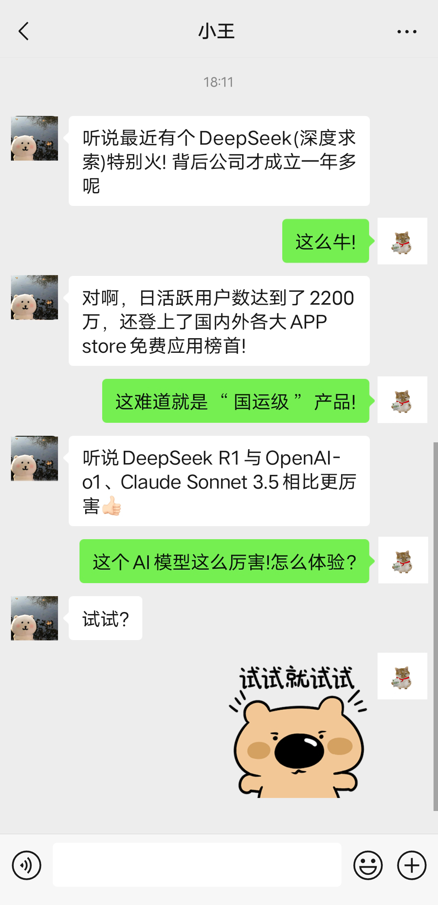

**< 搭建你的 AI 超级应用>**

只需几步简单配置，就能搭建一个基于 DeepSeek，集**「智能问答+实时搜索+ 补全代码」**于一体的 AI 超级应用，你摸鱼，让 AI 给你免费打工！🤣

👇 下面，让我们来一探究竟


**腾讯云 AI 代码助手支持接入 DeepSeek 服务**

在腾讯云 AI 代码助手，**开发者可配置接入DeepSeeK R1 及其他模型的官网 API** ！也**可接入本地 Ollama 部署的 Deepseek 大模型**，结合腾讯云AI代码助手和 DeepSeek ，开发者可实现更加强大、高效、安全的 AI 编程体验。

首先，先安装 IDE 和腾讯云 AI 代码助手 （已安装可忽略此步骤）。

**步骤1: 免费下载 Visual Studio Code**

下载地址：https://code.visualstudio.com

**步骤2:** **在 Visual Studio Code 插件市场， 搜索「腾讯云AI代码助手」，秒安装。**

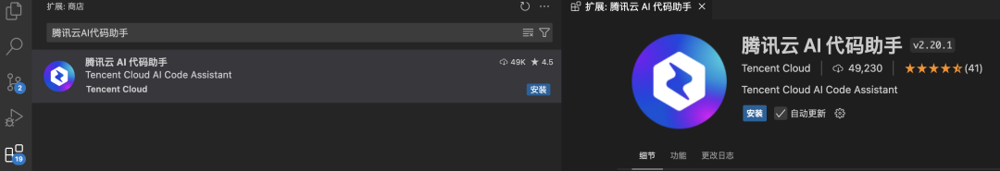

**步骤3: 登录腾讯云AI代码助手**

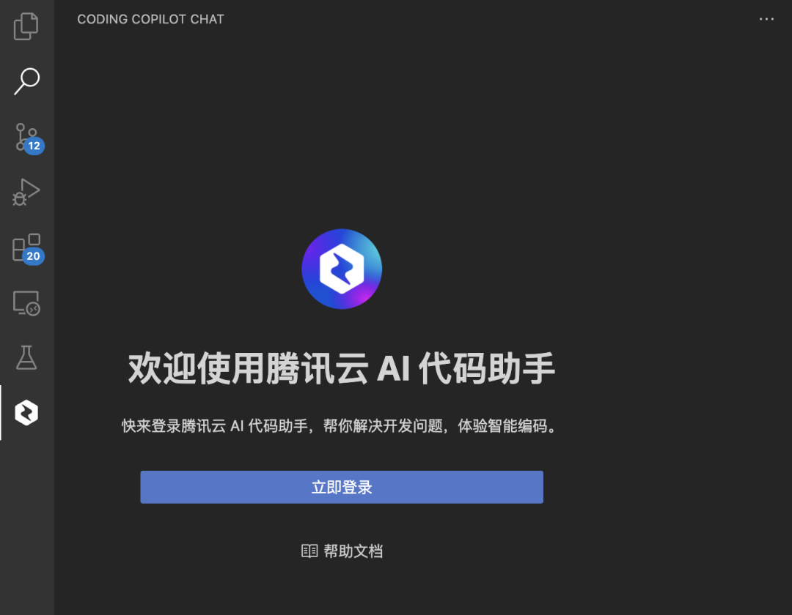

**方法一：获取和配置 DeepSeek API key 或其他 平台 API key 后接入腾讯云 AI 代码助手**

**步骤1:****注****册DeepSeek账号**

访问 DeepSeek 开放平台地址，进行微信扫码或手机号注册

DeepSeek 开放平台地址：https://platform.deepseek.com

**步骤2:****创建 API key，名称可自定义**

用户登录 DeepSeek 平台后，点击“创建 API key” 按钮，输入 API key 的名称

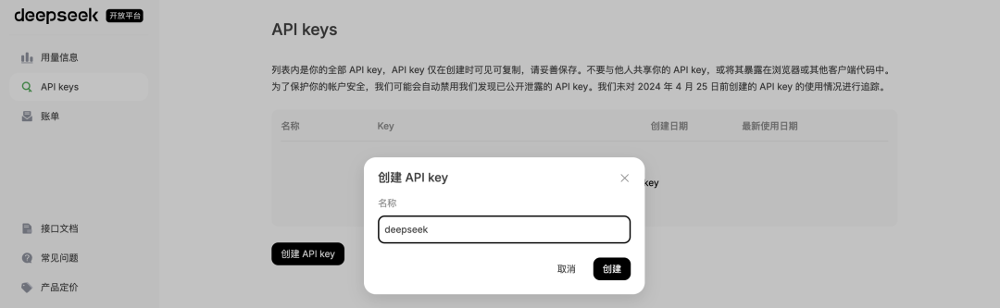

**步骤3. 妥善保存 API key**

创建完API key 后，请务必妥善保存，这是你唯一一次查看该 API Key 的机会。如丢失，则需重新创建一个新的API key。

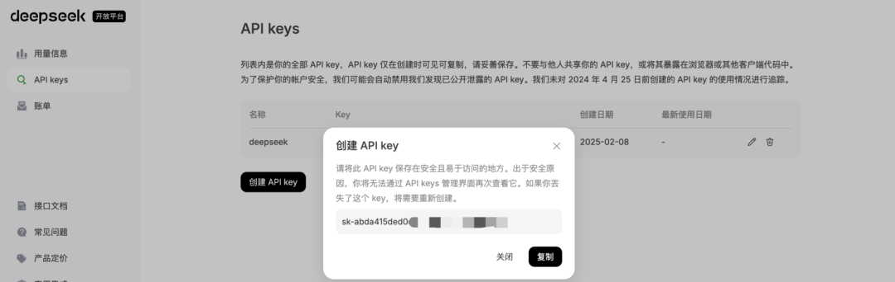

**步骤4. 在腾讯云AI代码助手中配置 API key**

点击腾讯云 AI 代码助手侧栏打开技术对话功能，在对话框右边有一个模型选项，默认为 hunyuan-turbo 模型。

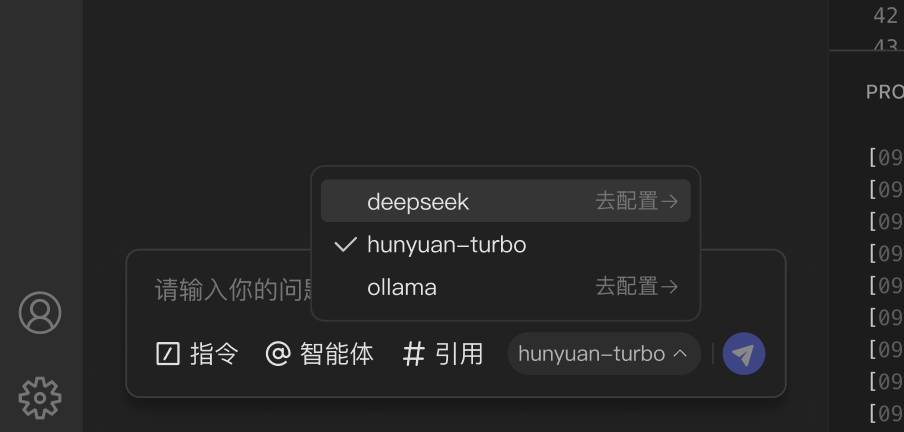

点击 DeepSeek 后面的**去配置按钮进行**配置 API key，填入上面申请的DeepSeek API key，配置模型 DeepSeek R1 或是 DeepSeek 其他模型，点击保存返回并自动启用。此时，就可使用接入 DeepSeek 后的对话助手。

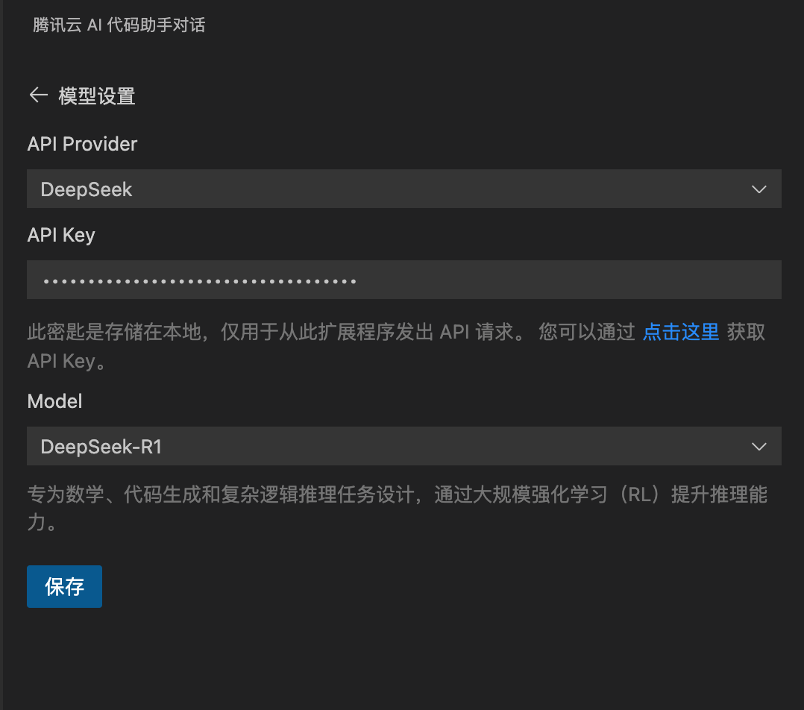

**步骤5. 见证奇迹的时刻！**

这里可看到 DeepSeek 思考的过程和提供建议。

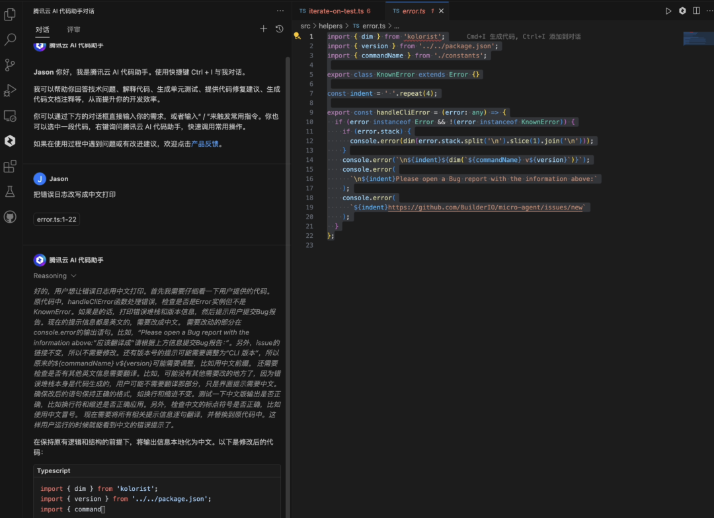

由于最近 DeepSeek 官网 API 有一定限制，我们也可接入其他平台部署的 Deep Seek API key。以硅基流动为例，访问https://cloud.siliconflow.cn/account/ak，创建账号后，登录。然后新建API密钥，记录下密钥，按照上面配置方法配置即可。

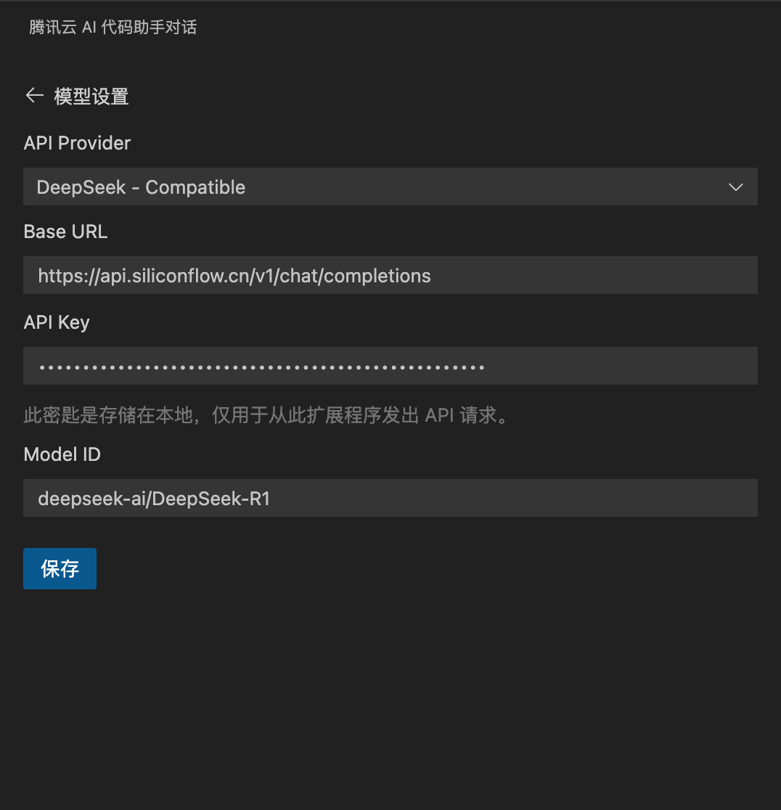

当然，还有如下一种办法，用户通过本地 Ollama 部署 DeepSeek R1 接入，本地部署无任何网络等限制，能部署启动即可使用！


**方法二：通过用户本地部署的 Ollama + DeepSeek R1 进行配置接入**

以 Mac 为例，部署 DeepSeek 对电脑硬件也有一定要求，以下为DeepSeek R1 在 Mac 上的配置要求

**推荐最低配置：**

● 处理器：Apple M4 或更高版本芯片

● 显卡内存：16GB RAM 内存，更高容量可显著提升性能

● 存储空间：至少 30GB 到数百 G 存储来存储模型文件及相关以来项

● 操作系统：macOS Ventura 或更高版本

操作步骤如下：

**步骤1: 安装 Ollama**

为了在本地能运行 DeepSeek R1，我们将使用 Ollama 这一专门为本地运行 AI 模型的工具。

● Ollama 官网：https://ollama.com


● 下载Ollama 后，按照以下步骤安装：

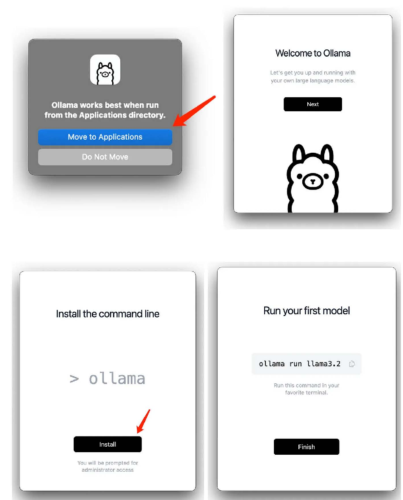

安装后 Ollama 提供了一种直接从终端提取和运行模型的简便方法

**步骤2：拉取并运行 DeepSeek R1 模型**

Olama 支持 DeepSeek R1 的多个版本，模型越大越智能，但所需的GPU 也越大，具体 DeepSeek R1 有以下版本：

1.5b、7b、8b、14b、32b、70b、671b

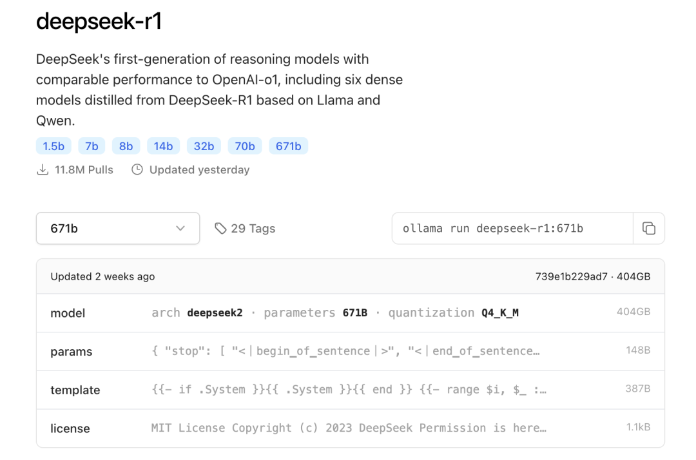

● 打开终端，输入以下命令下载并运行 DeepSeek 模型。例如，下载 7B 版本的命令为：


```java
ollama run deepseek-r1:7b
```


● 启动 Ollama 服务：在终端运行以下命令后台，并可尝试访问尝试访问http://localhost:11434，或者本地的 IP 地址。


```java
#创建日志目录
mkdir -p /root/.ollama/logs
#定义服务端口
PORT=11434 && port=11434  nohup ollama serve > /root/.ollama/logs/server.log 2>&1 &
```


● 如需下载其他版本，具体模型：https://ollama.com/library/deepseek-r1 ，可以参考以下命令：


```java
# 1.5B  DeepSeek R1
ollama run deepseek-r1:1.5b

# 7B  DeepSeek R1
ollama run deepseek-r1:7b

# 8B Llama DeepSeek R1
ollama run deepseek-r1:8b

# 14B  DeepSeek R1
ollama run deepseek-r1:14b

# 32B  DeepSeek R1
ollama run deepseek-r1:32b

# 70B Llama DeepSeek R1
ollama run deepseek-r1:70b

# 671B Llama DeepSeek R1
ollama run deepseek-r1:671b
```


**步骤3：进行配置接入**

腾讯云 AI 代码助手技术对话，选择 ollama 去配置按钮，如图，填入上面申请的DeepSeek API key，选择模型 DeepSeek R1 或是 DeepSeek 其他模型，点击保存返回并自动启用。


上面的 http://localhost:11434 作为Base URL，并填入 DeepSeek-R1 作为 Model ID，点击保存即可。

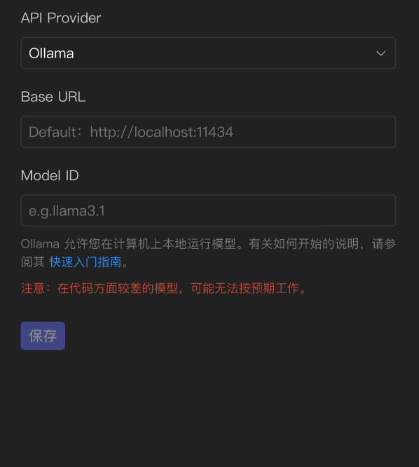

输入 Base URL 和 Model ID 后点击保存返回并自动启用，使用方法同方法一中在腾讯云 AI 代码助手技术对话中使用即可。


**还有彩蛋，即将预置 671B 满血版，敬请期待！**

即将发布！腾讯云 AI 代码助手，**全网唯一无限额搭载预置 671B 满血版 DeepSeek R1 模型的代码助手**。免费使用，无需下载模型，更无需部署，开箱即用，敬请期待 ！

我们也期待邀请加入用户群随时和我们反馈问题或需求，可扫码入群！


**https://copilot.tencent.com**

点击原文链接免费体验产品

