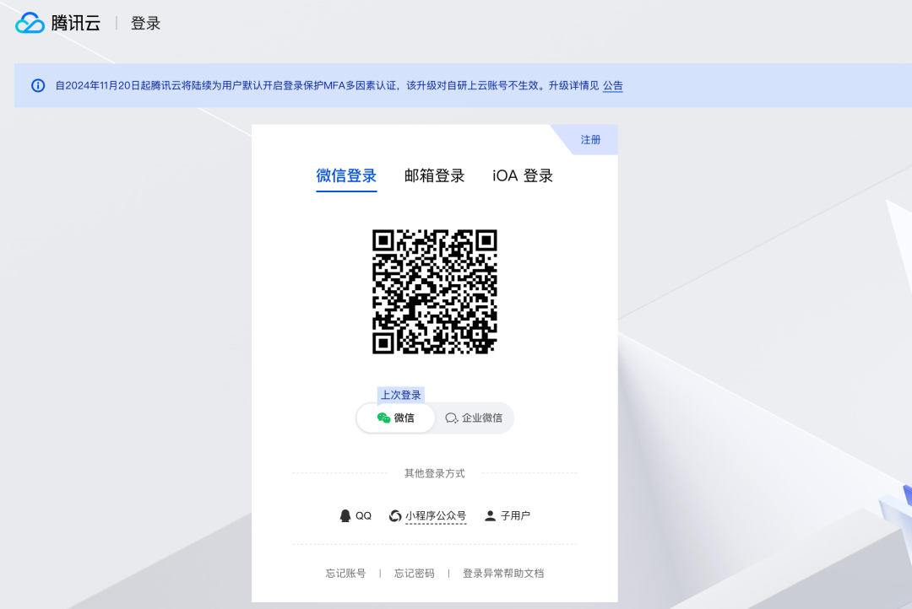
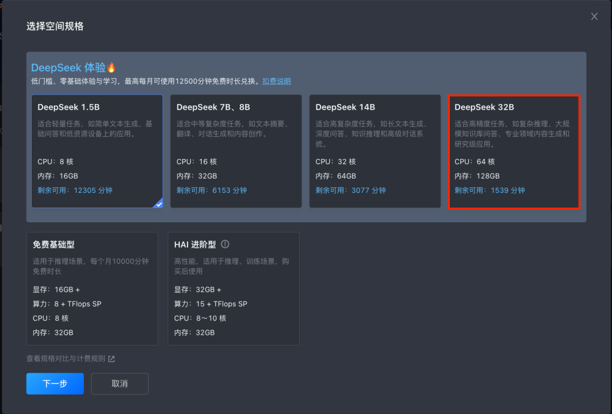
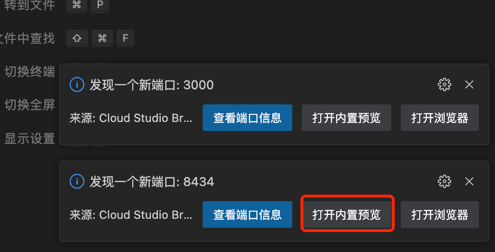
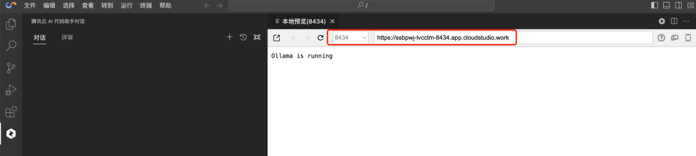
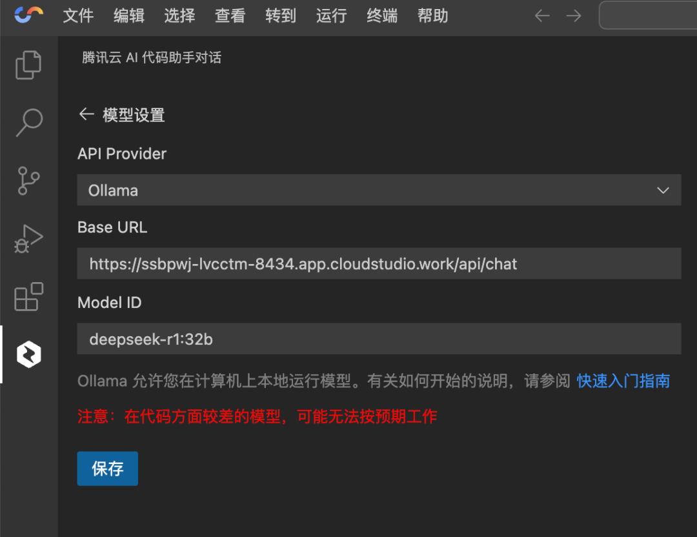
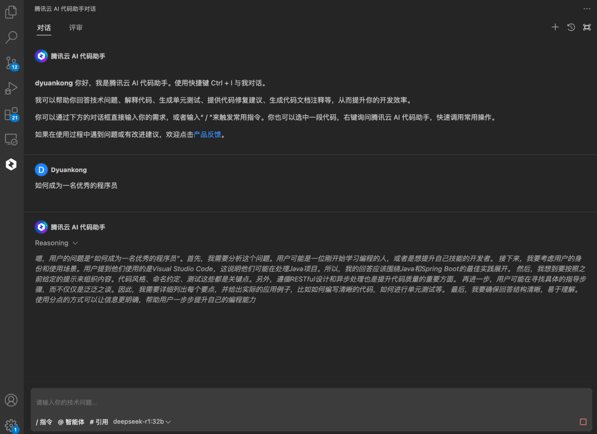
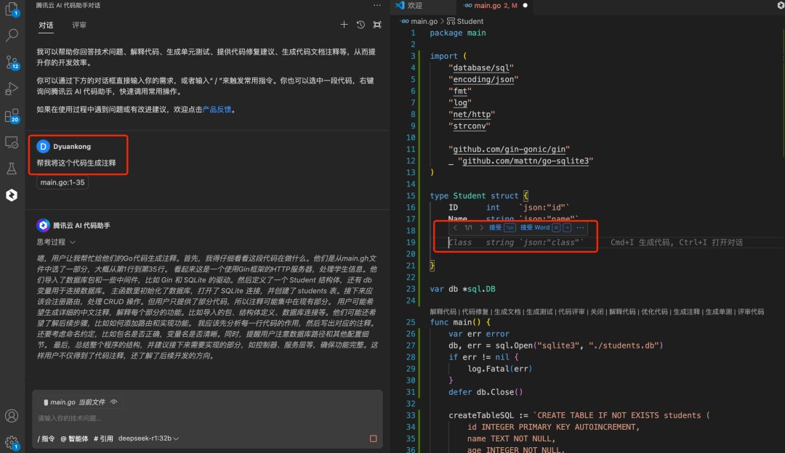
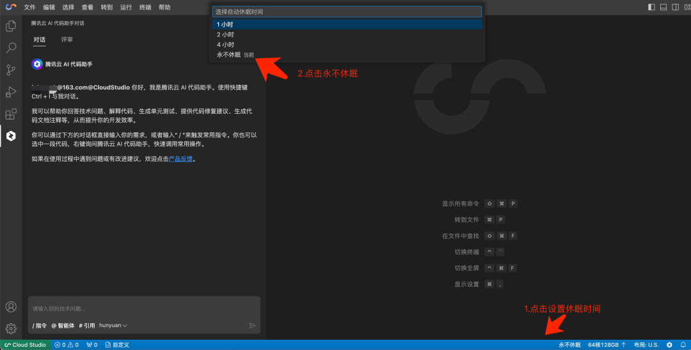
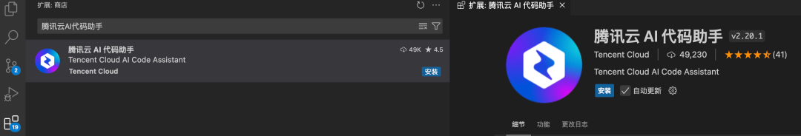

# 只需两步，我的代码助手就能免费用上DeepSeek 了

> 公众号: 腾讯CodeBuddy
> 发布时间: 2025-02-11 12:38
> 原文链接: https://mp.weixin.qq.com/s/7wyRl_rhN121eXQgqZx1Zg

---

最近使用 DeepSeeek R1 的你，是不是很熟悉这张图

于是，你开始查看网上各大 DeepSeek 部署教程

· 升级电脑到推荐最低配置

· 开个会回来，模型下载 99% 进度，突然电脑没电了，重来！（扎心了吗？）

·  终于运行起来了，但是电脑卡死......（一句xxx飘过）

现在，

有了腾讯云 CloudStudio + AI 代码助手，

感觉超爽！

✓ 轻松体验 DeepSeek 32B 大模型

（像敲键盘按钮一样，点个创建空间按钮即可）

✓ 点击空间模版，DeepSeek AI 聊天、RAG 知识库等应用开箱即用

（人在工位躺，模型云端跑）

✓ 免费薅台 64 核 128G + 64G 显存的电脑连续玩 1500 分钟

（1秒不停，服务贼稳定）

✓ 每月还有特权领取 50000 分钟免费算力

（彻底疯了！）

✓  1000 人旗舰版免费使用

（老板，再招点人和我一起玩 AI 代码助手 ）

心动吗？

还等啥呢？！

快来和我一起体验吧！！

**手把手白嫖指南--会开机就行！**

**Step1 注册和登录**

**操作：**

打开网址：

https://ide.cloud.tencent.com/dashboard/

跳转到腾讯云官网→ 进行微信扫码登录！

**Step2 创建 DeepSeek 32B空间**

**操作：**

1.如下图所示点击【立即创建】。

2: 进入【选择空间规格】页，可选择各规格模板，最大采用 64 核 128 GB 的 CPU 空间，支持 DeepSeek 32B 模板，点击下一步开机就可以了！

3.  复制 DeepSeek 32B API 服务地址，

打开空间会弹窗提醒，点击 8434 这个端口的内置预览。

复制 8434 端口这个内置地址：https://ssbpwj-lvcctm-8434.app.cloudstudio.work

**Step 3 使用 DeepSeek 32B 空间  API**

**操作：**

1.进行配置DeepSeek 32B API ，并在在腾讯云 AI 代码助手中配置

打开 Cloud Studio 中集成的腾讯云 AI 代码助手或本地 IDE 中进行配置，记得 Base URL 后面输入 /api/chat , Model ID 中输入的模型名称 (记得，需要体现具体的参数，如 32b ，否则会在技术对话中提示 API 不可用)。

2.  就这么配置上面的一个地址，就搞定了！（别人可能 Ollama 还没 run 起来，你都可以直接用了）。

3.  当然你可能很疑问怎么免费使用~看图：

问一个灵魂拷问的问题：如何成为一名优秀的程序员（你觉得自己优秀吗）。

4.  打开代码仓库，你开始摸鱼，让 DeepSeek + 腾讯云AI代码助手帮你打工，对话框进行问答，文件编辑去 Tab 就把代码写完了（别人还在下载 DeepSeek ，你已经干完活了）。

**注意**：为防止机器空间休眠而关机，可以设置永不休眠，且不要关闭这个标签页。

**Step 4 在本地 IDE 安装和使用**

1.需要下载 Visual Studio Code

下载地址：https://code.visualstudio.com

2.在 Visual Studio Code 插件市场， 搜索「腾讯云 AI 代码助手」，秒安装。

3.登录腾讯云 AI 代码助手。

4.参考上面的 Step 2 和 Step 3 方式接入即可。

**加入我们 参与建设**

扫码加入我们，了解更多 AI 智能编码知识～

**https://copilot.tencent.com/**

