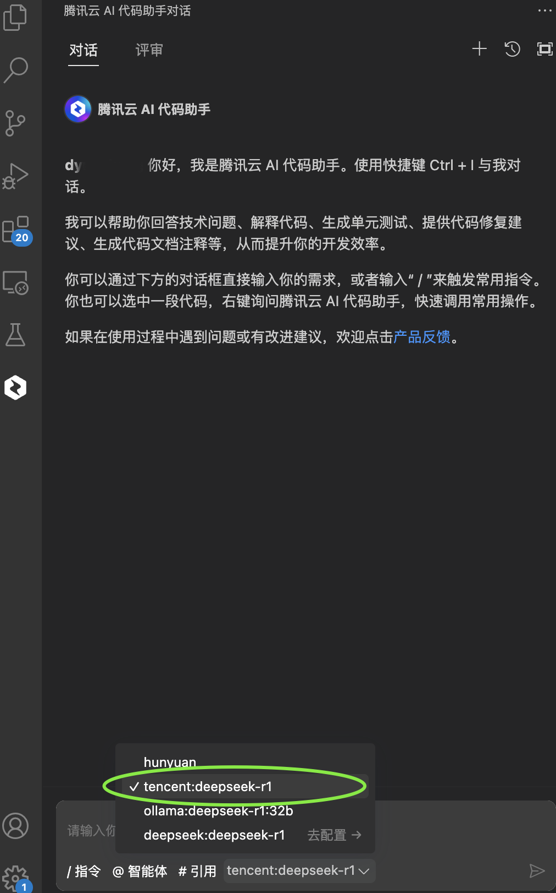
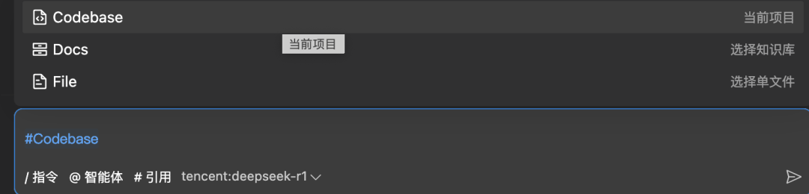
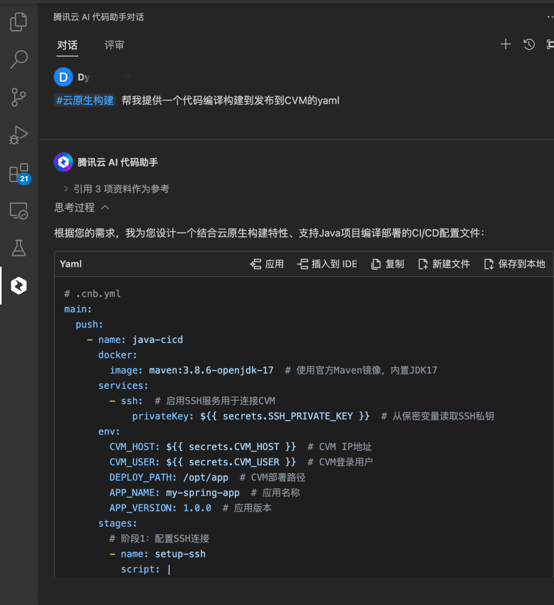
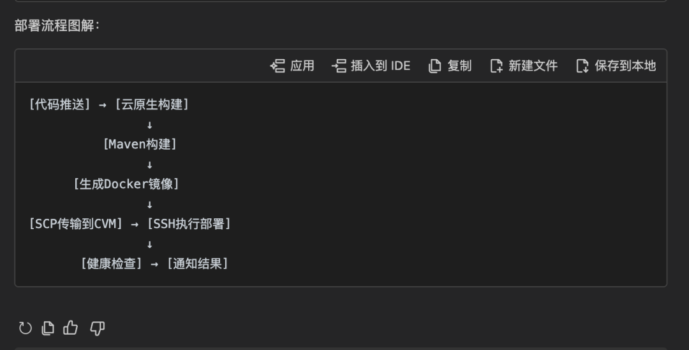
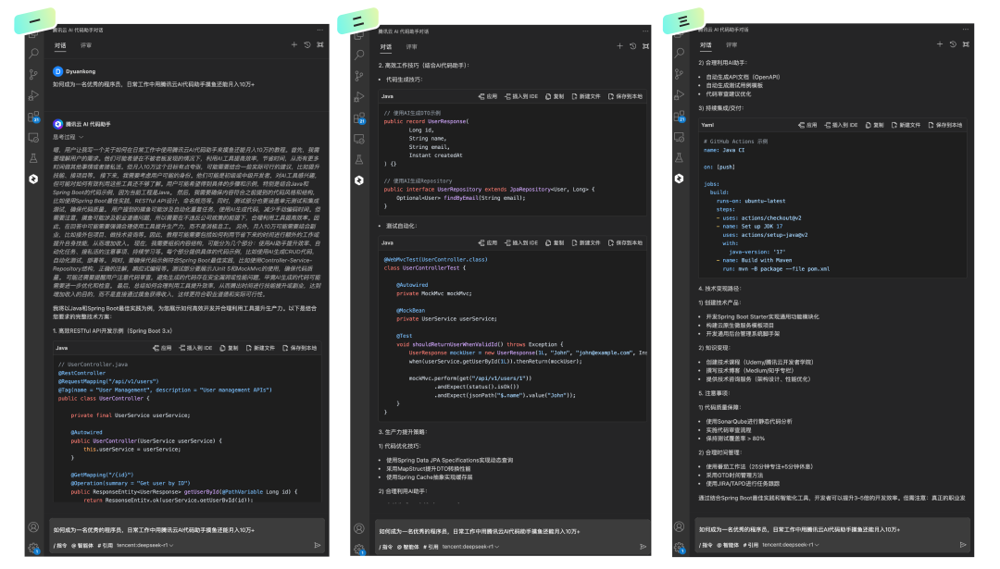
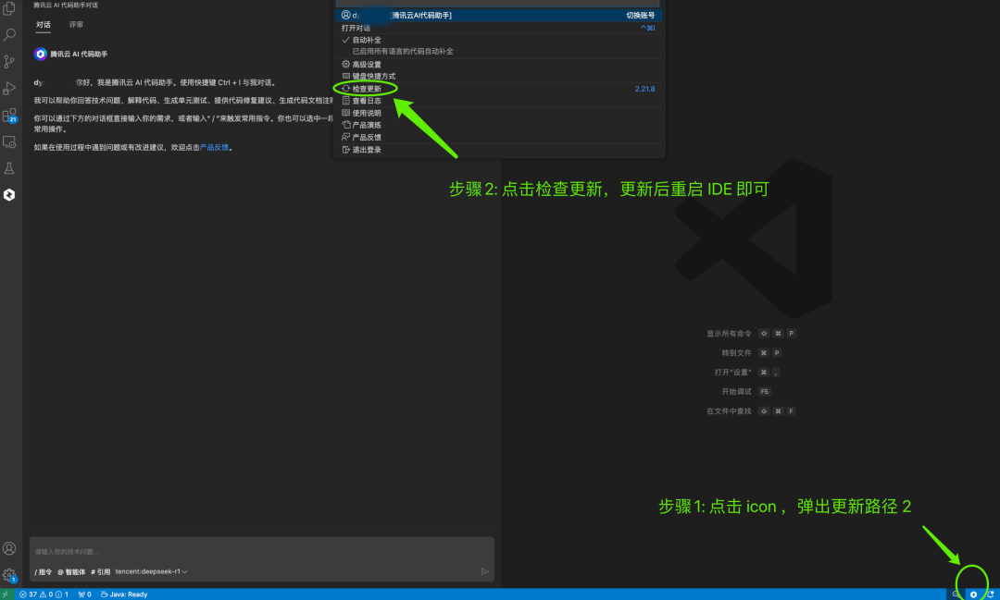

# 【重磅升级】腾讯云 AI 代码助手内置 DeepSeek-R1 满血版，稳定，免费，不限量，免部署！

> 公众号: 腾讯CodeBuddy
> 发布时间: 2025-02-14 13:04
> 原文链接: https://mp.weixin.qq.com/s/qu0-FCEwkLAy6GFT0JoltQ

---

**< 引语>**

🔥激动人心的更新来了！

现在我们正式内置 DeepSeek-R1 671B

**满血版，稳定，免费，不限量，免部署！**

安装「腾讯云 AI 代码助手」最新版本插件，

即可开箱使用！

欢迎各位开发者前来体验👏

👇 下面，让我们来一探究竟

**一、新版本快速体验攻略**

**1.将插件更新至最新版本， 切换 R1 即可**

将「腾讯云AI代码助手」更新至最新版本（Visual Studio Code ≥2.21.7，Jetbranis ≥ 2.21.8）即可，在对话输入框左下角选择 tencent:deepseek-r1 切换至 R1 模型（🤔 不知道怎么安装，请滑倒最后面）

**2.合理选择知识库、文件，精准问答**

基于当前项目工程、知识库、代码文件上下文引用：通过选择合理的知识库、文件，不仅可以提供完整的思考过程，还能得到最准确回答！

**3.生成代码编译构建到发布的流水线 YAML**

帮我基于云原生构建平台 (CNB) 知识库，提供一个代码编译构建到发布到 CVM 的 yaml ，在 CNB 配置即可使用

CNB 地址：https://cnb.cool

并能显示完整流程图，让你了解研发全过程

**二、近期其他重点上新**

● 支持 Xcode 、微信开发者工具，满足苹果和微信开发者需求

● 支持 Codebase ，增强工程理解能力

● 支持 Webchat 对话，满足网页端知识问答

**三、接入R1后，有什么变化**

**// 告别服务器繁忙，就用腾讯云 AI 代码助手**

现在的你是不是：

● 官网体验还是服务器繁忙吗？（想用用不了）

● 全网搜索各大 DeepSeek 部署教程（眼花缭乱，浪费大量时间）

● 花各种冤枉钱掏空微信余额？也无法落地（扎心了吧）

想体验免费、免部署、稳定还不限量的 DeepSeek R1 吗（还犹豫什么？没路子？)

现在，就用腾讯云 AI 代码助手，全搞定！进一步加速提升你的研发效率（一个字：爽）

**//****精准上下文理解能力，AI代码助手更懂你**

617B 大模型，参数大，结合代码长上下文及其精准推理，AI 更懂你的上下文和需求。

**//****降低认知负荷，实现个人快速成长**

基于思维链，思考过程助你打开思路，帮你 know how，快速成长

**//****真正替代你的搜索引擎，解决问题好帮手**

不仅可以学习编程，解决技术难题，写技术文案、刷面试题，还能创作脚本、流程图、汇报文案、都不在话下，轻松帮你实现信息平权，跨越阶层

**见证奇迹的时刻！**

帮大家灵魂拷问一个不是技术的“技术问题”

**四、与腾讯及客户一起前行**

目前，在腾讯集团内部，85% 以上的开发岗员工都在使用腾讯云AI代码助手，整体编码时间平均缩短 40% 以上，AI 生成代码占比超四成，结合内部大规模投产经验，研发提效超 16%！

腾讯云 AI 代码助手已获国内外多家权威认可，累计服务数十万开发者用户，数千家企业团队和多款国民级产品

**五、开启代码智能化的第一步**

**▷ 操作：操作插件更新操作指引**

**步骤1**: **安装开发工具 IDE** （（如已装请忽略）

Visual Studio Code IDE 下载指南：

https://code.visualstudio.com

Jetbrains IDEs下载指南：

https://www.jetbrains.com/ides

**步骤2**: **安装腾讯云 AI 代码助手**（如已装请忽略）

在 Visual Studio Code 或Jetbranis IDEs(如 IntelliJ IDEA、Goland、PyCharm、Rider等） 插件市场， 搜索「腾讯云 AI 代码助手」，秒安装

在 Visual Studio Code 中安装指南：

https://copilot.tencent.com/setup/vscode

在 Jetbrains IDEs 中安装指南：

https://copilot.tencent.com/setup/intellij

**步骤3:** **登录腾讯云 AI 代码助手**，可用微信扫码或手机号快读登录

**步骤4**: **更新插件方式**

 Visual Studio Code更新方式

Jetbranis IDEs 更新方式(如 IntelliJ IDEA、Goland、PyCharm、Rider等）

**反馈渠道**

入群反馈：微信扫码加入用户交流群，随时反馈，产品侧会及时响应解决（如已在群里可随时@我们）

**https://copilot.tencent.com/**

点击原文链接免费体验产品

