# 万字长文解构DeepSeek V1/V2/V3/R1进化史：从算法革命到推理涌现！

> 公众号: 腾讯CodeBuddy
> 发布时间: 2025-03-05 08:30
> 原文链接: https://mp.weixin.qq.com/s/qG3kICUdB5wGm4L2mEdqkQ

---

👉目录

一、 Deepseek-LLM （V1-V3）系列

1  DeepSeek-67B (V1)1.1 预训练1.2 对齐（SFT+DPO）1.3 论文主要亮点2  DeepSeek-V22.1 数据2.2 架构2.3 评估2.4 优化3  Deepseek V33.1 论文主要亮点3.2 模型架构改进3.3 基础设施和训练框架测试3.4 训练阶段3.5 评估二、 Deepseek R1系列1  R1关键贡献2  训练总览2.1 第一阶段R1-Zero: 无需监督数据的强化学习训练2.2 第二阶段训练R1：强化学习和冷启动的结合3  实验结果4  蒸馏实验5  R1存在的问题6  复现R1项目分析6.1 R1-Zero复现项目：Logic-RL6.2 蒸馏实验复现：Open-R1

在今年的春节期间，DeepSeek 火出了圈。凭借 DeepSeek-V3 与 DeepSeek-R1 的创新技术和卓越表现，DeepSeek 迅速成为了行业内外的焦点。不管是技术专家还是普通用户，都对 DeepSeek 赞不绝口。我们特别准备了这篇技术科普文章，期望无论你是不是技术同学，都能够读懂 DeepSeek。
关注腾讯云AI代码助手，一手技术干货提前解锁👇

# 01

Deepseek-LLM （V1-V3）系列
V1模型重点在于保障效果的前提下，探索低成本算法，在低成本情况下做Scaling Laws实验，打牢基础。延用LLAMA 2 稠密（Dense）模型的架构，使用2万亿Token的中英数据来做超参数和模型大小/数据配比的Scaling Laws实验，后训练阶段使用SFT和DPO算法，在多个维度超越LLaMa2 70B。
V2模型的模型参数比V1模型翻了3.5倍，训练数据量比V1多了4倍，基于论文H800用时推测预训练算力成本只增加一倍。训练效率提升主要是依靠MoE (Mixture-of-Experts)架构，为什么要从Dense架构变为MoE架构，主要是Dense架构计算效率低，所有的输入都要激活所有参数参与计算，会导致大量冗余和不必要的算力浪费。MoE架构的稀疏激活和动态路由特点就可以很好的解决这些问题。同时Deepseek打响了API的价格战，当时号称GPT4的性能但API价格只有GPT4的百分之一。推理成本低的功劳是在与他们提出的MLA (Multi-Head Latent Attention)大大节约了KVcache显存的占用，MLA会在文章后面详细讲解。
V3模型参数量相较于V2模型多了三倍，训练数据量比V2模型增加接近一倍，但是V3模型训练成本控制在557.6万美元，重点是MoE、MLA、FP8混合精度训练在起作用。之后一个月推出了R1，在V3作为底座的基础上通过多阶段SFT和强化学习达到o1水平的模型，至此，登上王座成功破圈。

|  |  |  |  |  |  |
| --- | --- | --- | --- | --- | --- |
| **模型** | **论文发布时间** | **模型参数** | **训练数据** | **训练算力成本** | **模型架构特点** |
| V1 | 24/1/5 | 67B | 2万亿token中英数据 | 未公布，参考v2论文提到H800用时，通过推测预训练花费120万美元（基于租赁H800每小时2美元） | Llama架构  更大的神经网络深度  多步学习率调度器 |
| V2 | 24/5/7 | 236B(激活21B) | 8.1万亿token多语言数据 | 文中没明确给出，根据文中提到的H800 GPU小时推测预训练花费276万美元 | MOE架构  160个路由专家及2个共享专家。  多头潜在注意力(MLA)机制 |
| V3 | 24/12/27 | 671B(激活37B) | 14.8万亿token多语言数据 | 论文指出单次训练成本557.6万美元 | MOE架构    256 个路由专家及 1 个共享专家。 1.FP8混合精度训练 2.无辅助损失的负载均衡策略 3.多 token 预测机制 4.MLA |
| R1 | 25/1/22 | 671B(激活37B) | 预训练：4.8万亿 token。数千条高质量的长链推理数据 | 256未公布，不过其基于V3上面做RL，算力成本不会太高 | MOE架构   1.基于 DeepSeek V3 基座模型 2.结合冷启动数据的强化学习 |

这张我们画了DS三篇论文的主要的创新点，V3不是一日铸就成的，是一步步打怪升级过来的。

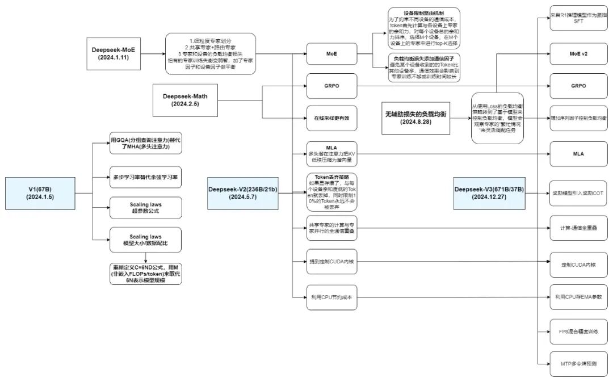

   1. DeepSeek-67B (V1)

####

DeepSeek LLM: Scaling Open-Source Language Models with Longtermism

发表时间: 2024年1月5日论文地址:[2401.02954] DeepSeek LLM: Scaling Open-Source Language Models with Longtermism
通过这篇论文的标题可看出，Deepseek旨在通过长期主义视角推进开源大模型的发展。文章主要解决了以下两个关键问题：

- **特定领域能力不足**：当时模型在代码、数学和推理能力方面表现不佳，特别是在中文数据上的表现欠佳（当时主流大模型里面中文数据占比很少，LLaMa2预训练数据里面中文占比0.13%，GPT3预训练数据中文占比0.1%）。
- **缩放定律研究结论不一**：现有关于Scaling laws研究有不同的结论，同时未能充分探讨超参数的设置，Deepseek填补了这方面的空白，还发现数据集的差异对scaling laws有很大影响。

   1.1 预训练

####

   1.1.1 数据
Deepseek通过许多渠道（一般来说有四种：开源数据、自己爬、自己标、找其他公司买数据。当时合成数据还属于探索阶段）获取到大量的原始数据，但这些数据存在大量重复和无效内容、数据比例失衡等问题，因此需要对数据进行清洗。他的数据构建方法分为三个关键阶段：去重、过滤和混洗。通过清洗后，得到一个包含 **2 万亿Token的中英双语预训练数据集**，比 LLaMA 2数据量更大。**1.  去重阶段**

- 采用跨数据包去重策略，消除 89.8% 的重复文档（相比单数据包去重效率提升 4倍）

**2.  过滤阶段**

- 制定文档质量评估标准，过滤低质量内容
- 保留数学、代码等低资源领域知识

**3.  混洗阶段**

- 平衡数据分布，增加代表性不足领域的数据量

   1.1.2 架构

预训练模型延用 LLAMA 2架构设计，采用 Pre-Norm 结构、RMSNorm 函数以及 SwiGLU 作为前馈网络的激活函数。67B 模型使用了Grouped-Query Attention（GQA）分组查询注意力替换了多头注意力来优化推理成本。

- **稳定性优先**：Pre-Norm 结构（先做标准化，再做计算）让深层网络训练更稳定。
- **效率优化**：GQA 和 RMSNorm 降低大模型计算成本。
- **长文本友好**：Rotary Embedding（旋转位置编码） 增强位置感知能力。
- **参数高效**：SwiGLU 激活函数提升前馈网络表达能力。
- **前馈网络设计**：中间层维度=（8/3） \* d\_input\_model（中间层扩展到更高维度来增强特征提取关系）。

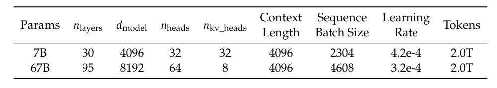

7B模型30层的网络，而67B模型是95层网络，因为67B模型使用的GQA会导致模型能力下降，DS选择增加网络深度，维持模型性能效果的同时实现成本下降。

   1.1.3 预训练模型结果评估：

下图是Deepseek 预训练Base Model的结果，Deepseek 67B 相比 LLaMa 70B 在中英评测上都有显著的优势，但Deepseek 7B 相比 LLaMa 7B 只在中文数据上有优势。Deepseek的数据有比LLaMa更多的中文数据，因此这种现象表明**小型模型对语言数据量比例更加敏感。**

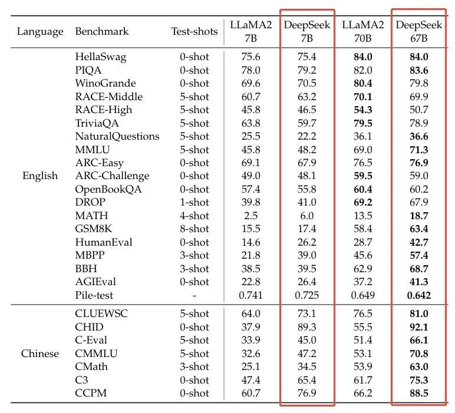
   1.2 对齐（SFT+DPO）

DeepSeek LLM收集了大约150万条英文和中文的指令数据，分为有益数据和安全数据。其中，有益数据包含120万个实例（对话、数学问题、代码题）。安全数据则由30万个实例（可以理解为危险问题+多样化拒绝话术）组成，覆盖了各种敏感话题。

"为什么要SFT和DPO呢？因为预训练是从所有的数据里面学习，好的坏的都记住了，是一个”野蛮“的模型。所以下一步我们要让他知道什么该说什么不该说，就像教小孩，不仅要学会知识，还要懂规矩。SFT侧重于生成正确的回答，追求答案的准确性，让模型学到人类问与答的方式，而DPO侧重于在多个可能的正确回答中选择最符合人类价值观的那个，通过人类对答案的偏好排序，让模型自己学习“什么该说、什么不该说”。"

"为什么要两部分数据呢？如果只有安全数据的话，模型就不敢说话变傻，经常性重复问题或者拒绝回答用户。如果只学有益数据，模型有用但是没底线，可能会教用户制作暴力武器、教唆犯罪等行为。如果用两部分数据那这样就可以造出即聪明又安全的AI"

**SFT**[2203.02155] Training language models to follow instructions with human feedback**:**

7B小模型需要在数学和代码数据集上进行更长时间的微调以提高性能，但在他们实验中观察到SFT的时候随着数学数据量的增加，输出的重复率有上升趋势，可能原因是模型学到了数学里面许多的解题套路。

为了解决重复问题，他们用了两阶段微调，第一阶段是"全科补习"（使用所有微调数据，数学代码都学），然后第二阶段改为"主攻对话"（剔除数学和代码，专练聊天）和DPO方法，这两种方法都能几乎保持基准分数并显著减少重复。

**DPO**Direct Preference Optimization: Your Language Model is Secretly a Reward Model

他们构建了用于DPO训练的偏好学习数据，包括无害性（不仅教拒绝危险问题，还要对比"好回答vs坏回答"）和有益性（不仅教回答问题，还要对比"优质回答vs普通回答"）。DPO训练了一个epoch，学习率为5e-6，批量大小为512。他们发现DPO不仅增强了模型开放式问答能力，还在所有领域都带来了改进。

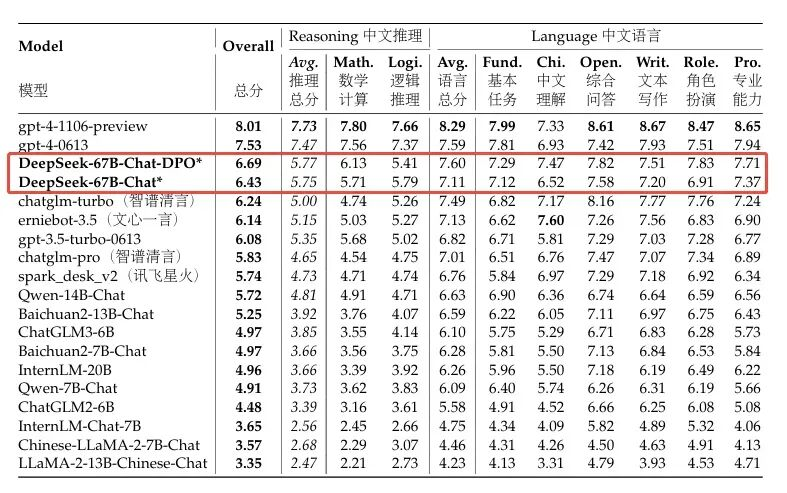

   1.3 论文主要亮点

   1.3.1 GQA取代MHA

通过Grouped-Query Attention（GQA）取代Multi-Head Attention（MHA），GQA可以将KVcache的size减小，那么KVcache占用的显存就变小，大模型可以处理的请求数量就更多，吞吐量更大（减少显存的使用，同时加快推理速度）。与此同时增加了模型深度，以缓解模型效果的下降，但效果还是不如MHA。

举个例子：假设每个头的Q、K、V参数量固定且独立，用MHA算法情况下，模型32个头，每个头需要独立的Q、K、V矩阵，总参数量为 32×(Q+K+V)。用GQA的情况，若分成4组（每组8个头），每组共享K和V，参数量降为 4×(K+V) + 32×Q。

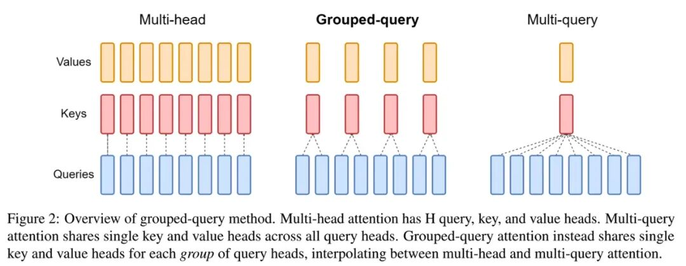
   1.3.2 多步学习率调度器

通过多步学习率调度器取代余弦学习率调度器，从而实现80%的训练一阶段可复用。

**余弦调度器：**学习率按余弦曲线从初始值衰减到零，每个训练步都需动态计算学习率，与训练步数强相关。

**多步学习率调度器：**在预设的绝对步数节点（如第1000、2000步）进行阶梯式衰减，学习率调整仅由当前步是否达到节点决定，无需依赖总步数比例。

DS论文中操作分三步：

- 预热阶段：学习率在前2000个warmup steps后线性增加到最大值。
- 第一阶段：处理完80%的训练词元后，学习率降低到最大值的31.6%。
- 第二阶段：处理完90%的训练词元后，学习率进一步降低到最大值的10%。

这样做的好处是如果想搞N个模型做实验,那么前80%模型权重是可以复用的,只需要针对后20%进行实验,从而把每次实验成本从100%压低到20%。

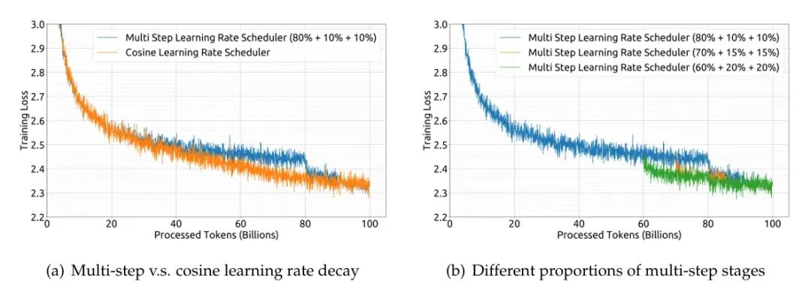

   1.3.3 超参数的Scaling laws公式

通过多步学习率重用第一阶段的模型权重，在此基础上再训练了多个具有不同批大小、学习率和计算范围的模型，推导出超参数的Scaling laws公式，这个公式在模型大小确定时，可以推导出对应Batch Size和学习率。

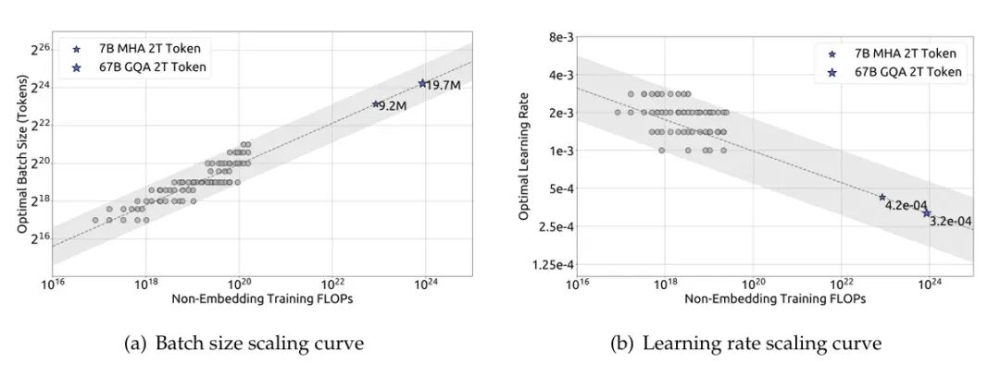

他们还做了一堆实验，推导出最佳的模型和数据分配策略，重新定义了过去流传甚广的计算资源计算公式C=6ND。其中，N是参数规模，D是数据规模，C是计算资源。但他们发现这个公式是不精确的，在小参数模型的情况下，偏差率最高能达到50%。于是他们用M (non-embedding FLOPs/token) 来取代6N，推出C=MD，以实现更精确的计算资源估算。

还发现，在相同数据规模(D)下，高质量的数据可以推动更大的参数规模。D的质量越高，能支持的M越高，得到更大的C。

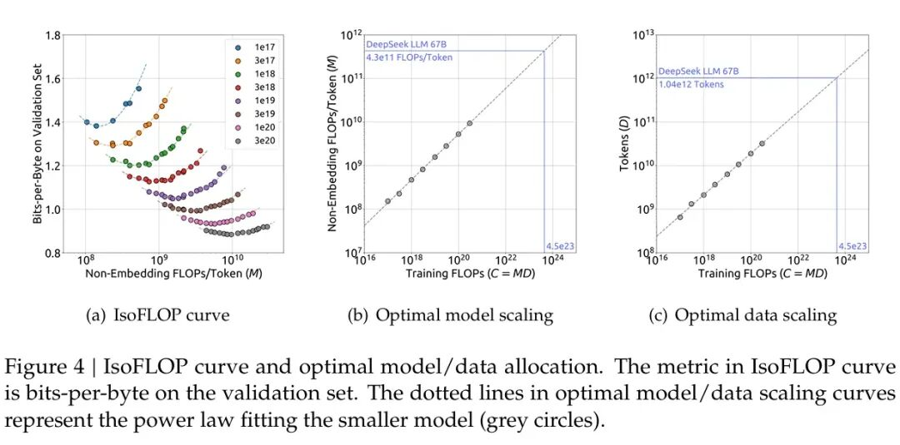

文章中还提到，当引入系统提示时，7B 模型的表现略有下降。然而，当使用 67B 大型语言模型时，加入提示会显著改善结果。文章对这种差异的解释是，高参数模型能够更好地理解系统提示背后的意图，使它们能够更有效地遵循指令并生成更优的回应。另一方面，**较小的模型难以充分理解系统提示**，训练和测试之间的不一致性可能会对它们的表现产生负面影响。

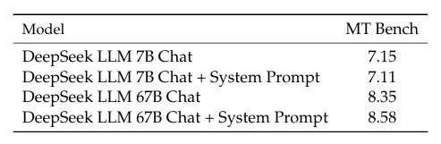

   2. DeepSeek-V2

**DeepSeek-V2: A Strong, Economical, and Efficient Mixture-of-Experts Language Model**

发表时间: 2024年5月7日（最终版6月19日）

论文地址:[2405.04434] DeepSeek-V2: A Strong, Economical, and Efficient Mixture-of-Experts Language Model

模型地址：GitHub - deepseek-ai/DeepSeek-V2: DeepSeek-V2: A Strong, Economical, and Efficient Mixture-of-Experts Language Model

DeepSeek V2 的提出是为了解决Dense模型在规模扩展时面临的效率与性能矛盾：传统模型随着参数增加，计算成本、能耗和推理延迟急剧上升，但专项任务（如数学推理、代码生成）的性能提升却逐渐受限。为此，它通过稀疏化混合专家架构（MoE），让模型在推理时动态选择激活少量专家模块，既大幅降低计算资源消耗，又使模型在多任务均衡性和专项能力上限之间进行取舍，最终实现低成本、高效率、强性能之间的平衡。

   2.1 数据

在保持与 DeepSeek 67B相同的数据处理阶段的同时，DeepSeek-V2扩展了数据量并提高了数据质量。融入了更多的中文数据，旨在更好地利用中国互联网上可用的语料库。除此之外，DeepSeek-V2还丰富了预训练语料库，增加了不同来源的高质量数据，同时完善基于质量的过滤算法。改进后的算法保证大量无益数据将会被剔除，只保留大部分有价值的数据。还过滤掉了有争议的数据，从而避免了因为特定地域文化所带来的数据偏差（例如不同国家的人可能对同一个道德问题有不同的看法）。

模型预训练所使用的语料库中包含8.1万亿个token，其中中文token比英语token多了大约12%。而推理所使用的词汇表有10万个不同的token。

   2.2 架构

Deepseek-V2总共有236B参数,，其中每个token只会激活21B个参数，并且每次支持128K个token（相当于一本小书）作为输入。而下图则是DeepSeek-V2的主要架构（Transformer Block结构），整个DeepSeek-V2模型是由60个Transformer Block结构组成。DeepSeek-V2还在传统的MoE模型结构的基础上，主要提出了两个创新技术：Multi-head Latent Attention（MLA）和DeepSeekMoE。

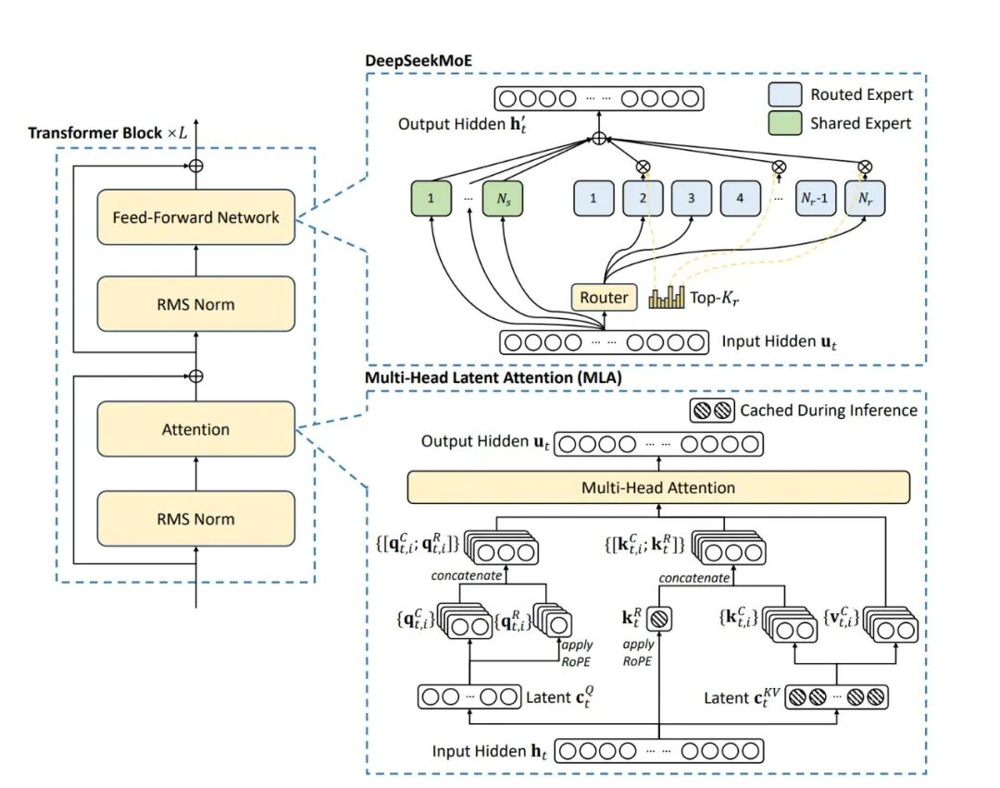

   2.2.1 MLA

在LLM中，Key-Value cache（键值储存，这是为了在推理和训练时，通过存储Attention机制中Key和Value两个值，从而减少计算，增加模型运行速度）一直是阻挡LLM在推理时变得更加有效率的一大阻碍。虽然Deepseek-V1已经用Grouped-Query Attention取代了Multi-Head Attention，从而减少Key和Value的储存，但是这会降低模型表现，而通过使用MLA，则**既能减少Key和Value的储存，又能保证模型的准确率（甚至更好）**，有效提高推理效率（效果比较如下图）。这是因为MLA会通过把输入token的**Attention输入压缩成一个潜在向量**，对于不同的头，只需要在**使用它的时候，再解压这个潜在向量**就能获得对应文本不同特征的Key和Value，也就是只需要存储这个潜在向量，就能获得对应不同文本特征的Key和Value，而不需要对每个文本特征都存储对应的Key和Value，结构如下图。除此之外，在推理的时候，DeepSeek-V2还将Key-Value cache里的参数量化为FP8，最终相比于DeepSeek 67B，减少了93.3%的Key-Value缓存，并将生成速度提升了5.76倍。

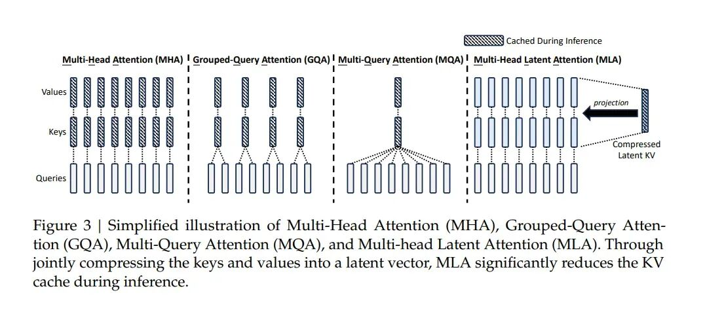

   2.2.2 DeepSeekMoE

DeepSeek-V2用DeepSeekMoE结构取代传统MoE结构中的Feed-Forward Networks（FFNs）。FFNs是一个全连接网络，参数量巨大，大概占了整个模型参数量的三分之二左右，但FFN层的激活存在较大的稀疏性，也就是针对某些问题的输入，FFN层只有部分的参数是对最终结果有用的，但是每一个参数都会参与计算，这就造成有很多不必要的计算。而MoE架构则对此问题进行了较大的改进。简而言之就是将一个完整的FFN，替换成由多个”专家网络“组成的神经网络，这个神经网络可以是简单的FFN，或者其它结构。从而在推理或者训练时，能够针对不同的数据进行解耦，增加效率。而DeepSeekMoE相比普通MoE，把专家分为了共享专家和路由专家（2个共享专家，160个路由专家），从而使模型中的专家更加专业化、能更精准的提取**知识**（路由专家），同时又能让专家之间的知识冗余减少（共享专家）。除此之外，因为激活参数的减少，DeepSeek-V2的训练成本比DeepSeek 67B节省42.5%。

(注意这里的知识不是通俗理解的“专业领域知识”（例如医学、法律、生物等），不同专家的知识是在训练过程中自发地形成了一种分工。这种分工既可能在微观层面上表现为对某些token（如标点符号、介词）的特殊处理能力，也可能在更高层次上反映出对语法结构、语义关系或者上下文信息的捕捉。)

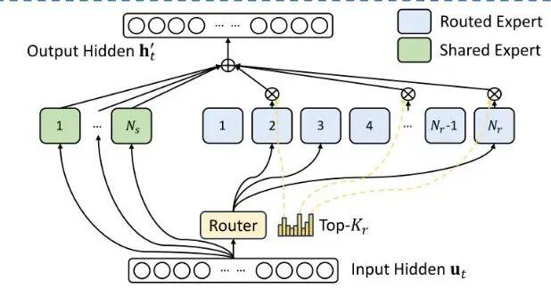

   2.2.3 辅助损失负载平衡

在训练时，每个机器的负载会不同，某些专家会被多次选上，从而导致剩余的专家没被充分训练，论文提出三个辅助损失负载平衡方法：

**1. Expert-Level Balance Loss（专家层面平衡损失）**

某些专家可能会在训练过程中得到过多的激活，而其他专家的作用则减弱，导致模型整体无法充分利用各个专家的优势。这个设计目的就是约束各个专家的“使用率”或贡献，使得模型在面对不同样本时，各专家能够均衡地参与决策。

**2. Device-Level Balance Loss（设备层面平衡损失）**

重点在关注各个设备在参与训练时的贡献平衡。我们肯定希望不同设备的数据、计算和更新尽可能均衡，避免出现某些设备贡献过多而其它设备被边缘化的情况。比如，有的设备可能承担了大部分的计算任务，而其他设备反而空闲，这样就会浪费资源或导致训练瓶颈。设备层面的平衡损失就是用来约束每个设备专家调用大体相同。

**3. Communication Balance Loss（通信层面平衡损失）**

分布式训练中，各个部分（比如不同设备之间）需要互相通信来交换信息。如果某时刻某些设备收到的token比其他设备多，一直承担大部分信息传递，而其他通路几乎没用到，就可能出现通信瓶颈。它旨在保证在进行参数传输或者同步时，各通信通道或阶段负载相对均衡，避免因通信瓶颈导致整体训练效率下降。

   2.2.4 Token丢弃策略

在训练时，首先计算每台机器的平均计算预算，然后丢弃每台机器上亲和力最低的几个token，直到利用完每台机器的计算预算。为了保证训练和推理时的表现一样，还会保证10%的tokens不会被丢弃。

   2.2.5 长文本扩展

在预训练好的DeepSeek-V2上，通过使用YaRN算法，将默认的上下文窗口长度从4K扩展到128K。通过在32K长度的文本上额外训练1000步，模型在大海捞针 (NIAH) 测试的表现如下图：

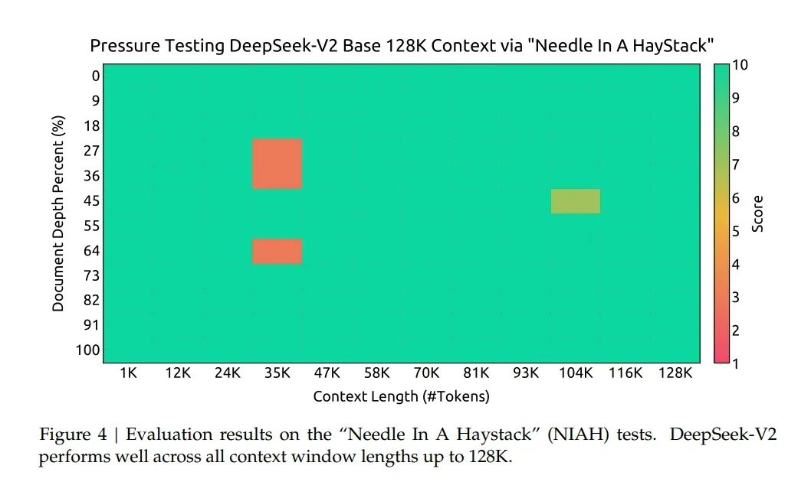

   2.2.6 强化学习

为了进一步来对齐人类偏好，他们使用了强化学习（RL）来调整模型偏好，同时为了节约成本用了GRPO(Group Relative Policy Optimization)策略来进行训练，与其它的强化学习训练策略不同，它不需要额外去特意收集监督数据来进行强化学习训练，而是通过所谓的“自我进化”的方式，采用纯粹的强化学习过程。

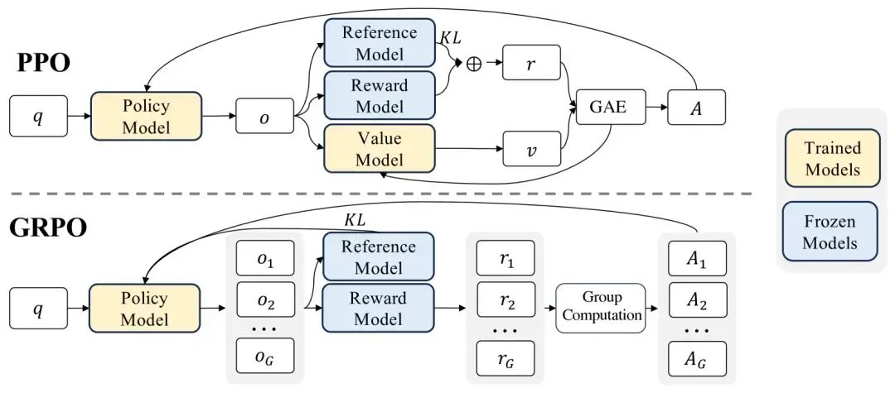

这里在GRPO与PPO的对比中，GRPO精简了价值函数这部分，推测GRPO平均奖励的有效性可能直接源于大数定理，作为概率基础理论支撑，大数定理可以确保奖励基线估计的统计合理性。GRPO通过从旧策略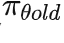中对同一问题 q 采样多个输出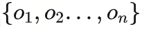，并计算平均奖励作为基线，其本质是利用大数定理对期望奖励进行估计。
   2.3 评估

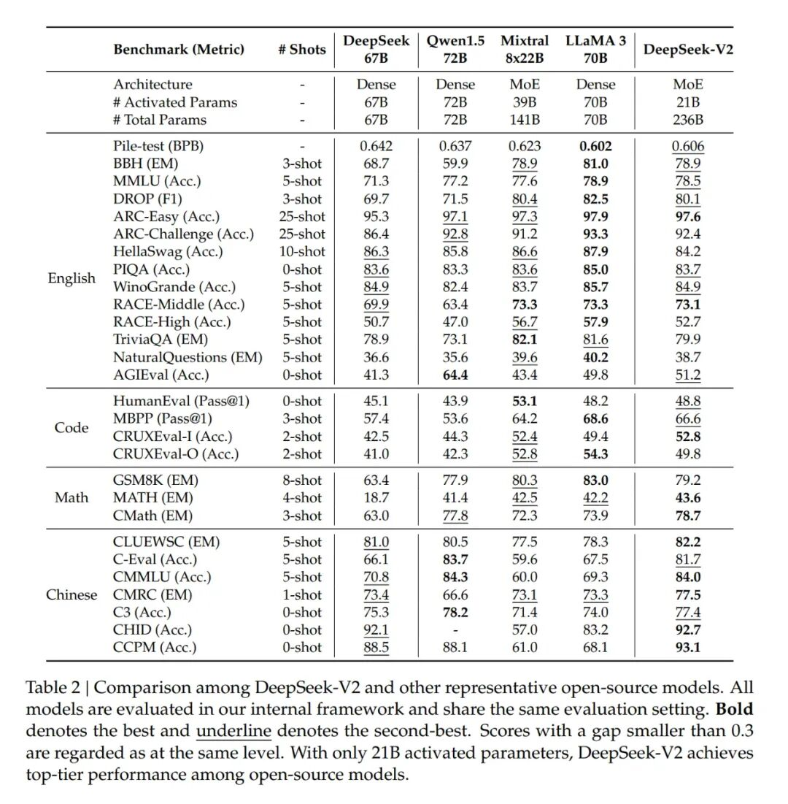

   2.4 优化

为了更进一步开发DeepSeek-V2潜力并与人类偏好对齐，在对DeepSeek-V2精调，产生DeepSeek-V2 Chat (SFT)后，论文作者还执行了两个阶段的强化学习的步骤：

● 第一阶段：基于一个用于代码和数学任务的奖励模型 Reasoning Model，提升模型的编码和数学能力。

● 第二阶段：训练三个奖励模型，从而提升回答有用性、回答安全性和使回答基于规则。

   **3.DeepSeek-V3**

**DeepSeek-V3 Technical Report**

发表时间: 2024年12月27日

论文地址:[2412.19437] DeepSeek-V3 Technical Report

DeepSeek-V3共包含**61层Transformer**架构，并将前馈神经网络中除前三层外全部替换为MoE架构。每个MoE架构包括**1个共享专家****和256个路由专家**，每个token会**激活8个**路由专家。

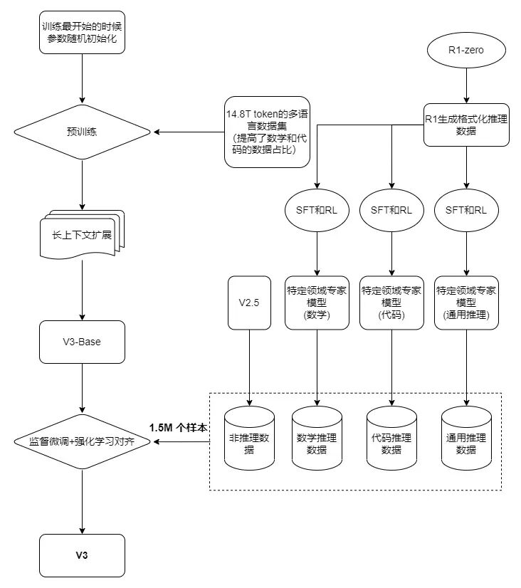

   **3.1 论文主要亮点**

● 一个强大的专家混合 (MoE)语言模型，总共有 671B 个参数，每个token激活了 37B。

● 无辅助损失的负载均衡策略：通过引入偏置项动态调整专家负载。

● 多Token预测(MTP)：在每个位置预测多个未来的token，提高模型的数据效率。

● 高效的训练框架：FP8 混合精度训练框架，通过DualPipe算法和优化的通信内核，实现了近乎零开销的跨节点通信。

● 知识蒸馏：从DeepSeek-R1 系列模型中蒸馏推理能力，将其融入DeepSeek-V3，提升了模型的推理性能。

● 训练成本仅为2.788M H800 GPU小时 (仅仅为Llama 3系列的十五分之一)。

● 在多项基准测试中，DeepSeek-V3的成绩超越了Qwen2.5-72 B和Llama-3.1-405 B等其他开源模型，并在性能上和世界顶尖的闭源模型GPT-4o以及Claude-3.5-Sonnet不分伯仲。

   **3.2 模型架构改进**

****3.2.1 多头潜在注意力机制 (Multi-head Latent Attention)****

**继承自Deepseek-v2**

******3.2.2 包含专家网络的Transformer块(DeepSeekMoE )******

**部分继承自Deepseek-v2**

******3.2.3 MoE负载均衡策略******

Deepseek v3 主要采用了两种方式进行负载均衡，保证专家网络中的参数都能平等的得到训练。

● 无辅助损失负载平衡 (auxiliary-loss-free load balancing)

[2408.15664] Auxiliary-Loss-Free Load Balancing Strategy for Mixture-of-Experts

step1 编制注入:

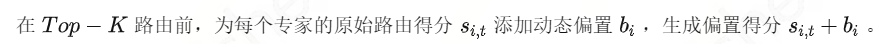

这个偏置量仅仅用于topk筛选，不加入后续的权重计算

step2 偏执更新:

根据近期负载情况调整偏置，高负载专家的偏置被抑制，低负载专家的偏置被提升。在**每个训练步骤结束**的时候，如果某个专家过载，则按照某一特定比例减少其偏置量；如果某个专家负载不足，则相应的按照同一比例增加其偏置量。

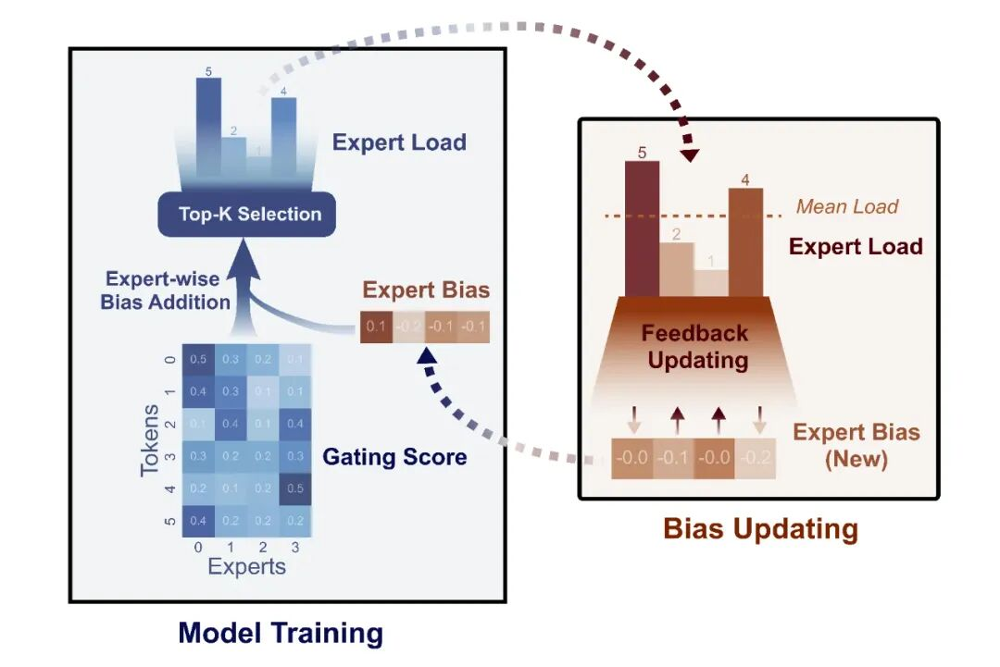

● 序列级辅助补充损失策略 (Complementary Sequence-Wise Auxiliary Loss)

序列级辅助补充损失策略主要是为了解决**单个输入序列**内部的极端负载不均衡。对于单个序列的多个token, 每一个专家对于序列内的每个token的亲和度均值代表了该专家对该序列的整体亲和度。当部分专家反复在top-K被选中时会基于惩罚, 体现了Sequence-wise级别的负载均衡。

******3.2.4 多token预测(multi-token prediction training)******

https://arxiv.org/pdf/2404.19737

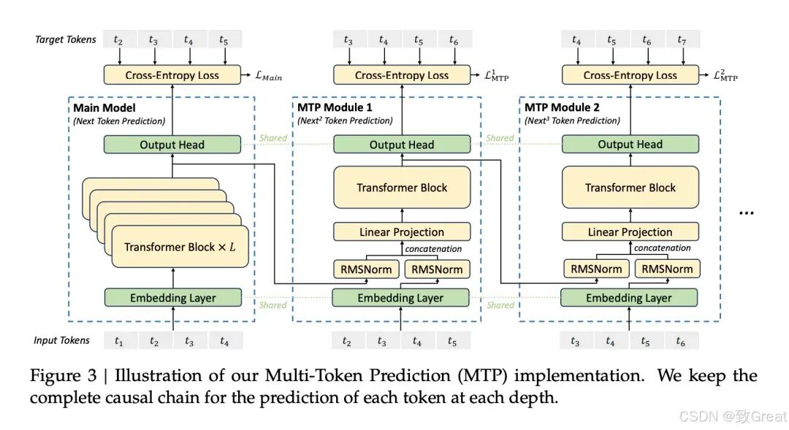

传统的语言模型通常使用下一个token预测 (next-token prediction) 的方式进行训练,即根据前面的token序列,预测下一个最可能出现的token。然而,这种训练方式可能导致模型过度关注局部的模式,忽略了长程的依赖关系；而MTP则是让模型在训练时一次性预测接下来的多个token了,这种做法一方面提高了预测效率，另一方面也可以让模型具有更好的上下文理解能力，关注到更多的token。具体来说就是**在Transformer结构共享主干的基础上，为每个待预测的token都设置一个独立的输出头。这些输出头并行工作，预测对应的未来token。**

"""大白话讲就是让AI模型一次性开多个窗口同时工作，同时预测未来3-5个词（比如同时预测「想」「吃」「肉」），而不是像传统方法那样只预测下一个词「想」。"""

Deepseek v3中，MTP结构主要用于在训练时提供更丰富的训练信号，而在推理时被弃用（一次预测了 n 个token，就相当于训练数据量翻了 n 倍）。

******3.3 基础设施和训练框架测试******

**● DualPipe算法**通过实验验证了DualPipe算法在减少流水线气泡和隐藏通信开销方面的效率。**● 跨节点All-to-All通信**测试了定制的跨节点All-to-All通信核的性能，确保高效的通信和计算重叠。**● FP8混合精度训练框架**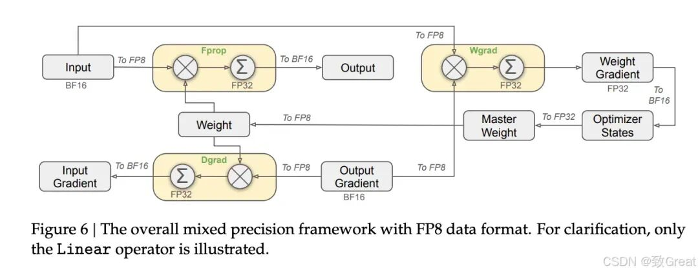

在不同规模的模型上应用FP8训练，并与传统的BF16训练对比，验证FP8训练框架的有效性和准确性。

**● 经济高效的训练成本**

尽管性能出色，DeepSeek-V3的训练成本仅为2.788M H800 GPU小时，训练过程非常稳定，没有经历任何不可恢复的损失峰值或回滚。

###

### ********3.4 训练阶段********

#### ********3.4.1 预训练(pre-traning)********

DeepSeek-V3在14.8万亿高质量和多样化的标记上进行预训练，并进行了两阶段的上下文长度扩展，以增强模型处理长上下文的能力。

**● 语料优化**

与 DeepSeek-V2 相比，V3 通过提高数学和编程样本的比例来优化预训练语料库，同时将多语言覆盖范围扩大到英语和中文之外。此外，新版本对数据处理流程也进行了改进，以最大限度地减少冗余，同时保持语料库的多样性。DeepSeek-V3的训练语料由他们的tokenizer中的14.8T高质量且多样化的token组成。

**● 上下文扩展**

采用与 DeepSeek-V2 类似的方法，在 DeepSeek-V3 中启用长上下文功能。在预训练阶段之后，应用 YaRN（https://openreview.net/pdf?id=wHBfxhZu1u）进行上下文扩展，并执行两个额外的训练阶段，每个阶段包含 1000 个 step，以逐步将上下文窗口从 4K 扩展到 32K，然后再扩展到 128K。

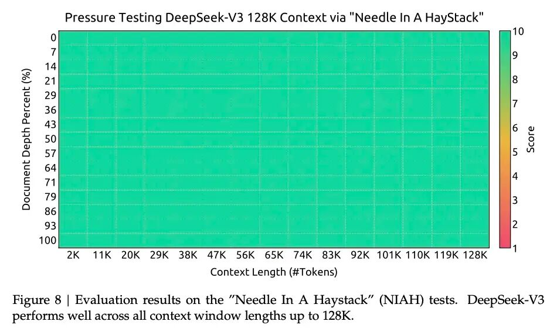

通过这种两阶段扩展训练，DeepSeek-V3 能够处理长达 128K 的输入，同时保持强劲的性能，经过监督微调后，DeepSeek-V3 在大海捞针 (NIAH) 测试中取得了显著的性能，在长达 128K 的上下文窗口长度中表现出一致的稳健性。

#####

#### ********3.4.2 后训练（post-training）********

包括监督式微调和强化学习，以进一步解锁模型潜力，并使其与人类偏好对齐。

- **有监督微调 (Supervised Fine-Tuning)**

采用了1.5M多领域的数据进行微调，每个领域都采用针对其特定需求量身定制的不同数据创建方法。

超参数:两个 epoch 的微调学习率余弦退火：从 5×e6 开始逐渐减少到 1×e6 调度。

- 推理数据 （reasoning data）：对于推理相关的数据集，包括那些专注于数学、代码竞争问题和逻辑谜题的数据集，通过内部的 DeepSeek-R1 模型生成数据，具体来说，虽然 R1 生成的数据表现出较强的准确性，但它存在思考过度、格式不佳、长度过长等问题。
- 目标：平衡 R1 生成的推理数据的高精度和规则格式化的推理数据的清晰度和简洁性。
- 方法：使用组合的监督式微调 （SFT） 和强化学习 （RL） 训练管道，为特定领域（例如代码、数学或一般推理）开发一个**量身定制的专家模型**。此专家模型用作最终模型的数据生成器。训练过程涉及为每个实例生成两种不同类型的 SFT 样本：第一种以 **<problem，original response>** 格式将问题与其原始响应耦合，而第二种类型以 **<system prompt，problem，R1 response>** 格式将系统提示与其 R1 响应一起合并。
- 非推理数据 （Non-Reasonging data）：非推理数据。对于非推理数据，例如创意写作、角色扮演和简单问答，利用 DeepSeek-V2.5 生成响应并招募人工注释者来验证数据的准确性和正确性。

- **强化学习 (reinforcement learning)**

在 RL 流程中采用基于规则的 RM 和基于模型的 RM。

- Rule-Based RM：从响应格式，最终结果的角度进行奖励模型的构建，估计模型在域内进行探索找到约束路径下的正确答案。
- Model-Based RM：针对自由格式真实答案的问题，依靠奖励模型确定响应是否与预期真实答案匹配，对于开放类问题，从提供相应的人类偏好中进行学习。
- Group Relative Policy Optimization

     继承自Deepseek-math

### ********3.5 评估********

### ********3.5.1 Evaluation Benchmarks********

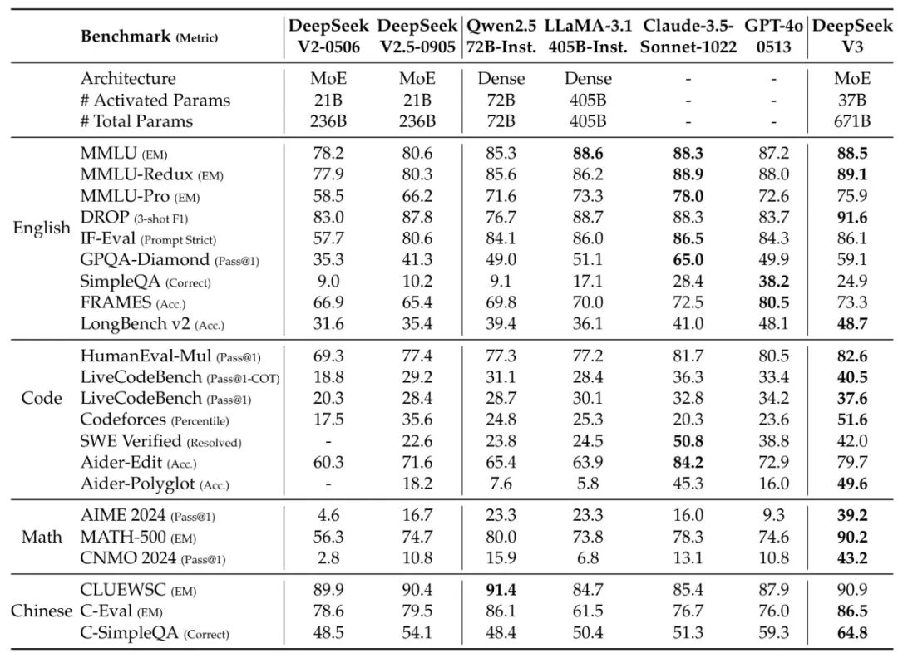

**● 知识领域评估**

在教育类基准测试中，DeepSeek-V3 的表现超越了所有开源模型，在 MMLU、MMLU-Pro 和 GPQA 测试中分别获得了 88.5、75.9 和 59.1 的优异成绩。这一性能水平已与领先闭源模型 GPT-4o 和 Claude-Sonnet-3.5 相当，显著缩小了开源与闭源模型的性能差距。

在事实性知识评测中，DeepSeek-V3 在 SimpleQA 和中文 SimpleQA 测试中都展现出领先于其他开源模型的优势。特别值得注意的是，虽然其英语事实知识（SimpleQA）略逊于 GPT-4o 和 Claude-Sonnet-3.5，但在中文事实知识（中文 SimpleQA）方面却超越了这些模型，凸显了其在中文知识领域的特殊优势。

**● 技术能力评估**

在数学领域，DeepSeek-V3 在所有非 CoT 模型（包括开源和闭源）中取得了最优性能。值得注意的是，在 MATH-500 等特定测试中，其表现甚至超越了 GPT-4o，充分展示了其出色的数学推理能力。

在编程领域，DeepSeek-V3 在 LiveCodeBench 等编程竞赛基准测试中表现最为突出，确立了其在该领域的领先地位。在软件工程相关任务中，尽管略低于 Claude-Sonnet-3.5，但仍大幅领先于其他模型，展示了其在各类技术评测中的综合实力。

### ********3.5.2 开放域评估 Open-Ended Evaluation********

DeepSeek-V3 在 AlpacaEval 2.0 上展示了卓越的性能，性能优于闭源和开源模型。这表明了在写作任务和处理简单的问答场景方面的出色能力。值得注意的是，它比 DeepSeek-V2.5-0905 高出 20%，突出了处理简单任务的实质性改进，并展示了其进步的有效性。

# 02

Deepseek R1系列

**DeepSeek-R1: Incentivizing Reasoning Capability in LLMs via**

发表时间: 2025年01月22日

论文地址:DeepSeek-R1: Incentivizing Reasoning Capability in LLMs via Reinforcement Learning

### ******1. R1关键贡献******

- DeepSeek-R1-Zero模型是一个纯粹通过强化学习来增强的强推理模型，摆脱了传统使用**SFT训练所需的海量标注数据**，同时使用基于规则的reward计算方式，解决了传统强化学习中引入基于模型的reward计算方式带来的reward hacking问题，使强化学习过程更加稳定
- GRPO提供了一种新的思路，相比PPO，GRPO摒弃了价值模型，转而从组得分中估计基线，显著降低了训练资源消耗。
- **（低成本快速复制推理能力）探索了如何将大模型（如DeepSeek-R1）学到的推理模式蒸馏到小模型中。这一蒸馏方法使得小模型在推理任务上表现出色，超越了一些最先进的模型。论文中提到用了800K的生成推理数据训练过一些小规模的模型后（1.5B、7B、14B、32B、70B）测试表现良好**

### ******2. 训练总览******

整体原理图如下所示，简单来看可以划分为两部分，R1-Zero与R1两部分：

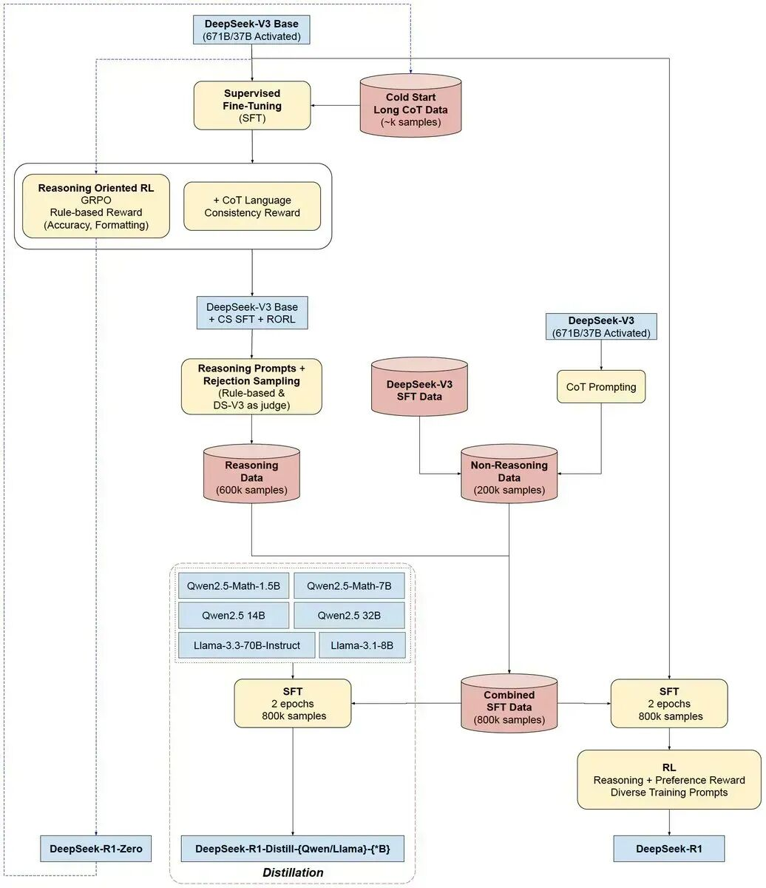

### ******2.1 第一阶段R1-Zero: 无需监督数据的强化学习训练******

### ******2.1.1 训练策略GRPO******

继承自Deepseek-math

### ******2.1.2 基于规则的奖励建模******

R1的技术报告指出他们主要采用基于规则的奖励系统来对输出进行奖励信号生成，主要有两种奖励：

1）准确性奖励：要求根据模型的回答准确通过规则。例如，对于一些有着确定性答案的数学问题，模型的输出需要会被组织成一个特定的格式来验证是否符合答案，而对于一些leetcode类的编程问题，会采用编译器来验证生成的代码是否能通过测试用例。

2）格式奖励：会要求模型将思考过程放在<think>和</think>标签之间。

他们没有采用reward 网络，因为使用奖励网络的话可能会导致reward hacking问题，而且也会产生额外的计算开销。

在复现代码中，作者也是通过大量的if-else判断来进行打分，没有使用具体的模型来做拟合，但是具体的这些分支规则，也跟着训练中实际产生的trick来不断进行调整的。

### ******2.2 第二阶段训练R1：强化学习和冷启动的结合******

此部分的训练步骤较多且繁琐，不适用于快速应用，而且在原文中的数据部分提及较少，此部分的复现大部分开源项目仍然在进行，继续进行R1训练的原因是纯粹使用强化学习训练得到的R1-Zero模型会产生如结果阅读困难，混合多种语言等问题，这就引出了R1模型的需求。

### ******2.2.1 冷启动（Cold Start）******

在 DeepSeek-R1 的训练中，冷启动数据的引入起到了关键作用，尤其是在 DeepSeek-R1-Zero 的早期不稳定训练阶段。研究者收集了一些长链思维（CoT）数据，并用这些数据对基础模型进行微调，作为强化学习的初始步骤。

冷启动数据的收集方式：

- 使用少量示例提示（few-shot prompting）生成长链思维。
- 直接提示模型生成详细的答案，并加入反思和验证步骤。
- 从 DeepSeek-R1-Zero 的输出中收集数据，并通过人工后处理优化结果。

### ******2.2.2 推理导向的强化学习（Reasoning-oriented Reinforcement Learning）******

在对基础模型进行冷启动微调后，作者使用与 DeepSeek-R1-Zero 相同的大规模强化学习（RL）训练方法，进一步提升推理能力，尤其在数学、编程、科学和逻辑推理等任务上。

- 语言混合问题：在强化学习训练过程中，常常出现语言混合的问题，尤其是在多语言提示的情况下。为了解决这个问题，研究者引入了语言一致性奖励，即在推理过程中鼓励模型保持目标语言的一致性。
- 奖励机制：通过结合推理任务的准确度奖励和语言一致性奖励，模型不断优化，最终达到了在推理任务上的收敛。

### ******2.2.3 拒绝采样和监督微调******

1. 拒绝采样（Rejection Sampling）：当推理导向的强化学习训练收敛后，研究者使用该检查点收集监督微调（SFT）数据，进一步改进模型的表现。
2. 推理数据：通过拒绝采样从 RL 训练的检查点生成推理数据，并对生成的数据进行人工筛选，确保数据的高质量。
3. 非推理数据：包括写作、事实性问答、自我认知和翻译等任务，结合 DeepSeek-V3 的数据进行微调。

### ******2.2.4 全场景强化学习（Reinforcement Learning for all Scenarios）******

为了进一步提高模型对人类偏好的适应性，作者实施了第二阶段的强化学习，旨在优化模型的有用性和无害性，同时继续完善推理能力。

有用性：重点确保模型的回答对用户有实际帮助，评估时仅关注最终总结部分。

无害性：评估整个回答的内容，识别并消除潜在的偏见或有害内容。

### ******3. 实验结果******

DeepSeek-R1 在 MMLU、MMLU-Pro 和 GPQA Diamond 等教育知识基准上相比 DeepSeek-V3 有非常大的能力提升，数学推理和可以和OpenAI-o1-1217持平，展示出了非常强的逻辑推理能力。

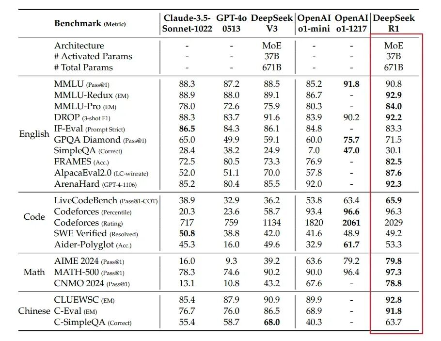

### ******4. 蒸馏实验******

**此部分对业务侧参考意义较大，通过纯sft的方式将推理方式蒸馏至可用的小模型，不会额外增加训练和部署的成本。**为了让更小的模型具备推理能力，作者采用了蒸馏方法，将DeepSeek-R1的推理能力传递给更小的模型。

论文中将 DeepSeek-R1 用来微调开源的模型如 Qwen 和 Llama，并使用约 80 万个训练样本进行蒸馏。这里只使用了最简单的SFT，而不引入强化学习，发现这种简单的方式就足够使得小模型的推理能力大幅提升，这验证了蒸馏的前景。实验表明，这种蒸馏方法显著提升了小模型的推理能力。

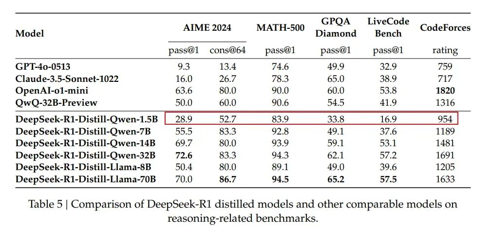

**结论1：**简单的方式就足够使得小模型的推理能力大幅提升，但是值得注意的是，对于1.5B的小模型，效果并不是很好，可能是因为过小的模型无法承载复杂的推理能力，表格中用开源模型跟目前最先进的一些闭源模型做了对比。文中还提到，要是继续使用强化学习训练，还能得到更好的效果，但是论文说还需要进一步的探索，所以只写了蒸馏的效果。

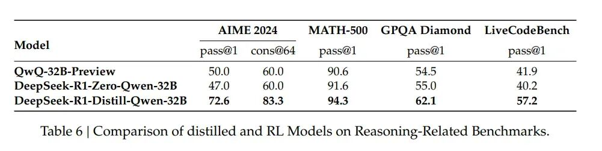

**结论2：**与其对小模型进行耗时耗力的大规模强化学习训练，不如就采用经济实惠的知识蒸馏，对于强化学习来说，基座的能力也至关重要，要想突破模型能力的上限，大规模强化学习和强有力的基座模型都至关重要。

### ******5. R1存在的问题******

论文中提到，在R1的训练结果中也出现了很多问题，这对我们后续的复现和使用都是一个参考：

**通用能力（General Capability）：**

目前，DeepSeek-R1在函数调用、多轮对话、复杂角色扮演和JSON输出等任务上不如DeepSeek-V3。未来计划探索如何利用长链式思维（CoT）提升这些任务的表现。

**语言混合（Language Mixing）：**

DeepSeek-R1目前针对中文和英文进行了优化，但在处理其他语言时可能出现语言混合问题。未来计划解决这一问题。

**提示工程（Prompting Engineering）：**

DeepSeek-R1对提示敏感，少样本提示（few-shot prompting）会降低其性能。建议用户在零样本（zero-shot）设置下直接描述问题并指定输出格式，以获得最佳结果。

**软件工程任务（Software Engineering Tasks）：**

由于评估时间较长，影响RL过程的效率，大规模RL尚未广泛应用于软件工程任务。未来版本将通过拒绝采样（rejection sampling）或异步评估来提高效率。

### ******6. 复现R1项目分析******

### ******6.1 R1-Zero复现项目：Logic-RL******

开源项目地址：https://github.com/Unakar/Logic-RL

**训练数据**

只有2K不到的训练数据集，完全由程序合成，确保对基座模型是OOD数据（这些数据在模型训练时从未见过）。其中逻辑问题类似老实人和骗子的益智题，老实人总说真话，骗子总说假话，下面N个人，各有各的表述，请判断谁是骗子。我们以此为例讲解实验细节。一些训练用的数据格式示例：
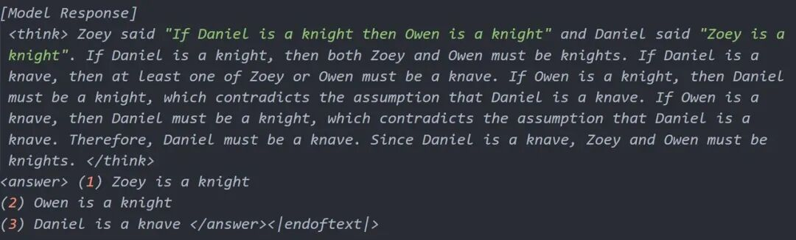

**训练过程**

训练过程分为三个阶段

1. **预热阶段**，此部分主要是课程学习与格式遵循，用少量简单题目引导模型学习<think></think><answer></answer>的格式，此阶段没有明显的response length增加。
2. **高温采样与大量rollout**，此阶段调高温度进行大量采样，此阶段训练持续最长，也最不稳定，是各种能力涌现的时段。
3. **退火**，温度学习率学习率递减，此阶段模型的输出已经趋于稳定，有verify，有反思，有回溯，有格式。

**训练结果**

复现实验中观察到了论文中提到的 自我进化过程（Self-evolution Process of DeepSeek-R1-Zero），包括模型思考时间的增加，自发行为的出现，反思（Reflection），验证（Verify），“顿悟时刻”（Aha Moment of DeepSeek-R1-Zero）

原始基座模型在测试集上只会基础的step by step逻辑。

无 Long CoT冷启动蒸馏，三阶段Rule Based RL后，模型学会了

    - **迟疑** (标记当前不确定的step等后续验证)，

    - **多路径探索** (Les't test both possibilities),

    - **回溯之前的分析**(Analyze .. statement again)，

    -**阶段性总结** （Let's summarize, Now we have determined），

    - Answer前习惯于最后一次**验证答案**(Let's verify all statements),

    - Think时偶尔切换**多语言作答** （训练数据纯英文的情况下，思考部分是中文，最后answer又切回英文）

如下是训练过程中的部分日志，证明模型确实可以从强化学习中自我进化出各种能力。

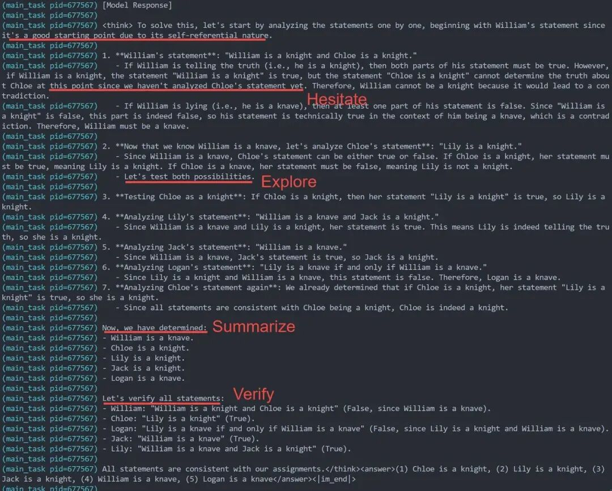

### ******6.2 蒸馏实验复现：Open-R1******

蒸馏实验分析来自于开源项目

https://github.com/huggingface/open-r1

step1：通过DeepSeek-R1蒸馏的数据训练

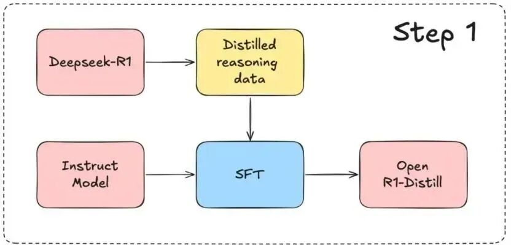

使用 DeepSeek-R1 的 蒸馏数据创建了 Bespoke-Stratos-17k——一个包含问题、推理轨迹和答案的推理数据集。制作好的数据集参见：

https://huggingface.co/datasets/bespokelabs/Bespoke-Stratos-17k。

这里面的关键是推理轨迹，通过R1得到，但是是英文的数据集。

该数据集包含：

- 5,000 条来自 APPs 和 TACO 的编程数据；
- 10,000 条来自 NuminaMATH 数据集的 AIME、MATH 和 Olympiads 子集的数学数据；
- 1,000 条来自 STILL-2 的科学和谜题数据。

生成过程：

- 高效数据生成：通过 Bespoke Curator(用于生成和管理高质量合成数据的项目) 和 DeepSeek-R1，仅用 1.5 小时生成高质量推理数据集，成本控制在 800 美元。
- 改进拒绝采样：引入 Ray 集群加速代码验证，作者后面计划直接集成代码执行验证器。
- 优化推理轨迹：DeepSeek-R1 的推理轨迹质量高，无需额外格式化步骤，简化了流程。
- 提升数学解题精度：通过 gpt-4o-mini，过滤错误的数学解决方案，显著提高了正确数学解决方案的保留率（从 25% 提升至 73%）。

部分训练数据可视化结果：

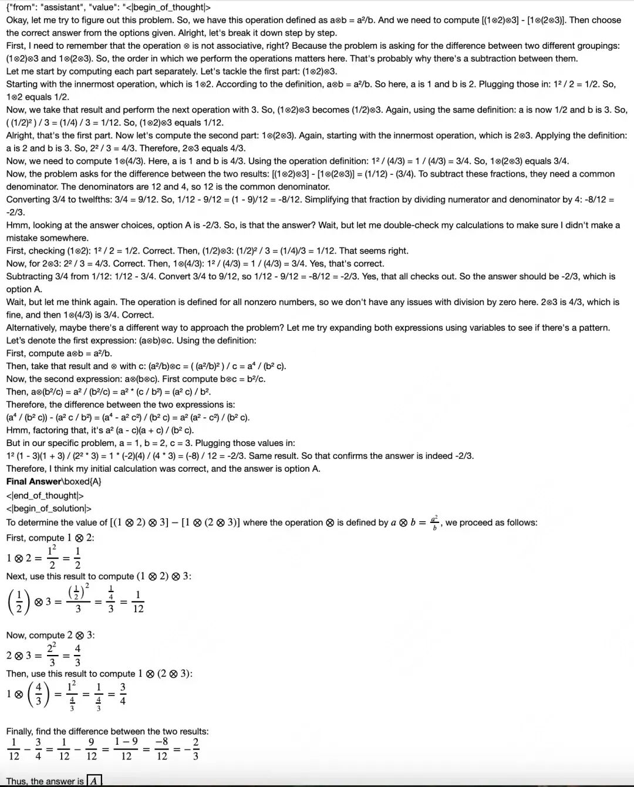

项目中使用qwen各个规模的模型作为基座进行蒸馏实验对比，指标均有明显提升。

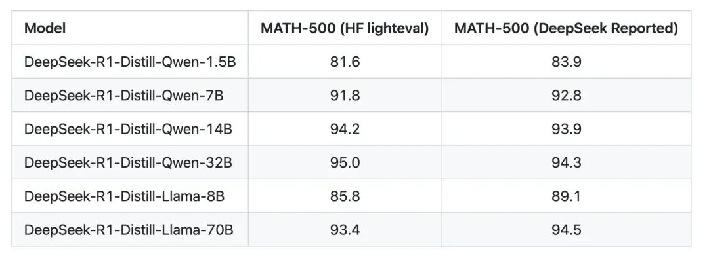-End-原创作者｜客服部产研团队
感谢你读到这里，不如关注一下？👇

 

DeepSeek 给你带来了怎样的影响或是便利？欢迎评论留言补充。我们将选取1则优质的评论且点赞量最高的同学，送出腾讯QQ公仔1个（见下图）3月6日中午12点开奖，一周内寄出。

📢📢欢迎加入腾讯云AI代码助手社群，享前沿资讯、大咖干货，找兴趣搭子，交同城好友，更有鹅厂招聘机会、限量周边好礼等你来~

（长按图片立即扫码）

