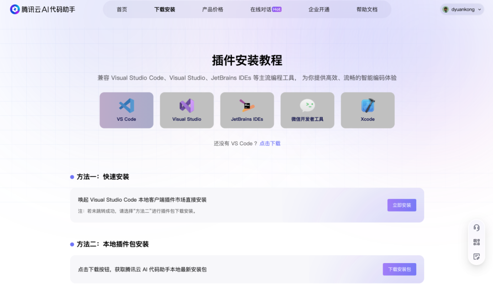
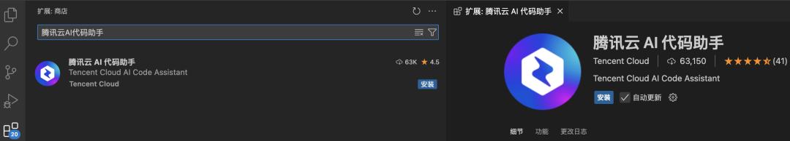
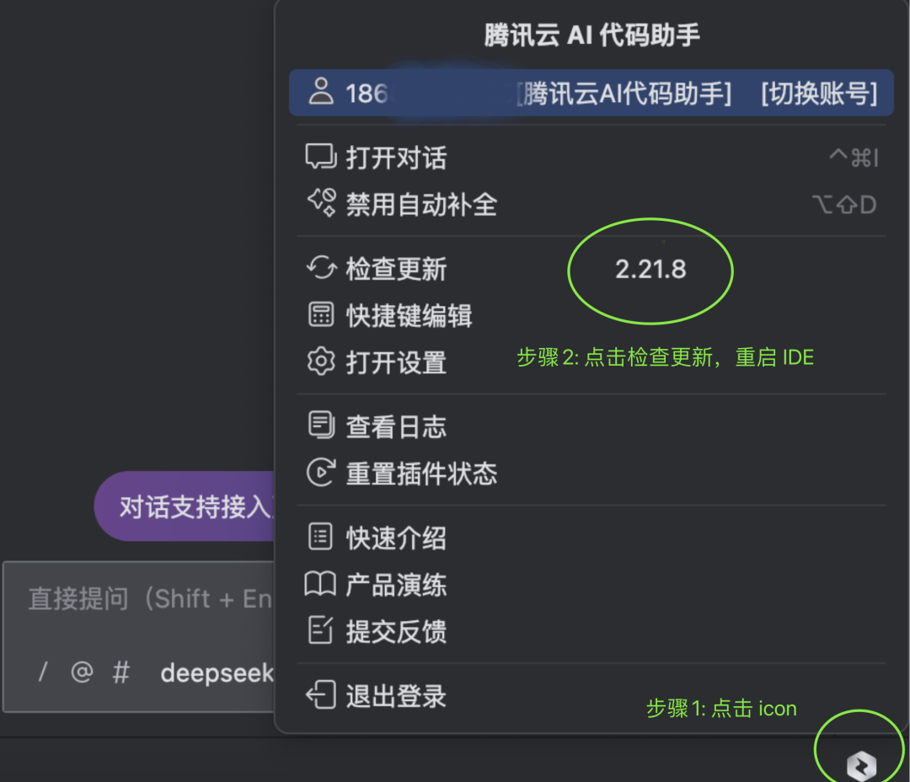

# 即刻体验｜腾讯云AI代码助手正式搭载DeepSeek-V3-0324顶级模型，开发效率直接提升100倍！

> 公众号: 腾讯CodeBuddy
> 发布时间: 2025-03-27 23:54
> 原文链接: https://mp.weixin.qq.com/s/mJrAyu0SWvK6QHTXy3VaFA

---

各位开发者家人们！你的开发日常崩溃瞬间是不是这样的：

“这行报错到底什么意思？”

“重复代码怎么优化？”

“今晚赶需求，要通宵上线，你们聚......”

“今晚有线上故障定位，别等我”

.......

——你的崩溃，腾讯云AI代码助手都懂！

此刻，烦恼的通通丢掉，手头繁忙的事情先放一放，听我宣布个好事儿！

即日起，AI代码助手正式搭载 DeepSeek-V3-0324 顶级模型！

无需配置，下载/更新AI代码助手插件即可用，编码效率和体验直接溜的飞起 🚀

**什么是DeepSeek-V3-0324,它到底厉害在哪？**

什么是DeepSeek-V3-0324，它是DeepSeek-V3 系列的小版本迭代，模型参数从初代 V3 的 6710亿小幅增至 6850 亿，依然采用混合专家(MoE)架构，每个 token激活约370亿参数，在推理、编程、数学、中文处理等多个领域达到行业领先水平。

DeepSeek-V3-0324 的强大之处可总结以下五点：

● 创新的训练策略

○ 采用无辅助损失的负载均衡，避免传统方法的性能损失

○ 多 token 预测训练提升推理速度，FP8 混合精度训练显著降低计算成本

○ 在超大规模模型上验证FP8训练的有效性，提高训练效率

● 优化的MoE架构

○ 动态调整偏差项，防止路由崩溃，性能提升15%以上

○ 节点受限路由机制减少跨节点通信流量至1/3，结合 FP8 调度与 RDMA 优化，训练效率提升40%

○ 支持128K超长上下文，可处理50页PDF或完整代码库，多轮对话记忆更强

● 综合能力大幅提升

○ 关键指标突破性进步，在各项权威基准测试中相较于初代 V3，在关键指标上展现了突破性进步。

- MMLU-Pro：75.9 → 81.2 (+5.3) -多领域知识理解能力
- GPQA：59.1 → 68.4 (+9.3) - 专业问答能力
- AIME：39.6 → 59.4 (+19.8) - 数学竞赛解题能力，进步最为显著
- LiveCodeBench：39.2 → 49.2 (+10.0) - 代码生成与调试能力

○ 数学推理能力突出，AIME 竞赛正确率提升近20%，超越 Grok3

○ 中文处理优势，中长篇写作逻辑更严密，联网搜索报告更精准

● 顶尖的编程生成能力，代码生成质量达到行业顶尖水平

○ 单一提示词中，可精准生成800行无错误网页代码（含动态交互，视觉美观）

○ 代码可运行率92%，支持20+编程语言，前端开发效率提升80%

○ 在 kcores-llm-arena 评测超越 Claude 3 Sonnet普通版

● 高效的推理与开发者体验

○ 推理任务显著提升，借鉴 DeepSeek R1 模型训练技术，上线每秒20+ token生成速度（M3 Ultra设备），响应比前代快40%

○ 智能补全、代码纠错、API兼容性检测等功能大幅提升开发效率

○ 支持复杂逻辑问题（如"7米甘蔗过2米门"），自主发现隐藏解法

\*来源：DeepSeek 官方发布文档

**怎么用？**

**切换模型**

将腾讯云AI代码助手插件更新至最新版本，在对话输入框左下角选择 tencent-deepseek-v3 模型即可，如果你还没安装代码助手，请看后续安装指引

**新用户**

访问 https://copilot.tencent.com，进入下载页选择对应的 IDE类型，进行下载对应版本的安装包；

如本地有IDE，打开你的IDE（VSCode、JetBrains），在插件市场搜索「腾讯云AI代码助手」，下载安装与登陆即可。

**老用户**

更新 AI代码助手插件版本至最新版本即可直接使用，如已使用最新版本需重启 IDE 客户端哟。

VS Code更新方式

Jetbranis IDEs 更新方式(如 IntelliJ IDEA、Goland、PyCharm、Rider、鸿蒙DevEco Studio 、Android Studio 等） Jetbrains 系列 IDEs

**体验有礼**

1️⃣ 体验：体验最新 DeepSeek V3-0324 模型或腾讯云AI代码助手相关任一功能

2️⃣ 分享：分享你的【体验截图+使用心得】并@腾讯云AI代码助手，分享在社交平台（腾讯云开发者社区、技术交流群、小红书、CSDN 等各类开发者社区圈子）

3️⃣ 抽奖：搜索「腾讯云AI代码助手」微信公众号底部菜单栏，点击体验有礼问卷，上传你的【社交分享截图】+【体验截图】并成功提交，可以获得1次抽奖机会（为大家准备了 10

 份精美腾讯 QQ 公仔周边礼品）。

⏰活动时间：03.27-04.02

🎁发货时间：04.07号之前

\*运营小助手会核对中奖截图信息，若不符合要求的将取消中奖资格

如您在使用过程有疑问或遇到问题，可以扫下方二维码，随时联系我们

