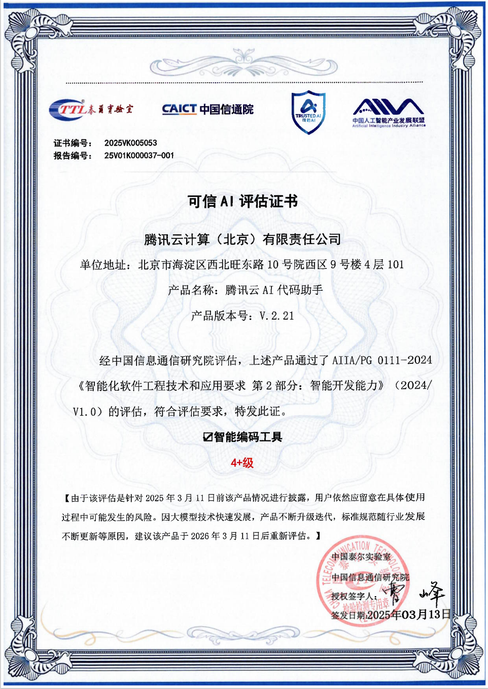
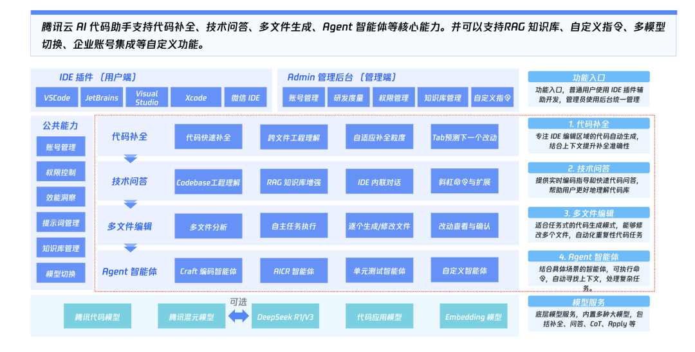
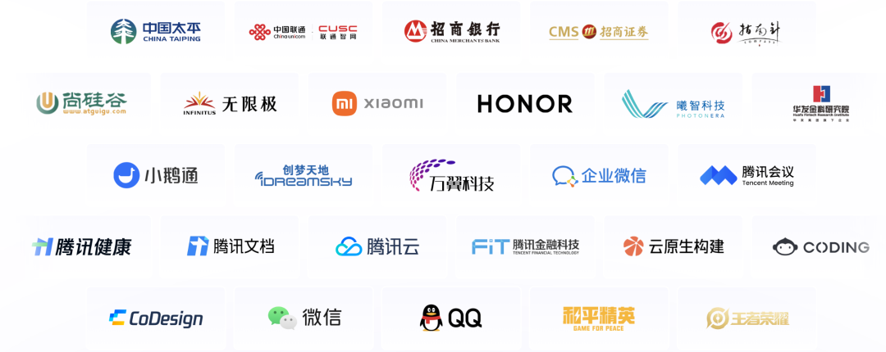
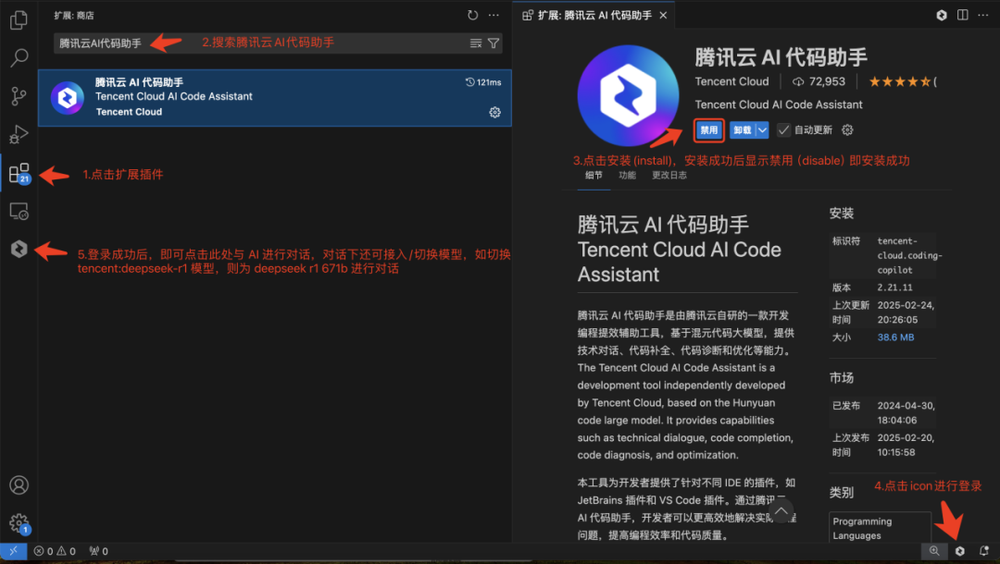
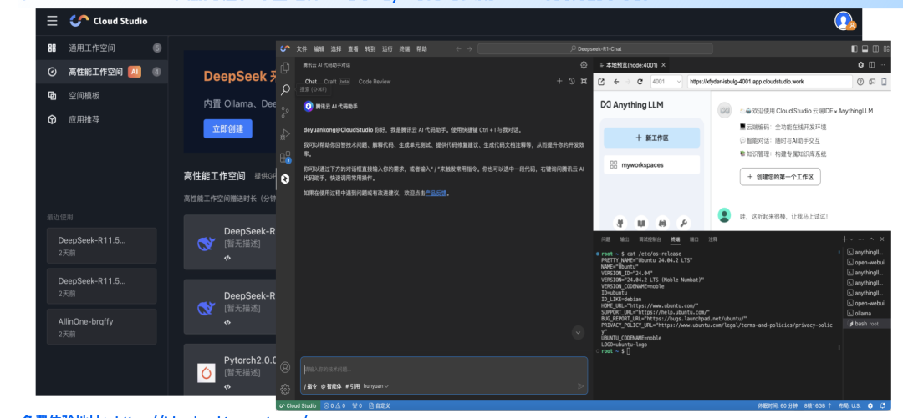
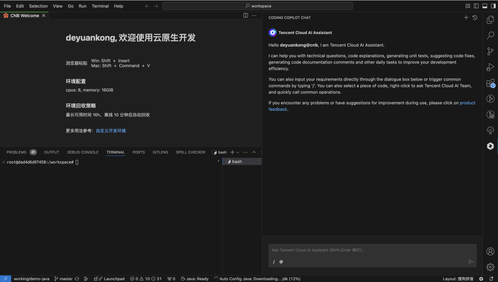

# 2025首批！腾讯云AI代码助手斩获信通院可信AI智能编码工具最高等级认证！

> 公众号: 腾讯CodeBuddy
> 发布时间: 2025-03-31 19:10
> 原文链接: https://mp.weixin.qq.com/s/beAyLwN8JTs8HoZSwnEYig

---

2025年3月，中国信息通信研究院（以下简称“中国信通院”）公布了由其组织的可信AI智能编码工具2025年首轮评估结果，国内数家头部企业参评，腾讯云AI代码助手斩获最高评级4+级， 成为2025年首批通过该项评估并获得当前最高评级的企业之一。

经评估，腾讯云AI代码助手在四类检测项目，13个能力项，177个能力子项评测表现优异，腾讯云AI代码助手具备完善的功能性和较高结果准确性，其代码生成补全等方面结果准确度较高，代码工程语义理解方面能够深度理解开发者意图实现上下文精准解析，形成从编码辅助到质量校验的全链路智能化支持。产品交互设计流畅直观，在主流开发平台及高并发场景下均保持稳定的响应性能。

**腾讯云AI代码助手是什么**

腾讯云 AI代码助手是由腾讯云自研的一款开发编程提效辅助工具，具备代码补全、单元测试、技术对话、软件开发智能体Craft、智能代码评审等能力，支持自定义指令、创建 RAG 知识库、智能体接入、多文件编辑等工程化能力，同时支持其他例如 DeepSeek大模型的接入，有效提升了对话的理解，帮助开发者实现更加强大、高效、安全的AI编程体验。

**与我们一起开启代码智能化**

**已服务百万开发者**

截至目前，在重点金融/消费电子/泛互/工业制造/教育等领域，腾讯云AI代码助手可提供SaaS/自托管/私有化等解决方案；腾讯云 AI代码助手已服务百万开发者，同时在金融、科技、汽车等行业深度落地应用。

在腾讯内部，85%以上的开发岗员工都在使用腾讯云AI代码助手，整体编码时间平均缩短40%以上，AI生成代码占比超四成，结合内部大规模投产经验，研发提效超16%！

**如何使用**

免费入口1：主流IDE中扩展插件中搜索腾讯云AI代码助手，免费体验。

打开 Visual Studio Code 或Jetbranis IDEs(如 IntelliJ IDEA、Goland、PyCharm、Rider等）、微信小程序开发者工具、Visual Studio、Xcode主流插件市场中 搜索「腾讯云AI代码助手」，即可秒安装。

免费入口2：在CloudStudio IDE中低门槛、零基础体验与学习，每月可使用12500分钟免费时长。

免费入口3：一站式云原生 & DevOps 平台CNB 中免费体验，每月更有1600 核时/月云原生开发体验及更多免费资源。

**体验有礼**

1️⃣ 体验：体验腾讯云AI代码助手任一功能

2️⃣ 分享：分享你的【体验截图+使用心得】并@腾讯云AI代码助手，分享在社交平台（腾讯云开发者社区、技术交流群、小红书、CSDN 等各类开发者社区圈子）

3️⃣ 抽奖：搜索「腾讯云AI代码助手」微信公众号底部菜单栏，点击体验有礼问卷，上传你的【社交分享截图】+【体验截图】并成功提交问卷，可以获得1次抽奖腾讯QQ公仔的机会（中奖率高达50%）。

⏰活动时间：03.31-04.06

🎁发货时间：04.13号之前

\*运营小助手会核对中奖截图信息，若不符合要求的将取消中奖资格

如您在使用过程有疑问或遇到问题，可随时向我们反馈，欢迎扫码扫下方二维码或随时联系我们～

