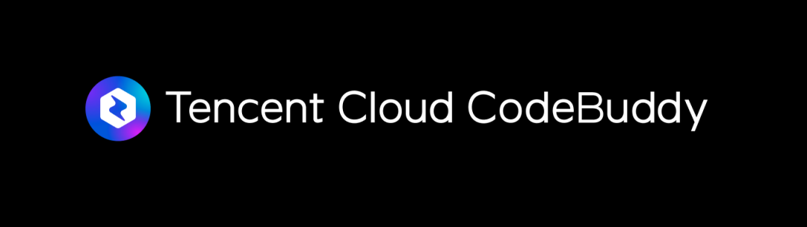

# AI 编程再进化？来 TVP 吐槽大会看 CodeBuddy 巅峰对决！

> 公众号: 腾讯CodeBuddy
> 发布时间: 2025-05-12 12:53
> 原文链接: https://mp.weixin.qq.com/s/zsI__RuTzcLiHNLS4wePwQ

---

**参会报名**

腾讯云代码助手 CodeBuddy 融合工程理解 Codebase、代码补全 、单元测试、代码评审、MCP 等多能力于一身，推出了对话式编程智能体 Craft， 真正实现 "一句话就生成好应用"。当智能工具成为研发新动力，腾讯云代码助手 CodeBuddy 究竟是“提效神器”，还是企业和开发者的另一道难题？

为了聆听用户的真实使用体验，5 月 17 日（周六）下午 14:00-17:00，腾讯云代码助手 CodeBuddy 将登上 TVP 吐槽大会的舞台，接受业界大咖的深度体验与暴风吐槽！“观战”席位限量开放观众，扫描「海报二维码」或点击「阅读原文」火速报名，见证领域大咖巅峰对决，选出你心中的 Talk King！

