# 国内首家 | CodeBuddy + Skills 驱动的 AI 编程实践

> 公众号: 腾讯CodeBuddy
> 发布时间: 2025-11-05 12:03
> 原文链接: https://mp.weixin.qq.com/s/bBbyPh7ENDgduvKOa3NSHg

---


近半年 AI Agent 在行业内的快速崛起，在我们与外部企业负责人、高校院校负责人，以及团队内部及各 BG 业务团队中一群专业技能很强、经验丰富、高频使用 CodeBuddy 核心功能的一线开发者们进行了日常 QA、抽样调研，发现大家有焦虑，也非常关注 AI 时代如何提升自己的技能，希望在团队内部落地好 AI Coding工具，本文将深度解答你的疑惑，欢迎查阅。

**一、AI Coding 时代一线开发者的痛点**

**1.1 开发者一些日常成长需求与 AI 应用痛点**

自 CodeBuddy 及行业 AI Coding 工具诞生发布以来，伴随业界 LLM 的高速发展，特别是近半年 AI Agent 在行业内的快速崛起，在我们与外部企业负责人、高校院校负责人，以及团队内部及各 BG 业务团队中一群专业技能很强、经验丰富、高频使用 CodeBuddy 核心功能的一线开发者们进行了日常 QA、抽样调研，发现大家反馈比较高频的需求如下：

- AI 时代开发者需要的技能是什么？如何在时代中不被淘汰？
- 如何更好地驾驭好 CodeBuddy 这类 AI Coding 工具？
- 如何实现团队知识及技能传承, 如 Prompt，团队内部规模化落地，每个成员都能借助 AI 进行高效工作，而不是"技能孤岛” ？
- 如何让 AI 像人一样具备现实世界的技能？

同时，我们也发现了一些使用 AI 工具的痛点问题，如下：

- 提示词冗长低效: 复杂任务依赖长提示,效率低且难复用,无法沉淀能力。
- 协作流程混乱: 团队使用AI方式不统一,知识碎片化难以显性沉淀。
- 上下文资源浪费: 每次对话重复"教育"AI,Token消耗大易超限。
- 专业能力欠缺: 通用 AI 缺乏领域深度,无法组装技能解决复杂问题。

**1.2 从知识到技能**

本质是能力到技能的转化：对于上述痛点和需求， 我们 CodeBuddy 团队一直在进行探索和深入研究，跟进业界进展，从分类上可以分为产品能力建设提供支撑、另外一个角度是自身/业务实践赋能，通过产品功能形成操作手册知识库，用户学习掌握，即为技能。 如近期的案例：《CodeBuddy Code 是怎么做到 90% 产品代码由 AI 生成的》

其实，我们日常接触的广泛信息传递和输入，本质上是一种知识的输入到技能的输出给到大家，通过知识的转化，我们获得了新的技能，具备解决问题的能力。

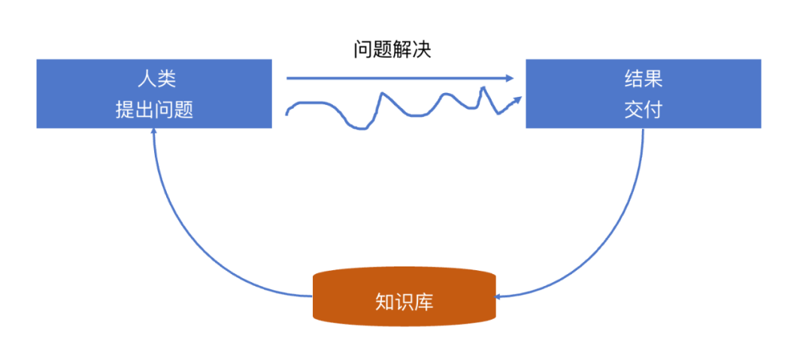

如图举个例子：我安排一个同学去解决一个问题，一方面凭借自身经验，有无技能，另外一方面回去查询技术资料，如规则约束，流程，方法，这里包含了 2 个关键内容，即：

- 显性化知识：技术资料等知识库，规则约束，流程、方法
- 隐性的知识：自己经验经验，有无技能，最佳实践

想象这样一个场景: 你是团队的技术专家,手头有个棘手问题需要解决。凭借多年经验,你三下五除二就搞定了。但如果此时来了一位实习生小明,你会怎么教他?

我们可能会亲自"去解决这个问题",或是耐心地告诉他:先查哪份技术文档,遵循什么规则约束,按照什么流程操作,使用哪些工具,注意哪些坑点,最后检查哪些关键项。这个过程,本质上是将你脑海中的隐性知识(经验、技能、最佳实践)转化为显性知识(文档、流程、方法),让小明能够复制你的成功路径。

 AI 的困境:知识丰富却缺乏技能

现在, 如果我们把小明换成 AI 呢? 从 AI 角度来看，知识就是大模型本身训练的语料，针对特定领域的事项，如果没有私域知识的输入，特定领域的技能支持，AI 很难按照我们的意愿执行，难以满足，最终结果也不一定好。 同样拥有了知识，如果缺乏和外界的交互，也很难有好的结果。所以 AI 一直在想方设法的拓展它对外部的一些边界和能力来提升效果。如 Prompt、Rules、MCP、A2A 协议及最新发布的 Skils 这些都是为了更好的扩展大模型的知识边界，方便大模型和外部的协同。

期望 AI 像人一样自主执行和独立操作

如果我们也希望 AI 能按照人的思路、自主执行，首先要解决的一个核心问题就是，得将我的私域经验显性化表达出来， 类似 Rule，有没有一种 工具形态，可以将方法，工具，技术，知识这些经验都需要你提前定义好，给 AI 专注解决问题的本质，让 AI 按你的结果目标来运行。

**二、Skills：为 AI 配备现实世界所需的"技能包"**

今天我们重点分享的就是新晋的 Skills，我称之为技能，给大模型培训像人一样赋能的技能，通过 Rules 约束大模型输出，通过 MCP 触达外部业务系统，通过知识库进行私域知识库输入，而通过 Skills 则是为大模型武装上特定技能，配备现实世界所需要的技能，高效解决问题。Skills 是近期 Anthropic 发布了一个新特性——Claude Skills，它的目标，是让 Claude 不再只是一个「能聊天的模型」，而是一个具备可扩展、可执行技能体系的代理式 Agentic AI 工具。CodeBuddy 也是国内首家支持 Skills 的产品。

Skills 听着很诱人，到底能解决什么问题？能不能解决上面的问题，接下来，我们来看看 Skills 的设计逻辑以及应用。

**2.1 Skills 设计逻辑与核心特性**

**● 设计逻辑：** Skills 技能是包含指令、脚本和资源的文件夹集合，结合 Agent 可实现构建专业化智能体的一种方法，通过 `SKILL.md` 文件组织，为 AI Agent 提供现实世界如人一样的可按需加载的专业化技能扩展，包括工具、方法、流程、自定义能力，Skills 将通用模型转变为领域专家。

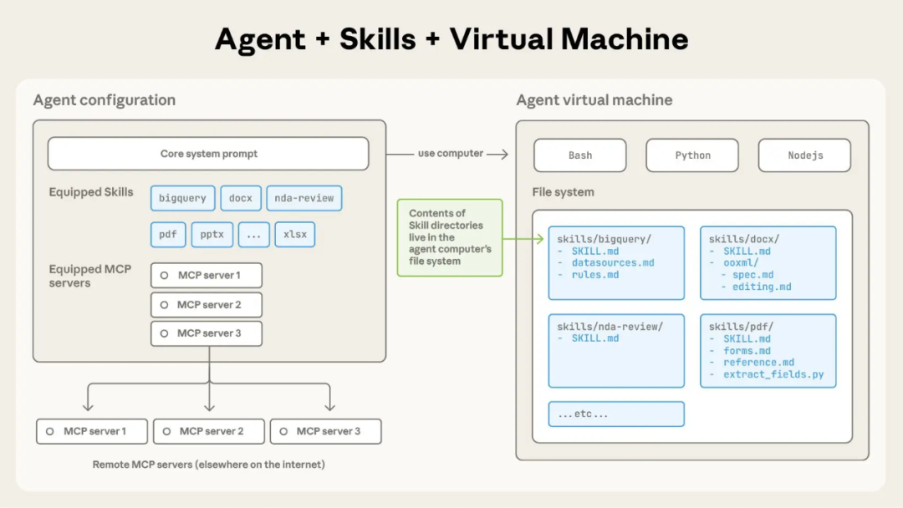

示例图： Agent + Skills + Virtual Machine 架构图

**● 核心特性:**通过模块化、可组合的能力封装为技能，具备以下核心特性：

- **模块化设计：**每个技能都是独立的文件夹，包含完整的指令、脚本和资源，如文档技能
- **动态加载：**AI Agent 可根据任务需求按需加载相应技能
- **专业化能力：**每个技能专注于特定领域，提供深度的专业知识和操作能力
- **人性化交互：**模拟人类专业技能的学习和应用方式
- **可扩展性：**支持自定义技能开发，满足个性化和企业级需求

**● 组成拆解：**

一个完整的 Skills 就是一个标准化的文件夹体系，每个技能由若干文件组成，用来描述功能、脚本和引用资料


```objectivec
my-skill/
├── SKILL.md (必需)
│   ├── YAML 前置元数据 (必需)
│   │   ├── name: (必需)
│   │   └── description: (必需)
│   └── Markdown 指令 (必需)
└── 捆绑资源 (可选)
    ├── scripts/          - 可执行代码 (Python/Bash等)
    ├── references/       - 参考文档
    └── assets/           - 输出文件 (模板、图标、字体等)
当然我们还可以进行封装引用的Tools（工具）、Knowledge（知识库）
```


**●SKILL.md：**其中 SKILL.md 文件是最核心的文件，必须以 YAML Frontmatter 元数据开头，其中包含文件名和描述，该描述会在启动时加载到系统提示符中，如下为 PDF 例：

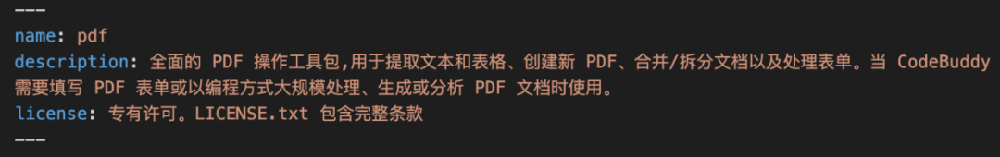

示例图：以 PDF 为例的 YAML Frontmatter 元数据

看起来像普通的 Prompt 文件，但它的结构和加载机制不一样。Skills 不是简单的「指令封装」，而是一个具备分层调用逻辑的知识模块体系。

如图为 PDF 在 AI 应用的技能，基于该技能进行拆解和封装，包括定义 SKiil.md 以及相关的脚本和代码解决相关的问题。

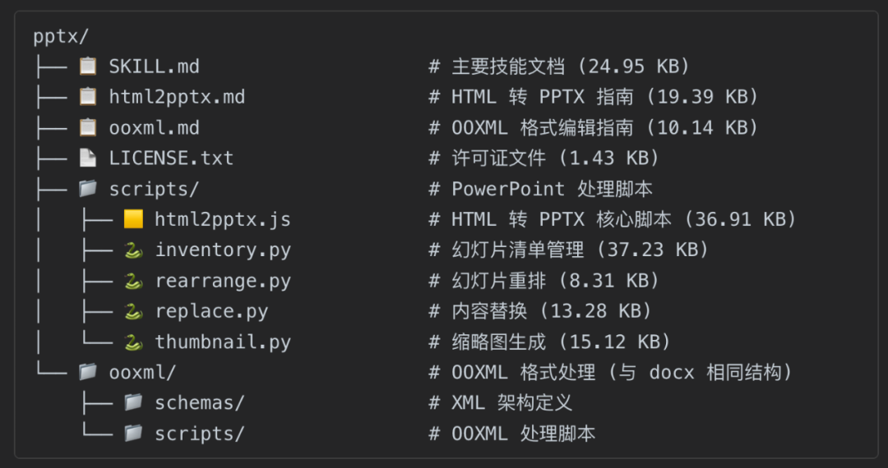

示意图：以 PDF 技能为例，进行代码结构拆解

随着技能的提升， 我们可以捆绑额外的内容，AI 会在需要时加载这些内容，以 PDF 技能 Skill.md 为例：

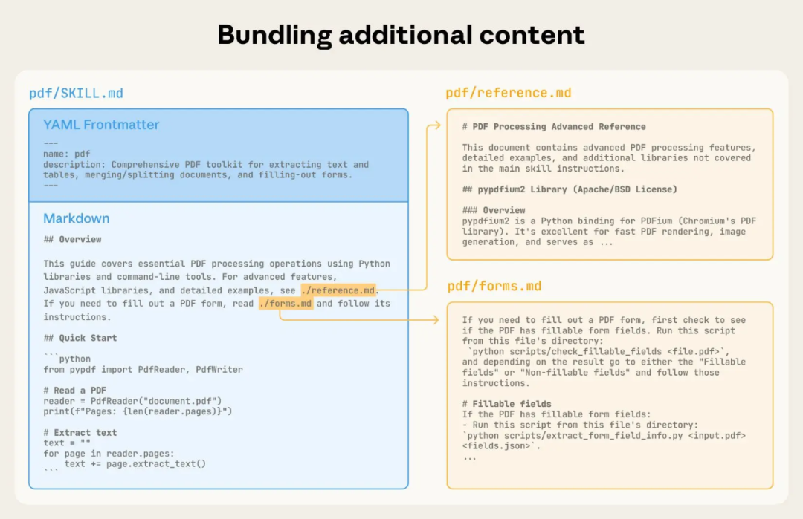

例如在进行处理 PDF 技能中，针对不同的任务目标，AI 提供有不同的工作流和解决办法。

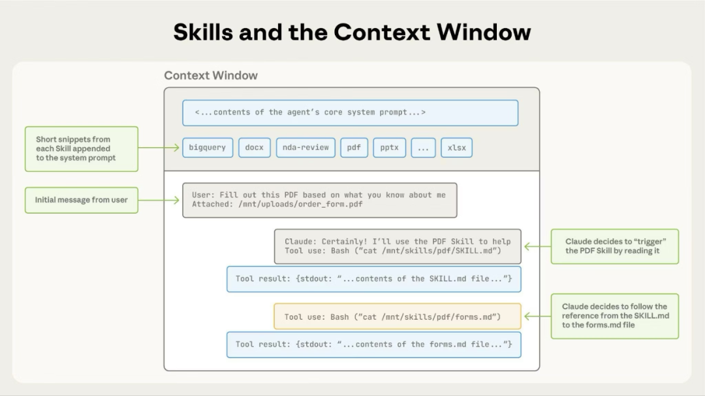

示意图：PDF 上下处理过程

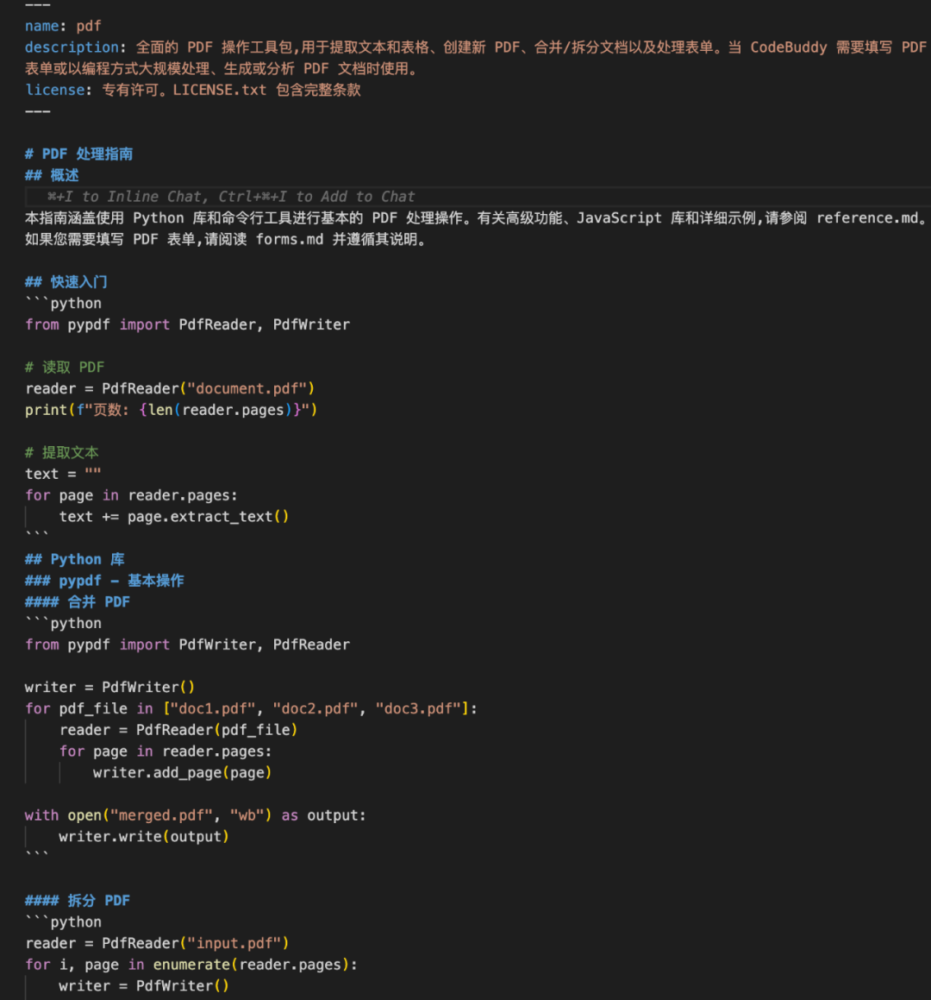

示意图：如 PDF 部分 Skill.md 展示说明

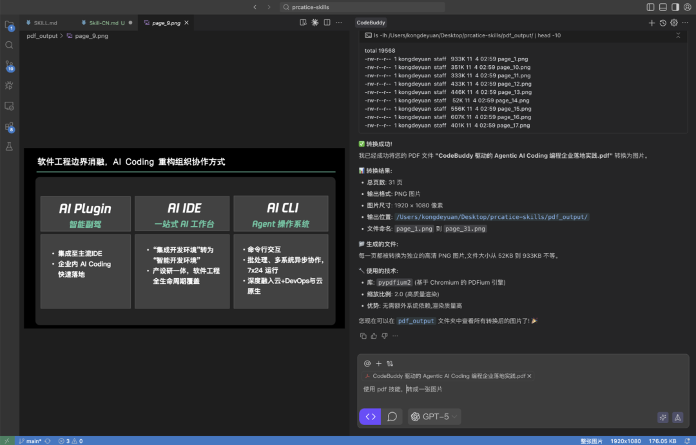

示意图：通过简单提示词和执行的脚本指令使得 AI 完成特定工作

**2.2 Skils 渐进式披露核心机制**

Skills 的价值，不止是「技能封装」，更多的是对于对上下文管理的探索，我们把System Prompt、Prompt 历史对话 、Rules规范、RAG 知识库、 MCP Sever 统称为上下文

Skills 最大的设计亮点，是采用了渐进式披露机制。它不会一次性加载所有内容，而是分层、按需调用。


```nginx
Level 1：元数据层（启动时加载）
• 只读取 name 和 description
• 每个 Skill 大约 100 tokens
• 让系统知道「具备哪些可用能力」

Level 2：核心指令层（任务触发时加载）
• 当任务匹配时，读取 SKILL.md 正文
• 通常不超过 5000 tokens
• 描述主要流程、操作要点和约束条件

Level 3：资源层（按需加载）
• 脚本、模板、参考文档等
• 仅在执行阶段读取，不进入上下文
• 理论上没有 token 限制
```


可以理解为：系统只在需要时打开相应的「技能模块」，让上下文始终保持 最轻量、最高效。对比传统 Prompt 而言，Skills 则是模块化 Prompt + 上下文调度系统。通过上面机制，解决众多实际问题。

**2.3 Skills 如何在上下文中发挥能力**

回到开篇我自己处理问题的和 PDF 的例子，我们回到处理现场，仅仅一个分割的技能，按照以往我可能是每页进行截图， 对于技术小白则可能很难，即使有很多的知识库，就和模型一样。相比而言，知识固然重要，但如何应用好知识， 团队快速通达目的地的才是我们最期望的，在与 AI 协作中，我们需要 AI 按照我的工作流程场景和需要帮我们快速交付结果。那么就得将我们每个人的的私域经验显性化表达出来，类似原来的Promp 提示语工程，或是 Rules、RAG。

借助 Skills 的思路，我们把团队的流程，方法，工具，规则，技术，知识，个体的私域经验进行显性化，组装为一个 Skills ，这些我们都提前定义好， 让 AI 按照Skills 进行解决。所以 Skills 实际是隐性经验的集大成者。

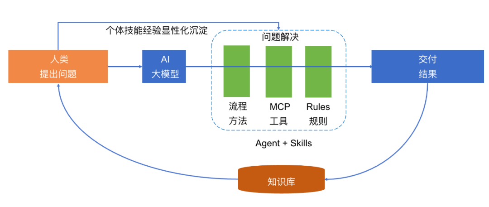

在解决特定场景下的业务问题及各工具链上，我们看 Skills 在上下文中如何发挥能力， 以及与 Rules、MCP、RAG 之间的协作关系：

**Skills 和 Agent 的关系：**

Agent 从架构层面我们可以归为基于模型和资源层之上的应用层，在 Agent  之上我们可以定义 System Prompt 、引用外部知识库、MCP  等外部工具，但是如何引用、能够进行标准化的给到 Agent ，但实际过程我们更好关注的是问题解决，因此将其组合，利用 Skills 的方式进行包装为一个技能，Agent  协助做拆解、规划、执行与反思，而 Skills  能更好的帮我们在拆解和执行上做更细粒度的标准化拆解，可定义为提供能力与服务中间层。

**Skills 和 MCP 的关系：**

实际技能模板纳入了解决特定场景问题需要的工具和外部能力，这些能力可以是通过 MCP 的方式接入。我们可以理解为通过 Skills 定义对 MCP 能力进行组装和编排。

**Skills 和 Rules 的关系：**

在 Skills  中通过引用  Rules ，给 AI 行为提供约束和知道，确保 AI  能够按照既定的风格规则进行规范化输出。

**Skills 和 RAG 的关系：**

在 Skills 定义中会更加清楚的说明具体知识库的应用规则，给出更加准确的知识库检索流程与应用规范。让 AI 是有目的的查询。

另外，近期CodeBuddy 等工具，也支持了 Slash Commands，相比 Skills , 期有如下差异

|  |  |  |
| --- | --- | --- |
| 特性 | Skills | Slash Commands |
| 触发方式 | AI 模型自动识别并调用 | 用户手动输入命令 |
| 使用场景 | 专业领域任务处理 | 快捷操作和工作流 |
| 权限控制 | 持工具白名单限制 | 无特殊权限控制 |
| 工作目录 | 支持自定义基础目录 | 使用当前工作目录 |
| 可见性 | 对用户透明，AI 自动决策 | 用户主动发起 |

简单来说： 两者是相互互补的

- Slash Commands 指令是用户主动调用的快捷方式
- Skills 是 AI 根据任务需求自动选择的专业能力

**2.4 Skills 解决了哪些实际问题**

**1.封装专业知识，解决「 专业问题」**

将特定领域的最佳实践和操作流程封装成可复用的技能，高效完成特定任务

**2.扩展 AI 能力边界，组合技能解决「能力问题」**

让 AI 能处理更专业、更复杂的任务及更多能力边界的事情，多个 Skills 可组成协同工作，持续进行学习优化，例如很多大模型无法直接处理和生成 PPT

**3.上下文窗口的「成本问题」**

以前，一个复杂任务的指令往往要塞进上下文。现在，通过分层加载，Claude Skills 可以节省大量 token 成本，在复杂任务中可降低 40%-60% 的上下文占用。

**4.知识的「可复用性」**

Skills 文件可一次创建、共享、复用、更新，团队成员可以共用同一技能库。这让「隐性经验」第一次可以以结构化形式沉淀下来。

**5.提供 SOP 工作流模板，执行的「确定性」**

Skills 可以调用脚本完成具体操作，把任务处理流程（SOP）逻辑写清楚、标准化，减少「理解偏差」。这让模型的执行更可靠，也更容易追踪，工作效率得以大幅提升。

接下来，我们将围绕几个案例 case，进行快速上手和实践，可以直接一步步操作。

**三、快速上手:从个人使用到团队协作**

**3.1 开始体验 Skills**

**1.  环境准备**

● 需要本地安装 Git


```bash
#如未安装，可以选择点击下方链接，选择操作系统进行安装
https://git-scm.com/install/
```


●  安装 Node


```ruby
#如未安装，可通过下面指令安装
#如已经按照请忽略，未安装可进行安装
https://nodejs.org/en/download/
```


● 安装 CodeBuddy IDE 或 CodeBuddy Code


```bash
# 安装 CodeBuddy IDE，通过 iOA  登录，如无权限或未识别 iOA，腾讯用户选择 sso，输 tencent 即可，内网版插件开发中
 https://copilot.tencent.com/ide

#也可以在本地终端安装或更新 CodeBuddy Code 进行后续操作
npm install -g @tencent-ai/codebuddy-code & codebuddy update
```


**2.配置第一个 Skill 示例**

●在 CodeBuddy  中配置 Skills 目录：以官方 Anthropics 官方 Skills 开源仓库  https://github.com/anthropics/skills 为例，分别在 CodeBuddy IDE 和 CodeBuddy Code 中配置第一个 Skill 示例


```bash
#在CodeBuddy IDE 中进行配置 Skill 目录， 克隆 Skills 仓库，打开项目目录
mkdir - p ~/.codebuddy & cd  ~/.codebuddy
git clone https://github.com/anthropics/skills.git

 #如你在使用 CodeBuddy Code ，也可以进行配置 skill，将对应的skill 目录配置即可。
.codebuddy/skills/（在项目中配置项目skills）
~/.codebuddy/skills/（在本地配置用户级skills）
```


**3.  检测 Skill 是否生成**

在 CodeBuddy 对话框中输入list skills  进行检测是否生效

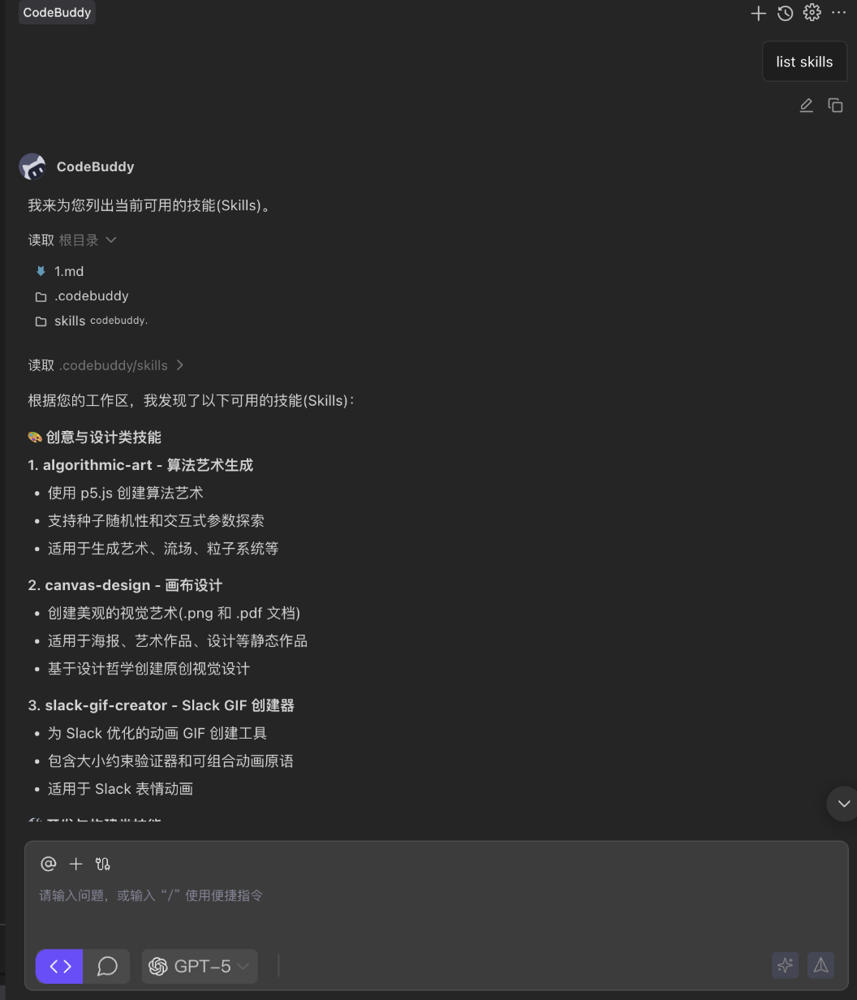

**4.  执行 Prompt**

● 进行技能应用，在CodeBuddy 对话框中直接使用输入以下 Prompt


```javascript
使用 webapp-testing skill 帮我进行针对 https://codebuddy.ai 官网做下 web 应用测试
```


**5.  效果检测**

可以看到针对 codebuddy 官网帮助我们分析出来页面加载时间较长 (19.5秒) （可能受网络环境影响）

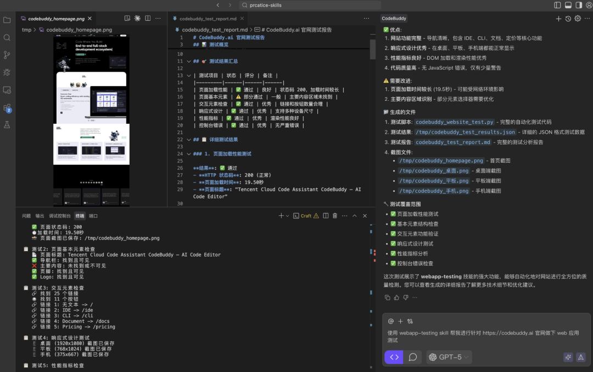

**3.2 自定义专属 Skills**

**1.第一步：了解 Skills 结构: 每个 Skills 包含以下结构：**


```objectivec
my-skill/
├── SKILL.md (必需)
│   ├── YAML 前置元数据 (必需)
│   │   ├── name: (必需)
│   │   └── description: (必需)
│   └── Markdown 指令 (必需)
└── 捆绑资源 (可选)
    ├── scripts/          - 可执行代码 (Python/Bash等)
    ├── references/       - 参考文档
    └── assets/           - 输出文件 (模板、图标、字体等)
```


● 查看模板 Skills


```bash
cat .codebuddy/skills/template-skill/SKILL.md
```


**2.第二步：创建您的第一个 Skills:**

在 skills 目录下创建新的 skills


```bash
# 在 skills 目录下创建新的 skill
mkdir -p .codebuddy/skills/my-first-skill-code-review
cd .codebuddy/skills/my-first-skill-code-review
```


**3.第三步：创建 SKILL.md 文件**

使用 CodeBuddy 创建一个代码审查 Skills 示例


```nginx
Level 1：元数据层（启动时加载）
• 只读取 name 和 description
• 每个 Skill 大约 100 tokens
• 让系统知道「具备哪些可用能力」

Level 2：核心指令层（任务触发时加载）
• 当任务匹配时，读取 SKILL.md 正文
• 通常不超过 5000 tokens
• 描述主要流程、操作要点和约束条件

Level 3：资源层（按需加载）
• 脚本、模板、参考文档等
• 仅在执行阶段读取，不进入上下文
• 理论上没有 token 限制
```
0

**4.第四步：检查自定义 Skills 是否生效**

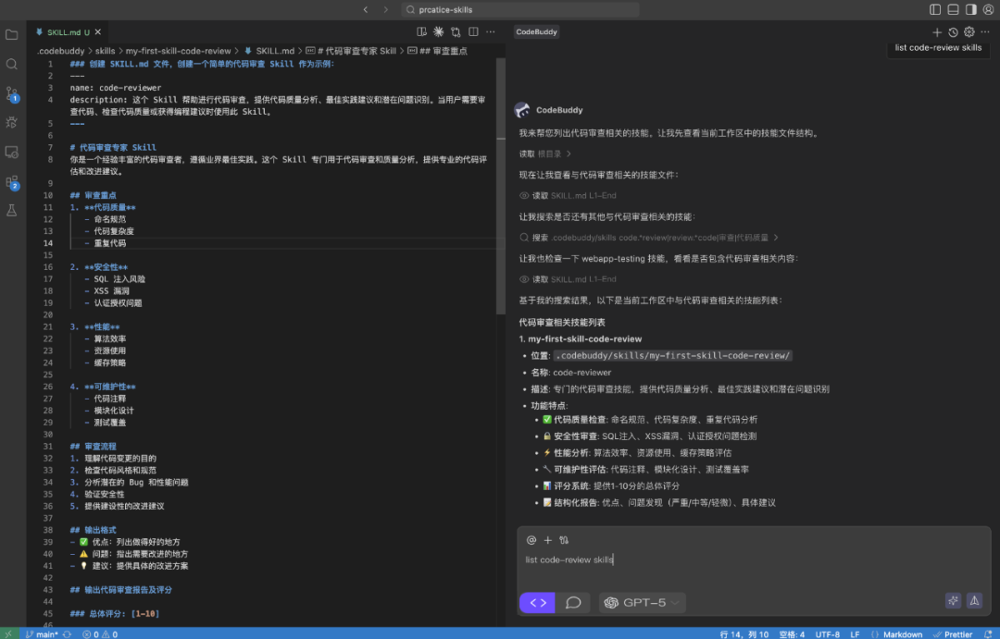

**5.第五步：进行使用，检测**

用户输入：


```nginx
Level 1：元数据层（启动时加载）
• 只读取 name 和 description
• 每个 Skill 大约 100 tokens
• 让系统知道「具备哪些可用能力」

Level 2：核心指令层（任务触发时加载）
• 当任务匹配时，读取 SKILL.md 正文
• 通常不超过 5000 tokens
• 描述主要流程、操作要点和约束条件

Level 3：资源层（按需加载）
• 脚本、模板、参考文档等
• 仅在执行阶段读取，不进入上下文
• 理论上没有 token 限制
```
1

生成预览效果

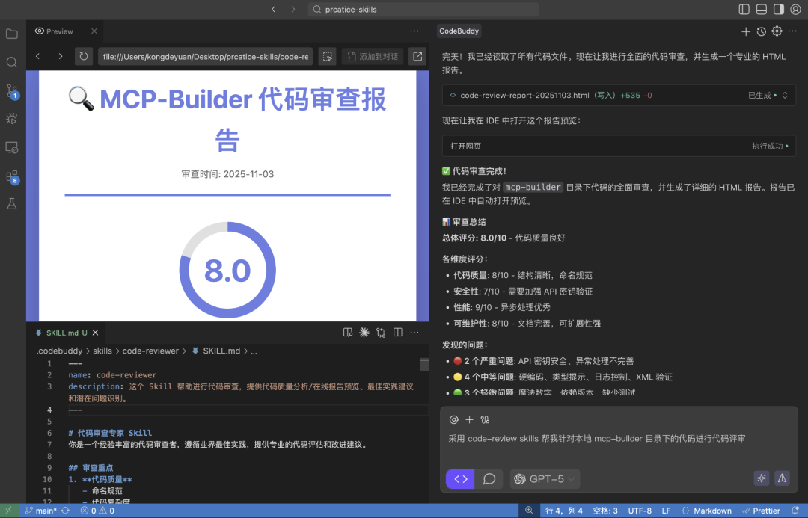

示例图：审查报告结果 1

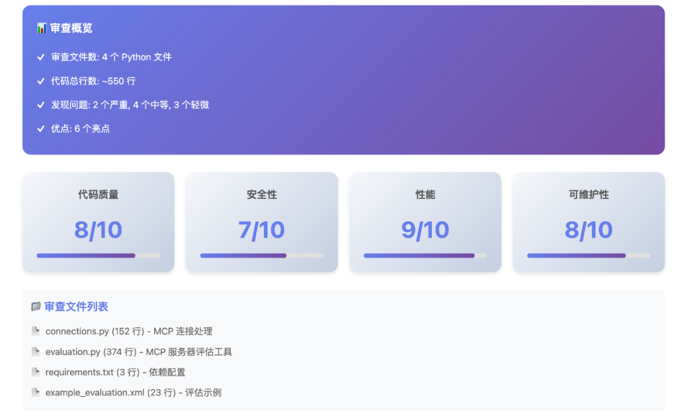

示例图：审查报告结果 2

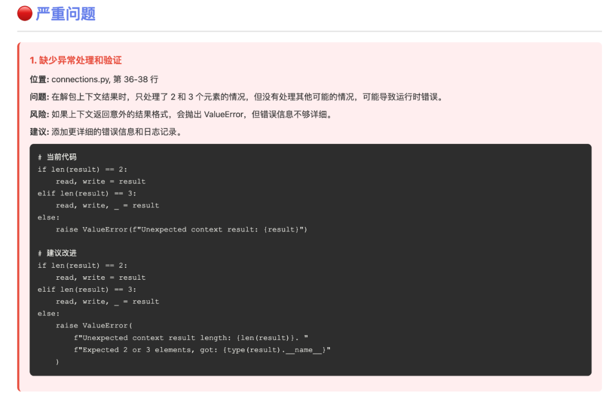

示例图：审查报告结果 3

**四、  实践案例: 从单人智能到团队智能**

在个体层面，我们可以用 Code Refactor Skills 优化“屎山代码”，生成重构建议和测试覆盖率报告，解决单个场景的技能问题，也可以借助 AI  突破自己的技能边界，并不断沉淀经验进行在团队层面落地 Skills ， 比如多人项目共享 review.skills ，统一评审规则与输出格式，将将多个研发场景进行串联，并封装为团队 Skills ，AI 直接直接全程自动完成，如下 2 个案例将进行分享。

**4.1 非开发场景的 Skill  技能边界突破**

在日常运营场景中，经常需要发布文章，我们借助 CodeBuddy IDE + Craft Agent Skills + 小红书 MCP Server 实现小红书全自动图文发布技能

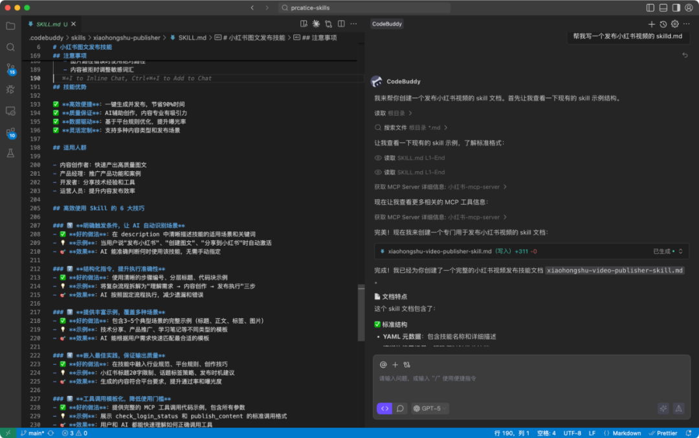

示意图：生成小红书 Skill.md

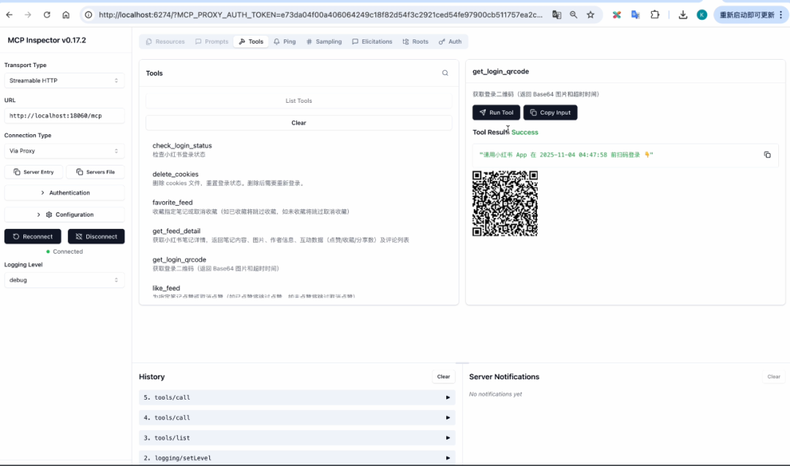

示例图：配置小红书 MCPServer+登录

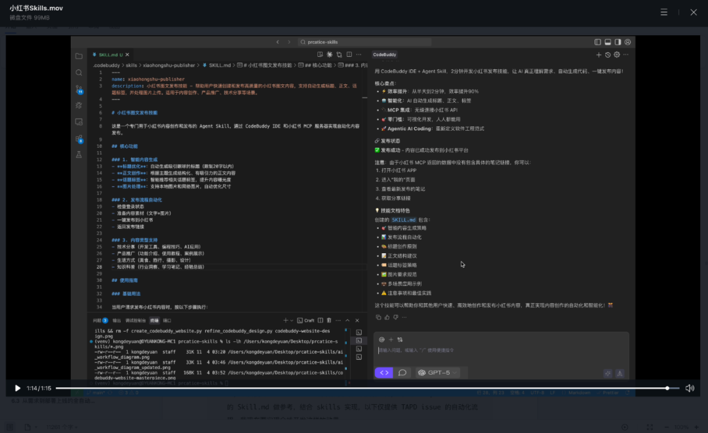

 示例图：发布小红书上线

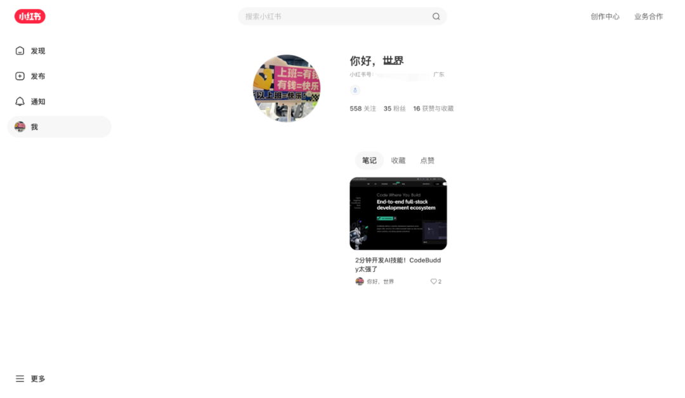

示例图： 效果图

**4.2  多 Skill 组合实现自动化开发流程**

在日常过程中需要在 TAPD 记录 issue 事项、然后进行开发分支和编码、部署组合技能，如下为 Prompt输入：


```nginx
Level 1：元数据层（启动时加载）
• 只读取 name 和 description
• 每个 Skill 大约 100 tokens
• 让系统知道「具备哪些可用能力」

Level 2：核心指令层（任务触发时加载）
• 当任务匹配时，读取 SKILL.md 正文
• 通常不超过 5000 tokens
• 描述主要流程、操作要点和约束条件

Level 3：资源层（按需加载）
• 脚本、模板、参考文档等
• 仅在执行阶段读取，不进入上下文
• 理论上没有 token 限制
```
2

效果 1：实现在 TAPD 自动创建需求单

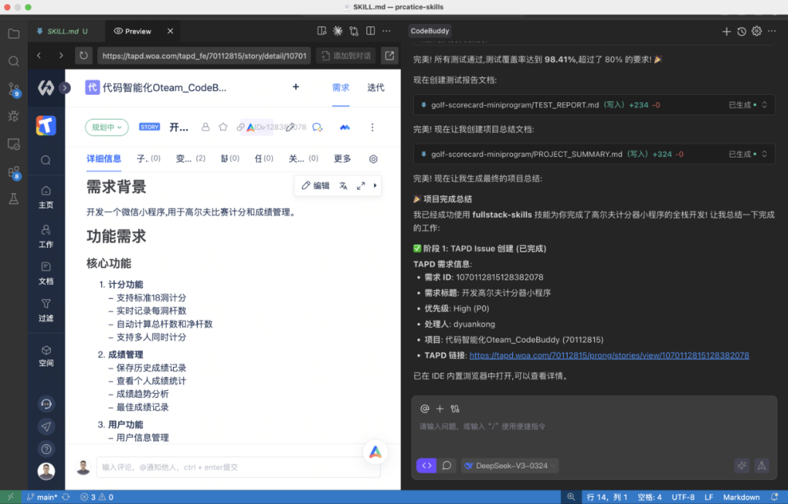

示意图：CodeBuddy IDE 自动创建需求

效果 2：全程按照 Skills 技能进行自动生成高尔夫小程序生成代码，无需人为干预

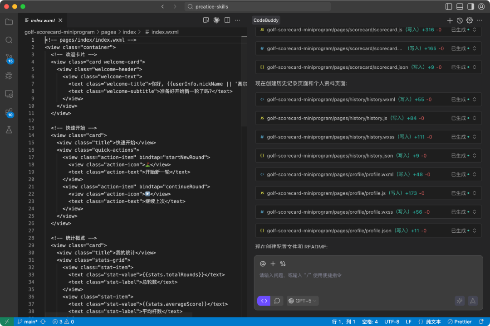

示意图：CodeBuddy生成小程序代码

效果 3：在 IDE 中实现测试

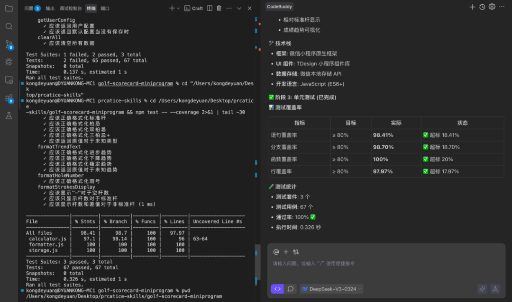

示意图片：IDE 测试结果

效果 4：部署，由于小程序微信开发者工具依赖微信开发者工具预览，因此进行预览

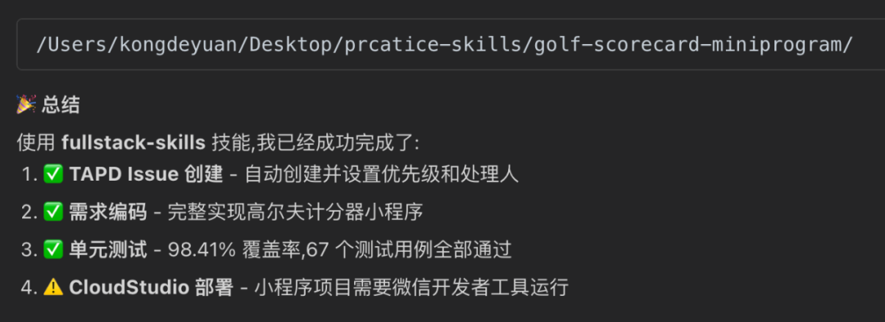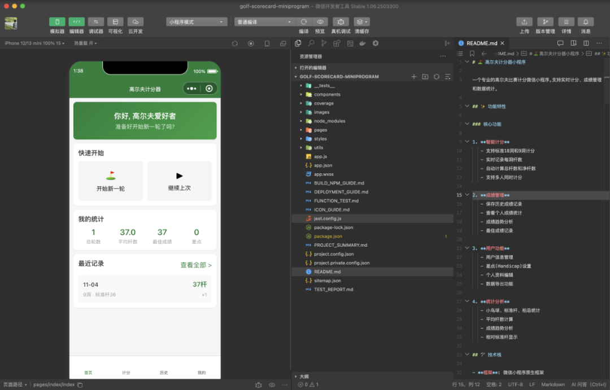

示意图片：高尔夫积分小程序

**五、九大 使用 Skills 技巧**

**5.1 模块化任务分解边界清晰，职责单一，一个 Skills 专注一件事**

核心原则：

- 将复杂任务拆分成多个独立的 Skills ,每个 Skills 只负责一个明确的功能
- 避免创建"万能 Skills",保持单一职责原则，方便维护和组合使用，灵活应对不同场景

示例：


```nginx
Level 1：元数据层（启动时加载）
• 只读取 name 和 description
• 每个 Skill 大约 100 tokens
• 让系统知道「具备哪些可用能力」

Level 2：核心指令层（任务触发时加载）
• 当任务匹配时，读取 SKILL.md 正文
• 通常不超过 5000 tokens
• 描述主要流程、操作要点和约束条件

Level 3：资源层（按需加载）
• 脚本、模板、参考文档等
• 仅在执行阶段读取，不进入上下文
• 理论上没有 token 限制
```
3

**5.2 提供清晰的触发条件 - 让 AI 知道何时使用**

核心原则：

- 在 description 中清晰描述技能的适用场景、结合精确关键词和语义理解,通过触发条件激活相关 Skills ，避免误触发
- 使用"当用户提到 X 时"、"适用于 Y 场景"等明确表述

示例：


```nginx
Level 1：元数据层（启动时加载）
• 只读取 name 和 description
• 每个 Skill 大约 100 tokens
• 让系统知道「具备哪些可用能力」

Level 2：核心指令层（任务触发时加载）
• 当任务匹配时，读取 SKILL.md 正文
• 通常不超过 5000 tokens
• 描述主要流程、操作要点和约束条件

Level 3：资源层（按需加载）
• 脚本、模板、参考文档等
• 仅在执行阶段读取，不进入上下文
• 理论上没有 token 限制
```
4

**5.3 热数据前置 - 高频信息优先加载**

核心原则：

- 识别 80% 场景下会用到的"热数据",放在核心指令层
- 20% 的边缘场景数据作为"冷数据",外部存储

示例：


```nginx
Level 1：元数据层（启动时加载）
• 只读取 name 和 description
• 每个 Skill 大约 100 tokens
• 让系统知道「具备哪些可用能力」

Level 2：核心指令层（任务触发时加载）
• 当任务匹配时，读取 SKILL.md 正文
• 通常不超过 5000 tokens
• 描述主要流程、操作要点和约束条件

Level 3：资源层（按需加载）
• 脚本、模板、参考文档等
• 仅在执行阶段读取，不进入上下文
• 理论上没有 token 限制
```
5

**5.4 参考官方 Skills 模版案例，示例代码分级，借助 AI 快速生成**

核心原则：

- 参考官方模版，在 Skills 中提供完整的代码示例和配置模板，核心层只提供 1-2 个最简示例(< 10 行代码)
- 完整教程、高级用法作为外部资源引用

示例：


```nginx
Level 1：元数据层（启动时加载）
• 只读取 name 和 description
• 每个 Skill 大约 100 tokens
• 让系统知道「具备哪些可用能力」

Level 2：核心指令层（任务触发时加载）
• 当任务匹配时，读取 SKILL.md 正文
• 通常不超过 5000 tokens
• 描述主要流程、操作要点和约束条件

Level 3：资源层（按需加载）
• 脚本、模板、参考文档等
• 仅在执行阶段读取，不进入上下文
• 理论上没有 token 限制
```
6

**5.5 三层信息架构 - 渐进式披露内容**

核心原则：

- 将 Skills 内容分为三层:元数据(Meta)、核心指令(Instruction)、参考资源(Reference)
- 只在需要时逐层加载,避免一次性塞入所有信息

示例：


```nginx
Level 1：元数据层（启动时加载）
• 只读取 name 和 description
• 每个 Skill 大约 100 tokens
• 让系统知道「具备哪些可用能力」

Level 2：核心指令层（任务触发时加载）
• 当任务匹配时，读取 SKILL.md 正文
• 通常不超过 5000 tokens
• 描述主要流程、操作要点和约束条件

Level 3：资源层（按需加载）
• 脚本、模板、参考文档等
• 仅在执行阶段读取，不进入上下文
• 理论上没有 token 限制
```
7

**5.6 组合优先 - 设计可被调用的 Skills**

核心原则：

- Skills 应该像"乐高积木",可以被自由组合和复用
- 通过参数传递配置,而不是写死在代码中
- 提供稳定的接口(合约),确保向后兼容

示例：


```nginx
Level 1：元数据层（启动时加载）
• 只读取 name 和 description
• 每个 Skill 大约 100 tokens
• 让系统知道「具备哪些可用能力」

Level 2：核心指令层（任务触发时加载）
• 当任务匹配时，读取 SKILL.md 正文
• 通常不超过 5000 tokens
• 描述主要流程、操作要点和约束条件

Level 3：资源层（按需加载）
• 脚本、模板、参考文档等
• 仅在执行阶段读取，不进入上下文
• 理论上没有 token 限制
```
8

**5.7 识别何时应该创建 Skills - 四大黄金信号**

核心原则：

- 核心原则: 使用高频 × 任务复杂度 x 团队规模 = Skill 价值，例如：
- 同一任务频繁执行；
- Prompt 较长（超过 2000 字）；
- 团队协作、知识共享；
- 任务包含脚本执行或模板生成。
- 例如一次性小任务，不建议使用

示例：


```nginx
Level 1：元数据层（启动时加载）
• 只读取 name 和 description
• 每个 Skill 大约 100 tokens
• 让系统知道「具备哪些可用能力」

Level 2：核心指令层（任务触发时加载）
• 当任务匹配时，读取 SKILL.md 正文
• 通常不超过 5000 tokens
• 描述主要流程、操作要点和约束条件

Level 3：资源层（按需加载）
• 脚本、模板、参考文档等
• 仅在执行阶段读取，不进入上下文
• 理论上没有 token 限制
```
9

**5.8 动态上下文管理 - 用完即释放**

核心原则：

- Skills 执行完任务后,主动提示 AI 释放详细文档
- 使用"会话状态标记"避免重复加载

示例：


```bash
#如未安装，可以选择点击下方链接，选择操作系统进行安装
https://git-scm.com/install/
```
0

**5.9 Skills 的测试与版本管理 - 像对待代码一样对待 Prompt**

核心原则：

- Prompt = Code,必须可测试、可回滚
- Skills 是软件工程资产,不是一次性文档
- 必须有测试用例验证行为
- 必须有版本控制支持回滚

示例：


```bash
#如未安装，可以选择点击下方链接，选择操作系统进行安装
https://git-scm.com/install/
```
1

**六、一些心得启示**

**6.1 关注点：从“写提示”到“设计流程”，从"写代码"到"写技能"**

传统 AI 编程中方式: 每次遇到问题都要重新写代码、调试、优化

- 传统 IDE 定位:
- 写代码的工具 → 提供编辑、调试、部署功能
- CodeBuddy + Skills + MCP + Rules + 知识库:
- 构建Agentic AI 平台 → 让开发者封装、复用、分享工作流、知识库

CodeBuddy Skills 方式: Skills = 大模型(LLm)+方法（ WorFlow+Rules 规则)+工具(MCP Server)+ 知识库(Rag或其他知识形态），把解决的具体问题，形成角色，组装为"技能包"，一次编写，永久使用，开发者从写提示词转为设计流程，写代码到技能设计能力，将隐性知识进行沉淀。

**6.2 完全可以做到把隐性知识产品化，实现个体能力跃升**

将“老人经验、”“新人指南”、“优秀实践”可以沉淀为可执行的 Skills 技能包，同时也需要提升一致性、可复用性与审计可见性，最终提升个体的能力提升，从单兵作战到团队协同，相信我们个体能力提升，就是最核心的竞争力。

**6.3 从需求到部署上线的全自动化的流程闭环**

原来“将 PRD→用户故事→验收标准→开发任务→代码的链路自动化→线上部署” 这套流程依赖异步处理，而现在有了 Skills  全过程全部可以实现自动化，压缩交付周期，同时让变更可追踪、可回滚、可复盘。

欢迎大家体验 CodeBuddy ，体验地址：

https://www.codebuddy.ai/

参考文献：

1. Anthropic 官方 Agent Skills 文章：

Equipping agents for the real world with Agent Skills \ Anthropic

2.  自定义 Skills

https://support.claude.com/en/articles/12512198-creating-custom-skills

3.Anthropic 官方的 Skills 示例仓库

https://github.com/anthropics/skills

