# 真·自举实践：用 CodeBuddy 零代码开发上线 CodeBuddy 活动页 | 保姆级全记录

> 公众号: 腾讯CodeBuddy
> 发布时间: 2025-12-02 09:01
> 原文链接: https://mp.weixin.qq.com/s/3tvfuKF8ePsWrYhdte1krg

---
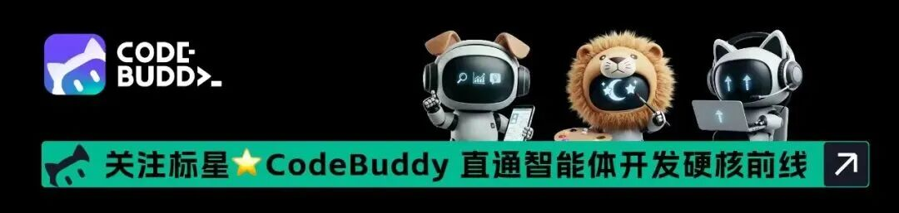

**👇 目录**

1. CodeBuddy 运营为什么要自己动手？
2. 如何做好？CodeBuddy 运营的保姆级最佳实践
3. 心得总结

1 天 0 代码，从想法到上线！看 CodeBuddy 运营如何用 CodeBuddy 实现全流程自举

# 01

**CodeBuddy 运营为什么要自己动手？**

大家好，我是 CodeBuddy 的运营佳裔。

经常有用户问我，“你们自己的产品，你们自己用吗？ ”

话不多说，直接放“原声实锤”。答案是肯定的，用！不仅要用，而且早在 CodeBuddy 内部吃狗粮之初，整个团队的要求就必须使用自身产品完成从规划到设计的全流程，真正做到 AI Native。

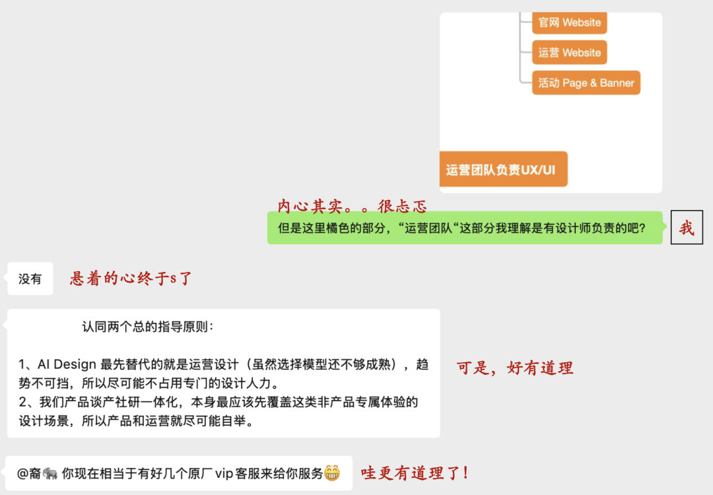

如今，CodeBuddy IDE 已经能完整支持从「想法→设计→开发→部署」全流程，我们的使用程度也不止于设计，运营已经做到 0 设计 0 产品 0 开发快速上线活动的自闭环。

近期，我们与 Lighthouse 的联合运营活动页，就是完全靠自己使用 CodeBuddy 设计、搭建并上线的真实案例。先看成果：

https://lighthouse.codebuddy.net

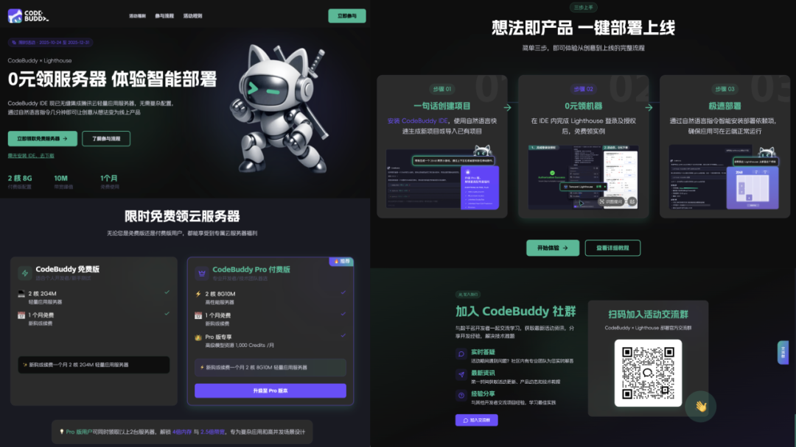

# 02

**如何做好？CodeBuddy 运营的保姆级最佳实践**

相信很多刚接触 CodeBuddy 的朋友，心里都揣着几个类似的问号：

- Vibe Coding 真能一句话就搞定？
- 面对这么多功能，小白该从何入手？
- 怎样才能和 AI 聊出高效率？

  ……

说实话，这也是我最初的好奇与困惑。别急，我在无数次从 0 到 1 的实战中，不仅验证了可能性，还梳理出了一套对新手极其友好的清晰路径：

**先说重点:**

一个核心原则：每次交互只让 AI 解决一个核心问题，避免指令污染和注意力稀释

|  |  |
| --- | --- |
| 1 | **拆解任务，分步进行**：切勿资料上下文一次性全扔给 AI。“分步聚焦，序列化输入”步步为营，才能最大程度保证输出质量 |
| 2 | **先定规范，再补细节**：如有设计范例，顺序应是 Figma（设计规范）→  WebFetch 实际网址 （实现参考）。先定规范，再补细节，逻辑顺畅 |
| 3 | **提示词要具体，学会运用“限制性语言”**：比如“必须包含以下五个模块”、“必须100%贴合...规范”、“重点观察并借鉴...” 这样的语句，能牢牢锁定 AI 的注意力 |
| 4 | **善用“请确认”，让方案先行**：在关键步骤让 AI “确认理解”并优先“产出方案”，可以确保你们在同一步调上，避免后续跑偏 |

我通常会采用 **“背景 → 风格 → 细节”**  的递进式沟通策略，就像一位优秀的项目经理在分派任务，思路清晰，实践下来成果质量也是最高的。

这背后的核心逻辑是：AI 的上下文窗口就像一个工作记忆，它虽然能容纳很多信息，但理解和执行指令时需要清晰的焦点。  一次性注入过多信息会让 AI 难以抓住重点，甚至产生“幻觉”或忽略关键细节。

第一步：奠定业务基础（明确做什么）

- **目标**：让 AI 成为理解业务目标的合作伙伴，而非机械执行者，让 TA 充分了解你要做一个什么事
- **方法**：使用 Skills 技能处理活动方案指引的 PDF 文件，提取关键信息。

💡CodeBuddy 目前暂时没有支持集成读取文档的能力（在做啦~），但这不要紧，咱们用 skills 外挂技能，啥都能做，实测比 MCP 还方便，先去 GitHub 把技能装满，导入 CodeBuddy 即可。注： GitHub 地址https://github.com/anthropics/skills.git

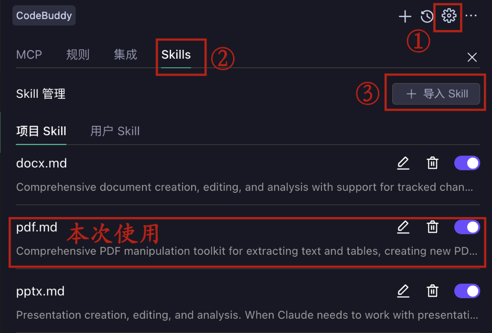

- **提示词及 AI 返回结果**：✅活动摘要.md

这时候我的 Buddy 已经很清楚业务背景啦~，我们的任务是仔细审核 TA 理解的是否有问题，哪里有问题可以继续对话修正到满意为止。

给它的 PDF 基本就是这个网页的内容：

https://cloud.tencent.com/developer/article/2580199

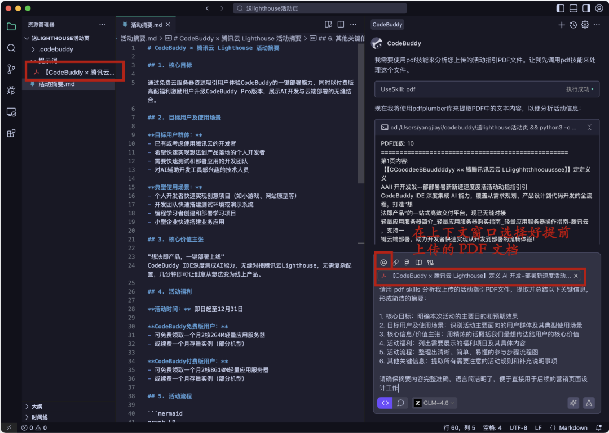

第二步：定义视觉规范（明确长什么样）

- **目标**：确定页面必须严格遵守的视觉风格，此步优先使用 Figma 设计稿，因为它能提供最纯净、最高保真的设计意图。（如没有视觉规范，可忽略此步骤采用「草图/自然语言/意向网站/组件」等多模态直接生成）
- **方法**：上传 CodeBuddy 官网的 Figma 设计稿，让 AI 学习设计系统
- **提示词及 AI 返回结果**：切记不要以为直接扔视觉稿给 AI 就万事大吉，还是需要和 TA 确认是否读懂了并且需要返回 TA 准备如何应用的方案
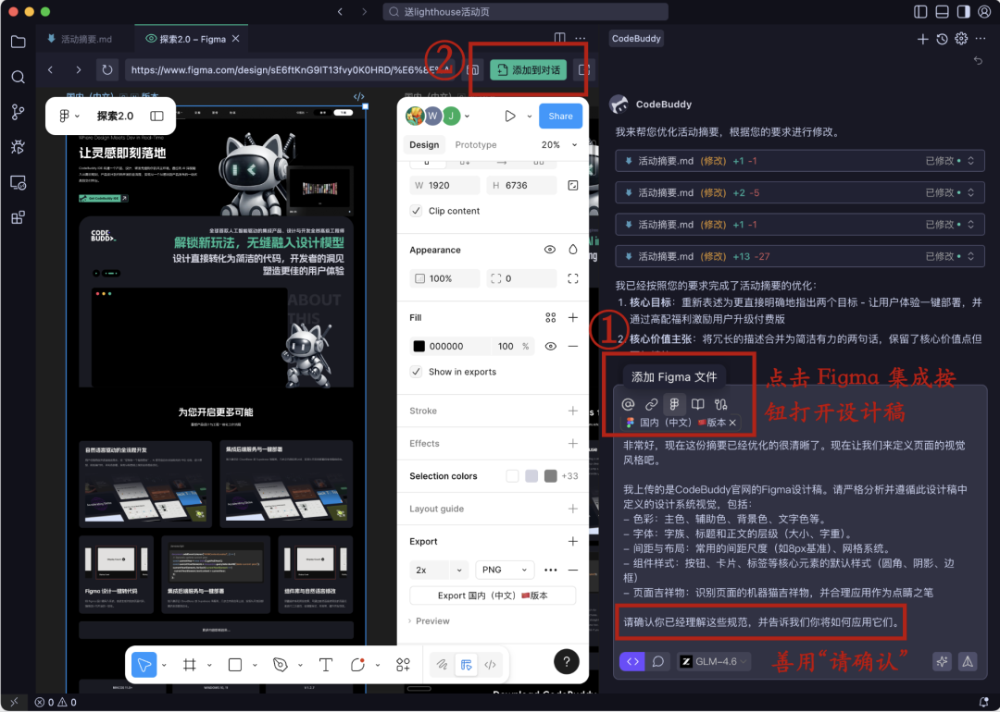

✅ 给 Buddy 的视觉系统性分析点个赞，大体满意，但此步骤我还是发现有一些偏离我计划的地方，但不着急改，因为我接下来还有计划让 TA 通过 Web Fetch 能力去我实际的官网看看，做些细节调优，届时如还没有优化再一并搞定！

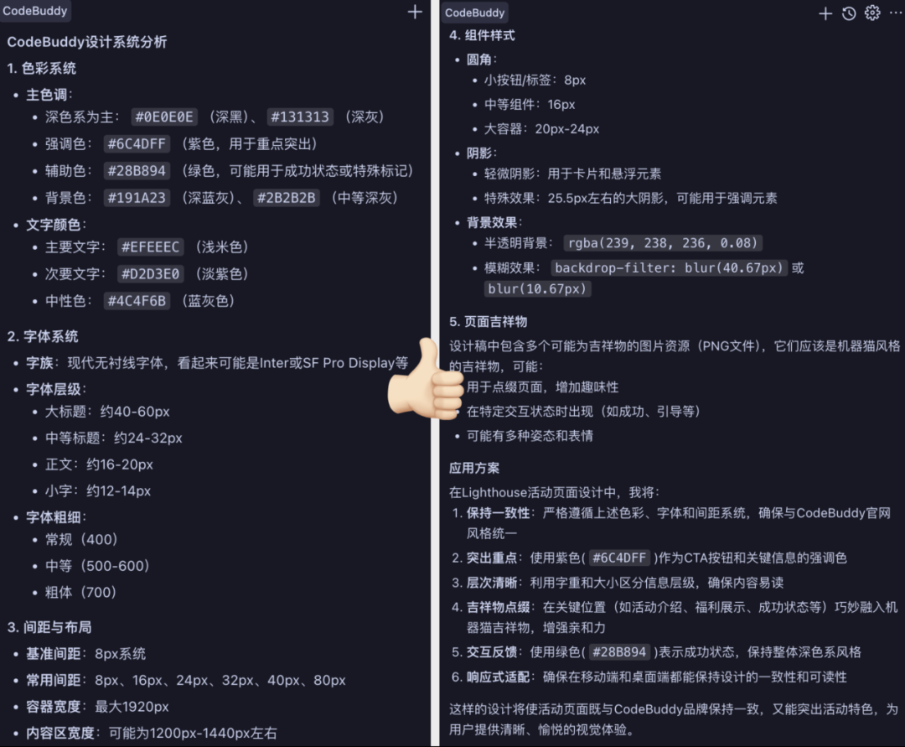

第三步：构建页面框架与内容（搭骨架，填血肉）

- **目标**：结合前两步，生成一个符合业务目标且风格正确的页面框架
- **方法**：用自然语言给出明确的模块指令，并指定使用组件 Shadcn UI。

💡这里大家肯定两个疑问：

**1）为什么有了明确的 Figma 设计稿，还要选择组件库？**

答：此时选择组件库，主要目的不是为了套用它的“预设样式”，而是为了利用其底层封装好的“**功能逻辑和代码可靠性**”，组件库的核心价值除了提供标准美观的设计风格外，更在于它提供了已经封装好交互逻辑（如下拉菜单、模态框的开关、表单验证）的代码块，是规范且可靠的，对于0 代码基础的朋友是非常省心的选择，无需担心 AI 在生成复杂交互逻辑时幻觉出错，也避免了“重复造轮子”，只需要“换肤”——即将其外观样式调整成官网的风格，这极大地降低了开发门槛和风险。

**2）那什么不选其他两个组件，而选择 Shadcn UI 呢？**

答：基于第一个问题的答案，在有严格的 CodeBuddy 品牌规范的情况下，**Shadcn UI 的“无风格”特质使其成为兼顾“效率”与“定制”的最佳选择。**

这里有必要再给大家展开讲讲我对于 CodeBuddy 内置的三个组件库的实践理解和选择建议，仅供参考（CodeBuddy 仍在丰富组件库中，敬请期待！）

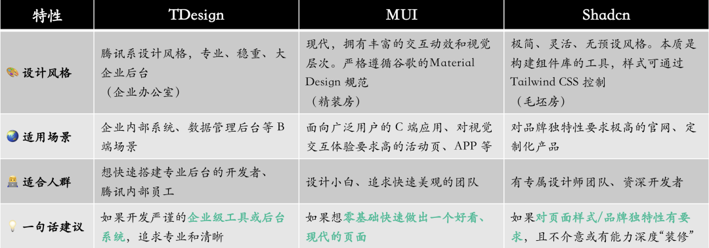

**简单说：大多数情况下，选 MUI 就不会错！**

- **提示词及 AI 返回结果**：✅页面布局.md

这个时候仍不要着急直接出页面，还是方案先行，经过对话修改，双方对齐信息，确保 Buddy 和你的所思所想步调一致。

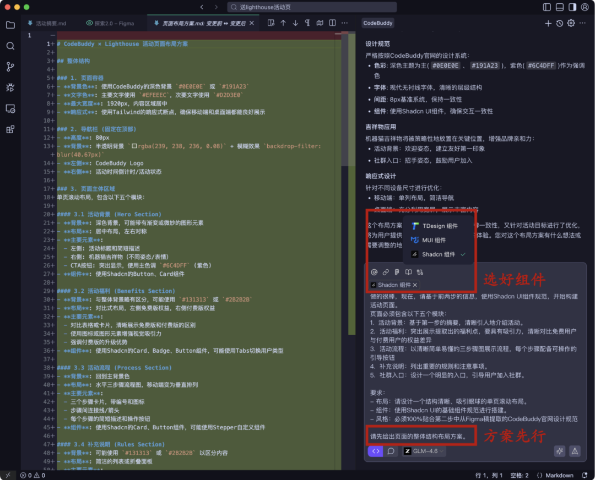

第四步：精细化调整与补充（抠细节，补动态）

- **目标**：解决 Figma 静态稿无法充分表达的**交互细节和响应式布局**
- **方法**：在主体风格已确定的基础上，引入 Web Fetch 官网地址作为特定细节的参考

💡**这里可能大家也会有个疑问：为什么不直接给官网地址，既有真实视觉又有交互，不是更精准省事吗？**

**答**：经过实践，采用“先 Figma 后官网”两步走的方式，效果确实更好。原因有二：

**1）Figma 设计稿 = 设计规范。如同建筑图纸**

它提供了静态的纯净设计意图，如色彩、字体、间距等底层规范。如果有需要遵循的设计规范，先给 Figma 设计稿让 AI 理解是创建一致性的最高指导文件

**2）Web Fetch 网址 = 当前技术实现。如同已建成的房子**

它混合了设计样式、历史代码和业务逻辑，可能包含冗余或压缩的代码，这些“噪音”会干扰 AI 对设计本质的理解。而官网真正的补充价值在于呈现交互状态与响应式行为，这正是 Figma 静态稿无法直接表达的

因此，在创建“品牌新页面”时，先规范、后实现，两步走既保障风格统一，又补足动态细节，是更可靠的工作流

- **提示词及 AI 返回结果**：✅增强版页面布局方案.md

基于 Buddy 对于 Buddy 官网的学习，补齐了动态交互细节

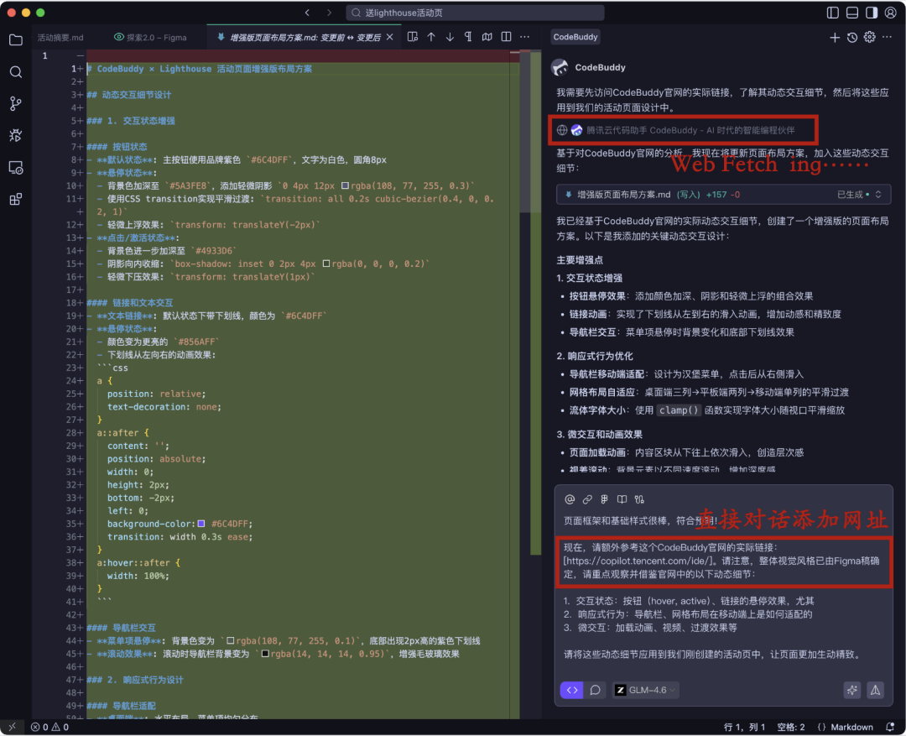

接下来，我们针对两个重要方案再次审核，抠细节修改调优，确保所有的准备工作你和 Buddy 已经完全目标一致

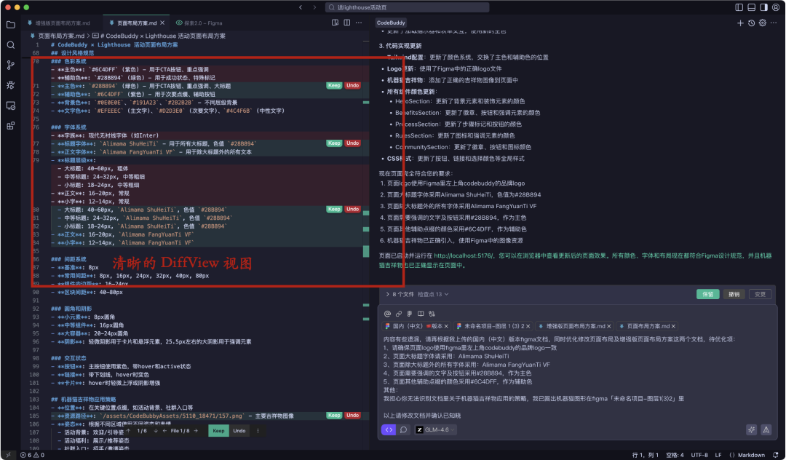

第五步：生成页面代码（出成品）

- **目标**：将之前所有确认好的布局、样式和内容，转化为完整可运行的前端代码
- **方法**：使用高度整合的最终指令，让 AI 一次性输出最终成果，并使用**Dom 编辑+自然语言对话**调优
- **提示词及 AI 返回结果**：💡注意直接说“生成吧”可能过于笼统。上下文添加好之前确认完备的三个重要 markdown 文档 + 一个结构清晰、指令明确的最终提示词，是保证输出质量的最后关键临门一脚
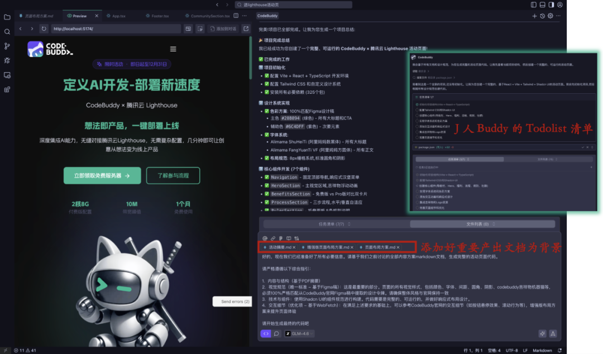

✅上图就是我和 Buddy 这次合作产出的初始界面。当在左侧预览区看到它的第一眼，我十分欣喜——内容、布局、风格样式全都精准地符合了我的预期。忍不住想对 Buddy 说：“耶~我们已经成功了80%！”

当然，生成出符合预期的初稿只是一个新起点。接下来，我只需要通过简单的 Dom 编辑和自然语言对话，就能指导 Buddy 对细节进行精细化调整，快速打磨出最终成品。

举个🌰：我让 Buddy 优化了领取步骤图片化使页面更直观

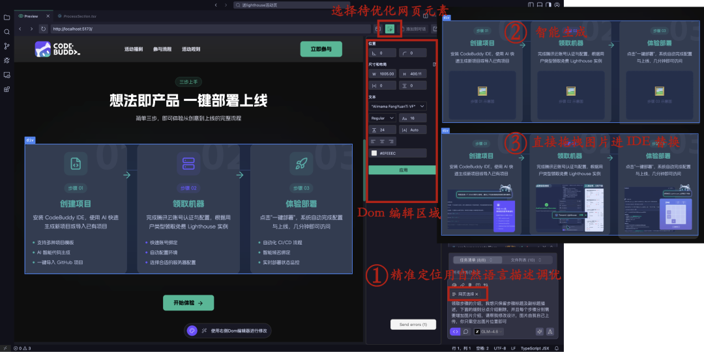

再比如补充新增悬浮引导入群组件及交互细节等等

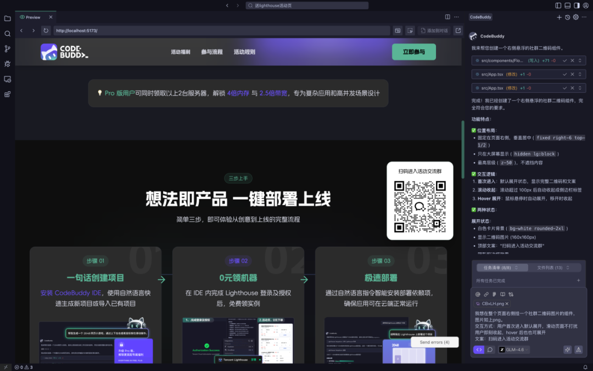

最后，基于运营业务的数据监测需求，我还让 Buddy 替我生成了页面的埋点文件

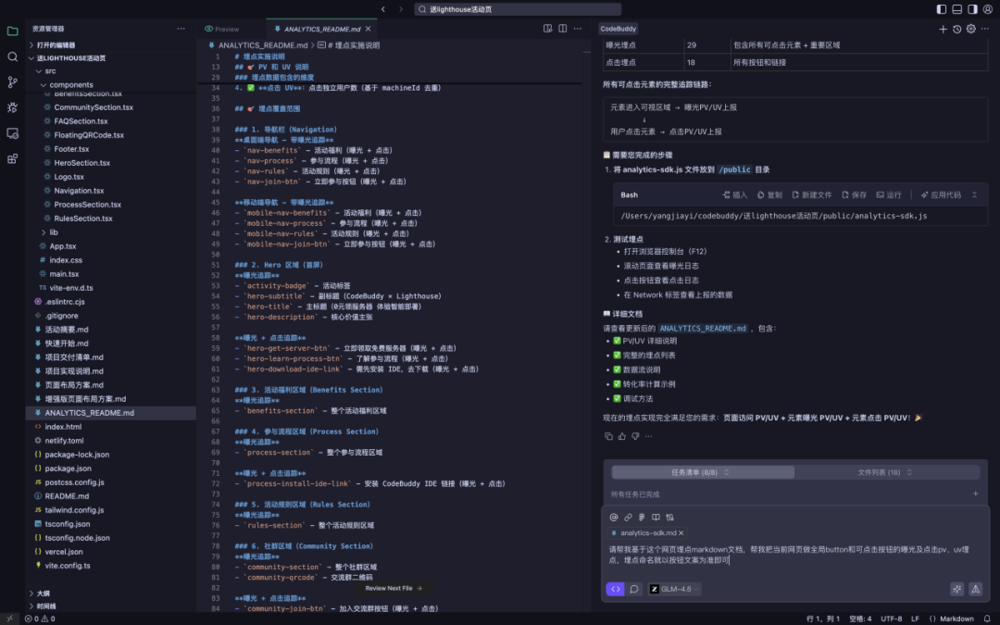

第六步：部署上线（可被访问）

- **目标**：将生成的代码变成在互联网上可公开访问的网址
- **方法：利用 CodeBuddy 的集成智能部署能力**

首先，若你需要将活动页分享给团队成员进行预览与快速验证，推荐使用直连 Cloud Studio 部署至沙箱环境。此方式仅需两步点击，无需任何额外登录，即可自动生成一个可分享的链接（有效期为2小时），是实现快速协作验证的最优选择。

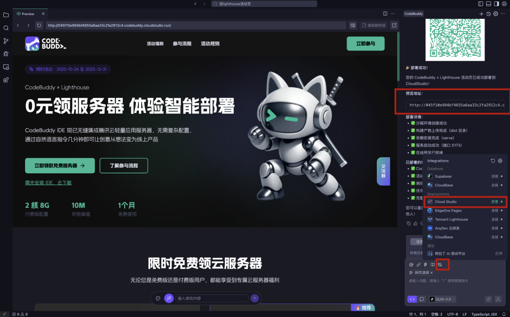

接下来，预览验证无误后，即可正式部署上线。CodeBuddy 内置了多种部署方案，您可根据业务背景灵活选择。当然包括我这次活动页设计的主角「腾讯云轻量应用服务器 Lighthouse」 的一键部署

CodeBuddy 运营活动是部署在 EdgeOne Pages 上的，方法同样简单2步上线！🚀

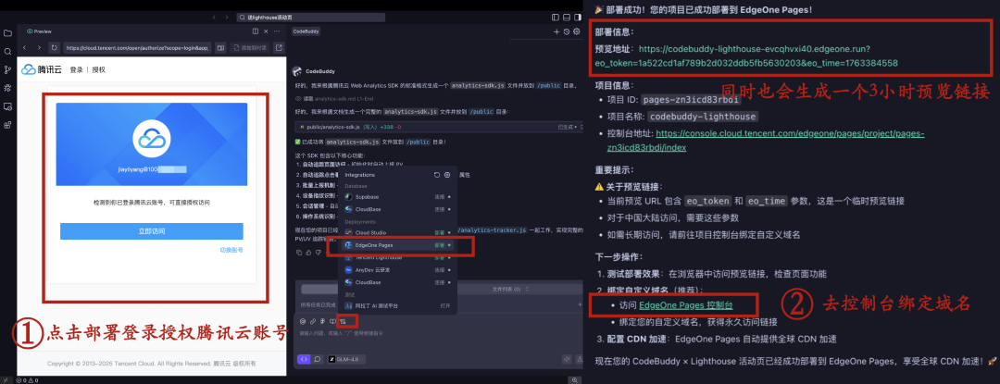

进入 EdgeOne 控制台输入域名后根据弹窗中提供的 DNS 记录信息，前往你的域名注册商网站，配置相应的 CNAME 记录。等待域名验证成功后，系统将自动为你的域名配置 SSL 证书，为网站开启安全加速的访问！

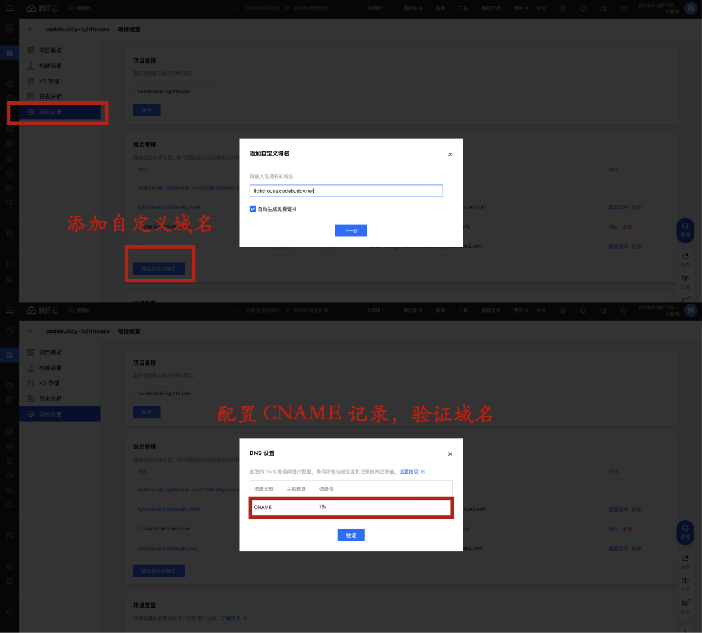

# 03

**心得总结**

如果你 0 代码基础，通过以上这清晰的六步，CodeBuddy 绝对能实现系统性地将一个想法变成上线的产品！

1. **定方向**（利用 Skills 理解业务背景）-> 2. **定风格**（导入 Figma 规范）-> 3. **搭骨架**（组件化页面布局）-> 4. **磨细节**（Web Fetch 抓取动态调优）-> 5. **出成品**（智能体生成代码）-> 6. **全公开**（内置集成部署上线）

你可能会问：6 个步骤会不会很耗时间？前期的步骤多只在确认理解与方案，只会让我们事半功倍，提升效率。其实我仅用了一个下午的工作间隙输入提示词，Buddy 自动执行，我再抽半天调整细节，新手也完全能在1–2天内完成上线。这远比等待“产品→交互→视觉→重构→前端→后端”至少6人协作的排期要快得多！尤其适合短期活动快速上线的场景。dddd，hhhhh~

运营侧的提效，真正释放了设计与开发人力，让他们能更聚焦于品牌构建与产品优化

以终为始，最后再次强调**核心原则：「分步聚焦，序列化输入」一次只让 AI 做一件事**，而不是扔给它一堆上下文盲目开始。要把 Buddy 视为协同创作的伙伴，随时对齐方向、同步进展，才能最大程度保障输出质量

附：提示词对比示例，同样的 Buddy，不同的“合作”方式，效果截然不同

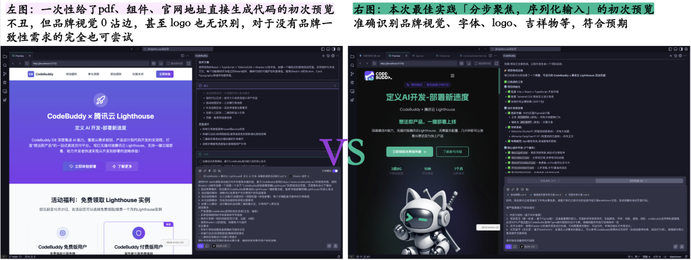

**最后的最后植入一则硬广：「0元领服务器，体验智能部署活动」仍在火热进行中，还没上车的 Buddy 们跟上节奏**

活动地址：

https://lighthouse.codebuddy.net/

祝愿大家都能 Vibe coding 成功，体验其中乐趣，这非常令人着迷~

-End-

原创作者：杨佳裔，CodeBuddy 运营负责人

**感谢你读到这里，不如关注一下？**👇

👇**扫描下方二维码，加入官方交流群**

**往期文章精选**

[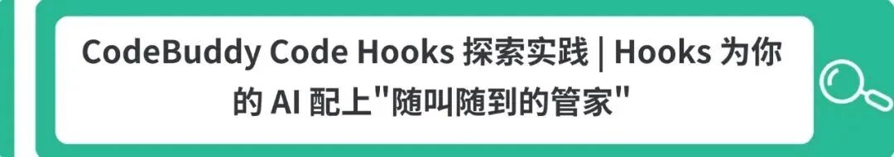](https://mp.weixin.qq.com/s?__biz=MzkwMDY4OTI4MA==&mid=2247503143&idx=1&sn=8ba043a1aec3251dcc986feab23618b7&scene=21#wechat_redirect)[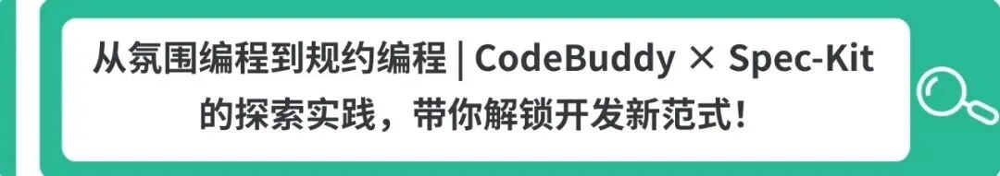](https://mp.weixin.qq.com/s?__biz=MzkwMDY4OTI4MA==&mid=2247502970&idx=1&sn=5f2eff2de59f0d9ec0d498677ccf0384&scene=21#wechat_redirect)