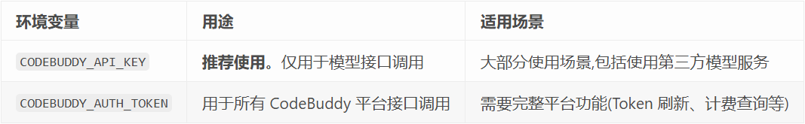
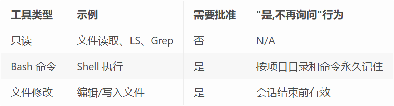
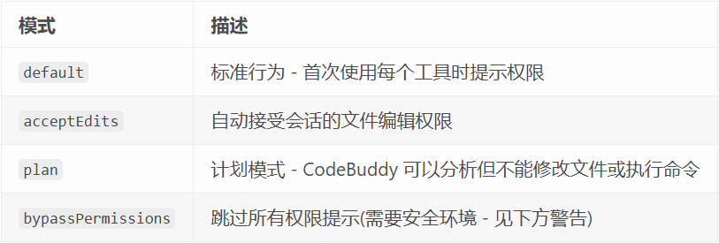
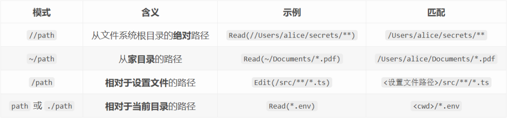
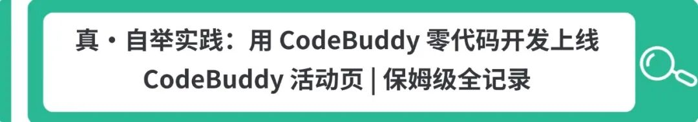
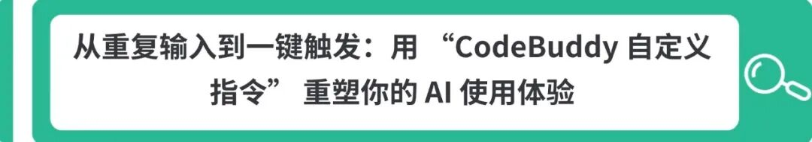

# 为 CodeBuddy Code 构建安全工作防线

> 公众号: 腾讯CodeBuddy
> 发布时间: 2025-12-09 09:35
> 原文链接: https://mp.weixin.qq.com/s/AKuD2Ku3IDGHDa6PGllrXw

---


**👇 目录**

1. 认证方法
2. 访问控制和权限
3. 设置优先级
4. 凭据管理
5. 安全最佳实践
6. 常见问题

在享受 CodeBuddy Code 高效编程助力的同时，如何确保其访问安全、权限可控，是每个团队与开发者必须面对的核心议题。强大的能力需要匹配精细的管控。本文将带你了解如何为组织中的 CodeBuddy Code 配置用户身份验证、授权和访问控制。


# 01


**认证方法**

设置 CodeBuddy Code 需要访问 AI 模型服务。团队可以通过以下几种方式设置 CodeBuddy Code 访问权限:

- CodeBuddy 平台 API
- 第三方模型服务(如 OpenRouter)
- 自托管模型服务

**CodeBuddy 平台认证**

**为团队设置 CodeBuddy Code 访问权限:**

1. 使用现有的 CodeBuddy 账户或创建新账户
2. 获取 API Key:

- **海外版**: 访问 https://www.codebuddy.ai/profile/access-keys
- **中国版**: 访问 https://copilot.tencent.com/profile/

3. 配置环境变量(详见下文)

4. 每个用户需要完成以下步骤:

•检查系统要求

•安装 CodeBuddy Code

•使用 API Key 或登录凭据进行身份验证

**使用 OpenRouter 等第三方服务:**

1. 在第三方服务提供商处创建账户并获取 API Key
2. 配置以下环境变量:


```javascript
export CODEBUDDY_API_KEY="your-api-key"
export CODEBUDDY_BASE_URL="https://openrouter.ai/api/v1"
```


3. 用户可以安装 CodeBuddy Code
4. 使用 --model 参数指定模型

**认证配置**

CodeBuddy Code 支持两种主要的认证环境变量:



**使用示例**


```bash
# 基础使用(推荐)
export CODEBUDDY_API_KEY="your-api-key"

# 中国版用户需额外设置环境标识
export CODEBUDDY_INTERNET_ENVIRONMENT=internal

# 使用第三方模型服务
export CODEBUDDY_API_KEY="sk-or-v1-xxx"
export CODEBUDDY_BASE_URL="https://openrouter.ai/api/v1"
```


# 02


**访问控制和权限**

我们支持细粒度权限,以便您可以精确指定代理允许执行的操作(例如运行测试、运行 linter)和不允许执行的操作(例如更新云基础设施)。这些权限设置可以检入版本控制并分发给组织中的所有开发人员,也可以由各个开发人员自定义。

**权限系统**

CodeBuddy Code 使用分层权限系统来平衡功能和安全性:



**配置权限**

您可以使用 /permissions 查看和管理 CodeBuddy Code 的工具权限。此 UI 列出所有权限规则及其来源的 settings.json 文件。

- Allow 规则将允许 CodeBuddy Code 使用指定的工具,无需进一步手动批准。
- Ask 规则将在 CodeBuddy Code 尝试使用指定工具时询问用户确认。Ask 规则优先于 allow 规则。
- Deny 规则将阻止 CodeBuddy Code 使用指定工具。Deny 规则优先于 allow 和 ask 规则。
- Additional directories 将 CodeBuddy 的文件访问扩展到初始工作目录之外的目录。
- Default mode 控制 CodeBuddy 在遇到新请求时的权限行为。

权限规则使用格式: Tool 或 Tool(optional-specifier)

仅工具名称的规则匹配该工具的任何使用。例如,将 Bash 添加到 allow 规则列表将允许 CodeBuddy Code 使用 Bash 工具而无需用户批准。

**⑴ 权限模式**

CodeBuddy Code 支持几种权限模式,可以在设置文件中设置为 defaultMode:



`bypassPermissions` 模式应仅在安全、隔离的环境中使用,例如 Docker 容器或 VM。在生产环境或包含敏感数据的系统上使用此模式可能会带来安全风险。

**⑵ 工作目录**

默认情况下,CodeBuddy 可以访问其启动目录中的文件。您可以扩展此访问权限:

- 启动时: 使用 --add-dir <path> CLI 参数
- 会话期间: 使用 /add-dir 斜杠命令
- 持久配置: 添加到设置文件的 additionalDirectories

附加目录中的文件遵循与原始工作目录相同的权限规则 - 它们可以无提示读取,文件编辑权限遵循当前权限模式。

**⑶ 工具特定的权限规则**

某些工具支持更细粒度的权限控制:

**Bash：**

- Bash(npm run build) 精确匹配 Bash 命令 npm run build
- Bash(npm run test:\*) 匹配以 npm run test 开头的 Bash 命令
- Bash(curl http://site.com/:\*) 匹配以 curl http://site.com/ 开头的 curl 命令

CodeBuddy Code 能识别 shell 操作符(如 `&&`),因此前缀匹配规则如 `Bash(safe-cmd:\*)` 不会授予它运行命令 `safe-cmd && other-cmd` 的权限 Bash 权限模式的重要限制:

- 此工具使用前缀匹配,而非正则表达式或 glob 模式
- 通配符 :\* 仅在模式末尾有效,用于匹配任何后续内容
- 像 Bash(curl http://github.com/:\*) 这样的模式可以通过多种方式绕过:

  **1. URL 前的选项**: curl -X GET http://github.com/... 不匹配

  **2. 不同协议:** curl https://github.com/... 不匹配

  **3. 重定向:** curl -L http://bit.ly/xyz (重定向到 github)

  **4. 变量:** URL=http://github.com && curl $URL 不匹配

  **5. 额外空格:** curl  http://github.com 不匹配

要更可靠地过滤 URL,请考虑:

- 使用带 WebFetch(domain:github.com) 权限的 WebFetch 工具
- 通过 CODEBUDDY.md 指示 CodeBuddy Code 您允许的 curl 模式
- 使用 hooks 进行自定义权限验证

**Read & Edit**

Edit 规则适用于所有编辑文件的内置工具。CodeBuddy 将尽力将 Read 规则应用于所有读取文件的内置工具,如 Grep、Glob 和 LS。

Read 和 Edit 规则都遵循 gitignore 规范,有四种不同的模式类型:



像 `/Users/alice/file` 这样的模式不是绝对路径 - 它相对于您的设置文件!使用 `//Users/alice/file` 表示绝对路径。

示例:

- Edit(/docs/\*\*) - 在 <项目>/docs/ 中编辑(不是 /docs/!)
- Read(~/.zshrc) - 读取家目录的 .zshrc
- Edit(//tmp/scratch.txt) - 编辑绝对路径 /tmp/scratch.txt
- Read(src/\*\*) - 从 <当前目录>/src/ 读取

**WebFetch：**

WebFetch(domain:example.com) 匹配对 example.com 的获取请求

**MCP：**

- mcp\_\_puppeteer 匹配 puppeteer 服务器提供的任何工具(在 CodeBuddy Code 中配置的名称)
- mcp\_\_puppeteer\_\_puppeteer\_navigate 匹配 puppeteer 服务器提供的 puppeteer\_navigate 工具

与其他权限类型不同,MCP 权限不支持通配符(`\*`)。

要批准 MCP 服务器的所有工具:

- ✅ 使用: mcp\_\_github (批准所有 GitHub 工具)
- ❌ 不要使用: mcp\_\_github\_\_\* (不支持通配符)

要仅批准特定工具,列出每一个:

- ✅ 使用: mcp\_\_github\_\_get\_issue
- ✅ 使用: mcp\_\_github\_\_list\_issues

**权限配置示例**

**基础权限配置:**


```json
{
  "permissions": {
    "allow": [
      "Read",
      "Edit",
      "Bash(git:*)",
      "Bash(npm:*)"
    ],
    "ask": [
      "WebFetch",
      "Bash(docker:*)"
    ],
    "deny": [
      "Bash(rm:*)",
      "Bash(sudo:*)",
      "Edit(**/*.env)",
      "Read(~/.ssh/**)"
    ]
  }
}
```


**安全限制配置:**


```json
{
  "permissions": {
    "allow": [
      "Read",
      "Edit(src/**)",
      "Bash(git:status,git:diff)"
    ],
    "deny": [
      "Edit(**/*.env)",
      "Edit(**/*.key)",
      "Edit(**/*.pem)",
      "Bash(wget:*)",
      "Bash(curl:*)",
      "Read(/etc/**)",
      "Read(~/.ssh/**)",
      "Read(~/.aws/**)"
    ],
    "defaultMode": "default"
  }
}
```


**使用 hooks 进行额外的权限控制**

CodeBuddy Code hooks 提供了一种注册自定义 shell 命令在运行时执行权限评估的方法。当 CodeBuddy Code 进行工具调用时,PreToolUse hooks 在权限系统运行之前运行,hook 输出可以决定是批准还是拒绝工具调用,以代替权限系统。

详见 Hooks 文档:

https://copilot.tencent.com/docs/cli/hooks


# 03


**设置优先级**

当存在多个设置源时,它们按以下顺序应用(从高到低优先级):

1. 命令行参数
2. 本地项目设置(.codebuddy/settings.local.json)
3. 共享项目设置(.codebuddy/settings.json)
4. 用户设置(~/.codebuddy/settings.json)

此层次结构确保在适当的地方仍允许项目和用户级别的灵活性。


# 04


**凭据管理**

CodeBuddy Code 安全地管理您的身份验证凭据:

1. 存储位置:

- **macOS**: API 密钥、OAuth 令牌和其他凭据存储在加密的 macOS Keychain 中
- **Linux**: 存储在系统的密钥环中(如 GNOME Keyring、KWallet)
- **Windows**: 存储在 Windows 凭据管理器中

2. 支持的身份验证类型: CodeBuddy 平台凭据、第三方 API 凭据
3. 自定义凭据脚本: apiKeyHelper 设置可配置为运行返回 API 密钥的 shell 脚本
4. 刷新间隔: 默认情况下,apiKeyHelper 在 5 分钟后或在 HTTP 401 响应时调用。设置 CODEBUDDY\_CODE\_API\_KEY\_HELPER\_TTL\_MS 环境变量以自定义刷新间隔 ⚠️ 暂未支持

**使用 apiKeyHelper**

apiKeyHelper 允许您使用自定义脚本动态生成或获取 API 密钥:

**⑴ 配置示例:**


```json
{
  "apiKeyHelper": "/usr/local/bin/get-api-key.sh"
}
```


**⑵ 脚本要求:**

- 脚本必须输出有效的 API 密钥到标准输出
- 脚本应以退出码 0 表示成功
- 脚本可以访问环境变量

**⑶ 示例脚本:**


```bash
#!/bin/bash
# /usr/local/bin/get-api-key.sh

# 从密钥管理服务获取临时 API 密钥
vault read -field=api_key secret/codebuddy/api-key
```


# 05


**安全最佳实践**

**最小权限原则**

仅授予 CodeBuddy Code 完成任务所需的最小权限:


```json
{
  "permissions": {
    "allow": [
      "Read",
      "Edit(src/**/*.ts)",
      "Bash(npm:test,npm:build)"
    ],
    "deny": [
      "Edit(**/*.env)",
      "Bash(rm:*)",
      "Bash(sudo:*)"
    ]
  }
}
```


**保护敏感文件**

始终拒绝访问包含敏感信息的文件:


```json
{
  "permissions": {
    "deny": [
      "Read(.env)",
      "Read(.env.*)",
      "Read(secrets/**)",
      "Read(~/.ssh/**)",
      "Read(~/.aws/**)",
      "Edit(**/*.key)",
      "Edit(**/*.pem)"
    ]
  }
}
```


**使用 Bash 沙箱**

在支持的平台上启用沙箱以隔离 bash 命令:


```json
{
  "sandbox": {
    "enabled": true,
    "autoAllowBashIfSandboxed": true,
    "excludedCommands": ["docker"]
  }
}
```


详见Bash 沙箱文档：

https://copilot.tencent.com/docs/cli/bash-sandboxing

**审查权限日志**

定期检查 CodeBuddy Code 的权限使用情况,确保符合安全策略。

**团队配置共享**

将团队级别的权限配置检入版本控制:


```bash
# 创建团队共享配置
.codebuddy/settings.json

# 添加到 .gitignore
.codebuddy/settings.local.json
```


# 06


**常见问题**

**如何临时绕过权限?**

使用 --permission-mode bypassPermissions 启动 CodeBuddy Code:


```bash
# 基础使用(推荐)
export CODEBUDDY_API_KEY="your-api-key"

# 中国版用户需额外设置环境标识
export CODEBUDDY_INTERNET_ENVIRONMENT=internal

# 使用第三方模型服务
export CODEBUDDY_API_KEY="sk-or-v1-xxx"
export CODEBUDDY_BASE_URL="https://openrouter.ai/api/v1"
```
0

仅在安全、隔离的环境中使用此选项!

**如何为特定项目设置不同的权限?**

在项目根目录创建 .codebuddy/settings.json:


```bash
# 基础使用(推荐)
export CODEBUDDY_API_KEY="your-api-key"

# 中国版用户需额外设置环境标识
export CODEBUDDY_INTERNET_ENVIRONMENT=internal

# 使用第三方模型服务
export CODEBUDDY_API_KEY="sk-or-v1-xxx"
export CODEBUDDY_BASE_URL="https://openrouter.ai/api/v1"
```
1

**如何查看当前权限配置?**

使用 /permissions 命令查看所有生效的权限规则及其来源。

**另见：**

- 设置配置 - 了解完整的配置选项

  https://copilot.tencent.com/docs/cli/settings
- Hooks 文档 - 使用 hooks 进行高级权限控制

  https://copilot.tencent.com/docs/cli/hooks
- Bash 沙箱 - 了解沙箱隔离功能

  https://copilot.tencent.com/docs/cli/bash-sandboxing
- MCP 集成 - 配置 MCP 服务器权限

  https://copilot.tencent.com/docs/cli/mcp

通过适当的权限配置,确保 CodeBuddy Code 在安全边界内工作。

-End-

原创作者：杨苏博，CodeBuddy Code 技术负责人

**感谢你读到这里，不如关注一下？**👇

👇**扫描下方二维码，加入官方交流群**


往期文章精选

[](https://mp.weixin.qq.com/s?__biz=MzkwMDY4OTI4MA==&mid=2247503398&idx=2&sn=dd8f5e8f20fdedb276292220feb982d9&scene=21#wechat_redirect)[](https://mp.weixin.qq.com/s?__biz=MzkwMDY4OTI4MA==&mid=2247503353&idx=1&sn=cdd5ac96a4745db13fceb28bc9bc702c&scene=21#wechat_redirect)[](https://mp.weixin.qq.com/s?__biz=MzkwMDY4OTI4MA==&mid=2247503398&idx=1&sn=8d964e16de3be4d66c9ed3f29153a371&scene=21#wechat_redirect)