# 年底 PPT 杀疯了？别慌！让 CodeBuddy “外挂”帮你光速写完

> 公众号: 腾讯CodeBuddy
> 发布时间: 2025-12-09 09:35
> 原文链接: https://mp.weixin.qq.com/s/oRJyKjX_hReMXApjLNheNA

---


**👇 目录**

1. 写 PPT 的痛点与需求
2. 快速入门
3. 场景实战
4. 实践技巧
5. 深度剖析
6. 总结

"明天有个汇报，今晚必须交最终稿 PPT..." 这场景熟悉吗？ 年底到了，又到了写 PPT 的"煎熬季"，也许你正在为写 PPT  而绞尽脑汁、通宵达旦。这一 次，你可以给 CodeBuddy 一个写 PPT 的机会，我想它能成为你的最佳助手，轻松搞定各种汇报、晋升答辩、培训场景的 PPT。


# 01


**写 PPT 的痛点与需求**

**1.1 四大痛点，你中了几个？**

作为职场上混的人免不了要写 PPT，下面的痛点你中了几个？

- **突然通知"明天汇报"，你却连模板都没有，缺模版**

- 没统一模板或缺乏各种思维模型的表达结构的模版，每次从零开始
- 网上免费的太丑，付费的太贵（99-299元/套）
- 想要简洁大气？自己设计不来

- **知道要说什么，但不知道怎么说，缺思路**

- 业务背景、技术难点、解决方案...该怎么排序？
- 数据一堆，不知道强调哪个
- 想突出亮点，逻辑却一团乱

- **好模板收费，专业 PPT 美化师更昂贵，缺资源**

- 专业模板网站：99-299元/套
- 设计师定制：费用昂贵，高达 500-2000元
- 买了还要学怎么用

- **本来就忙，哪来时间慢慢磨 PPT？没时间**

- 白天忙业务，晚上赶 PPT
- 改来改去，还是不满意
- 想要精美图表？没时间一点点调

面对上面的痛点， 于是你花了 2 小时找模板，最后还是选择" 职场土味商务风"、写了 50 页晋升 PPT，评委一句"所以你做了啥？"、PPT 美化要么花钱，要么凑合用、晚上熬夜到凌晨 3 点，第 2 天 顶着黑眼圈去汇报，心惊胆战，如履薄冰。这一切都别担心，CodeBuddy 来帮你！

**1.2 CodeBuddy 解决方案：Skills**

当前，CodeBuddy Skills  为大家提供了一个优雅的 AI 解决方案——— 用 document-skills  pptx 技能帮你搞定写 PPT ，Skills  一句话理解就是给为 AI Agent 配备人类现实世界所需的「技能包」，Skills 提前封装好工作流、工具、脚本等依赖信息，专注处理具体任务，并给出确定的结果，就像我们学习一门技术的时候，不会就赋能培训，具备从事专业能力。

早在本月初的时候作为国内首家上线 Skills 的 AI Coding 产品，我写了一篇[《基于 CodeBuddy + Skills  驱动的 AI 编程实践》](https://mp.weixin.qq.com/s?__biz=MzkwMDY4OTI4MA==&mid=2247502847&idx=1&sn=ddeed852985aef848502aaea194013a0&scene=21#wechat_redirect) 详细的分享了 Skills  的实现原理、以及我们的实践和一些思考。

今天，考虑我们写 PPT 的受众有很多非专业开发者，我知道大家非常痛，很需要帮助，CodeBuddy 没有忘记，今天将以手把手的实操，助力大家写好 PPT，希望给到大家一些帮助，也希望大家在汇报过程顺利、晋升成功。


# 02


**快速入门**

**2.1  安装 CodeBuddy**

目前 CodeBuddy IDE & CodeBuddy Code 均支持 Skills，在使用之前，需安装 CodeBuddy IDE 或 CodeBuddy Code，两者任选其一。非专业开发者，建议使用 CodeBuddy IDE，专业开发者、DevOps、运维工程师以及 Claude Code 用户建议使用 CodeBuddy Code 。

- **安装 CodeBuddy IDE**

  ○ **官网地址**：

  https://copilot.tencent.com/ide/

  ○ **操作手册**：

  https://copilot.tencent.com/docs/ide/Quick%20Start

- **安装 CodeBuddy Code**，打开终端 & 执行，一行命令搞定

  ○**安装方式**：npm install -g @tencent-ai/codebuddy-code & codebuddy update

  ○ **实践指南**：

  [CodeBuddy Code 是怎么做到 90% 代码由 AI 生成的](https://mp.weixin.qq.com/s?__biz=MzkwMDY4OTI4MA==&mid=2247503241&idx=1&sn=974205b2ebb0bafd250731cf6128f32a&scene=21#wechat_redirect)

**2.2 技能包安装与初次体验**

由于我们是需要写的是 PPT ，因此需要安装具有  ppt  演示文稿创建、编辑和分析的Skills 技能包，目前在 Github  上已经有了 Anthropics 官方出品的 Skills 技能包，仓库地址：GitHub - anthropics/skills: Public repository for Skills，我们只需要在 CodeBuddy 中进行应用配置即可使用，其中 document-skills  技能包包含 docx、ppt、pdf、xlsx 4 种 Skill 配置，满足 Word、PPT、PDF、Excell 文件类型的创建、编辑和分析，接下来我们进行安装体验。

**⑴  在 CodeBuddy IDE 中装 document-skills 技能包**

- 非专业开发者，适合纯技术小白

  **第 1 步**：下载安装包到本地并进行双击解压

  https://drive.weixin.qq.com/s?k=AJEAIQdfAAo1thuARSAXwAxgbpACQ

  **第 2 步**：打开 CodeBuddy  IDE，创建好本地文件夹
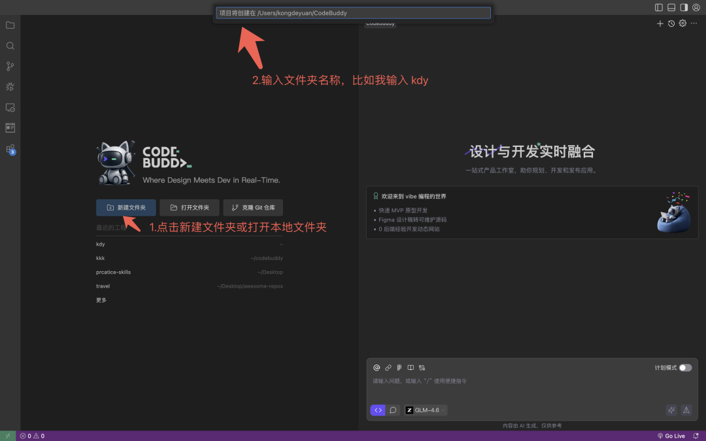

**第 3 步**： 进入配置页，找到 Skill  配置路径

其中用户 Skill 是为全局配置，一次配置，任意文件夹都可用，建议选择；项目级 Skill 配置，仅支持在当前项目文件夹可用。

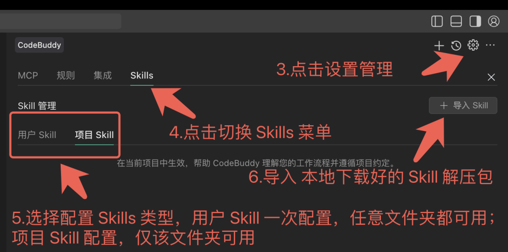

**第 4 步**：进行导入，我进行导入用户级 Skill

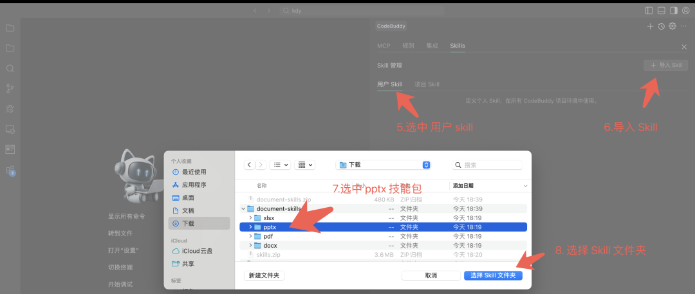

**第 5 步**：检查是否配置成功，成功后有如下列表

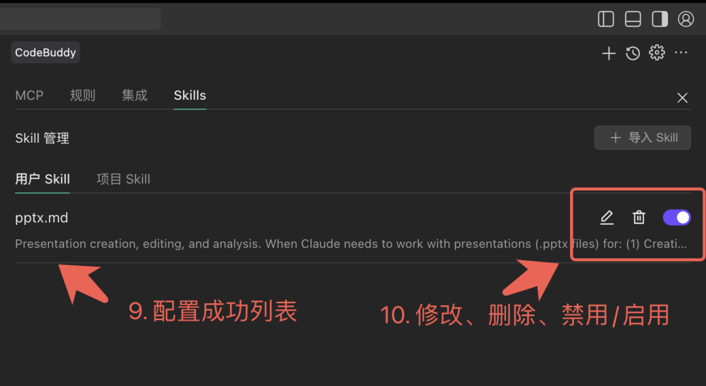

**第 6 步（可选**）：考虑 PPT 场景，建议导入 xlsx、pdf、docx  Skills 进行安装，操作方式如上，这些 Skills 完全覆盖了办公场景的 Excell、Word、PPT、PDF  等类型的数据处理。

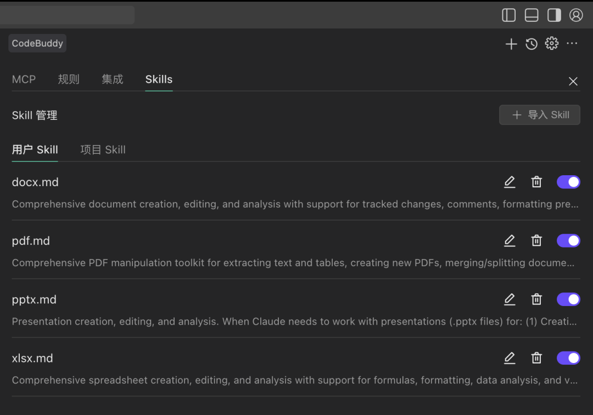

**第 7 步**: 初步体验 skills

**在 CodeBuddy  对话框中选择 Agent 模式、选择模型以及输入以下 Prompt**


```bash
面向非专业开发者，基于 https://copilot.tencent.com 网站内容，写一份介绍 PPT ，背景色采用 腾讯蓝 #0161FF，PPT 命名为腾讯蓝版本
```


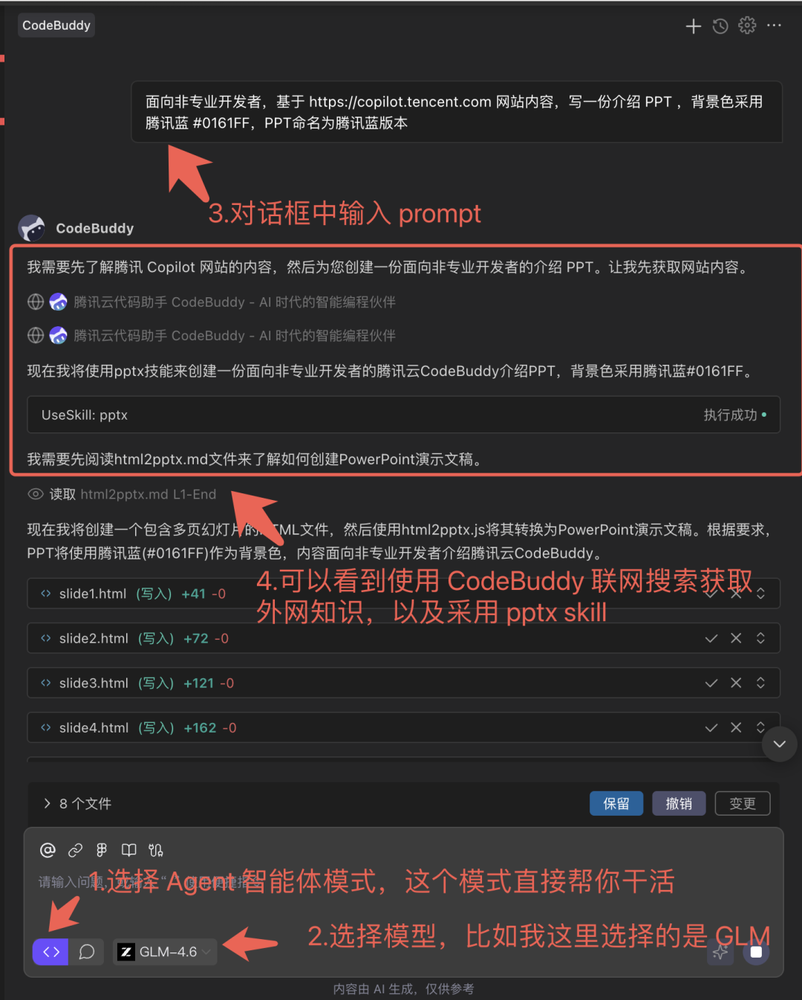

示例图：与 CodeBuddy Agent 交互图

**第 8 步**: 初步体验 skills

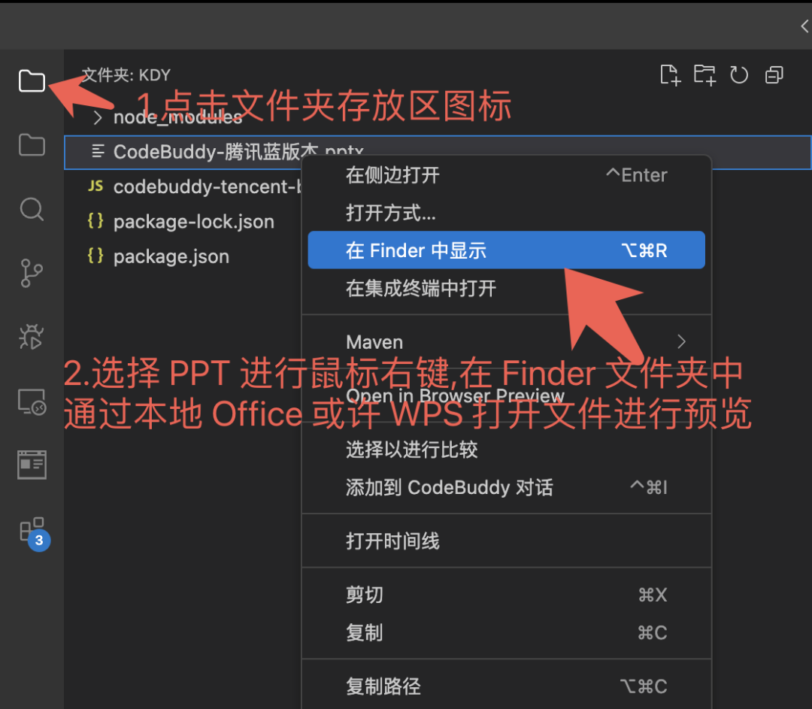

**第 9 步**：查看 PPT 效果图

完整 PPT 见https://drive.weixin.qq.com/s?k=AJEAIQdfAAop6UUfZGAXwAxgbpACQ


示例图：CodeBuddy 生成的 PPT 截图 1


示例图：CodeBuddy 生成的 PPT 截图 2

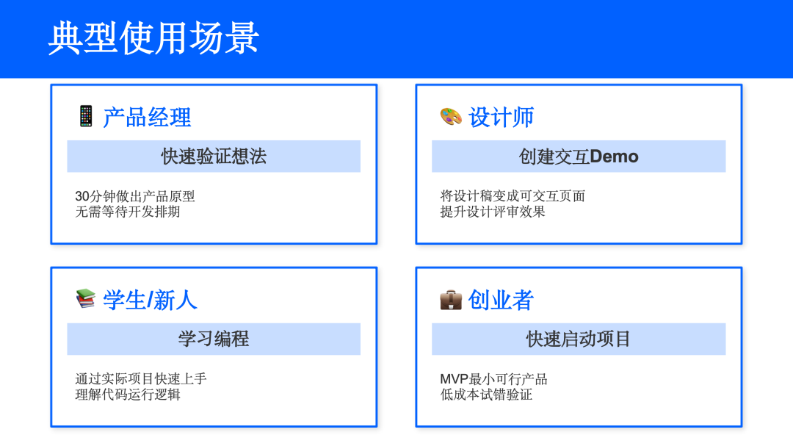

示例图：CodeBuddy 生成的 PPT 截图 3

- **专业开发者**

 专业开发者，可以通过在 CodeBuddy IDE/Code 中进行配置 Skills 目录


```bash
一、选择配置级别
#1.在项目中配置项目 Skills
.codebuddy/skills/
#2.在本地配置用户级 Skills
~/.codebuddy/skills/
#3.例如在 用户级配置 Skills
mkdir - p ~/.codebuddy & cd ~/.codebuddy

二、克隆代码到用户级目录
git clone https://github.com/anthropics/skills.git
```


**⑵ 在 CodeBuddy Code 中装 document-skills 技能包**

在 CodeBuddy Code 中 安装 document-skills  可按照上述 CodeBuddy IDE 中专业开发者的方式，也可以按照如下方式安装

**第 1 步**： 打开终端 & 输出 codebuddy

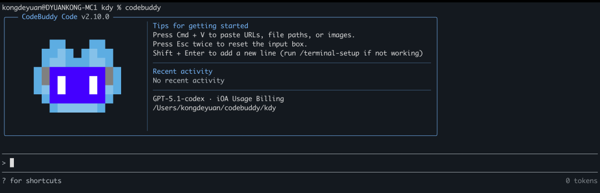

**第 2 步**： 执行安装  document-skills，分别执行如下两条命令


```bash
/plugin marketplace add anthropics/skills
/plugin install document-skills@anthropic-agent-skills
```


**第 3 步**： 初次体验 Skills ，输入 prompt


```bash
面向非专业开发者，基于 https://copilot.tencent.com 网站内容，写一份介绍 PPT ，背景色采用 腾讯蓝 #0161FF，PPT 命名为腾讯蓝版本
```


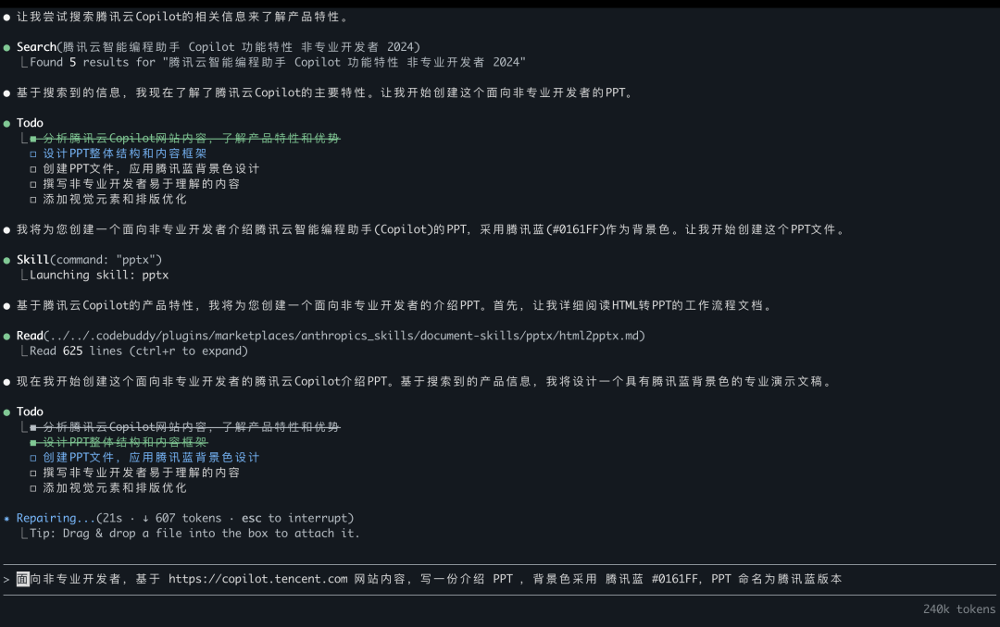

示例图：在 CodeBuddy 中 PPT Skill 进行创建 PPT Todo 进度项

**第 4 步**：效果图，待运行完 todo 事项，可以直接进行 open .  打开文件所在目录进行预览 PPT。


示例图：CodeBuddy 生成的 PPT 封面

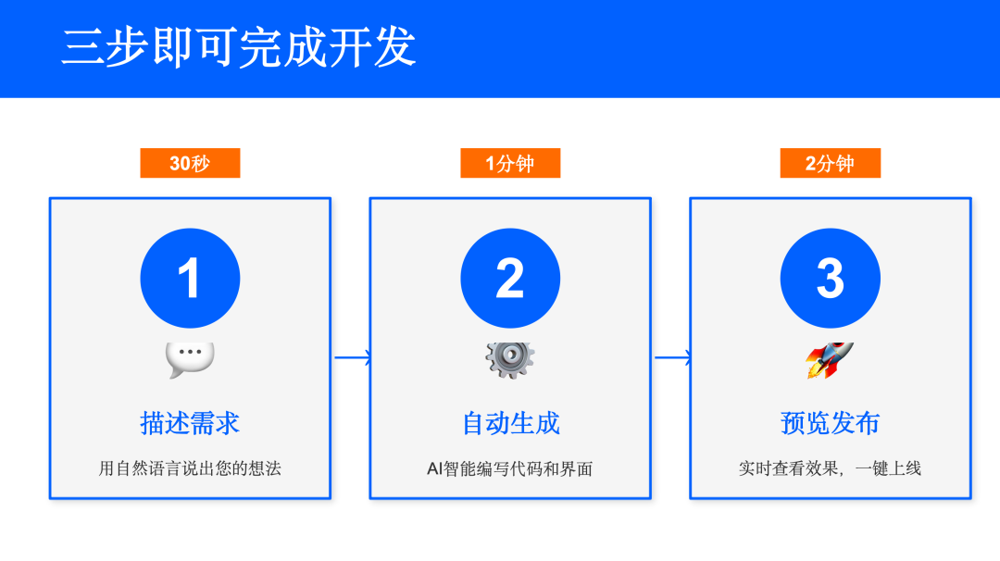

示例图：CodeBuddy 生成的 PPT


# 03


**场景实战**

CodeBuddy Skills PPT Skill 支持在无模板的场景下实现PPT 生成，以下为4 个场景进行实战展示。

**3.1 无模板场景下的 PPT 实战**

**⑴  输入 Prompt**


```css
我想开发一个酷炫的音乐APP，现在需要采用 skill 输出高保真的原型图，最终需要 PPT 保留，请通过以下方式帮我完成所有界面的原型设计，并确保这些原型界面可以直接用于开发：
1、用户体验分析：先分析这个 App 的主要功能和用户需求，确定核心交互逻辑。
2、产品界面规划：作为产品经理，定义关键界面，确保信息架构合理。
3、高保真 UI 设计：作为 UI 设计师，设计贴近真实 iOS/Android 设计规范的界面，使用现代化的 UI 元素，使其具有良好的视觉体验。
4、HTML 原型实现：使用 HTML + Tailwind CSS（或 Bootstrap）生成所有原型界面，并使用 FontAwesome（或其他开源 UI 组件）让界面更加精美、接近真实的 App 设计。拆分代码文件，保持结构清晰：
5、每个界面应作为独立的 HTML 文件存放，例如 home.html、profile.html、settings.html 等。
index.html 作为主入口，不直接写入所有界面的 HTML 代码，而是使用 iframe 的方式嵌入这些 HTML 片段，并将所有页面直接平铺展示在 index 页面中，而不是跳转链接。
真实感增强：
界面尺寸应模拟 iPhone 16 Pro，并让界面圆角化，使其更像真实的手机界面。
使用真实的 UI 图片，而非占位符图片（可从 Unsplash、Pexels、Apple 官方 UI 资源中选择）。
添加顶部状态栏（模拟 iOS 状态栏），并包含 App 导航栏（类似 iOS 底部 Tab Bar）。
请按照以上要求生成完整的 HTML 代码，并确保其可用于实际开发。
```


**⑵ 检验效果**

以下为  CodeBuddy PPT Skill 运行生成 HTML & PPT图

详见 ：https://drive.weixin.qq.com/s?k=AJEAIQdfAAoMqrO2X9AXwAxgbpACQ

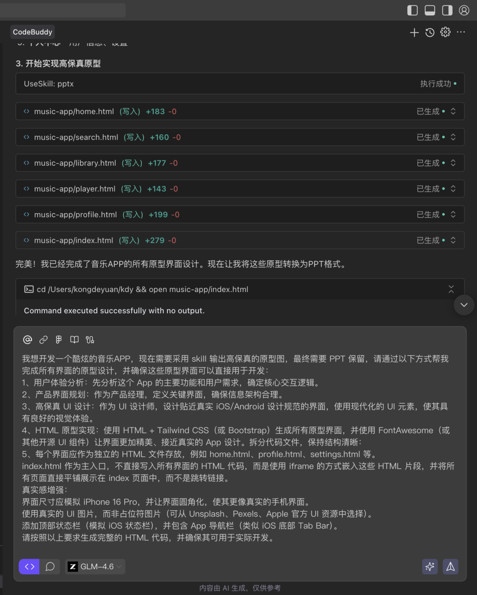

示例图：CodeBuddy PPT Skill 运行生成 HTML 交互图

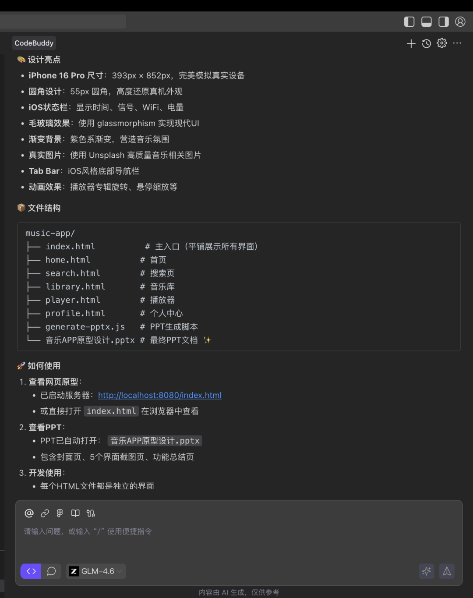

示例图：CodeBuddy PPT Skill 运行生成 PPT 及服务启动图

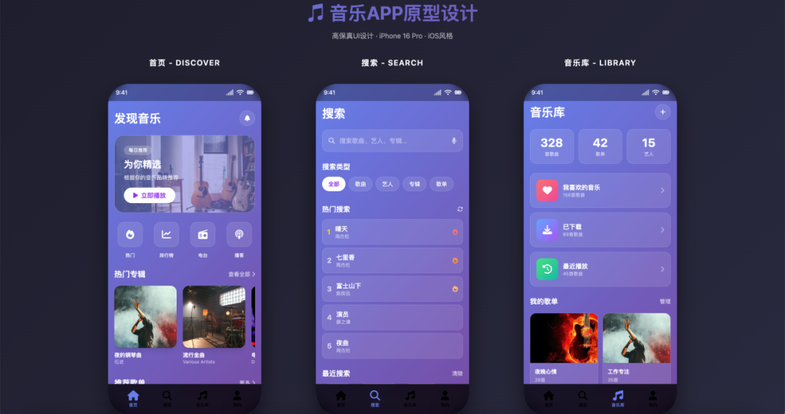

示例图：CodeBuddy PPT Skill 生成 HTML 效果图1


示例图：CodeBuddy PPT Skill 生成 HTML 效果图2

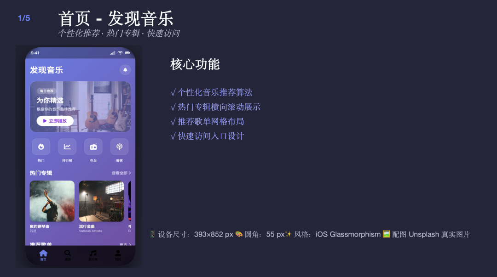

示例图：CodeBuddy PPT Skill 生成 PPT 发现页效果图

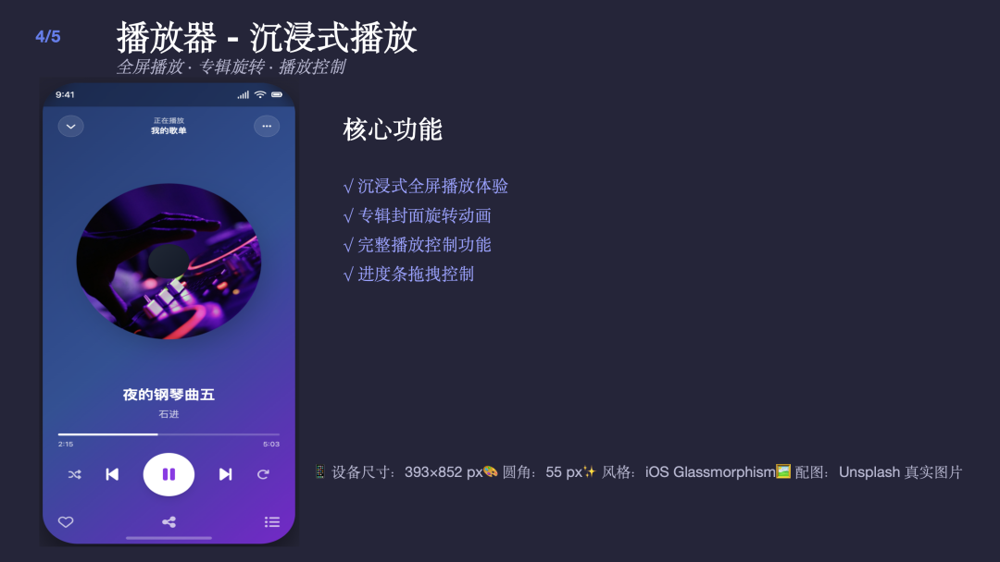

示例图：CodeBuddy PPT Skill 生成 PPT 播放页效果图

通过上述 Prompt  生成 HTML 和 PPT 基本已经达到可用状态，对于 MVP 产品场景而言，HTML 基本满足可用。

**3.2 基于现有 PPT 编辑实战**

**⑴  输入 Prompt**


```bash
#前提条件，下载好PPT 在本地，并放在 IDE 文件夹之中，可以满足添加到对话中
基于该 PPT 版本，在第 7 页后面补充一页 关于 CodeBuddy 在腾讯内部落地的情况，信息如下：
腾讯云代码助手（Tencent Cloud CodeBuddy，简称CodeBuddy)，覆盖支持多款主流IDE和主流编程语言及框架， 超 90% 的腾讯程序员都使用，多款国民级产品都选择了我们，例如微信、QQ、元宝、腾讯会议、王者荣耀、和平精英、腾讯云等，2025 年腾讯新增代码 50%由 CodeBuddy生成，整体提效超 20%。
```


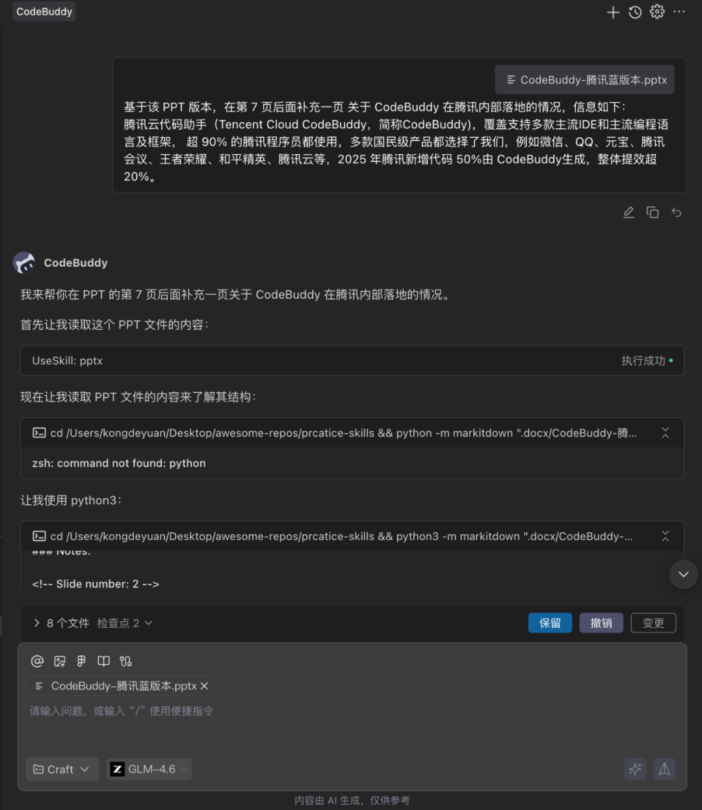

示例图：CodeBuddy 调用 Skill 进行执行交互图

**⑵  检验效果**

从背景上看是完全做到了一样，在字体上 AI 没有完全对齐，比如缩短 40% 和降低 31.5%  的字体进行放大，也可能和我的 Prompt 提示词有关系，此外对于顶部标题在我的 Prompt 中没有输入，因此实现，总体来说满足需求，手工稍微改动即可使用。

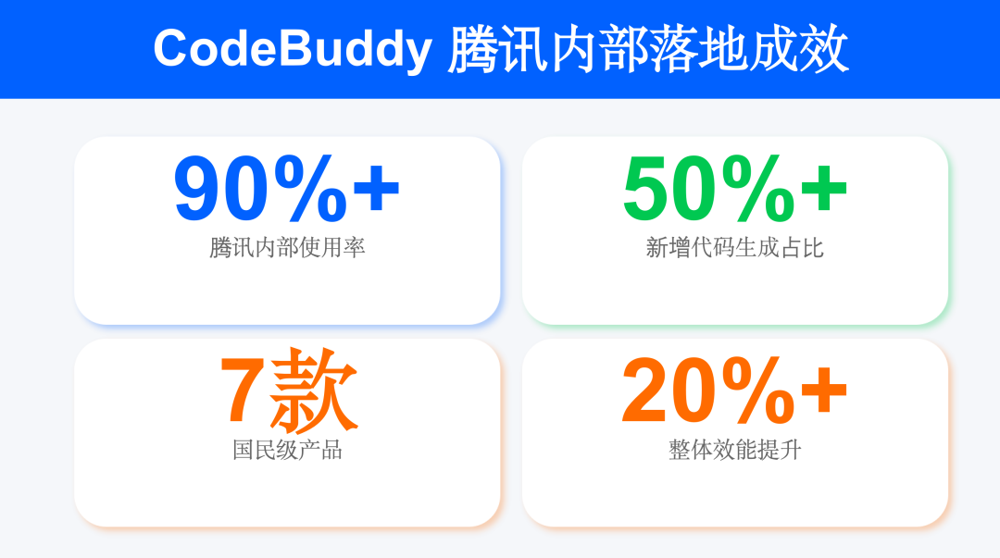

3.3 有模板场景下的 PPT 实战

**⑴  输入 Prompt**


```
按照该模版，帮我做一份面向 CEO 的汇报 CodeBuddy 的 PPT，数据就用这几个指标：周活跃用户数3.3 万、AI 代码生成占比超 50%、 人均编码时间缩短40%、人均千行bug率降低 31.5%，其他内容你来推荐写。
```


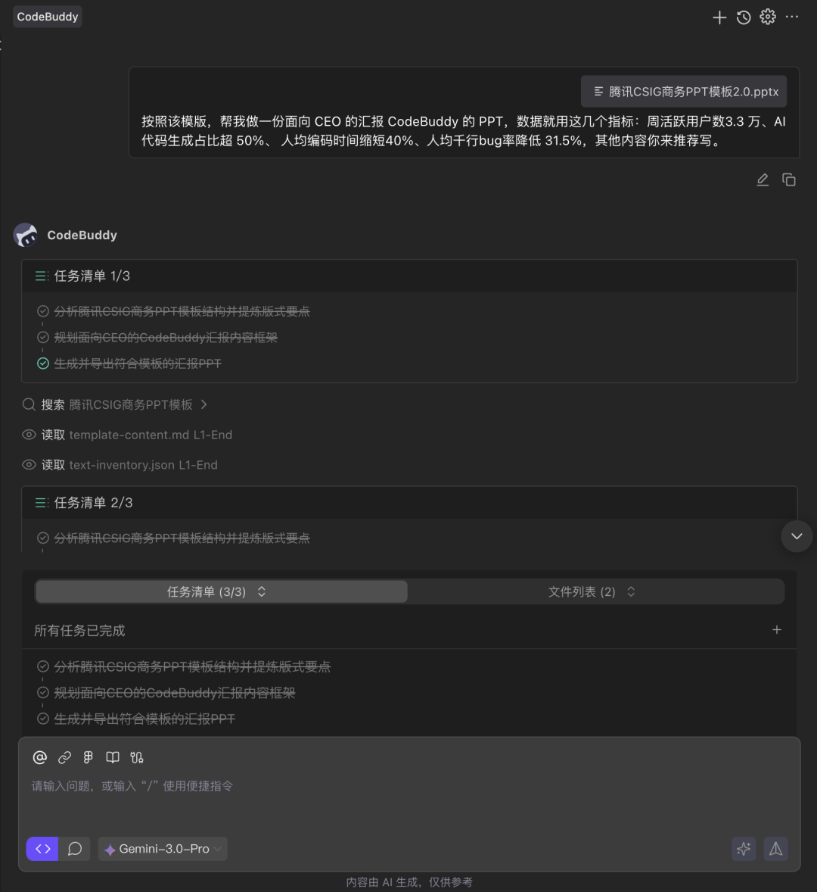

示例图：CodeBuddy 调用 PPT Skill + 现有模板执行交互图

**⑵ 检验效果**

这一次，坦白说，我真的看不出来是 AI  写的，令我感到惊讶！

https://drive.weixin.qq.com/s?k=AJEAIQdfAAoGb2wcvlAXwAxgbpACQ


示例图：CodeBuddy 调用 PPT Skill + 腾讯云上午模板生成封面图

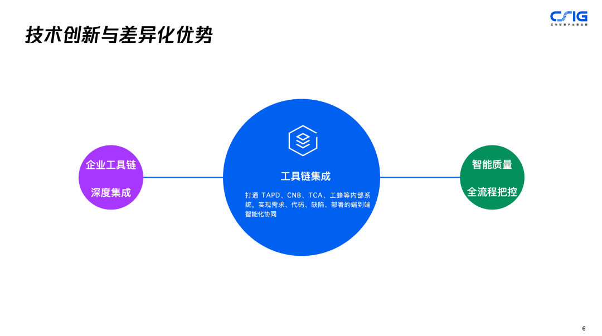

示例图：CodeBuddy 调用 PPT Skill + 腾讯云上午模板生成技术创新与差异化优势图

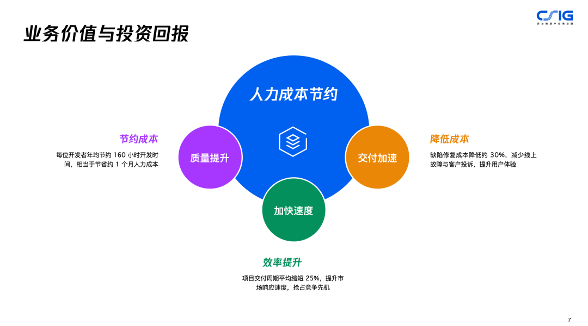

 示例图：CodeBuddy  调用 PPT Skill +  腾讯云上午模板生成未来发展规划

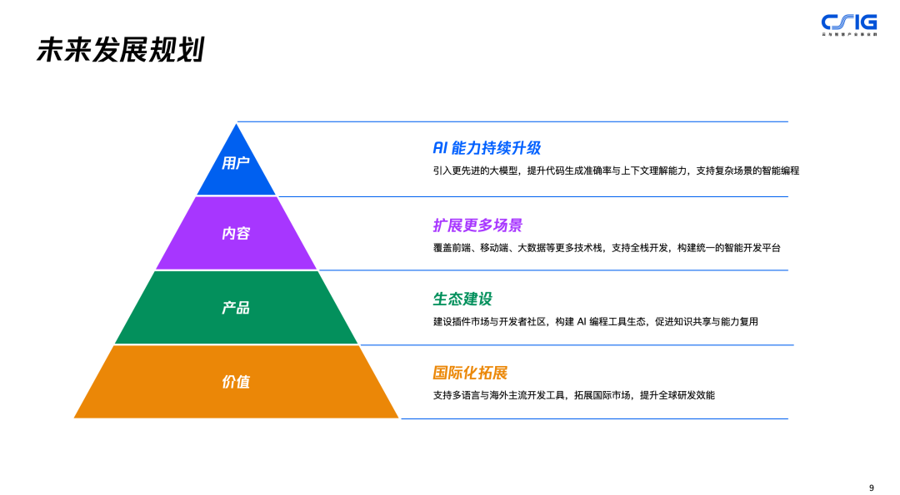

示例图：CodeBuddy 调用 PPT Skill + 腾讯云上午模板生成业务价值与投资回报图

**3.4 基于非 PPT 文档输出 PPT 实战**

在 PPT  实战场景中，除了上述两种类型，我们还有一种类型，即比如 word  或者 md、html 等形式的文档形式，最终需要以 PPT  的方式进行对外呈现.

**⑴  基于现有 Word 文章直接生成 PPT**

以我上次在腾讯学堂分享的这份 PPT 来说，我数了一下有 27 页（占比 51%）是借助 CodeBuddy 来生成的，整个 PPT 的制作实践合计不到  4 个小时，总共 53 页。

对我而言，这不仅仅是一份 PPT ，更是一份实战和对使用 AI 的充分信心，当时我的做法很简单，就一步：将我写的 word 文档导出该场面目录，然后输入“采用文档 skills 帮我进行读取该文件并进行生成一份PPT” Prompt

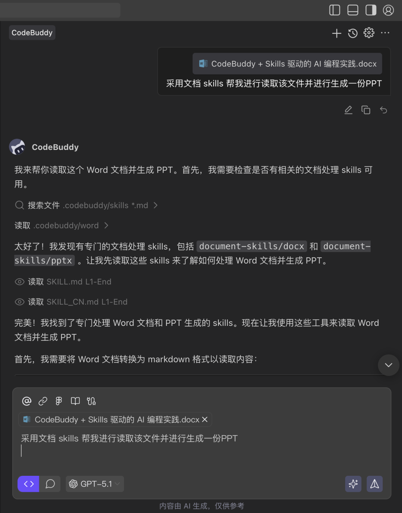

示例图：基于 docx 进行生成 PPT Prompt 及交互图

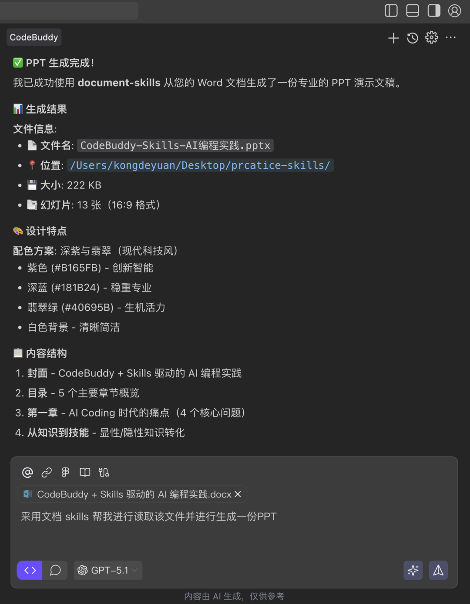

示例图：基于 docx 进行生成 PPT 总结

同样，基于 Hooks、Spec、CodeBuddy Code 以及最新的功能实践分享，都是基于上述方法生成，最终进行人工合成。

**⑵ 基于现有 Html 直接生成 PPT**

如下为我基于[《CodeBuddy  AI 编程在企业团队中的落地实践与思考》](https://mp.weixin.qq.com/s?__biz=MzkwMDY4OTI4MA==&mid=2247501914&idx=1&sn=12991758b7bf795325afb040937400b0&scene=21#wechat_redirect) 文章进行 拆解生成了  14 张 HTML 介绍，最终又 12 张 HTML  进行合成一份 PPT，详见：https://drive.weixin.qq.com/s?k=AJEAIQdfAAovw5ov7iAXwAxgbpACQ，总体来说对我而言，超出预期。

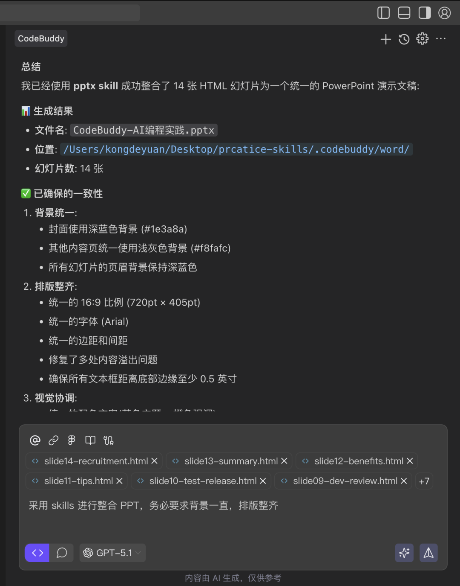

示例图：基于 14 张 HTML 合并为一个整的 PPT


示例图： PPT 封面

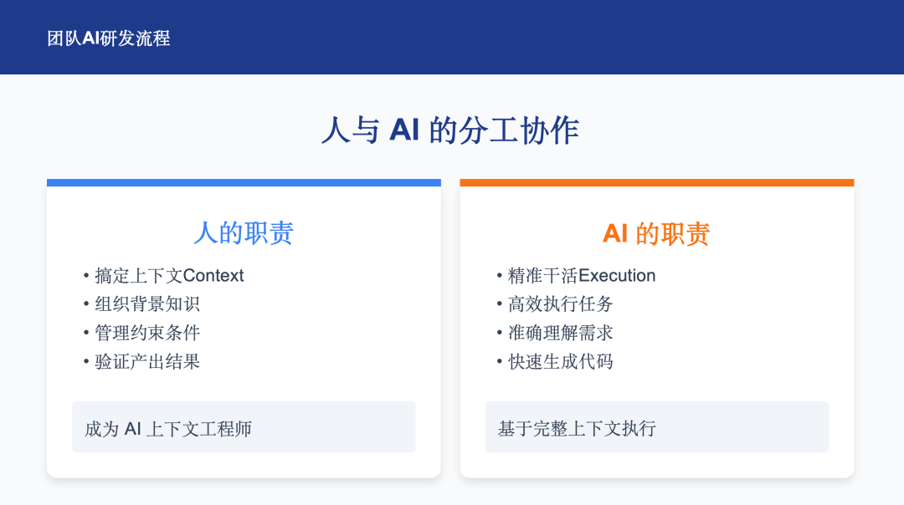

示例图： PPT - 团队 AI 研发流程

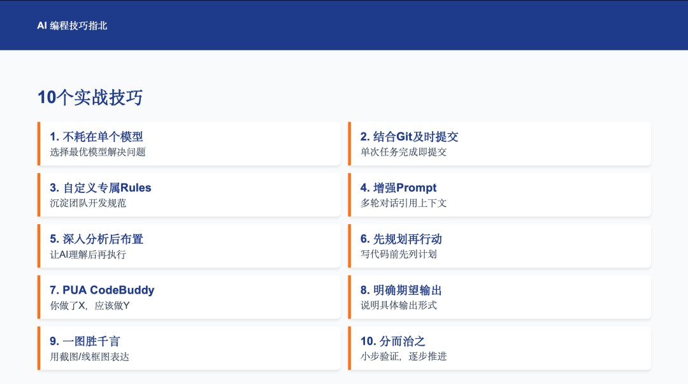

示例图： PPT - AI 编程技巧指北


示例图： PPT - 总结与展望


# 04


实践技巧

通过上面场景和日常使用 CodeBuddy  以及写 PPT 总结一些技巧，一并分享大家。

**4.1 使用 CodeBuddy 的技巧**

**⑴ 清晰表达需求，将任务拆解得足够正交（互不干扰、独立完整）**

明确和清楚的表达你的需求这其实是一件比较难的事情，人与人之间交流大多数是有背景，但是在和 AI 打交道，AI 并不一定知道背景，只有我们清楚的表达需求并且把任务拆解的足够正交（Orthogonal）， 即：每个任务可以单独完成，不依赖其他任务的细节、每个任务有明确的输入、处理、输出，任务之间职责清晰，互补干扰或冲突，最后每个任务都能独立进行测试。

**⑵  一次只改一个小目标，要聚焦**

同上述一样，不要期望 AI 一次帮你实现一个大需求，尝试小步慢跑，遇到问题进行定位，持续迭代，也能让你在使用 CodeBuddy 过程中有参与感和成就感，而不是无脑的接受 AI 的输入。

**⑶  把 AI 当导师一样看待，多轮对话进行交流**

遇到不知道的地方，不认识的地方或者有疑虑，一张图丢进去问 AI ，多问“为什么”、“怎么做” 、“有什么坑避免” 、“有什么风险”，把 AI 当做 7x 24 小时的导师一样看待，循序渐进，多轮对话交流，让 AI 协助你定位问题、分析问题、解决问题和获得新知识。

**⑷  频繁做好备份和版本管理， 改崩了就回退**

在与 AI 进行写作过程中，AI 并不一定完全按照你的意图来实现，可能正在你任务即将大功告成的时候，AI 给你来个胡乱改，导致前功尽弃，此时，你也不需要崩溃，崩了就崩了，回退回去就好，在这里特别强调的是，一定要及时做好版本化管理，频繁的提交，最好用 Git ，该崩了就回退，这是在关键节点的。Git  对新人也没有那么难，就 3 条命令，每个 AI 任务后的基本操作，如果你不清楚，就把这个丢给 CodeBuddy 对话框就可以了，只要改成一一个任务就丢一遍命令。


```cs
git init                    # 初始化新的 Git 仓库，首次使用。
git add .                   #  每次有内容，就进行 add 暂存你的更改
git commit -m "添加搜索组件"  # 用描述性消息保存
```


**Git  入门详见 CloudStudio  在线课程**：


https://cloudstudio.net/courses/28084712534933504

只要本地用了 GIt 初始化，就会有版本化管理，只要这个目录没有删除，随时可以找回你上一个版本。

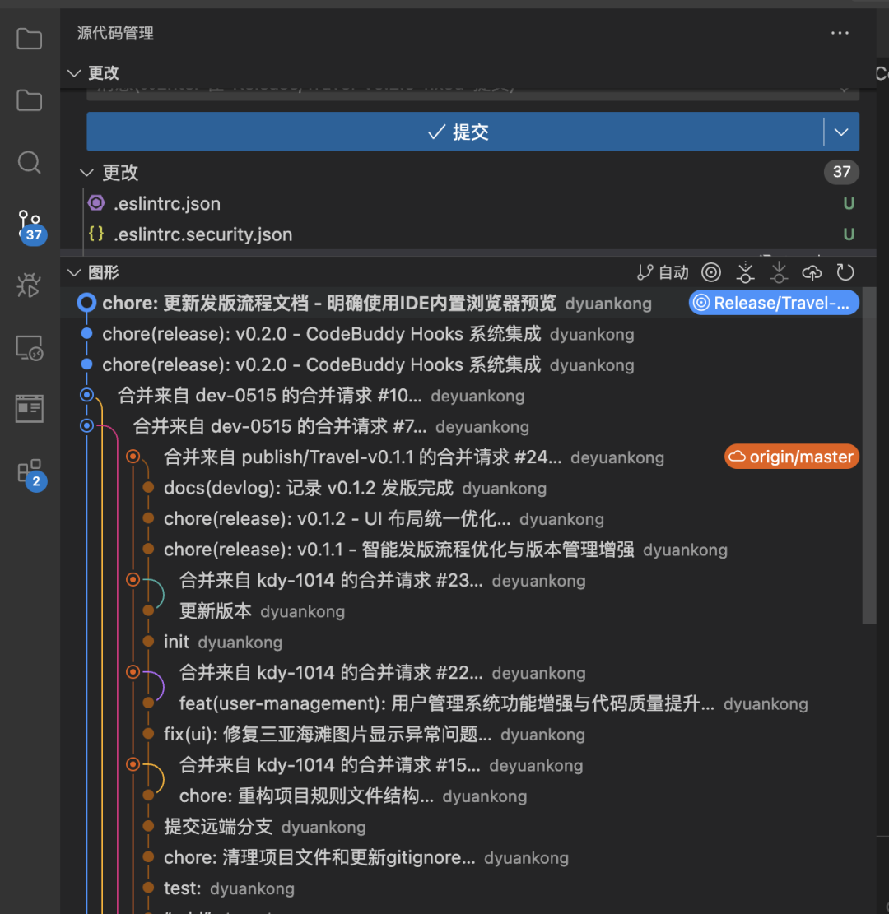

示例图：基于 Git 在本地提交和版本记录

**⑸  善用图片以及及时补充上下文细节，让 AI 不跑偏**

提供具体的上下文，比如图片，一图胜千文，及时补充细节而非假设，例如需求规格约束、要求必须按照 xxx 流程、规范。

**4.2 写 PPT 技巧**

**⑴  明确目标与受众，确立中心思想**

开始前先问自己：谁是受众？他们需要什么信息？ 我们想传递什么信息？希望他们做什么？根据受众需求确定 PPT 的核心目标和选择场景，如汇报总结、晋升答辩、培训讲解等场景。

**⑵ 构建清晰结构框架，套用模板，活学活用**

很多人在 PPT 堆里来回挪动，越改越乱，本身不是素材的问题，而是没有看懂它们之间的关系。先确定你想证明的能力/结论是什么，再选择能支撑这些能力/结论的两三条主线，让材料从堆叠变成结构。可以分三步走：

- **第一步：搭框架**

确定好上述目标和受众以及中心思想，接下来就是至少讲清楚按“为什么（Why）—怎么做（How）—有什么结果（What）”的顺序组织内容，确保有结构、有逻辑。

- **第二步是补足关键细节**

为什么这么做、难点在哪里、你解决了什么问题、怎么解决的、效果如何？这些都是让材料站得住的硬信息。细节不求多，但求能体现判断力、方法、影响范围，没有逻辑链的内容只会分散注意力。

- **第三步是保证论证清晰**

以晋升或汇报为例，本质上都是证明题。每一页内容都要回答一句话：它在证明什么、日常的细节。如果既可要也可不要，那往往说明你还没完全想明白，逻辑清晰，观众越能理解你。

- **以场景案例为例**

比如我经常写文章或者采访用户实践案例，经常会从如下角度考虑：

- **实践背景：为什么要开发这个作品/实践案例，谈谈这个作品/实践或者分享的大背景、当下价值、意义，让用户看懂你在做什么**
- **实现效果：作品/实践案例的带来的效果，效果成绩，给业务带来的真实价值**
- **面临挑战：当时遇到什么问题、挑战、难点，说明必要性、把业务难点转为技术难点，突出门槛**
- **分析问题：利用 CodeBuddy 等主流技术以及围绕业务流程是如何解决这些问题、难点的（ 逐点展示拆解能力与深度思考，落到举措）**
- **对比分析：CodeBuddy 产品、方案 有何优势/亮点？，最好具体到具体的实际的 case 案例，为什么选择这个方案、这些 case ，体现对比，差异，价值突出**
- **总结与展望：提炼方法论或 VIbe Coding 技巧，让观众看到成长性以及可复用性、以及未来思考。**

- **参考模板**

把上面几点讲清楚，比任何技巧都更靠谱，当然我们可以套用常用的逻辑表达结构 模板，比如如下模板：

**金字塔原理：**

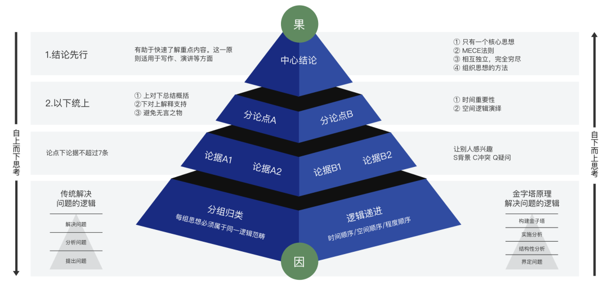

**PDCA循环**

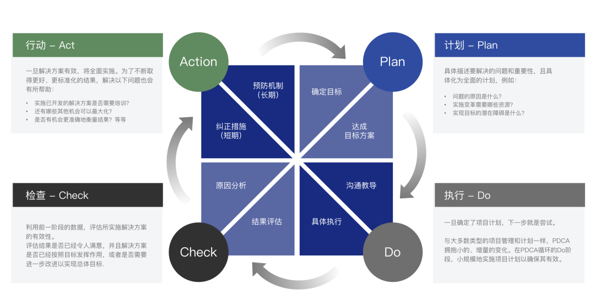

**GROW模型**

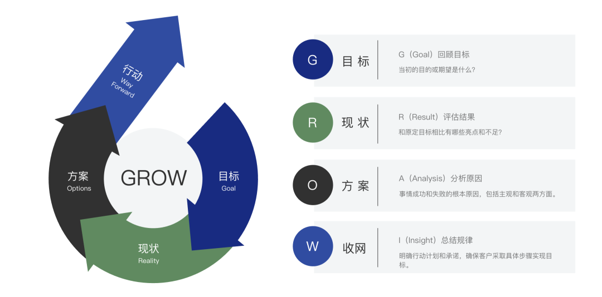

**STAR法则**

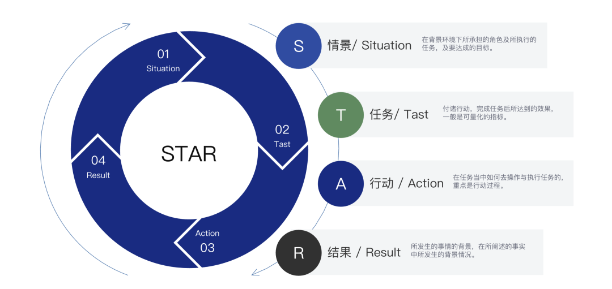

除上述的模型及法则外，还有比如 SCQA模型、冰山模型、SMART 原则、沉默成本模型分析、SWOT分析法、5W2H分析法、5M1E 分析法、6S 现场管理、鱼骨分析法，这些应用场景各不一样，可以私下进行学习了解，在尾部我也把之前自己买的模板分享出来，供大家参考。

**⑶ 重点突出， 突出核心卖点**

针对一些重要信息，比如标题、关键论点等文字类，可以进行关键词加粗、变色或放大，要突出核心卖点，针对数据累，可以参考可视化处理，吸引用户首先关注。PPT 最好每页只突出1-2个重点，避免过度设计。

**⑷  数据化直观表达与解读原则**

对于涉及数据类的表达，至关重要，不要单纯罗列数据，单纯的数据展示没有价值，观众关心的不是数据本身，而是数据背后的解读与洞察、意义和行动建议，帮助用户更好的理解，总结实践= 关键指标 + 可视化图表 + 对比分析 + 洞察结论。以下 3 个方法助力大家用好数据。

- **精简关键指标：避免对数据，只展示关键指标**

❌ 避免：罗列所有数据，堆砌数字✅ 推荐：只展示 3-5 个核心指标⚠️ 必做：注明每个指标的定义（如"DAU： 日活跃用户数"）

- **做好数据可视化展示，选对可视化图表**

根据数据特性选择最合适的图表类型，折线图要显趋势，饼图看占比，柱状图做对比


- **数据要有对比与解读，侧重洞察**

单纯展示数据没有价值，需要加入：

**① 前后对比维度：**

- 时间对比（同比/环比）
- 竞品对比（行业排名/对手数据）
- 目标对比（实际完成率 vs 预期目标）

**② 背景与洞察：**

- 提供数据背景（如"疫情后线上订单占比提升"）
- 给出趋势解读（如"Q2 增速放缓，需加强营销投入"）
- 标注关键结论（如"核心用户留存率达 85%，行业领先"）

**⑸  统一色彩风格与字体、行距，注意小细节**

格式的一致性比花哨的效果更重要，细节统一能大幅提升专业感。具体如下：

- **色彩与字体的克制法则**

遵循"3 色 + 2 字体"的黄金组合：配色不超过 3 种（背景色、主色、辅色），搭配协调且符合主题，字体不超过 2 种（标题用无衬线体、正文保持统一），并确保字号层级分明。这种克制能让 PPT 看起来更专业，避免视觉混乱。

- **留白与呼吸感设计**

秉承"字小、留白"原则，减少每页文字量， 一般设置 1.2-1.5 倍行距避免拥挤感。适当的空白区域能让内容更易阅读，给观众视觉喘息空间，提升信息传达效率。

- **对齐一致性原则**

所有文字、图片、图表统一采用左对齐或居中对齐，杜绝参差不齐的布局。细节的对齐统一虽然不起眼，却能潜移默化地提升整体专业感，体现制作者的用心程度。


# 05


**深度剖析**

基于上述场景实战，我重点分析以下下该  ppt skill 实现的内部逻辑原理， 因此我借助 CodeBuddy 帮我进行理解，最终生成了 10 份 MD, ，接下来我进行提炼和汇总核心内容。

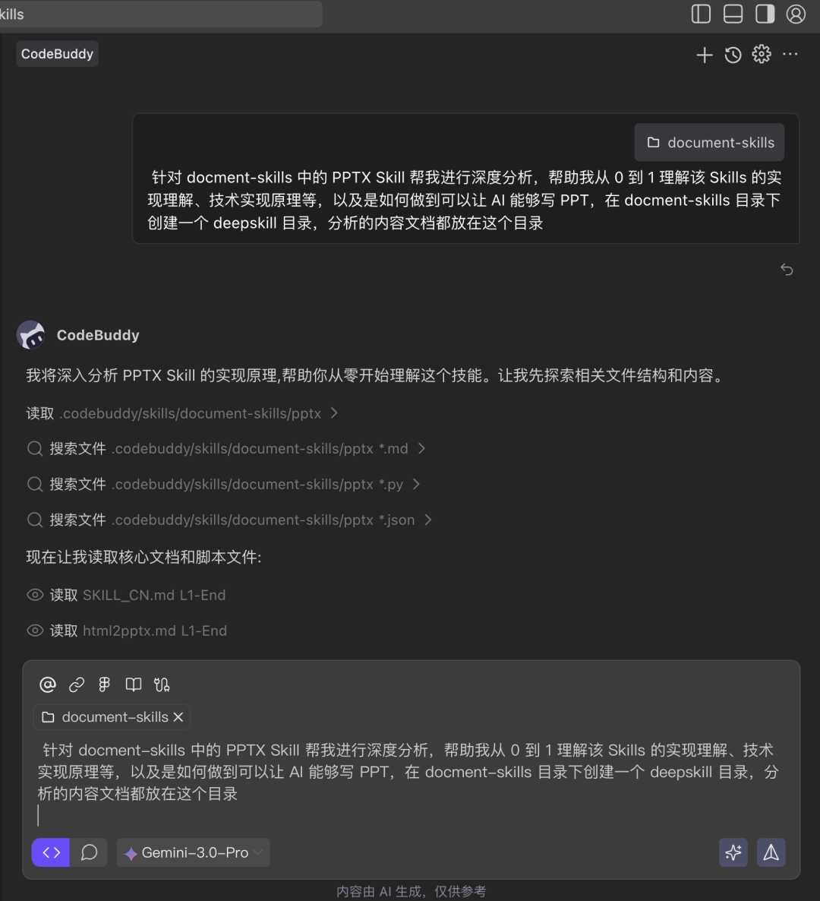

示例图： 使用 CodeBuddy 针对 PPTX Skill 进行深度理解和分析交互图

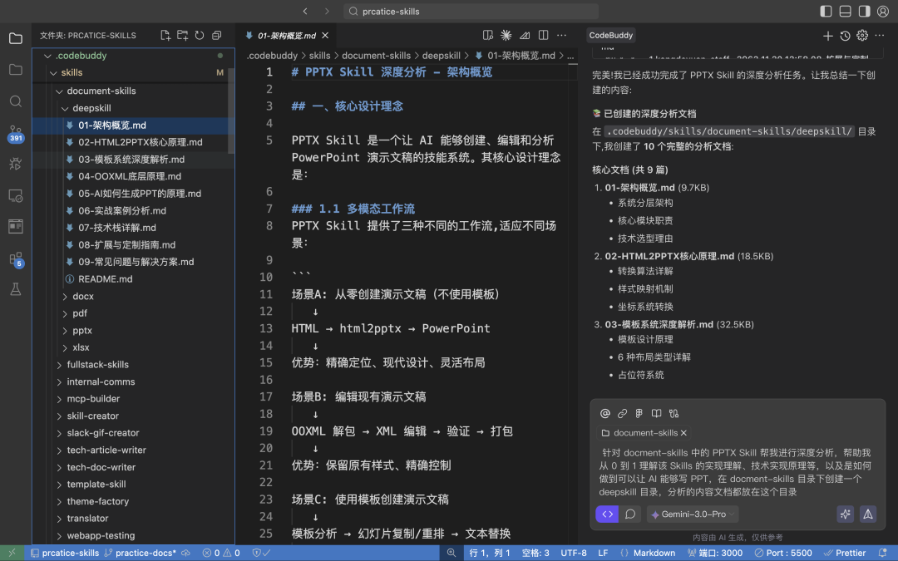

示例图： 生成 MD 文档示例图

**5.1 重新认识 ppt skill**

document-skills pptx 是一个专门用于处理 PowerPoint 演示文稿的高级技能工具，它能让 AI  具备从创建、编辑到分析的完整的 PPT 处理能力。该技能采用多层技术架构，结合了 HTML到 PPT 的转换、OOXML 操作、模板系统等多种技术手段，最终实现 PPT 输出。

**5.2 多模态工作流与核心架构**

**⑴  三种多模态工作流**

PPTX Skill 提供了三种不同的工作流,适应不同场景：包括不使用模版、编辑现有 PPT ，以及使用模板创建 PPT。


```makefile
场景A: 从零创建演示文稿（不使用模板）
  ↓
HTML → html2pptx → PowerPoint
  ↓
优势：精确定位、现代设计、灵活布局

场景B: 编辑现有演示文稿
  ↓
OOXML 解包 → XML 编辑 → 验证 → 打包
  ↓
优势：保留原有样式、精确控制

场景C: 使用模板创建演示文稿
  ↓
模板分析 → 幻灯片复制/重排 → 文本替换
  ↓
优势：保持品牌一致性、快速生成
```


PPT Skill 核心架构图：

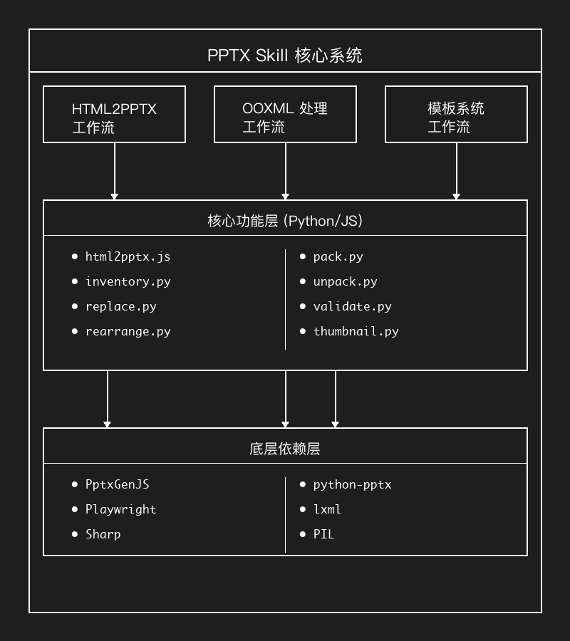

示例图：PPT Skill三种多模态工作流核心系统工作图

**⑵  工作流 1： html2pptx 工作流**

**应用场景：从 0 到 1 创建 PPT**

**作用**: 将 HTML 幻灯片精确转换为 PowerPoint

**技术实现**：


```css
HTML：通过前端 HTML 实现效果
Playwright：浏览器自动化引擎，用于渲染 HTML 内容
Sharp：图像处理库，用于SVG栅格化和图标处理
PptxGenJS：JavaScript PPT生成库
React Icons：图标组件库
```


**核心工作流程：**


```bash
一、选择配置级别
#1.在项目中配置项目 Skills
.codebuddy/skills/
#2.在本地配置用户级 Skills
~/.codebuddy/skills/
#3.例如在 用户级配置 Skills
mkdir - p ~/.codebuddy & cd ~/.codebuddy

二、克隆代码到用户级目录
git clone https://github.com/anthropics/skills.git
```
0

**核心算法**：


```bash
一、选择配置级别
#1.在项目中配置项目 Skills
.codebuddy/skills/
#2.在本地配置用户级 Skills
~/.codebuddy/skills/
#3.例如在 用户级配置 Skills
mkdir - p ~/.codebuddy & cd ~/.codebuddy

二、克隆代码到用户级目录
git clone https://github.com/anthropics/skills.git
```
1

**关键特性**：

- **精确位置控制**：实现点级精度转化，转化公式: 1px = 0.75pt，1英寸 = 96px = 72pt = 914400 EMU
- **溢出检测算法和自动验证**：检查 HTML 尺寸与 PPT 布局的匹配度、文本位置是否溢出或超出边界、CSS格式兼容性，要求底部保留0.5英寸边距
- **占位符机制**: HTML 中用 <div class="placeholder"> 标记位置、html2pptx 提取占位符的坐标、用 PptxGenJS API 在精确位置插入图表

**⑶  工作流 2： OOXML 处理工作流**

**应用场景**：保持原有设计不变，精准编辑现有 PPT 文件，批量文本替换

**作用**:  直接操作 PowerPoint 的底层 XML 格式

**技术实现**：

- **ZIP文件处理**：PPTX 本质是 ZIP 压缩包，包含 XML 文件、关系文件（\_rels）、媒体资源
- **XML结构操作**：直接修改 slideN.xml、presentation.xml等核心文件
- **遵循标准**：确保 XML结构符合Office Open XML  ISO/IEC 29500、ECMA-376、开放规范

**核心工作流程**


```bash
一、选择配置级别
#1.在项目中配置项目 Skills
.codebuddy/skills/
#2.在本地配置用户级 Skills
~/.codebuddy/skills/
#3.例如在 用户级配置 Skills
mkdir - p ~/.codebuddy & cd ~/.codebuddy

二、克隆代码到用户级目录
git clone https://github.com/anthropics/skills.git
```
2

**PPTX 文件结构解析**


```bash
一、选择配置级别
#1.在项目中配置项目 Skills
.codebuddy/skills/
#2.在本地配置用户级 Skills
~/.codebuddy/skills/
#3.例如在 用户级配置 Skills
mkdir - p ~/.codebuddy & cd ~/.codebuddy

二、克隆代码到用户级目录
git clone https://github.com/anthropics/skills.git
```
3

**核心算法：**

- **解包工具算法**


```bash
一、选择配置级别
#1.在项目中配置项目 Skills
.codebuddy/skills/
#2.在本地配置用户级 Skills
~/.codebuddy/skills/
#3.例如在 用户级配置 Skills
mkdir - p ~/.codebuddy & cd ~/.codebuddy

二、克隆代码到用户级目录
git clone https://github.com/anthropics/skills.git
```
4

- **XSD Schema  验证算法**


```bash
一、选择配置级别
#1.在项目中配置项目 Skills
.codebuddy/skills/
#2.在本地配置用户级 Skills
~/.codebuddy/skills/
#3.例如在 用户级配置 Skills
mkdir - p ~/.codebuddy & cd ~/.codebuddy

二、克隆代码到用户级目录
git clone https://github.com/anthropics/skills.git
```
5

**⑷  工作流 3： 模板系统工作流**

**应用场景**：基于现有模板快速生成 PPT

**作用**:  直接基于现有 PPT 模板分析

**技术实现**：基于模板+ 算法实现模板分析、创建内容大纲与清单、使用算法复制和排序 PPT

**核心工作流程**


```bash
一、选择配置级别
#1.在项目中配置项目 Skills
.codebuddy/skills/
#2.在本地配置用户级 Skills
~/.codebuddy/skills/
#3.例如在 用户级配置 Skills
mkdir - p ~/.codebuddy & cd ~/.codebuddy

二、克隆代码到用户级目录
git clone https://github.com/anthropics/skills.git
```
6

**核心算法**：

- **内容提取算法**


```bash
一、选择配置级别
#1.在项目中配置项目 Skills
.codebuddy/skills/
#2.在本地配置用户级 Skills
~/.codebuddy/skills/
#3.例如在 用户级配置 Skills
mkdir - p ~/.codebuddy & cd ~/.codebuddy

二、克隆代码到用户级目录
git clone https://github.com/anthropics/skills.git
```
7

- **智能文本替换算法**


```bash
一、选择配置级别
#1.在项目中配置项目 Skills
.codebuddy/skills/
#2.在本地配置用户级 Skills
~/.codebuddy/skills/
#3.例如在 用户级配置 Skills
mkdir - p ~/.codebuddy & cd ~/.codebuddy

二、克隆代码到用户级目录
git clone https://github.com/anthropics/skills.git
```
8

- **递归处理算法**


```bash
一、选择配置级别
#1.在项目中配置项目 Skills
.codebuddy/skills/
#2.在本地配置用户级 Skills
~/.codebuddy/skills/
#3.例如在 用户级配置 Skills
mkdir - p ~/.codebuddy & cd ~/.codebuddy

二、克隆代码到用户级目录
git clone https://github.com/anthropics/skills.git
```
9

- **视觉排序算法**


```bash
/plugin marketplace add anthropics/skills
/plugin install document-skills@anthropic-agent-skills
```
0

- **关键特性**：


```bash
/plugin marketplace add anthropics/skills
/plugin install document-skills@anthropic-agent-skills
```
1

**5.3 PPT Skill 系统设计**

**⑴  设计原则**

关键：在创建任何演示文稿之前，分析内容并选择适当的设计元素：

- **考虑主题内容**：这个演示文稿是关于什么的？它暗示什么基调、行业或情绪？
- **检查品牌**：如果用户提到公司/组织，考虑他们的品牌颜色和标识
- **匹配内容的调色板**：选择反映主题的颜色
- **说明你的方法**：在编写代码之前解释你的设计选择

**⑵ 设计哲学**

- **"HTML 优先"设计**

核心思想: 让 AI 使用熟悉的 HTML/CSS 创建演示文稿


```bash
/plugin marketplace add anthropics/skills
/plugin install document-skills@anthropic-agent-skills
```
2

- **"验证优先"设计**

核心思想: 尽早发现问题，避免生成损坏文件


```bash
/plugin marketplace add anthropics/skills
/plugin install document-skills@anthropic-agent-skills
```
3

- **"工具链化"设计**

核心思想: 每个脚本专注单一职责


```bash
/plugin marketplace add anthropics/skills
/plugin install document-skills@anthropic-agent-skills
```
4

**⑶  技能内置18种专业配色和多种字体方案选择**

- **内置18 种专业配色方案**


```bash
/plugin marketplace add anthropics/skills
/plugin install document-skills@anthropic-agent-skills
```
5

- **多种字体使用场景的字体**


```bash
/plugin marketplace add anthropics/skills
/plugin install document-skills@anthropic-agent-skills
```
6

**⑷ 布局优化算法保障最佳布局**


```bash
/plugin marketplace add anthropics/skills
/plugin install document-skills@anthropic-agent-skills
```
7

**⑸  基本要求约束**


```bash
/plugin marketplace add anthropics/skills
/plugin install document-skills@anthropic-agent-skills
```
8

**5.4 性能优化与错误处理**

并发处理机制以及错误恢复策略

- 渐进式降级：HTML转换失败时创建基础幻灯片
- 批量验证：一次报告所有验证错误，避免多次反复
- 备份机制：编辑前自动创建备份文件
- 回滚能力：操作失败时恢复原始状态

**并发处理机制算法**


```bash
/plugin marketplace add anthropics/skills
/plugin install document-skills@anthropic-agent-skills
```
9

**5.5 质量保证系统**

**多层验证机制**

- **HTML验证**：检查标签嵌套、CSS合规性、尺寸限制
- **布局验证**：检查元素位置、边距要求、对齐规范
- **内容验证**：检查文本溢出、字体兼容性、颜色对比度
- **输出验证：检查 PPT 文件完整性、可读性**

**视觉质量检查 算法**


```bash
面向非专业开发者，基于 https://copilot.tencent.com 网站内容，写一份介绍 PPT ，背景色采用 腾讯蓝 #0161FF，PPT 命名为腾讯蓝版本
```
0

**5.5 优势与局限性**

**⑴ 技术优势**

- **多模态灵活支持** 提供三种开发模式，满足不同场景需求：

- **HTML 模板渲染：所见即所得，开发效率高。**
- **OOXML 底层操作：精细控制文档结构，适合深度定制。**

- **存量模板复用**：基于现有 PPT 资产快速生成，降低设计成本。

- **像素级高精转换**

内置高精度坐标计算引擎，确保从 Web 布局到 PPT 元素的像素级对齐，最大程度保持视觉一致性。

- **企业级批量处理**

架构专为高并发场景优化，能够稳定支撑大规模幻灯片的自动化生成与批量修改任务。

- **稳健的架构设计**

- **模块化扩展：松耦合设计，便于快速集成新功能。**
- **质量门禁：引入多层验证机制，确保最终输出文件的格式合规与内容准确。**

**⑵ 技术局限**

- **渲染能力边界**

- **样式限制:暂不支持 CSS 渐变、复杂动画特效及部分极度复杂的 HTML 嵌套布局。**

- **还原损耗**：极个别特殊的 Web 布局在转换为静态 PPT 时可能存在细微差异。

- **资源与性能约束**

- **字体依赖:主要支持 Web 安全字体，对非标字体的兼容性受限。**
- **性能开销：在处理超大规模（如千页级）文档时，生成耗时会显著增加，需预留计算资源。**


# 06


总结

最后，希望大家确实摆脱 PPT  之痛，每一场汇报、晋升、培训都能很顺利，也期待大家能够使用 CodeBuddy Skills 做出自己精美的原型、作品和 PPT。

-End-

原创作者：孔德远，CodeBuddy AI Coding 专家

**感谢你读到这里，不如关注一下？**👇

👇**扫描下方二维码，加入官方交流群**


往期文章精选

[](https://mp.weixin.qq.com/s?__biz=MzkwMDY4OTI4MA==&mid=2247503398&idx=2&sn=dd8f5e8f20fdedb276292220feb982d9&scene=21#wechat_redirect)[](https://mp.weixin.qq.com/s?__biz=MzkwMDY4OTI4MA==&mid=2247503398&idx=1&sn=8d964e16de3be4d66c9ed3f29153a371&scene=21#wechat_redirect)[](https://mp.weixin.qq.com/s?__biz=MzkwMDY4OTI4MA==&mid=2247503353&idx=1&sn=cdd5ac96a4745db13fceb28bc9bc702c&scene=21#wechat_redirect)