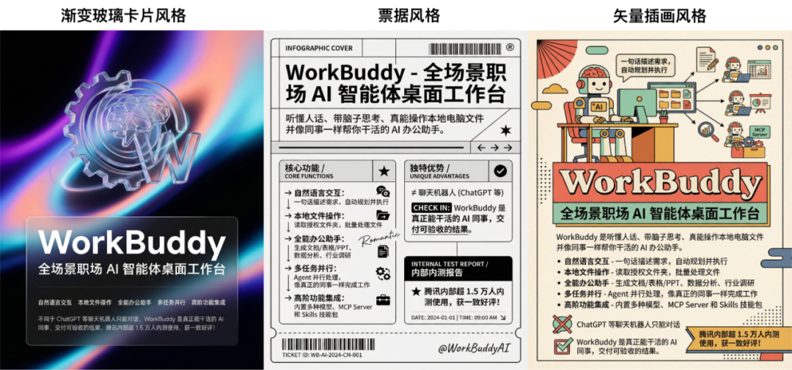

# Hi，你的一号员工 WorkBuddy，今日上岗内测！

> 公众号: 腾讯CodeBuddy
> 发布时间: 2026-02-06 08:02
> 原文链接: https://mp.weixin.qq.com/s/jepj-IFv3UR9LpZlt-h82w

---


**👇 目录**

1. WorkBuddy 是什么
2. WorkBuddy 如何帮助你
3. 写在最后

亲爱的 Buddy，提前 ㊗️大家马年快乐！

新年伊始，向大家正式介绍我们打磨已久的新伙伴：WorkBuddy，一个能真正坐在你电脑里干活的 AI 智能体。1月19日我们已在腾讯内部开放体验，服务超过2,000名员工，即日起，我们正式开放内测申请。诚邀你成为首批用户，一起玩转未来工作新方式👇

内测申请入口：

https://www.codebuddy.cn/work

WorkBuddy 介绍示例视频

已关注Follow  Replay    Share     Like  Close**观看更多**更多


退出全屏切换到竖屏全屏退出全屏腾讯CodeBuddy已关注Share Video，时长01:16

0/0

00:00/01:16 切换到横屏模式 继续播放进度条，百分之0[Play](javascript:;)00:00/01:1601:16[倍速](javascript:;)全屏 倍速播放中 [0.5倍](javascript:;)  [0.75倍](javascript:;)  [1.0倍](javascript:;)  [1.5倍](javascript:;)  [2.0倍](javascript:;)  [超清](javascript:;)  [流畅](javascript:;)  Your browser does not support video tags

继续观看

Hi，你的一号员工 WorkBuddy，今日上岗内测！

观看更多转载,Hi，你的一号员工 WorkBuddy，今日上岗内测！腾讯CodeBuddy已关注Share点赞WowAdded to Top Stories[Enter comment](javascript:;)  [Video Details](javascript:;)


# 01


**WorkBuddy 是什么**

**1. 产品介绍**

- **定位**：全场景职场 AI 智能体桌面工作台，适用于全角色，尤其面向技术小白职场群体的桌面办公应用。
- **交互方式**：能听懂自然语言，支持一句话下达任务，可在本地电脑自主规划并执行多模态复杂任务。
- **核心操作能力**：通过读取电脑上的**经授权文件夹**，实现多类自主操作，包括：自动批量处理文件、生成文档/表格/PPT、多模态内容创作、数据深度分析、行业调研、多任务 Agent 并行处理等。
- **高阶内置功能**：内置多种模型切换和主流 MCP Server、Skills 技能包、高危指令拦截等高阶功能。
- **核心价值**：像真正的同事一样帮用户完成工作、交付结果，辅助职场人高效办公。

**2. 与其他产品的区别**

- **核心差异**：不同于 ChatGPT 等聊天机器人仅能“**对话**”，WorkBuddy 核心优势在于“**听懂人话**”、“**带脑子思考**”、“**真能操作本地电脑文件**”，是能像同事一样“干活”的 AI 同事。
- **操作模式**：用户只需一句话描述需求，无需额外操作，即可自动完成工作并交付可验收的结果。
- **任务处理能力**：可承担复杂的多步骤任务，并代表用户执行这些任务，而非仅提供对话建议。

**3. WorkBuddy 解决的问题**

- **核心目标**：辅助职场人办公场景 AI 提效，重点服务非技术背景职场群体。
- **行业痛点**（以腾讯为例）：非技术背景用户被挡在门外，存在明显的办公提效需求。
- **用户具体困境**：不懂编程语言、IDE 开发环境及计算机专业知识；AI 编程工具技术门槛高、学习成本大、认知负担重、工具易用性不足，导致望而却步。
- **产品诞生背景**：基于非技术背景职场群体强烈的办公提效需求，解决其 AI 工具使用门槛过高的问题。

**4. 腾讯内部使用情况**

WorkBuddy 1月19 日在腾讯内部启动体验测试，已经成为了超过 2,000 员工的 AI 工作台。帮助 HR、行政、秘书、运营、销售等角色在数据处理与分析、构建本地知识库、内容文案创作、海报生成、自动化办公等场景实现 AI 提效。


# 02


**WorkBuddy 如何帮助你**

在日常办公职场场景中，很多繁琐且复杂的事情影响工作效率，我们希望通过  WorkBuddy 来减轻负担，以下为常见场景中和 Prompt 希望对你有所帮助。

**场景  1：一句话实现深度研究并本地生成精美 PPT**

"明天有个汇报，今晚必须交最终稿 PPT..." 这个场景是不是很熟悉？传统方式是领域调研，生成研究报告，研究报告转 PPT 脚本，到最终到处找素材生成最终 PPT。

即便有 AI 辅助，这些流程依旧需要人工干预，但，WorkBuddy 帮你打通所有流程，只需要一句提示词就可以收获精美而不失内容深度的 PPT，彻底告别绞尽脑汁、通宵达旦。

除了 PPT ，WorkBuddy 也可以帮你生成 Docx/XLSX/PDF/MD  等常见办公文件，当你的办公好帮手。

可通过以下 Prompt 实现


```javascript
帮我调研一下 2026 年 AI Agent 趋势和重塑商业格局的转变，并且最终生成一个 ppt，使用 document-illustrator skill 直接通过图片描述生成每一页的 ppt，然后汇总图片封装成 ppt，使用渐变玻璃卡片风格。注意字体的美观大气和内容的高质量。先加载 skill 查看这个 skill 如何使用
注意 ppt 正文部分要有详细的必要内容，然后最终我希望是一个完整的 ppt，不仅仅要有正文，也要有标题和结尾之类的。
```


外部信息深度研究并本地生成精美 PPT 示例视频

已关注Follow  Replay    Share     Like  Close**观看更多**更多


退出全屏切换到竖屏全屏退出全屏腾讯CodeBuddy已关注Share Video，时长00:48

0/0

00:00/00:48 切换到横屏模式 继续播放进度条，百分之0[Play](javascript:;)00:00/00:4800:48[倍速](javascript:;)全屏 倍速播放中 [0.5倍](javascript:;)  [0.75倍](javascript:;)  [1.0倍](javascript:;)  [1.5倍](javascript:;)  [2.0倍](javascript:;)  [超清](javascript:;)  [流畅](javascript:;)  Your browser does not support video tags

继续观看

Hi，你的一号员工 WorkBuddy，今日上岗内测！

观看更多转载,Hi，你的一号员工 WorkBuddy，今日上岗内测！腾讯CodeBuddy已关注Share点赞WowAdded to Top Stories[Enter comment](javascript:;)  [Video Details](javascript:;)

**场景 2：********通过扩展自定义 Skills 技能包生成宣传海报**********

设计资源紧张，临时要做海报却找不到设计师？WorkBuddy 可通过自定义 Skill 技能，让你用一句话就可以生成精美的宣传海报——从活动预告到产品推广，再也不用排队等设计。

可通过如下 Prompt 生成：


```javascript
使用 document illustrator skill 为 WorkBuddy 做一个宣传海报，使用内置的三种风格，每种风格都生成一遍，画幅 3:4，不要使用其他的生图工具
宣传内容如下（内容输入 WorkBuddy 是什么即可）
```


生成介绍 WorkBuddy 的示例海报



生成介绍 WorkBuddy 的示例视频

已关注Follow  Replay    Share     Like  Close**观看更多**更多


退出全屏切换到竖屏全屏退出全屏腾讯CodeBuddy已关注Share Video，时长05:03

0/0

00:00/05:03 切换到横屏模式 继续播放进度条，百分之0[Play](javascript:;)00:00/05:0305:03[倍速](javascript:;)全屏 倍速播放中 [0.5倍](javascript:;)  [0.75倍](javascript:;)  [1.0倍](javascript:;)  [1.5倍](javascript:;)  [2.0倍](javascript:;)  [超清](javascript:;)  [流畅](javascript:;)  Your browser does not support video tags

继续观看

Hi，你的一号员工 WorkBuddy，今日上岗内测！

观看更多转载,Hi，你的一号员工 WorkBuddy，今日上岗内测！腾讯CodeBuddy已关注Share点赞WowAdded to Top Stories[Enter comment](javascript:;)  [Video Details](javascript:;)

**场景 3：**解读外链文章，整理并构建完善的本地知识库****

WorkBuddy 搭配 Obsidian 可以实现个人知识库管理，轻松建立之前记录的笔记之间的双向链接，方便构建知识图谱。

这里以 GitHub 的 Papers We Love 项目（这是一个论文合集，包含上百篇各个领域的经典论文）为例，给 WorkBuddy 发送以下提示词就可以轻松实现文章分类和知识图谱建立。

同样，日后有任何新文章，只需要把链接发给 WorkBuddy，即可自动将文章打上标签，放到对应的目录下，快速实现归档，完善现有的知识图谱，构建个人本地知识库。


```
帮我整理一下 obsidian 仓库里的 Papers We Love 里的论文，按研究领域分类建立目录结构，给每篇论文所在的 readme 生成中文标题、主题标签和简短摘要，然后在 Obsidian 里建立双向链接，方便我构建知识图谱。
```


构建知识库示例视频

已关注Follow  Replay    Share     Like  Close**观看更多**更多


退出全屏切换到竖屏全屏退出全屏腾讯CodeBuddy已关注Share Video，时长01:04

0/0

00:00/01:04 切换到横屏模式 继续播放进度条，百分之0[Play](javascript:;)00:00/01:0401:04[倍速](javascript:;)全屏 倍速播放中 [0.5倍](javascript:;)  [0.75倍](javascript:;)  [1.0倍](javascript:;)  [1.5倍](javascript:;)  [2.0倍](javascript:;)  [超清](javascript:;)  [流畅](javascript:;)  Your browser does not support video tags

继续观看

Hi，你的一号员工 WorkBuddy，今日上岗内测！

观看更多转载,Hi，你的一号员工 WorkBuddy，今日上岗内测！腾讯CodeBuddy已关注Share点赞WowAdded to Top Stories[Enter comment](javascript:;)  [Video Details](javascript:;)

**场景 4：**本地文件及信息智能自动化处理

在日程办公中，我们的桌面经常会堆满临时文件或文件夹，一段时间后就会变成下面视频的封面那样，整理起来耗时，看起来闹心。

但现在，有了 WorkBuddy，即便是拖延症晚期也可以轻松实现一键智能整理。

可参考如下 Prompt 实现：


```
帮我整理下桌面，自行规划合理的分类
```


桌面整理分类示例视频

已关注Follow  Replay    Share     Like  Close**观看更多**更多


退出全屏切换到竖屏全屏退出全屏腾讯CodeBuddy已关注Share Video，时长00:21

0/0

00:00/00:21 切换到横屏模式 继续播放进度条，百分之0[Play](javascript:;)00:00/00:2100:21[倍速](javascript:;)全屏 倍速播放中 [0.5倍](javascript:;)  [0.75倍](javascript:;)  [1.0倍](javascript:;)  [1.5倍](javascript:;)  [2.0倍](javascript:;)  [超清](javascript:;)  [流畅](javascript:;)  Your browser does not support video tags

继续观看

Hi，你的一号员工 WorkBuddy，今日上岗内测！

观看更多转载,Hi，你的一号员工 WorkBuddy，今日上岗内测！腾讯CodeBuddy已关注Share点赞WowAdded to Top Stories[Enter comment](javascript:;)  [Video Details](javascript:;)

**场景 5：快速找出本地电脑垃圾文件，经授权后自动清理**

我们本地电脑硬盘容易爆满，垃圾文件，缓存文件，日志占用空间，小白想清理又不敢下手。免费清理软件广告多，缺乏智能分析，清理不彻底；而付费软件又需要花钱。

现在，使用 WorkBuddy 就可以帮你智能分析本地文件，找到可以放心清理的垃圾文件，经人工授权后可一键清理。

可参考如下 Prompt 实现：


```
帮我清理垃圾文件释放空间
```


清理垃圾效果示例视频

已关注Follow  Replay    Share     Like  Close**观看更多**更多


退出全屏切换到竖屏全屏退出全屏腾讯CodeBuddy已关注Share Video，时长00:35

0/0

00:00/00:35 切换到横屏模式 继续播放进度条，百分之0[Play](javascript:;)00:00/00:3500:35[倍速](javascript:;)全屏 倍速播放中 [0.5倍](javascript:;)  [0.75倍](javascript:;)  [1.0倍](javascript:;)  [1.5倍](javascript:;)  [2.0倍](javascript:;)  [超清](javascript:;)  [流畅](javascript:;)  Your browser does not support video tags

继续观看

Hi，你的一号员工 WorkBuddy，今日上岗内测！

观看更多转载,Hi，你的一号员工 WorkBuddy，今日上岗内测！腾讯CodeBuddy已关注Share点赞WowAdded to Top Stories[Enter comment](javascript:;)  [Video Details](javascript:;)


# 03


**写在最后**

AI 的价值，不再只是陪你聊天，而是替你做事。

从 Chat 到 Agent，从「我可以回答你的问题」到「我可以帮你完成任务」，这是一次跃迁。

想象一下未来的办公场景：你只需要说「帮我整理本周的会议纪要」「生成一份季度报告」「把微信文件按项目归档」，剩下的事 WorkBuddy 全包了。

你负责思考和决策，AI 负责执行和交付，实现真正的生产力解放！

CodeBuddy 已经让程序员效率翻倍，WorkBuddy 要让所有人都拥有这种能力。不需要懂代码，不需要学命令行，只需要会说话。

你的新年工作伙伴 WorkBuddy 已开启内测，未来，我们将基于用户反馈，持续迭代  WorkBuddy 。欢迎你访问下方链接或扫码申请内测 👇

https://www.codebuddy.cn/work


再次感谢各位 Buddy 对 CodeBuddy 的支持，预祝各位职场人马（Mark WorkBuddy）到成功。

**感谢你读到这里，不如关注一下？**👇

👇**扫描下方二维码，加入官方交流群**


往期文章精选

[](https://mp.weixin.qq.com/s?__biz=MzkwMDY4OTI4MA==&mid=2247504077&idx=1&sn=b351a3ff02f7fe2ee4dc1149eb4b67e8&scene=21#wechat_redirect)[](https://mp.weixin.qq.com/s?__biz=MzkwMDY4OTI4MA==&mid=2247504148&idx=1&sn=86be856fb457019ceeac1aa62c8a2a40&scene=21#wechat_redirect)[](https://mp.weixin.qq.com/s?__biz=MzkwMDY4OTI4MA==&mid=2247503983&idx=1&sn=0e92d44d9d992144b5aea50f78cb1fef&scene=21#wechat_redirect)