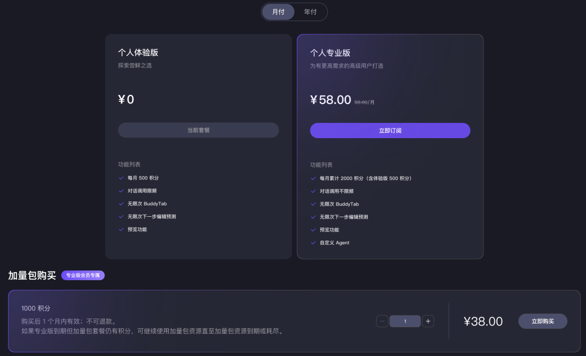

# CodeBuddy 国内个人专业版正式上线！免费额度再升级

> 公众号: 腾讯CodeBuddy
> 发布时间: 2026-02-11 08:06
> 原文链接: https://mp.weixin.qq.com/s/geDGwrKo3kQWdzkPVX7bCg

---

**CodeBuddy 国内个人专业版正式发布！**

无论轻量体验还是深度使用，本次升级为各位 Buddy 提供更灵活的选择

---

**👇 升级要点一览：**

1️⃣ 免费额度加码

所有国内个人体验版免费用户，每月将自动获得 **500 Credits** 基础额度。轻松覆盖日常开发、学习调试等轻量使用场景

2️⃣ 专业版正式上线，能力全面升级

国内个人专业版采用按月/年订阅制，每月 2,000 Credits（含体验版额度），核心权益：

- 无限频对话，适合高频、复杂及高优任务
- 支持自定义 Agent，创建专属 AI 助手
- 用完随时购买加量包，灵活应对全场景需求

国内个人版产品方案及定价如下 ⬇️

📌 重要说明：

- 免费资源刷新时间：

  ▸ 2月10日后注册：每月以注册日为刷新日

  ▸ 2月10日前注册：2月10日起陆续分批刷新，具体日期见用量页面
- 资源消耗顺序：基础体验包 → 最早到期资源包

**🔗 快捷入口：**

- **用量查询**：

  https://www.codebuddy.cn/profile/usage
- 订阅管理：

  https://www.codebuddy.cn/profile/plan

---

🤖 诚邀您体验 CodeBuddy，欢迎反馈使用感受：

https://www.codebuddy.cn/

**感谢你读到这里，不如关注一下？**👇

👇**扫描下方二维码，加入官方交流群**

往期文章精选

