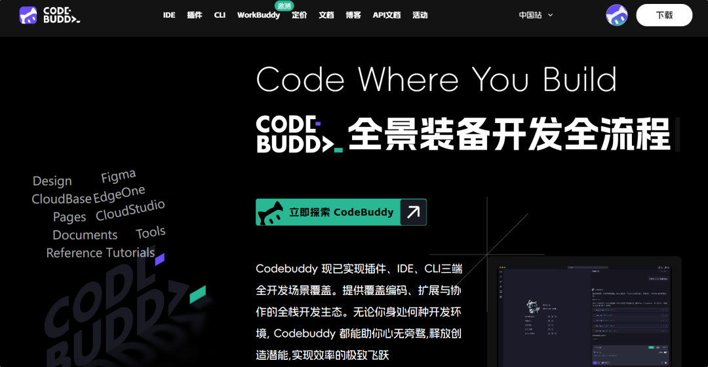
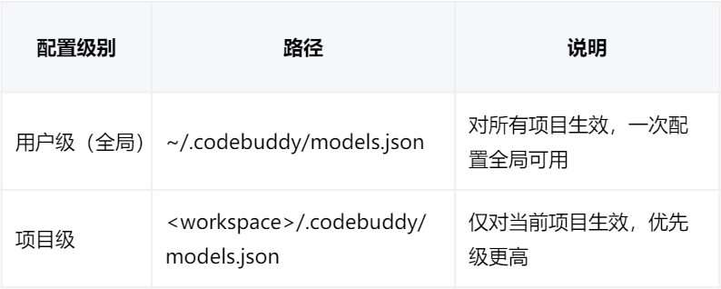
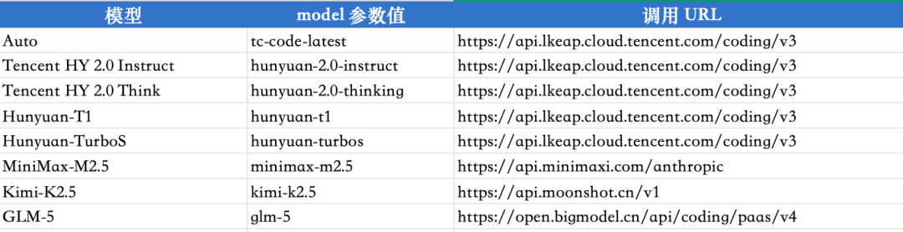
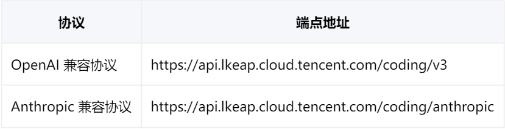
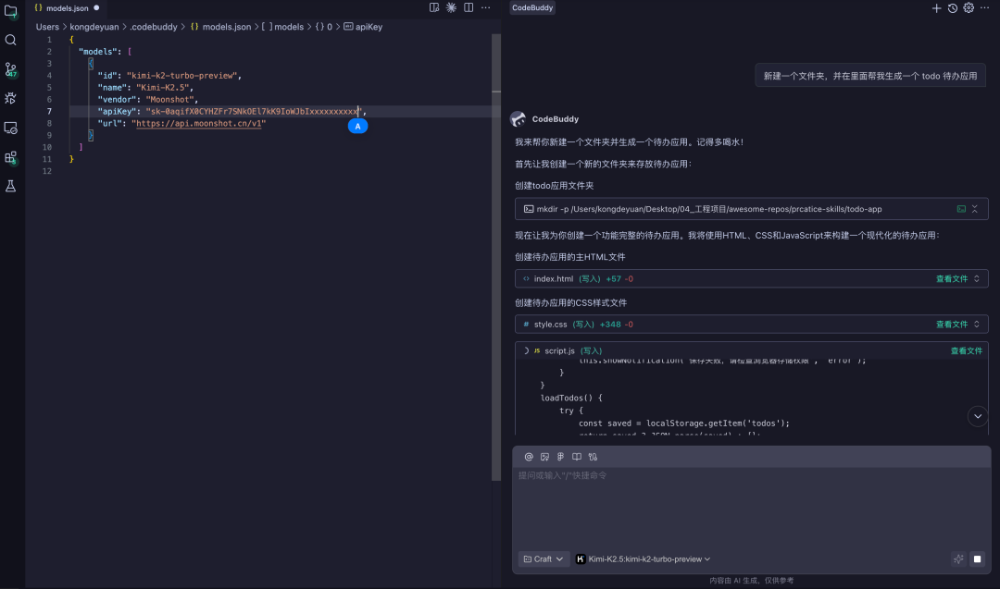

# 告别按 Token 付费焦虑，CodeBuddy 自定义模型一键接入实战指南

> 公众号: 腾讯CodeBuddy
> 发布时间: 2026-03-06 21:36
> 原文链接: https://mp.weixin.qq.com/s/i1KL4QIXQWbFLiQB3mru9A

---


**👇 目录**

1. CodeBuddy 自定义模型能力
2. 腾讯云 Coding Plan
3. 更多厂商 Coding Plan 快速接入
4. 总结

国内多家 AI 大模型厂商陆续推出了面向开发者的 Coding Plan（编程订阅套餐），以固定月费替代按 Token 计费，让开发者以极低成本使用强大的大模型进行 AI 编程。

好消息是，这些 Coding Plan 的 API 接口几乎都兼容 OpenAI / Anthropic 格式，这意味着你可以通过 CodeBuddy 的 自定义模型（models.json） 功能，轻松将它们接入 CodeBuddy，享受低价甚至"无限量"的模型调用。

今天，腾讯云 Coding Plan 也来了！下面我们一起看看如何在 CodeBuddy 中无缝接入。


# 01


**CodeBuddy 自定义模型能力**

CodeBuddy 内置了强大的自定义模型接入能力，只需编辑一个 models.json 配置文件，就能把任意兼容 OpenAI / Anthropic 协议的模型接入 CodeBuddy，在对话、编程、Agent 等场景中自由切换使用。

**1. 安装 CodeBuddy IDE**

访问官网，根据你的电脑处理器选择对应版本下载：

1. 国内版（个人版/旗舰版/专享版）：

https://www.codebuddy.cn

2. 国际版：

https://www.codebuddy.ai

3. 文档指引：

https://www.codebuddy.cn/docs/ide/Getting-Started/Installation



**2. models.json 配置说明**

CodeBuddy 通过 models.json 配置文件管理自定义模型，支持两级配置：



💡 如果你只是个人使用，建议直接使用用户级配置，一次配置全局生效。

**3. 配置文件结构**


```json
{
  "models": [
    {
      "id": "model-unique-id",           // 必填，模型唯一标识符
      "name": "Model Display Name",      // 模型显示名称
      "vendor": "vendor-name",           // 模型供应商（如 OpenAI、Tencent-Cloud）
      "apiKey": "sk-your-api-key",       // API 密钥（实际密钥值，非环境变量名）
      "url": "https://api.example.com/v1/chat/completions",  // API 端点 URL
      "maxInputTokens": 200000,          // 最大输入 token 数
      "maxOutputTokens": 8192,           // 最大输出 token 数
      "supportsToolCall": true,          // 是否支持工具调用
      "supportsImages": true,            // 是否支持图片输入
      "supportsReasoning": true          // 是否支持推理模式
    }
  ]
}
```


⚠️ 注意：JSON 中必须使用英文标点，中文逗号 ， 会导致解析失败。


# 02


**腾讯云 Coding Plan**

**为什么推荐腾讯云 Coding Plan？**

腾讯云 Coding Plan 是腾讯云面向 AI 编程场景推出的订阅套餐，具备以下核心优势：

- **智能模型切换**：通过配置 Model Name 灵活切换模型,持续接入更多优质模型，Auto 模型智能匹配:算法自动选择最优模型,通过 model 参数值即可配置
- **模型丰富**：支持腾讯混元系列、GLM-5、Kimi-K2.5、MiniMax-M2.5 等主流模型，一个套餐覆盖多家厂商


- **工具兼容**：兼容 CodeBuddy 等业界主流 AI 编程工具
- **价格实惠**：固定月费，告别按 Token 计费的焦虑，用得越多越划算
- **生态集成**：可与腾讯云服务器、容器服务等深度集成，助力快速构建云原生应用

**申请 API Key**

1. 访问：

https://buy.cloud.tencent.com/hunyuan

2. 登录腾讯云账号（没有请先注册）3. 进入 **API Key 管理** 页面4. 点击 **创建 API Key**，复制并妥善保存

**API 端点地址**

腾讯云 Coding Plan 提供两种协议兼容：



**CodeBuddy 配置示例**

在 ~/.codebuddy/models.json 中添加以下配置：

**方式一：Auto 模式（推荐，自动选择最优模型）**


```json
{
  "models": [
    {
      "id": "tencent-coding-auto",
      "name": "腾讯云 Coding Plan (Auto)",
      "vendor": "Tencent-Cloud",
      "apiKey": "替换为你的 API Key",
      "url": "https://api.lkeap.cloud.tencent.com/coding/v3"
    }
  ]
}
```


**方式二：指定混元 Turbo 模型**


```json
{
  "models": [
    {
      "id": "hunyuan-turbo",
      "name": "腾讯混元 Turbo",
      "vendor": "Tencent-Cloud",
      "apiKey": "替换为你的 API Key",
      "url": "https://api.lkeap.cloud.tencent.com/coding/v3"
    }
  ]
}
```


**验证效果**

配置保存后，重启 CodeBuddy（或等待配置热重载），在模型选择下拉列表中即可看到带有 **custom**标签的自定义模型。

📖 更多详情请查看官方文档：

https://cloud.tencent.com/document/product/1772/128947


# 03


**更多厂商 Coding Plan 快速接入**

CodeBuddy 的自定义模型能力不止于腾讯云，以下厂商的 Coding Plan 同样可以一键接入。

**月之暗面 Kimi**

Kimi-K2.5 是月之暗面推出的高性能模型，兼容 OpenAI 协议，可直接接入 CodeBuddy。

效果图



**MiniMax（稀宇科技）**

稀宇科技 Coding Plan 搭载 MiniMax 旗舰 M2.5 系列模型，提供代码生成、调试、重构、Code Review 等全流程能力，支持 OpenAI / Anthropic 双格式 API。

📖 **文档指引**：

https://platform.minimaxi.com/docs/coding-plan/intro

**智谱 GLM**

智谱 AI 的 GLM Coding Plan 由 GLM-5 / GLM-4.7 / GLM-4.6 旗舰模型驱动，覆盖代码生成、理解、调试、重构等全流程场景，具备 Agentic Coding 和多模态 MCP 能力。

📖**文档指引**：

https://docs.bigmodel.cn/cn/coding-plan/overview

💡 小提示：腾讯云 Coding Plan 本身已包含 GLM-5、Kimi-K2.5、MiniMax-M2.5 等模型，如果你不想分别管理多个厂商的 API Key，直接用腾讯云 Coding Plan 即可一站式搞定。


# 04


**总结**

CodeBuddy 不仅深度支持腾讯云 Coding Plan，还全面兼容 MiniMax、智谱 GLM、Kimi 等主流厂商的 Coding Plan 服务。

你只需：

- **编辑** ~/.codebuddy/models.json，填入厂商的接口地址和 API Key
- **重启** CodeBuddy，在模型下拉列表中选择对应模型
- **开始编程**，根据不同场景自由切换，真正实现 “**一个工具，多个大脑**”

如需了解更多配置细节，可参考官方文档 👇

- CodeBuddy 自定义模型配置指南：

  https://copilot.tencent.com/docs/cli/models
- 腾讯云 Coding Plan

  https://cloud.tencent.com/document/product/1772/128947

**感谢你读到这里，不如关注一下？**👇

👇**扫描下方二维码，加入官方交流群**


往期文章精选

[](https://mp.weixin.qq.com/s?__biz=MzkwMDY4OTI4MA==&mid=2247504744&idx=1&sn=6d1ff9d07615b6df1ae89f740787be87&scene=21#wechat_redirect)[](https://mp.weixin.qq.com/s?__biz=MzkwMDY4OTI4MA==&mid=2247504790&idx=1&sn=5c9c7f9419ed9ad6e9a31eef55594fb3&scene=21#wechat_redirect)[](https://mp.weixin.qq.com/s?__biz=MzkwMDY4OTI4MA==&mid=2247504740&idx=1&sn=f80d4ef9d27dc57dd444192da585f538&scene=21#wechat_redirect)