# 腾讯自研虾再进化！一键微信直连、自动化定时任务，养虾门槛又降！

> 公众号: 腾讯CodeBuddy
> 发布时间: 2026-03-12 01:07
> 原文链接: https://mp.weixin.qq.com/s/Z-FWZkcbiCzSnll9s4cLmQ

---

**👇 目录**

1. 一键连接微信，有手就能远程遥控指挥
2. 企业微信支持长链接，远程连接更稳定
3. 自动化任务执行和监控追踪，让小龙虾自动化产出

Hi，各位 Buddy 大家好！WorkBuddy 自发布以来深受欢迎，先对各位 Buddy 表示最诚挚的感谢，感谢大家的支持！

今天，🦞腾讯版小龙虾WorkBuddy 迎来重磅更新！👏欢迎大家下载更新体验：

https://www.codebuddy.cn/work/

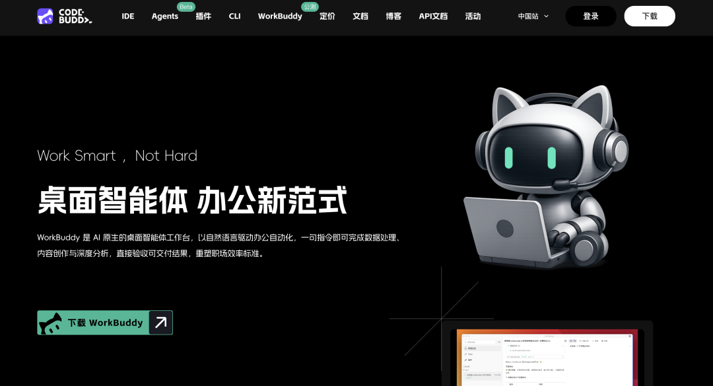

此次更新给大家带来更加友好的体验，支持在微信中一键直连小龙虾 WorkBuddy、新增企业微信长链接接入方式和优化 QQ、飞书等 IM 链接稳定性，方便虾大大们指挥小龙虾，发挥最大的双钳子力量，还支持自动化能力，让用户 “养虾” 变得前所未有的轻松。

无论你是通勤路上微信发消息遥控指挥电脑，还是定时跑报表、自动化抓竞品数据，WorkBuddy 都能像你的“ AI 员工”一样，自动规划、执行、自我反思进化与交付可验收结果！

# 01

**一键连接微信，有手就能远程遥控指挥**

相比 OpenClaw 等市场复杂安装部署和 IM 配置，WorkBuddy 让个人用户能轻松养虾！

在最新版本中，你可以在右上角打开 Claw 设置 → 微信客服号集成 → 手机扫码 → 三步完成，微信里多出一个你的专属“龙虾” 。如下为操作步骤，详见：https://www.codebuddy.cn/docs/workbuddy/Wechat-Guide

**第1步：右上角点击 Claw 设置**

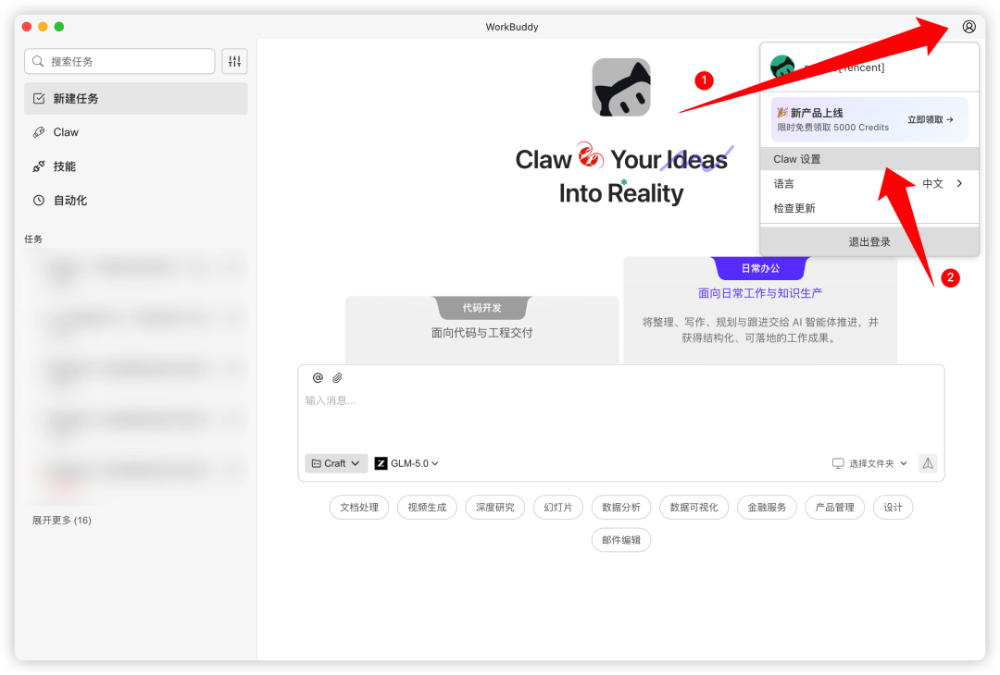

**第 2步：点击配置微信客服号**

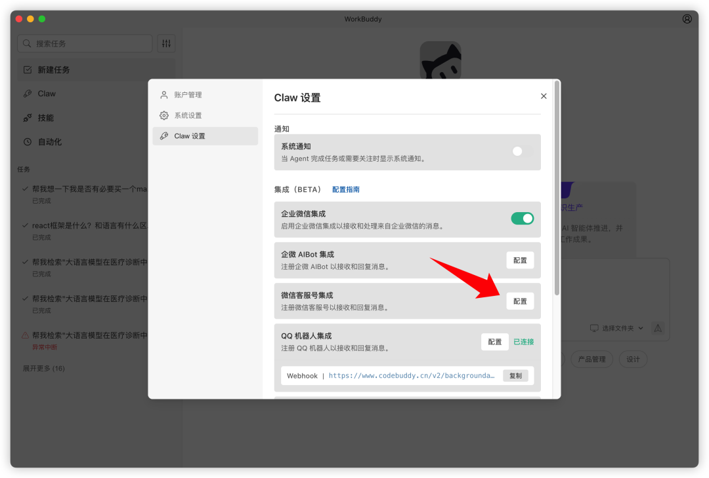

**第3步：进行微信扫码与微信实现一键直链**

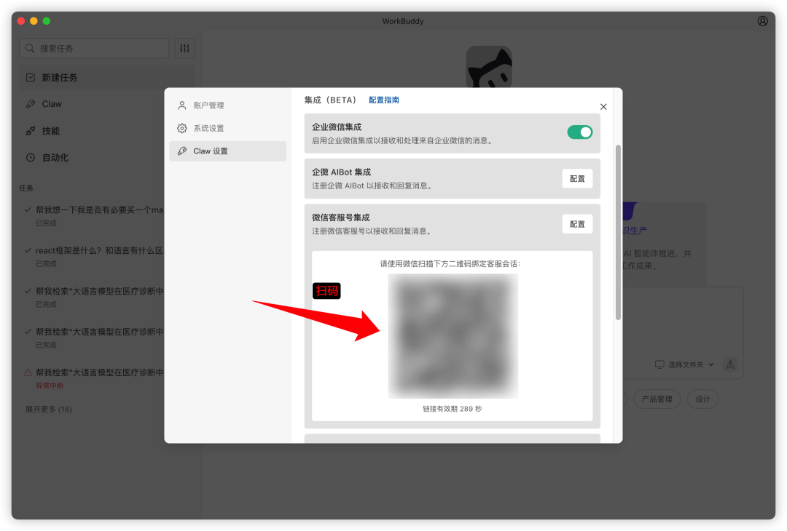

**第 4 步：随时随地远程遥控指挥你的小龙虾🦞**

随时随地发送几条文字，办公电脑上的 WorkBuddy 立刻执行，查资料，做调研、写文案、处理文件，全程本地操作，隐私安全无忧，只要你的电脑不关机，7 x 24 小时稳定运行。

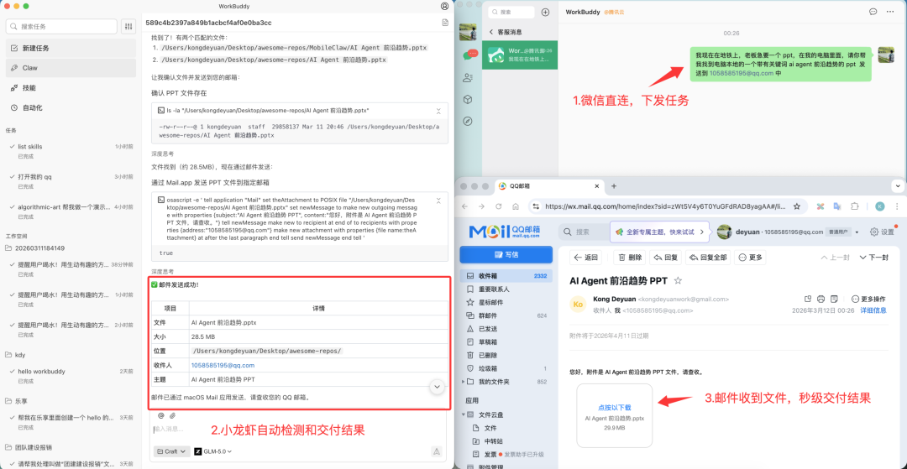

# 02

**企业微信支持长链接，远程连接更稳定**

原有 1 分钟极速配置基础上，我们优化底层协议等相关措施，支持WebSocket 长链接接入企业微信，让连接更稳、断连自动重连。如下为配置步骤，详见：
https://www.codebuddy.cn/docs/workbuddy/Wecom-Guide

**第一步**：进入企业微信工作台，新建机器人，选择使用长链接

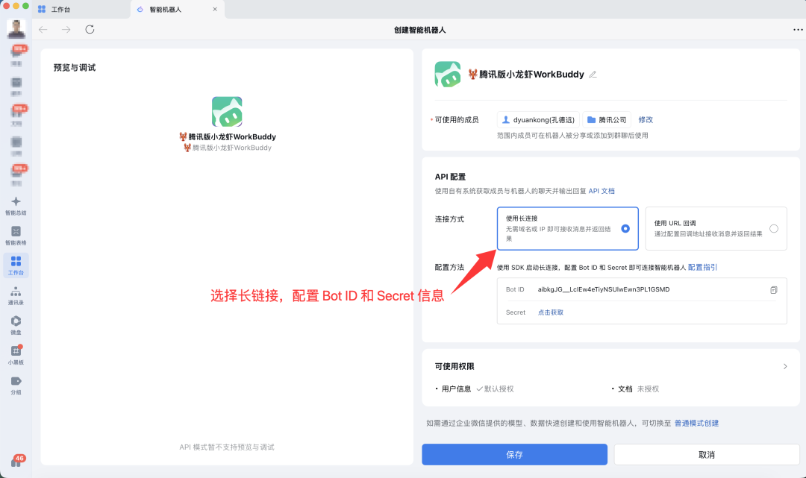

**第二步**：复制上述的Bot ID 和Secret 进行粘贴如下 WorkBuddy Claw 中

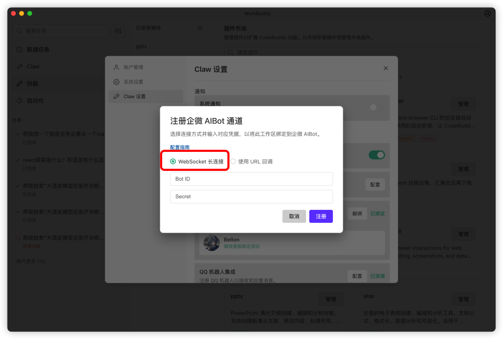

**第三步**：进行企业微信中对话

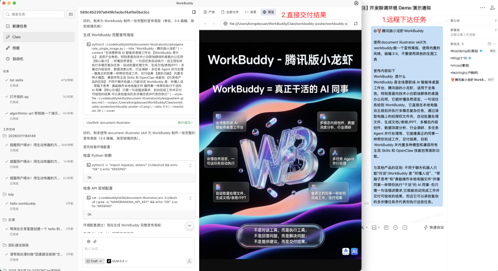

# 03

**自动化任务执行和监控追踪，让小龙虾自动化产出**

WorkBuddy 正式支持后台自动化任务，每天自动生成日报、周报，抓取竞品信息、整理会议纪要、监控数据变化……设置一次，永不操心。如下操作配置：

**第 1 步：点击自动化，添加自动化任务，让小龙虾自动化产出**

填写任务名称，规划自动化任务运行的工作空间用来储存龙虾工作产出，提示词则告诉你的龙虾做什么，即可收获一个主动帮你干活的龙虾了！

下面以周报为例：

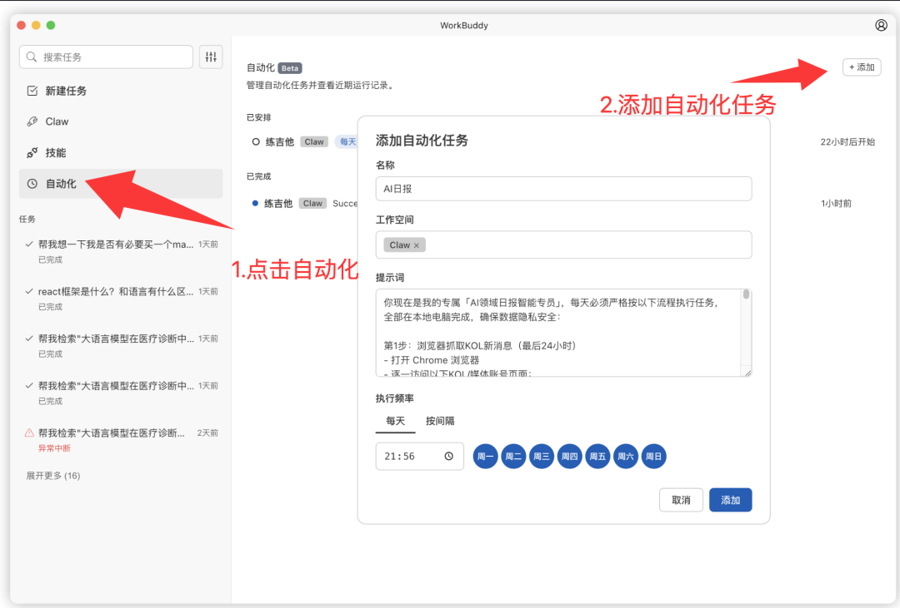

**第 2 步：定时任务进展记录与跟踪**

小龙虾自动执行任务执行中

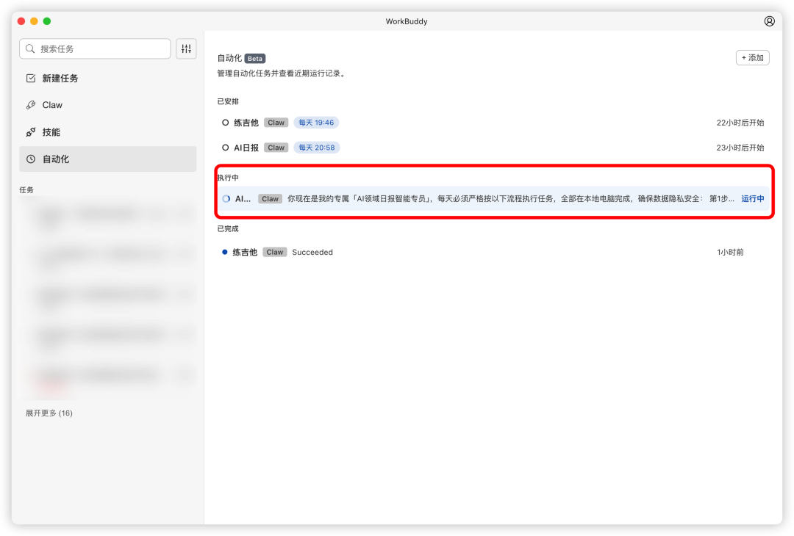

小龙虾执行明细

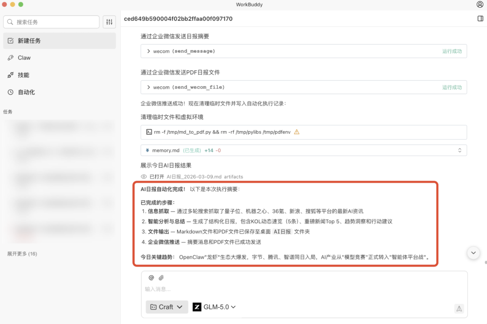

**第 3 步：小龙虾产出交付物：PDF，也可以是你想要的结果，取决于你的任务。**

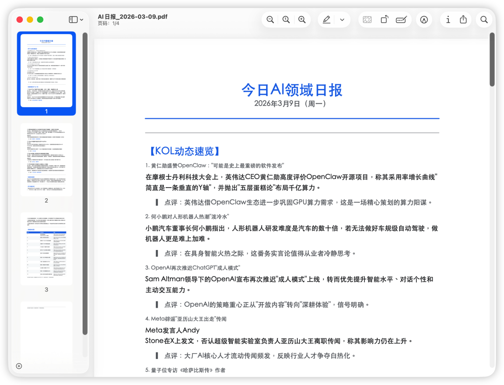

不管你是个人创作者还是企业团队，不要再花冤枉钱，买服务器和模型 API ，现在下载WorkBuddy 就能秒变“养虾人”，让 AI 真正帮你干活, WorkBuddy，让每一位国人都拥有一个专属的小龙虾!

欢迎大家体验腾讯版小龙虾 WorkBuddy🦞，👉 立即免费体验:

https://www.codebuddy.cn/work/

**感谢你读到这里，不如关注一下？**👇

👇扫描下方二维码，加入 WorkBuddy 官方交流群

往期文章精选

