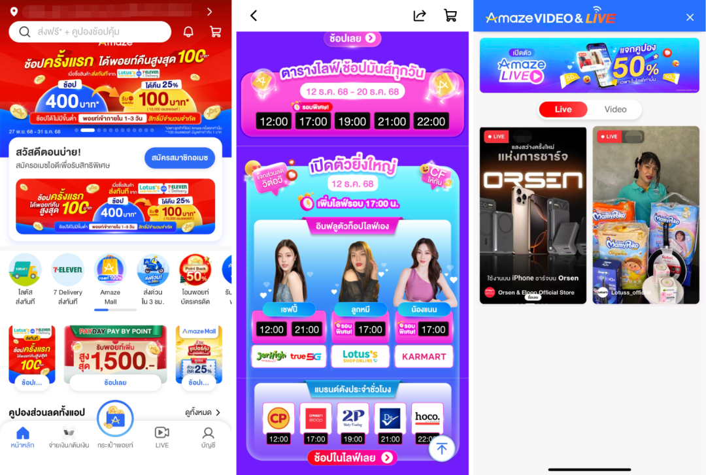
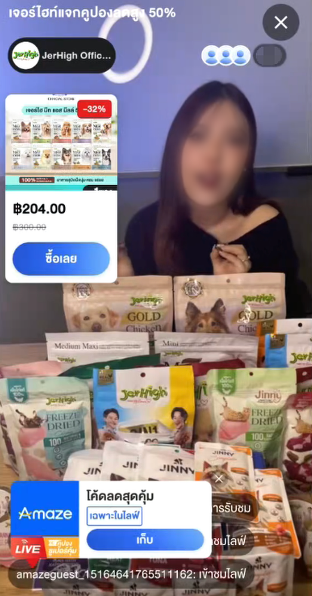

# 正大集团 X 腾讯云：「中式直播」登陆泰国

> 公众号: 腾讯云
> 发布时间: 2026-02-25 16:03
> 原文链接: https://mp.weixin.qq.com/s/zr9xeqIngXJSI5zvr_XExw

---

去年，我们和正大集团完成了一场[跨国「牵手」。](https://mp.weixin.qq.com/s?__biz=MjM5MDgwMzc4MA==&mid=2654900960&idx=1&sn=74370313a4e3cc0ab0d09f85077f7463&scene=21#wechat_redirect)

前不久，这位老朋友又和我们一起搞了个“大动作”。

在结束不久的泰国“双十二”电商大战中，正大集团旗下的超级应用Amaze，基于腾讯云音视频技术，成功完成了“黑五”电商直播首秀！

从“货架电商”到“直播电商”，Amaze的这一步跨越，也标志着腾讯云音视频的一站式电商直播解决方案，再次在海外本地化超大客户场景中得到验证。

// 既然要做，就找“最懂行”的

Amaze是谁？

作为正大集团旗下的王牌应用之一，Amaze已经坐拥 600万+用户，是打通集团庞大会员与积分生态的关键承载。

为了在这个“万物皆可直播”的时代抓住增长密码，Amaze决定引入直播带货。

但在东南亚跨地区、复杂的网络环境下，要支撑大规模并发的稳定性，还要兼顾画质和成本，这不仅是技术活，更是经验活。

很荣幸，他们选择了腾讯云！

理由也很简单：在中国，我们已服务超90%的本土+出海电商直播客户；在亚太，我们的OTT行业覆盖率超70%。

做直播电商，我们是当之无愧的“老司机”。

// 一站式方案：快、稳，还能省

对Amaze而言，如何快速上线并支撑规模化发展是核心诉求。

围绕快速上线、稳定运行、可持续扩展的目标，Amaze选择接入腾讯云音视频一站式电商直播解决方案。

Amaze在线直播间

第一，画质稳。在直播分发侧，Amaze基于腾讯云云直播（CSS）的全球加速网络进行部署。依托腾讯云在全球的3200+加速节点和400Tbps+带宽储备，系统可实现就近接入与低延时传输。

也就是说，无论用户身处曼谷繁华商圈还是偏远郊区，直播画面和观看体验都能得到很好保障。

第二，成本省。直播电商，带宽成本是大头。腾讯云独家的极速高清技术（Top Speed Codec），基于AI感知编码机制，能智能识别画面中的“人眼关注区域”并精细化处理，在保证观感质量的同时，有效降低整体码率消耗。

实测数据显示，在直播场景下可实现50%以上的视频码率压缩。简单说，就是在画质不变甚至更好的前提下，能够帮客户省下大笔带宽费。

第三，体验好。一般来说，“321上链接”瞬间爆发的弹幕、礼物和抢券请求，极易冲垮传统的通信架构。腾讯云即时通信（IM）为直播间提供了企业级的通信底座——

高并发支撑：支持单直播间千万级用户同时在线，架构动态扩容；弱网优化：在复杂的移动网络下，消息送达率依然保持在99.99%以上。

另外，从AI画质修复、智能字幕互译，到7×24小时的数字人主播，我们还提供各种AI能力，能够帮客户进一步升级直播体验，把直播做成引人入胜的“黑科技”秀场。

“这是我见过的最好的直播体验！”不仅是泰国的电商巨头，这种超棒的直播体验，前不久还在新加坡收获了实名点赞👇🏻

// 不止输出技术，更输出“中国玩法”

这次合作，不仅仅是底层的硬连接，更是玩法的软输出。

我们把国内最成熟、最带感的“中国式直播玩法”成功带到了泰国。从实时投票、弹幕礼物、带货抽奖，到分享助力、主播PK……这些在国内已经验证过的流量密码，现在正帮助Amaze快速拉升用户粘性。

腾讯云不仅提供技术底座，更提供全程陪伴式的运营支持。

目前，Amaze正计划引入海量本地达人，覆盖零售、生活方式等领域。

未来，用户在看直播“剁手”的同时，还能顺滑地消耗积分。这才是更懂本地生意的“云”。

// 结语

此次与正大集团Amaze的合作落地，是腾讯云音视频能力在海外本地化大客户场景中的又一里程碑。

过去一年，腾讯云国际业务持续保持双位数高速增长，服务覆盖全球80+国家和地区。

感谢认可！接下来，我们将继续以技术为核，做好最懂客户、最懂生意的云服务伙伴，助力更多海外客户构建“新范式”的电商生态。

