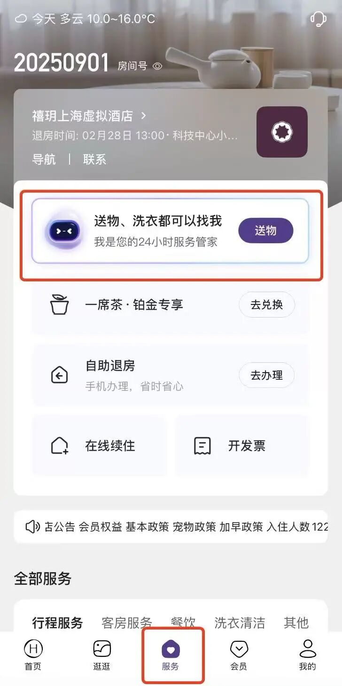
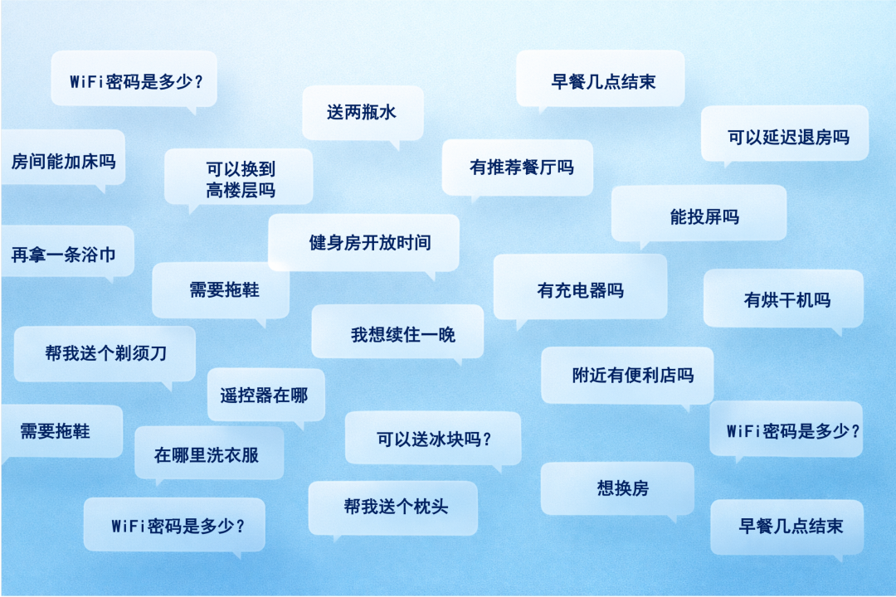
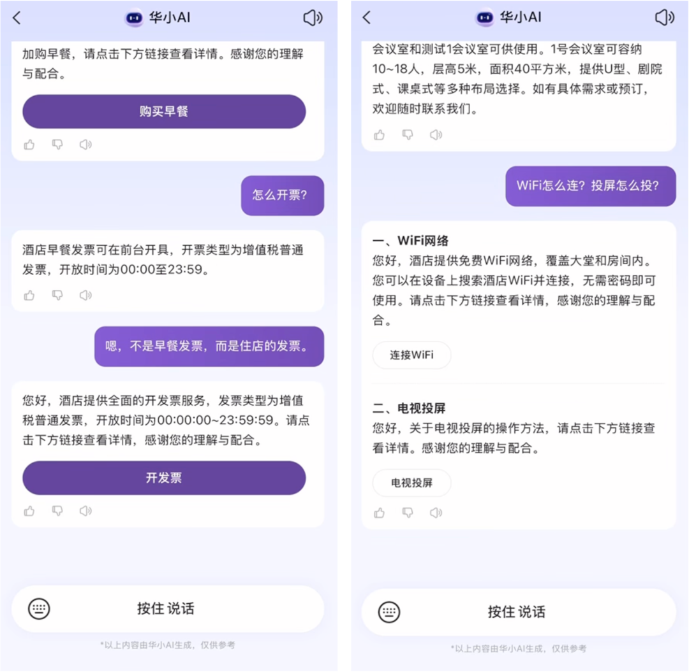
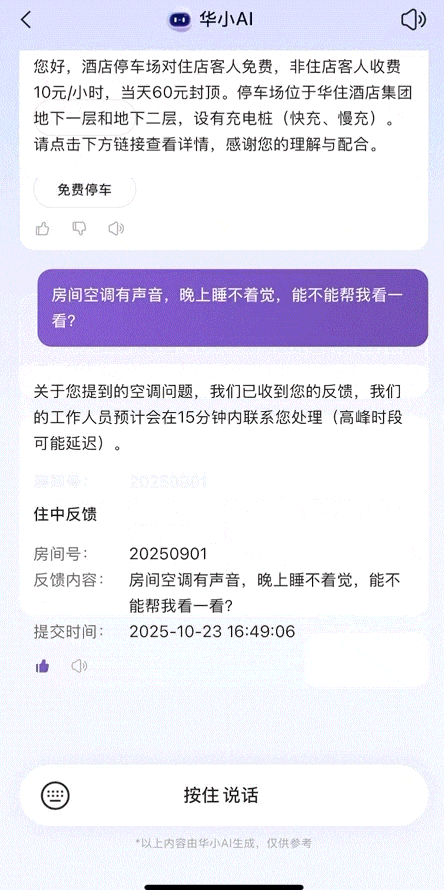
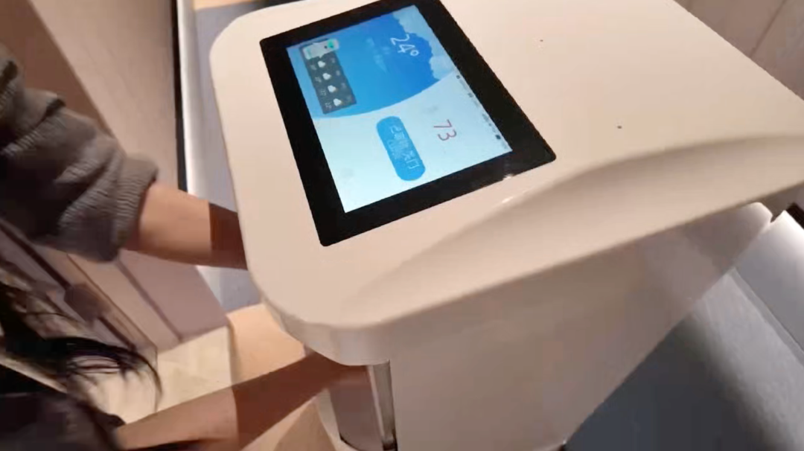

# 华住携手腾讯打造酒店服务Agent，已落地3200多家门店

> 公众号: 腾讯云
> 发布时间: 2026-03-02 11:38
> 原文链接: https://mp.weixin.qq.com/s/TzJ6VsPYOVKJWclzHF7rYQ

---

#

报告好消息!

腾讯和华住探索Agent在酒店服务中的落地，有了阶段性成果。

半年时间，双方联合打造的酒店智能体管家——「华小AI」，已在华住旗下3200多家门店上线运行，覆盖客需送物、酒店信息、服务设施、酒店周边查询、续住开票等多个住中服务场景。

（在华住会APP/小程序-服务中即可体验「华小AI」）

从今以后，（包括不限于）这些问题，请交给「华小AI」!

//自动处理70%高频问题，5秒响应

围绕最复杂、也最考验服务能力的“住中服务”场景，双方基于腾讯云智能体开发平台（腾讯云ADP），构建了 38 条工作流。

系统可在 5 秒内完成住客问题理解与响应，自动生成工单，并联动酒店硬件系统调度机器人完成配送，直接把事情办完。

目前，“华小AI”可自动处理 70% 以上高频问询，问答准确率超过 95%。

已开通门店使用率达 100%，部分门店住客单日使用率最高达到 94%。

//从“问”到“办”， 真24小时在线服务

与传统基于关键词匹配的客服系统不同，升级后的「华小AI」具备极强的理解与执行能力，高效解决下面这些住店宾客的常见问题。

-高频问题咨询，一问即得

WiFi 密码、早餐时间、洗衣房在哪层、健身房几点开放……

这些原本高度依赖人工重复回答的问题，现在由智能体统一承接。

系统可根据不同意图，自动调用对应业务信息进行整合回复，让住客在一个入口就能解决大多数基础问题。

-多个问题并行，也不“卡壳”

真实入住场景中，住客的问题往往不是“一个接一个”，而是随时变化。

依托腾讯优图实验室自研的意图识别模型，系统可精准拆解用户的复杂意图。

在对话过程中即便临时切换需求，智能体也能及时捕捉并调整处理逻辑，避免传统系统“一事一结”、频繁中断的体验。

-自动生成工单

当需求从“咨询”升级为“执行”，系统会自动进入下一步。

在客需送物、续住、服务请求等场景下，智能体可在对话中补齐关键信息，并自动生成工单，减少人工中转，让服务流程更顺、更快。

-工单生成后，直接联动硬件执行

华小AI直连 IoT，送物流程全自动完成。依托系统协同与模型能力，自动识别酒店与房间，核对清单并下发指令，全程无需人工介入，大幅解放一线人力。

自动调度机器人完成物资配送，把“指令”真正转化为“动作”。

目前，这个联合探索已进入规模化推进阶段，很快将实现万店覆盖。

敬请期待，欢迎光临。

