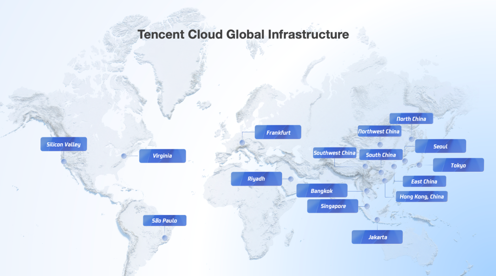

# 腾讯云法兰克福数据中心+1，混元3D加速出海

> 公众号: 腾讯云
> 发布时间: 2026-03-03 09:31
> 原文链接: https://mp.weixin.qq.com/s/hUUB6qnIP_OZMw8FxqBr_A

---

世界移动通信大会（MWC 2026）传来好消息！

腾讯云正式宣布：将在德国法兰克福新增1个云可用区。

新区将于今年2季度正式上线服务，届时腾讯云在德国的可用区数量增至3个，为欧洲客户提供合规稳定、高质量的云和AI服务。

法兰克福+1的背后，腾讯云正在持续加码全球基础设施布局。

过去三年，腾讯云海外开区速度在中国云厂商排在最前列，国际业务连续保持双位数增长，海外客户规模在2025年同比翻番。

在欧洲，各行各业的头部企业正在腾讯云上加速创新👇

//数字创作

自去年11月面向海外开放以来，腾讯混元3D已进入欧洲创意产业。德国软件公司 Maxon 已在其 Cinema 4D（C4D）桌面应用中集成混元3D API，用于建模环节。

（来源：网友@inevestenko）

混元3D支持文本、图片、草图等多种输入方式，几分钟即可生成3D模型，生成式能力正在嵌入创意生产流程。

//金融科技

腾讯云为土耳其金融科技公司 iyzico 在欧洲构建首个云业务平台。基于高可用、合规架构，该平台支撑其虚拟支付解决方案在欧盟范围内拓展，目前稳定承载超过 18.5 万家商户的交易处理。

//制造企业

去年7月，[美的集团](https://mp.weixin.qq.com/s?__biz=MjM5MDgwMzc4MA==&mid=2654903839&idx=1&sn=8c597108f95ead8f682c1325cd5d4535&scene=21#wechat_redirect)将其欧洲 IT 业务迁移至腾讯云法兰克福数据中心，近 50 个独立业务系统统一纳入云原生架构，并完成容器化改造。迁移后实现成本优化，系统稳定性与扩展能力同步提升。

...

面向全球，拥抱智能，腾讯云全力加速!

