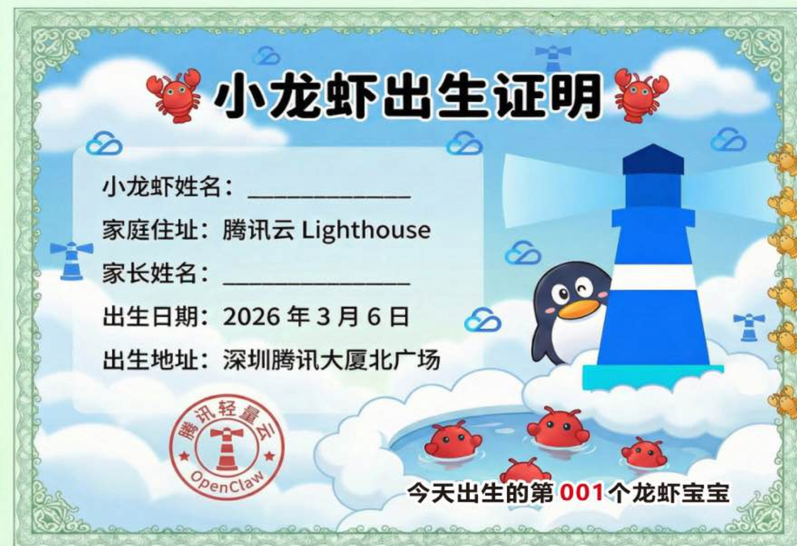
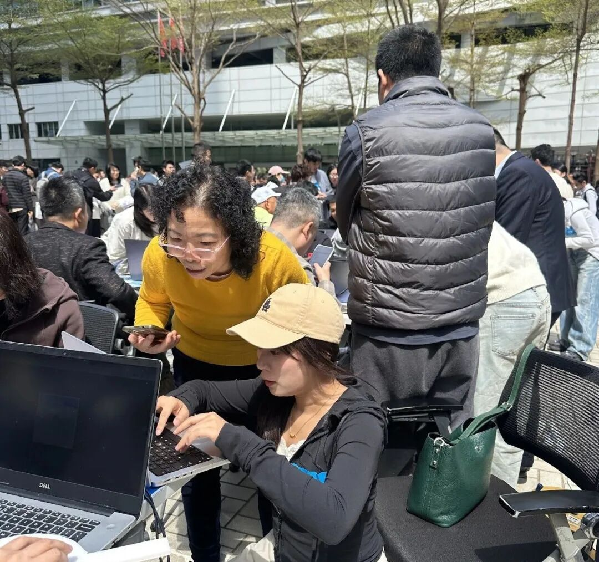
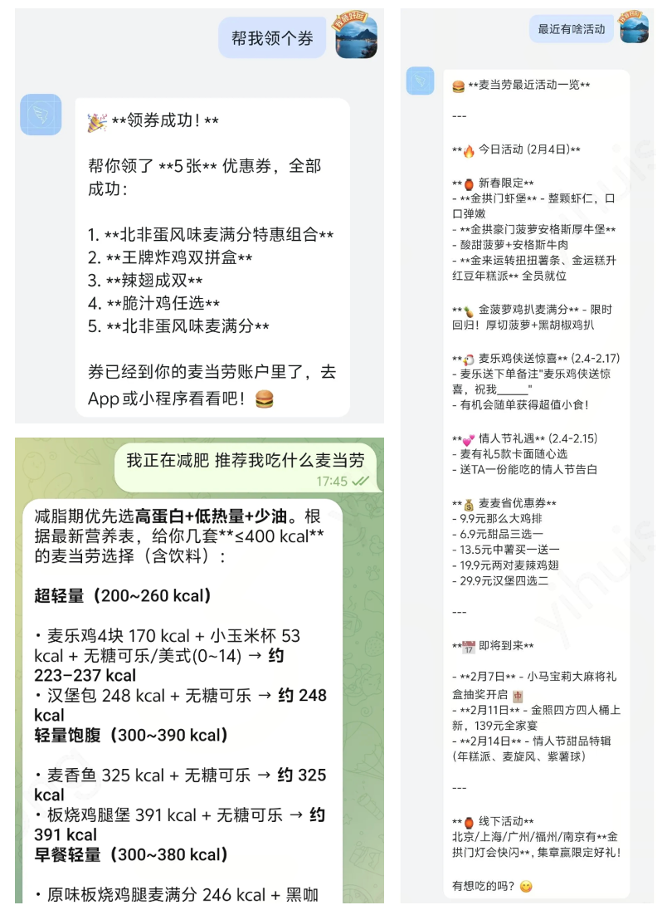
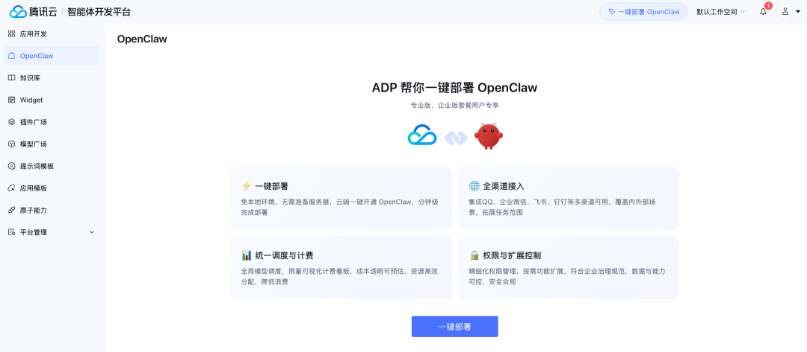
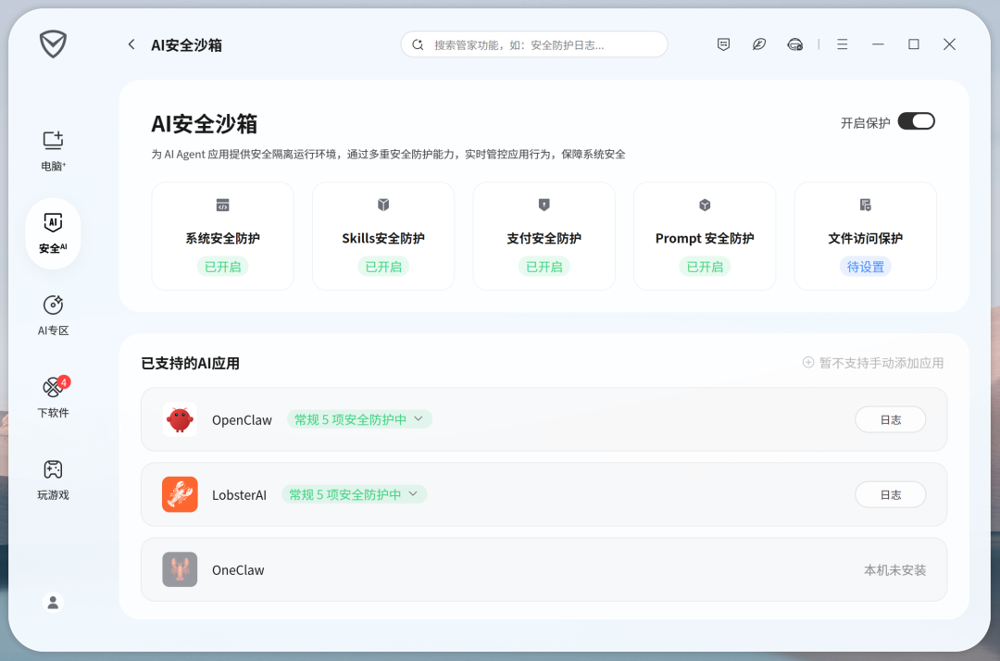

# 今天，腾讯免费安装OpenClaw

> 公众号: 腾讯云
> 发布时间: 2026-03-06 12:31
> 原文链接: https://mp.weixin.qq.com/s/JQnf6hlQpHTTpXNepnSNVQ

---

不要998，不要448。

今天，鹅厂门口现场免费安装OpenClaw。

（鹅厂人表示：上一次这么大阵仗还是排队领开工利是）

来自腾讯云Lighthouse的工程师，为用户提供一站式的OpenClaw从“装”到“玩”服务：安装部署、模型配置、IM渠道打通，还能解锁热门的skills技能。

短短几个小时，几百只OpenClaw 被装进腾讯云服务器。

现场装机队伍年龄跨度大，从2岁-60岁不等。比如，女儿上班没时间，帮女儿来养虾的父母。

作为 OpenClaw在国内首个提供应用模板的云平台，腾讯云轻量应用服务器 Lighthouse 已成为不少开发者部署 Agent 的首选入口，Lighthouse单日部署规模已突破产品发布以来的最高峰值。

它虽然“形”是一个对话框，但有无限的想象空间。lighthouse的老🦐经常会说，不要问它能做什么，而是看你想做什么。

比如，让Openclaw变成你在企业微信的专属“营养师”。

没去现场怎么办？扫码进群，Lighthouse工程师随时营业，包教包会。

[线上部署](https://mp.weixin.qq.com/s?__biz=MjM5MDgwMzc4MA==&mid=2654906307&idx=1&sn=ff17de9cf21abbe25f11c27811ca80b8&scene=21#wechat_redirect)的指南也同步大家，简单易上手。习惯用QQ的用户也可以到腾讯QQ开放平台（https://q.qq.com/qqbot/openclaw/login.html），零门槛创建QQBOT，无缝对接OpenClaw，拥有个人助手。QQ浏览器的Agent中心也支持一键部署OpenClaw。同时，腾讯云最近还紧锣密鼓上线了一系列OpenClaw服务，让你开启简单安全的养🦐之旅👇

-腾讯云ADP：上线OpenClaw企业级服务

腾讯云智能体开发平台（ADP）上线OpenClaw极速部署服务，基于腾讯云轻量应用服务器（Lighthouse）底座，整合了企业级权限管理、安全审核，以及渠道集成等多项能力，打造“开箱即用”的Claw 服务。

-腾讯云云桌面：像用电脑一样用 Claw

对于不熟悉 Linux 或命令行环境的用户，还有一种更简单的方式。腾讯云云桌面已提供预装 Claw 的镜像环境。用户可以直接获得一台运行在云机房中的电脑，并在桌面环境中完成 Claw 的配置与使用。云桌面支持linux、windows，在移动端场景，还支持云手机。

-腾讯电脑管家：AI安全沙箱，一键开启防护

腾讯电脑管家18.0全新版本推出「AI 安全沙箱 」功能，无需复杂配置、一键即可为 OpenClaw 等 Agent 工具开启隔离运行环境。通过系统级隔离与行为监测，可以对插件调用、文件访问和潜在风险操作进行全程防护。

目前该能力已经开启内测报名，感兴趣的开发者可以申请体验。[AI安全沙箱内测用户邀请诚邀体验 - 腾讯问卷](https://wj.qq.com/s2/25857287/d0is/)。

对了预告下，腾讯云Agent Runtime 即将上线特色Claw服务，腾讯版的CodeBuddy小龙虾工作模式）正在内测，即将发布，简单易用，有手就能玩！https://www.codebuddy.cn/ide/。敬请期待。

福利时间

评论区分享你的OpenClaw应用和skills，

随机挑选5名幸运养🦐人

送出Lighthouse代金券

