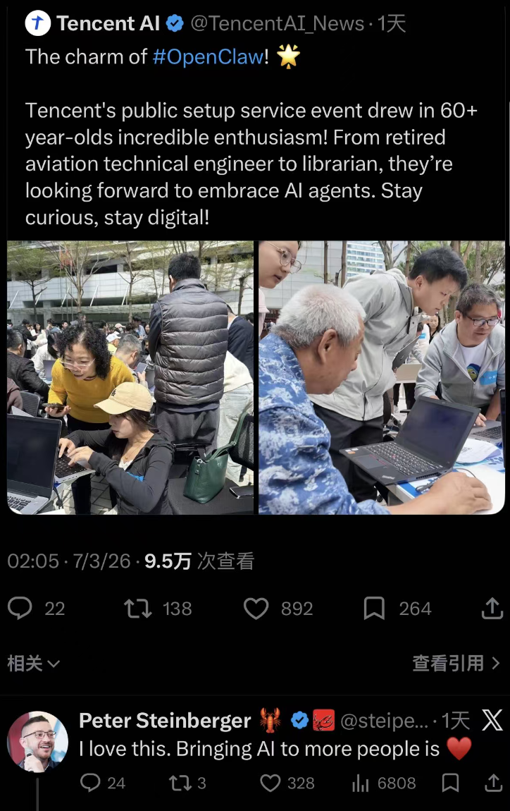
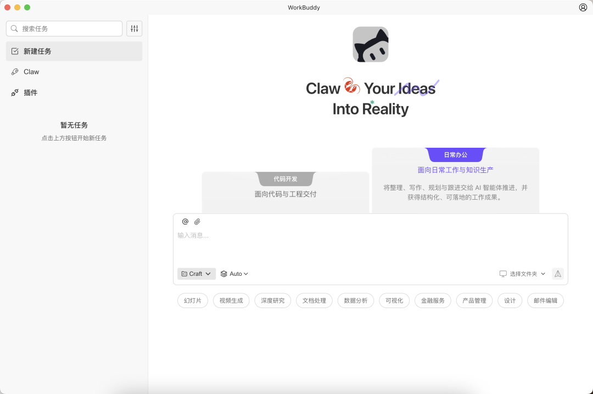

# 免部署，下了就能用！腾讯版“小龙虾”WorkBuddy正式上线

> 公众号: 腾讯云
> 发布时间: 2026-03-09 14:49
> 原文链接: https://mp.weixin.qq.com/s/UFpX8UXg51HoF04zKMxCtQ

---

[前两天，鹅厂总部门口，近千人为了一只小龙虾大排长龙。](https://mp.weixin.qq.com/s?__biz=MjM5MDgwMzc4MA==&mid=2654906519&idx=1&sn=589b1bdcac3ee8b1d5dc6e3ef2f627a8&scene=21#wechat_redirect)

从航空工程师到图书管理员…几十名鹅厂程序员现场摆摊，手把手免费帮大家安装OpenClaw。

动静之大，甚至惊动了“龙虾之父”本人现身点赞👇🏻

被称为“小龙虾”的OpenClaw确实神：盯股市大盘、写工作周报、甚至修程序Bug...它能自动操作你的电脑，帮你干活。

但火爆排队求装虾的背后，也反映了一个问题：环境配置还是复杂。“折腾三小时，报错二十次，连命令行都没跑起来”，是不少尝试自行部署用户的真实痛点。

全民养虾热情高涨，后台更有无数人疯狂催更：有没有那种不折腾、有手就能玩的开箱即用版？

今天，腾讯版“小龙虾”来了！

3月9日，腾讯旗下全场景AI智能体WorkBuddy正式上线。它完全兼容OpenClaw的技能，同时还做到了更易用、更安全、更懂办公。

WorkBuddy 操作界面

// 免部署，1分钟极速上岗：真·有手就能玩

WorkBuddy彻底砍掉了让人头秃的云端部署环节。

在官网下载安装后，直接输入指令就能让WorkBuddy帮你干活；如果你想通过企业微信远程“遥控”，最快 1 分钟即可完成配置并连接。

WorkBuddy 1 分钟连接企业微信-视频演示

此外，它还能无缝接入QQ、飞书、钉钉等工具。这意味着，哪怕你在外通勤，只需掏出手机发条语音，它就能在你的办公电脑上自动查资料、写推文，直接交付可验收的结果。

WorkBuddy不是一个只会聊天的网页框，而是“能听懂人话、带脑子思考”的桌面智能体。

它内置了超20种Skills技能包与MCP协议。无论是海报生成还是自动化报表，你都能一键导入或零代码新建，能力可以做到无限扩展。

它甚至支持多窗口、多Agent并行工作。把复杂任务动态拆解，几个AI同步开工，让生产力直接拉满。

使用WorkBuddy自动编发运营文案-场景演示

// 模型自由，安全兜底：超两千鹅厂人实测的企业级体验

想要用什么模型给你打工，你还可以自己定——

WorkBuddy国内版无缝切换Hunyuan、DeepSeek、GLM、Kimi、MiniMax。

更重要的是，它还补齐了开源工具最缺的一环：企业级安全与管理。

基于同源的腾讯CodeBuddy架构，它打通了统一账号与计费体系，具备完善的安全审计能力，让个人用得爽，更让企业用得放心。

在正式发布前，这位AI同事已经在腾讯内部经历了严苛的试用期。目前，已有超过2000名HR、行政、运营等非技术同事，用它搞定了数据分析和自动化办公。

同源的AI编程工具CodeBuddy更是交出了一份不俗的成绩单：腾讯内部超90%工程师都在用，AI生成代码占比超50%，整体编码时间平均缩短40%以上，研发提效超 20%！

// 无门槛送5000Credits，一键领走你的T版小龙虾

另外，针对所有国内版用户，我们还同步推出无门槛体验补贴——

下载即送5000Credits。领取后可直接用于驱动Claw执行各项任务，让你零成本体验AI代工的爽感。

从排队求安装，到下载即使用。

希望腾讯版的“小龙虾”，也能帮你把繁琐的杂活交给AI，把珍贵的时间留给创造。

[快来试试吧！](https://www.codebuddy.cn/work/)（点击👈🏻）一键领走你的专属免部署小龙虾。

