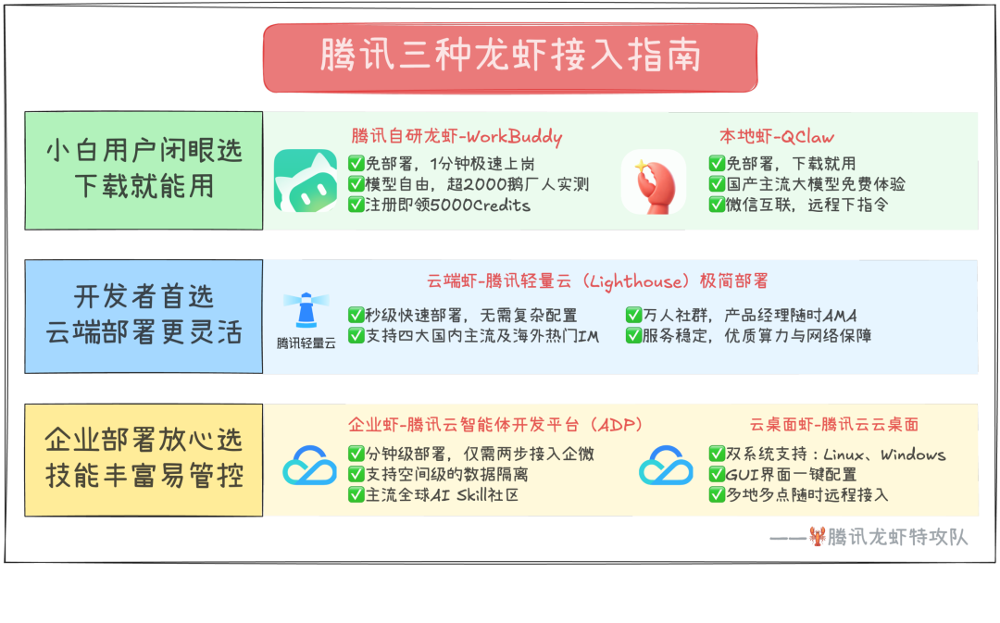

# 腾讯全系“龙虾”攻略来了，附QClaw内测码

> 公众号: 腾讯云
> 发布时间: 2026-03-10 15:14
> 原文链接: https://mp.weixin.qq.com/s/EOBSxZEfzAZdDRIj_ZE2tQ

---

昨天[腾讯版“小龙虾”](https://mp.weixin.qq.com/s?__biz=MjM5MDgwMzc4MA==&mid=2654906548&idx=1&sn=d073131d4be8f1aaac2970c4a571917c&scene=21#wechat_redirect)WorkBuddy刚刚端上桌。这会，腾讯QClaw内测的消息已经藏不住了（据说对话方式很特别的那个龙虾）。

从底层部署到IM交互，腾讯多产品线迅速构建起服务用户的“龙虾特攻队”。

不用挑花了眼，我们已经准备了这份OpenClaw领养指南，无论你是小白、开发者还是企业级的部署需求，都有专门的龙虾服务，即刻选出最懂你的那只龙虾特工👇

//大众用户：零部署，下个软件就能用

针对不希望折腾服务器和命令行的普通用户，首推这两款产品：

🦞WorkBuddy：腾讯版“免部署小龙虾”。完全兼容 OpenClaw 技能包，无需环境配置，支持多 Agent 并行。

👉[下载地址](https://www.codebuddy.cn/work/)

👉限时福利：官网下载即用，现提供 5000 Credits 无门槛体验补贴。

🦞QClaw：基于OpenClaw 打造的本地AI助手，支持 Windows/Mac 一键安装，核心亮点是微信远程操控。你只需在手机微信上发句指令（如：“帮我把桌面报表求和并传给我”），助理即可自动操作电脑执行并回传。

👉[下载地址](https://claw.guanjia.qq.com/#)

👉互动福利：在评论区分享你的“养虾”故事，随机抽取 5 名用户赠送 QClaw 首批内测码！

//开发者：云端一键部署，支持四大国民 IM

针对追求 7\*24h 稳定在线或有极客定制需求的开发者：

🦞腾讯云 Lighthouse：国内首发 OpenClaw 应用模板。免去手动配置环境的烦恼，适合运行长期、稳定的自动化任务。支持通过 QQ 和企业微信及其他主流IM入口远程操控。

👉[Lighthouse接入指南](https://cloud.tencent.com/act/pro/openclaw)

👉[QQ接入指南](https://mp.weixin.qq.com/s?__biz=MzA5ODM5MTg2Mw==&mid=2654697399&idx=1&sn=f826b343cf2141d6b64a1163f6185446&scene=21&token=1190780039&lang=zh_CN&poc_token=HAyyr2mj1mC63jYJHAfT3j9Rw_Dy1flAQkipkCnB#wechat_redirect)

 //企业级用户：分钟级部署，员工开箱即用

针对大规模协同与企业数据安全场景，腾讯提供企业级解决方案：

🦞腾讯云智能体开发平台（ADP）：分钟级一键部署。整合企业级权限管理与安全审核，支持空间级数据隔离。

👉[接入指南](https://cloud.tencent.com/document/product/1759/128832?sessionid=)

👉限时福利：最低只需188元即可解锁

🦞腾讯云桌面：支持Linux、Windows双系统，GUI界面直接操作，简单易上手。多地多点远程接入，适配大型企业分布式办公。

👉[接入指南](https://cloud.tencent.com/document/product/1291/128042?sessionid=)

👉限时优惠：特惠商品5折

// 国民级办公标配：企微 3 步接入，打造专属企业 AI 机器人

为了让 AI 真正成为打工人的办公利器，企业微信官方已于 3 月 8 日正式降低接入 OpenClaw 的门槛。各大云厂商均已快速响应，现在仅需 3 步，即可将 OpenClaw 无缝接入企微智能机器人：

👉[企微接入指南](https://mp.weixin.qq.com/s?__biz=Mzk3NTQyMTIzMA==&mid=2247517892&idx=1&sn=9ac0e286935c73862f9f929939d46ea0&scene=21&token=1190780039&lang=zh_CN&poc_token=HBixr2mj3mGeIh3y1YQ3R8oYNrbFZF48iU0A-cO-#wechat_redirect)

- 零代码长连接，实时交互： 采用“长连接方式”创建机器人，选择“API模式”即可免配域名。不仅支持被动回复，更支持 AI 主动向用户推送消息，大幅提升交互实时性。
- Webhook 智能表格直写： 数据流转不再需要复杂开发。来自各类系统和自动化工具的数据，可通过 OpenClaw 快速写入企业微信“智能表格”，直接融入企业的日常协作与管理流程。
- 生态全面打通：腾讯云 Lighthouse 等主流云服务产品已陆续上线支持方案。在云端秒级部署后，轻松绑定企业微信，让 AI 能力瞬间加持整个企业的工作流。

---

腾讯云正在上线一系列skills，让你的龙虾更懂你、更安全

-专为中国用户优化的 AI Skills 社区上线

腾讯云推出SkillHub 技能社区，通过国内镜像加速解决 OpenClaw 插件下载慢、选型难的痛点。

社区聚合 1.3 万个技能，特别针对国内场景优化了小红书运营、百度搜索等本土化工具。用户只需执行简单指令即可完成部署，大幅提升 AI 助理的实用性与安全性。

👉[社区官网](https://skillhub.tencent.com/)

-你的知识库正在申请接入龙虾

 OpenClaw接入腾讯乐享，解决 AI 不懂公司业务的痛点。

现在你可以把产品手册、调研报告等 100 多种格式的内部资料“喂”给龙虾，让它写竞品分析或整理报表时有据可依，再沉淀在知识库中实现团队协同共享。

👉[乐享接入指南](https://mp.weixin.qq.com/s?__biz=MzIzNTI2NjI3OA==&mid=2247525542&idx=1&sn=2ab0597977319725d6657f7a1521bb87&scene=21&click_id=17&token=1190780039&lang=zh_CN&poc_token=HImxr2mjSFpWQQ5sXbVDo-3ICSV9CwHeQFP0UL8u#wechat_redirect)

-腾讯龙虾安全中心来了！

针对 Agent 权限过大、黑盒交互等风险，腾讯云今天上线AI Agent安全中心，全力保障云上用户的养虾安全。

通过“可视、可溯、可控、可信”四大核心能力，实时监测异常指令、拦截高危命令并扫描插件漏洞。

👉[内测申请](https://doc.weixin.qq.com/forms/AJEAIQdfAAoAfMAIgYqADkCNrRw09Wjrf#/fill)

-腾讯电脑管家：龙虾管家，一键开启防护

针对本地部署用户，腾讯电脑管家 18.0新版本首发AI 安全沙箱功能，一键即可为OpenClaw 等 Agent 工具开启隔离运行环境，对插件调用、文件访问和潜在风险操作等进行全程防护。

👉[下载新版本](https://guanjia.qq.com/main.html)

