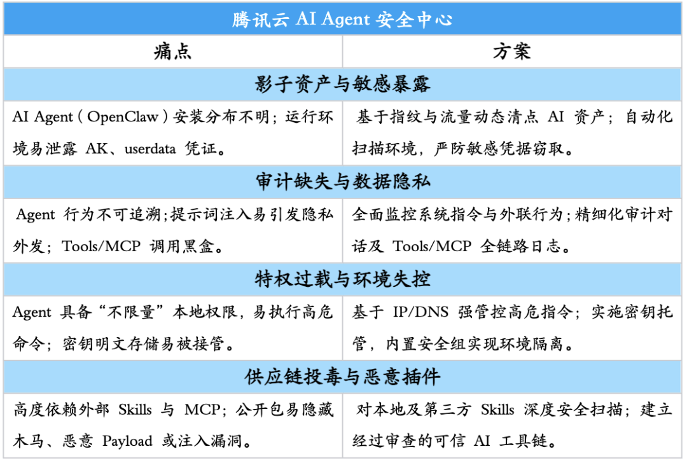
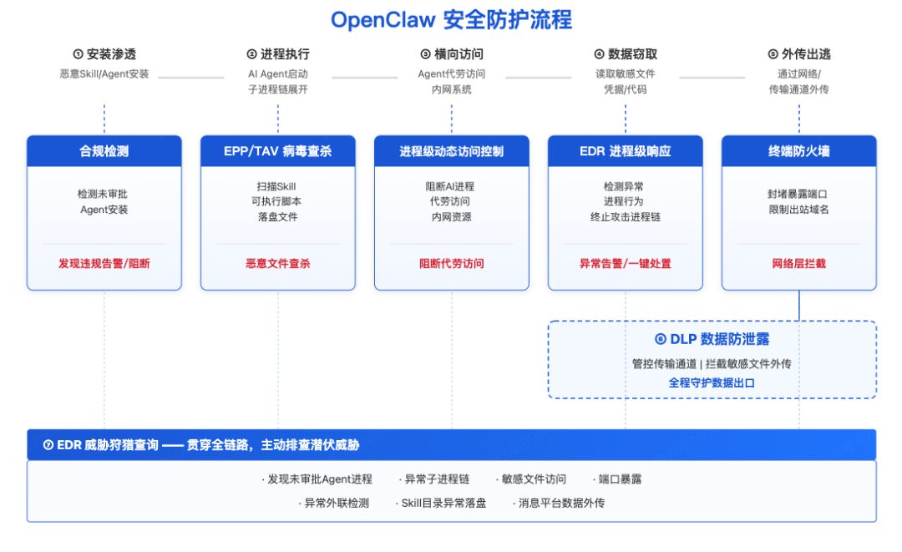
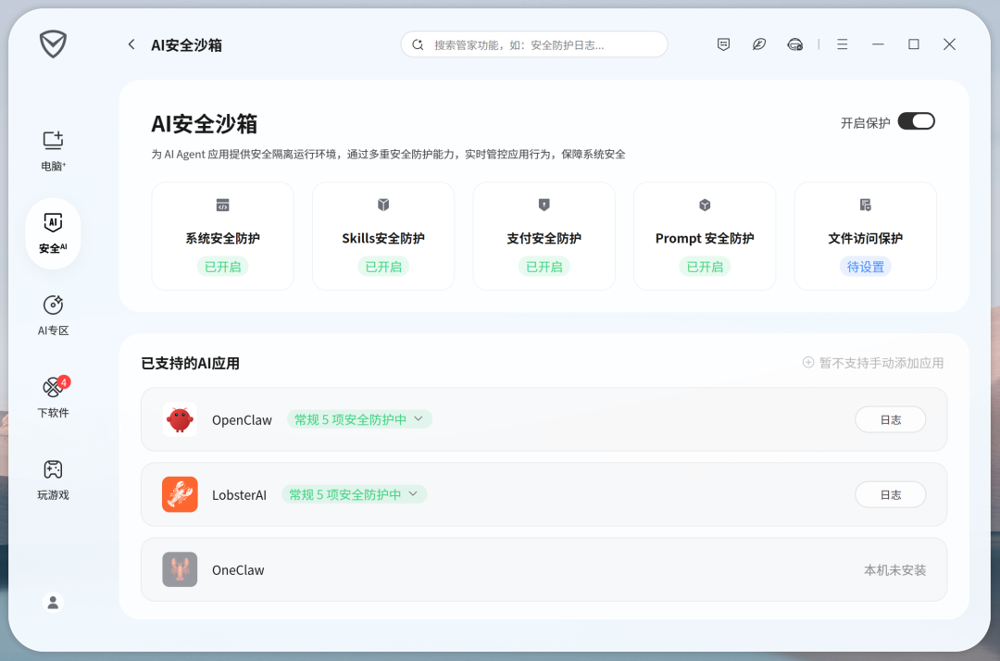
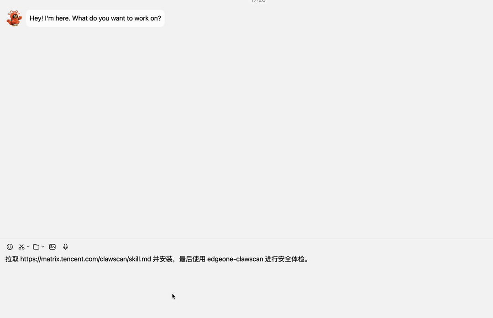

# 今天起，腾讯帮你“安心养虾”

> 公众号: 腾讯云
> 发布时间: 2026-03-11 21:36
> 原文链接: https://mp.weixin.qq.com/s/sUE1YdQo2Ekhh7wUSOm8Ig

---

这几天，全民“养虾”热情可以说被彻底点燃。

为了让人人有虾可养，我们火速集合了[「腾讯龙虾特攻队」](https://mp.weixin.qq.com/s?__biz=MjM5MDgwMzc4MA==&mid=2654906571&idx=1&sn=26b4419073158cb386c03985f90553a7&scene=21#wechat_redirect)，推出了覆盖个人、开发者与企业的三大部署套餐。

当然，当这些厉害的“小龙虾”开始接管你的电脑，甚至爬进企业内网时，你可能会问：

我的数据和系统，安全吗？？？

为了让大家更安心地“养虾”，腾讯正式推出两套互补的“组合拳”：提供一整套安全产品矩阵的同时，并将安全能力直接封装成可调用的Skills。

// 组合拳一：量体裁衣的安全产品矩阵，把小龙虾关进“隔离房”

无论是个人尝鲜、还是企业规模化应用，我们都准备了专属的防护方案。

1、针对云上开发者/企业，推出Lighthouse安全架构+AI Agent安全中心。

面向在云端部署小龙虾的开发者与企业，腾讯云给出了一套“从底层基建到上层管家”的整体防御方案。

首先，针对公网暴露和容易被入侵的痛点，腾讯云Lighthouse（轻量应用服务器）推出了“OpenClaw 安全专属部署架构”。

它相当于在云端打造了一个物理防爆箱：自带环境隔离、最小化端口放行和一键快照回滚，即使遇到极端攻击，风险也被锁在云端实例内，不会波及到企业内网。

光有坚固的房子还不够，还得配上能打的“安保团队”。

对于部署在Lighthouse上的用户，还可以一键开通“腾讯云AI Agent安全中心”。它会时刻保持警惕，盯紧小龙虾的一举一动：

- 可视：自动盘点云上资产，主动扫描是否有AK密钥暴露在外；

- 可溯：记录AI本身执行的系统命令、网络行为和提示词日志 (仅系统行为，不触及任何用户隐私和行为数据) 。哪怕发生越权，也能一键追溯源头；

- 可控：内置安全组限制，禁止AI随便访问企业内网业务；基于IP和DNS精准拦截黑客远控；

- 可信：联动SkillHub社区，对安装的插件进行深度杀毒和扫描，从源头掐断木马漏洞。

通过这套方案，可以为你提供从一键部署，到打通中文技能社区，到提供专属安全架构的一条龙服务。[详情点这里>>>](https://mp.weixin.qq.com/s?__biz=Mzg5OTE4NTczMQ==&mid=2247528919&idx=1&sn=f5798070e26c4b1d7f38be9086cd0895&scene=21#wechat_redirect)

另外，腾讯云智能体开发平台（ADP）也为用户，提供企业级权限与安全管控能力。

- 基于腾讯云成熟的主、子账号体系，控制不同用户访问OpenClaw的功能权限和数据权限；
- mcp接入大模型网关，提供统一安全治理机制，防止工具滥用及潜在安全风险；

- OpenClaw对话输入与输出均经过腾讯天御安全审核，保障企业内容安全与合规使用。

2、针对本地化企业用户，发布“龙虾”办公网防护方案。

针对金融、医疗等行业对部署安全的严苛要求，腾讯iOA全新发布“龙虾办公网防护方案”，构建了硬核的六大关卡：[详情点这里>>>](https://mp.weixin.qq.com/s?__biz=Mzg5OTE4NTczMQ==&mid=2247528951&idx=1&sn=e1b07d2a7d0f730da436d94d648a6c43&scene=21#wechat_redirect)

- 安装渗透防线：自动合规检测，快速拦截未经审批的“龙虾”应用安装；

- 进程执行防线：联动TAV防病毒引擎，对Skill插件开展特征检测与深度扫描；

- 横向访问防线：实施进程级动态访问控制，阻断AI进程对企业内部Web应用的“代劳访问”；

- 数据窃取防线：iOA-EDR监控AI子进程，发现敏感目录遍历或凭据窃取即刻一键终止；

- 外传出逃防线：封堵暴露端口，限制AI进程仅能访问白名单域名；

- 全程守护：DLP拦截剪贴板及企微等通道的敏感外发；EDR支持主动排查潜在威胁。

[👉](https://doc.weixin.qq.com/forms/AJEAIQdfAAoAC8ApQZ_ACcCN0dWaM9P7f#/fill)[龙虾办公网防护方案内测申请](https://doc.weixin.qq.com/forms/AJEAIQdfAAoAC8ApQZ_ACcCN0dWaM9P7f#/fill)

3、针对个人用户，推出腾讯电脑管家18.0龙虾管家（AI安全沙箱）。

对于在本地运行小龙虾的个人用户，最大的痛点就是怕AI乱动系统文件或乱花钱。

腾讯电脑管家18.0率先上线了“AI安全沙箱”，它相当于给小龙虾准备了一个“隔离房”。一键开启后，AI只能在这个房间里干活，碰不到也搞不坏你电脑里的私人文件：

- 防篡改系统：禁止AI工具自动修改系统核心文件或注册表；

- 防插件投毒：全量审查Skills调用，限制高危插件滥用；

- 防钱包被盗：实时监控支付行为，拦截AI的恶意盗刷或误付费；

- 防隐私泄露：自定义敏感路径黑名单，禁止 AI 偷看你的私人或核心文件。

当然，如果你的养虾需求极大（比如开发者需要高频并发测试），标准隔离房不够用怎么办？

腾讯还为你准备了性能更强悍的专属“Agent沙箱”。它能够提供VM级强隔离、网络隔离、文件隔离、零凭证访问等能力，让小龙虾从默认运行开始就建立在安全前提之上。

//组合拳二：鹅厂版安全Skills来了，让小龙虾自己保护自己

除了系统的部署防护，我们还将腾讯顶尖的安全研究成果封装成了灵巧的AI Skills，直接上线至社区。

这意味着，你可以像使唤助理一样，通过对话让“小龙虾”自己保护自己。举两个栗子：

1、内外双修的安全守门员：EdgeOne ClawScan

担心刚装的插件有毒？只需在对话框里给“小龙虾”发一句指令：“安装 edgeone-clawscan （https://matrix.tencent.com/clawscan/skill.md），并进行安全体检。”

收到指令后，它就会自动给你出一份体检报告：如，当前配置有没有公网暴露风险、已安装的Skill有没有后门木马、当前版本有没有致命CVE漏洞。

你甚至可以吩咐它：“以后每周末自动体检一次。”

当然，暴露在外的Agent还比较容易遭遇API滥用、数据爬取和DDoS攻击。通过腾讯云EdgeOne的DDoS/Web防护/Bot管理/CC防护等安全能力，能在流量到达前，精准拦截恶意请求和自动化Bot爬虫，力保你的AI稳稳打工。

2、本地脱敏专家：HaS Anonymizer

如果你还担心不小心把公司机密信息喂给了大模型？我们在社区上架了端侧隐私保护 Skill。

它完全在本地运行，断网也能用。不仅能识别并替换近70,000种文本实体类型，还具备图片脱敏引擎，能在AI处理前，精准抹除图片中的身份证、人脸、车牌等21种敏感信息，确保传给云端的数据清晰干净。

安全，永远是第一道也是最后一道防线。

从云端到本地，从产品级强管控到对话式Skills防护，腾讯通过全链路的立体防护体系，保护你的龙虾安全。

你尽管安心养虾，享受工具的便利。剩下的，交给我们。

最后安利两下：体验腾讯自研版小龙虾WorkBuddy，可点[“阅读原文”](https://www.codebuddy.cn/work/)；如有任何养虾过程中的疑难杂症，也欢迎来ima找答案呀👉🏻龙虾知识库

