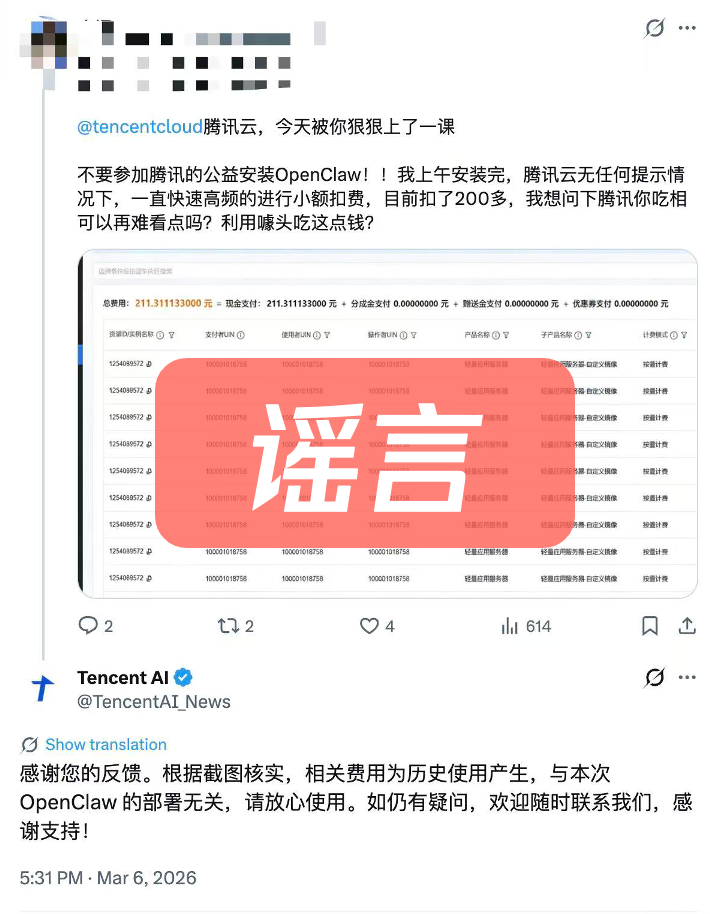

# 关于腾讯龙虾，回答大家关心的几个问题

> 公众号: 腾讯云
> 发布时间: 2026-03-11 19:01
> 原文链接: https://mp.weixin.qq.com/s/0uq6jl4YWzV0MiozYlCwOQ

---

#

#

# 一、OpenClaw安全吗？

OpenClaw 本身是一个开源的Agent 框架，部署在什么环境、执行什么任务、调用哪些工具，都由用户自己控制。

因此，OpenClaw 是否安全，主要取决于你怎么用：

- 如果选择部署在本地电脑上，可以使用闲置机、备用机，谨慎使用工作电脑；或者，欢迎试用我们的WorkBuddy、QClaw等本地Agent，一键直连OpenClaw的同时，进行了严密的安全防护设置。
- 也可以选择部署在云端，与本地隐私数据进行隔离，Lighthouse、ADP、云桌面、乐享等云产品，都针对OpenClaw做了全链路安全适配。
- 我们也在推出一系列OpenClaw安全产品和skills，让个人、开发者和企业都能更安心的养虾。
- 随着 Skills 生态发展，我们还在推动更规范的插件来源、权限声明和使用提示。你可以在 [SkillHub](https://skillhub.tencent.com/#featured)找到经过筛选、安全优质的Skills。

更多能力持续完善中。我们的目标是，让大家能更安心地使用 AI。

# 二、OpenClaw会疯狂扣我的钱吗？

社交平台上还流传着另一张截图：一名用户表示，在腾讯云公益装机活动上安装OpenClaw之后，出现高额费用“偷跑”，累计200多元。

我们迅速进行了后台排查。经核实，这200多元其实是这名用户此前的历史模型调用费用，与腾讯公益装机活动并没有直接关系。

需要提醒的是：OpenClaw 安装本身是免费的，但如果在使用过程中调用大模型，就会产生 token 费用。目前基本所有Agent 工具都是类似情况。

针对开发者和重度用户，我们最近也上线了 Coding Plan 订阅服务，支持 Tencent Hunyuan、GLM、Kimi、MiniMax 等主流模型。

# 三、有QClaw内测码？

非常紧张，尽量争取，不定期掉落。

#

# 四、之后还有线下免费装机活动吗？

正在计划中，可能会各地闪现，欢迎许愿。

# 五、腾讯一天发N条虾是在内部赛马吗？

关于这N条虾的区别，详见昨天发布的[“腾讯龙虾家族”](https://mp.weixin.qq.com/s?__biz=MjM5MDgwMzc4MA==&mid=2654906571&idx=1&sn=26b4419073158cb386c03985f90553a7&scene=21#wechat_redirect)。简单来说，目前腾讯对外提供的龙虾服务主要有两类。

第一类，是围绕开源项目 OpenClaw 提供的服务。

针对不同用户群体，我们在社区版的基础上做了一些封装，比如提供更简单的部署方式、模板环境和接入能力，让开发者和普通用户都能更容易用起来。

第二类，是腾讯自研的桌面智能体 WorkBuddy。可以把它理解为一种类 OpenClaw 的 Agent 产品。

# 六、WorkBuddy、CodeBuddy、OpenClaw到底啥关系？

WorkBuddy：

- 腾讯自研的AI Agent，能力和OpenClaw很像，因此被大家概称为“腾讯版小龙虾”
- 和CodeBuddy使用同一套Agent架构，同宗同源
- 兼容OpenClaw 的Skills，在易用性、模型选择和安全能力上做了一些优化

CodeBuddy：

- 腾讯自研的AI代码助手，有插件、IDE、CLI三种形态，支持自然语言编程、多文件代码生成、代码补全及单元测试等功能

# 七、龙虾到底有啥用？

#

# 我们也在摸索和挖掘当中！

在腾讯内部，大家研究 OpenClaw 的热情也很高。腾讯内网版 OpenClaw 的负责人说，已经有近4万名员工在内网“领养”了小龙虾。

同时， 用Agent参与研发，也在逐渐成为一种新的开发模式。腾讯云的Agent 沙箱服务、CodeBuddy Code等产品，很多代码和能力其实都是在这种模式下跑出来的。

---

技术的发展，往往从少数人开始。

但真正改变世界的，是越来越多普通人的参与。

有任何养虾过程中的疑难杂症，欢迎随时提问，以及来ima找答案：

腾讯各个龙虾服务的主理人，也会在直播间以及社交平台上现场解答。

（实在回答不上来的，我们去问问Peter）

—— 🦞「腾讯龙虾特攻队」

