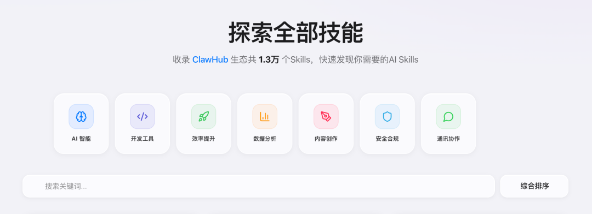
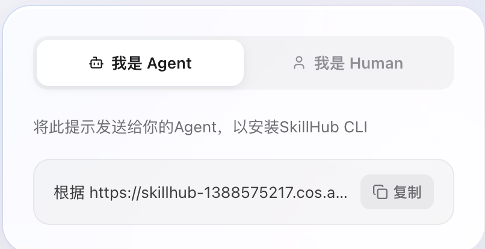
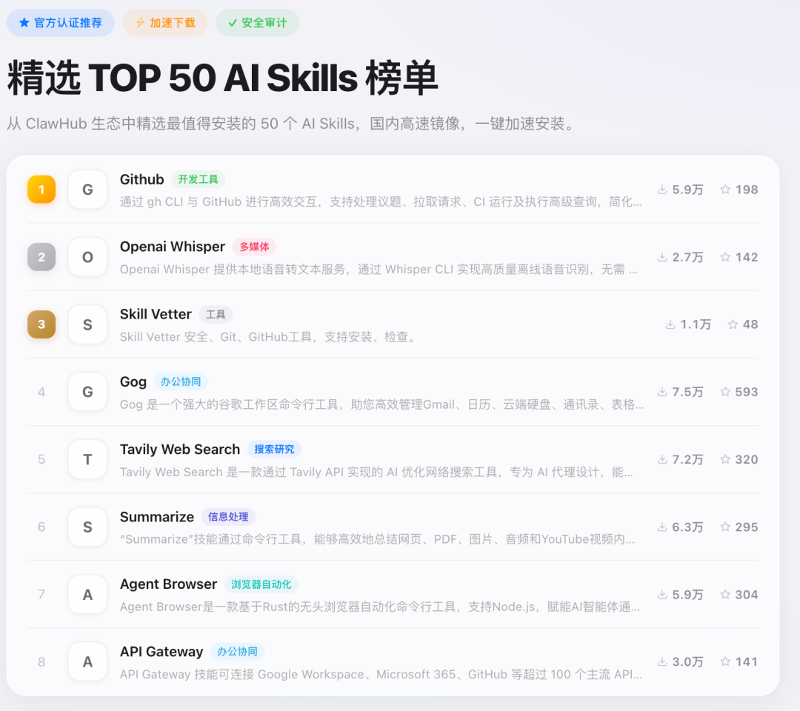
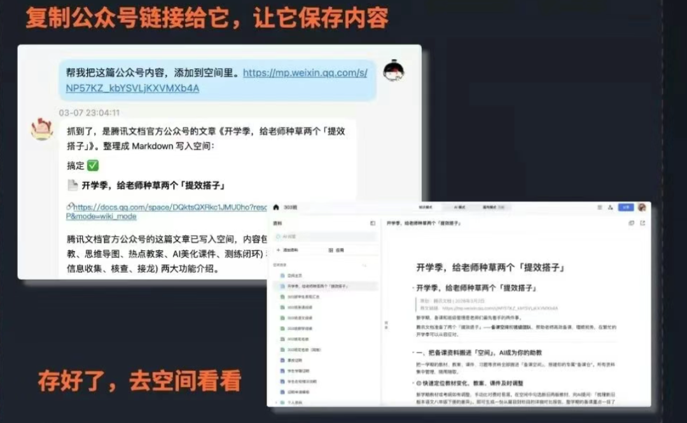
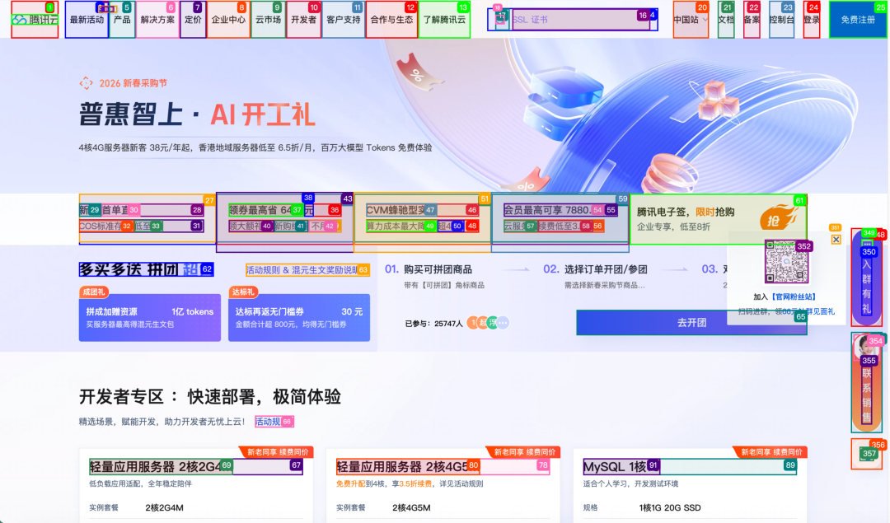
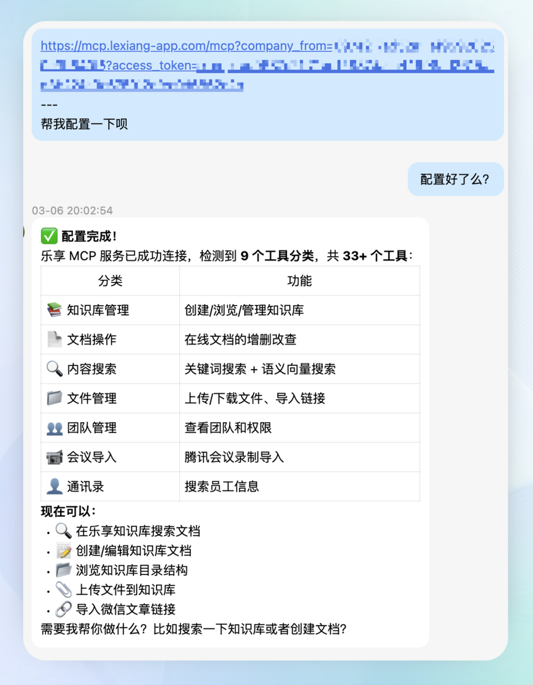
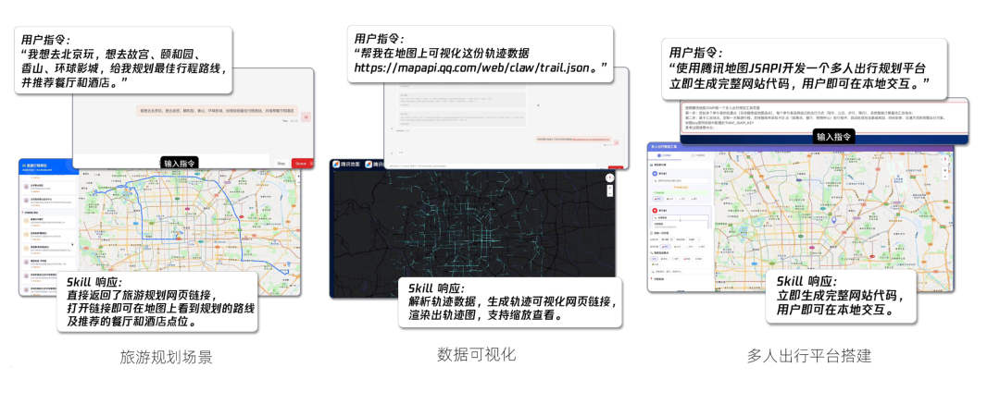
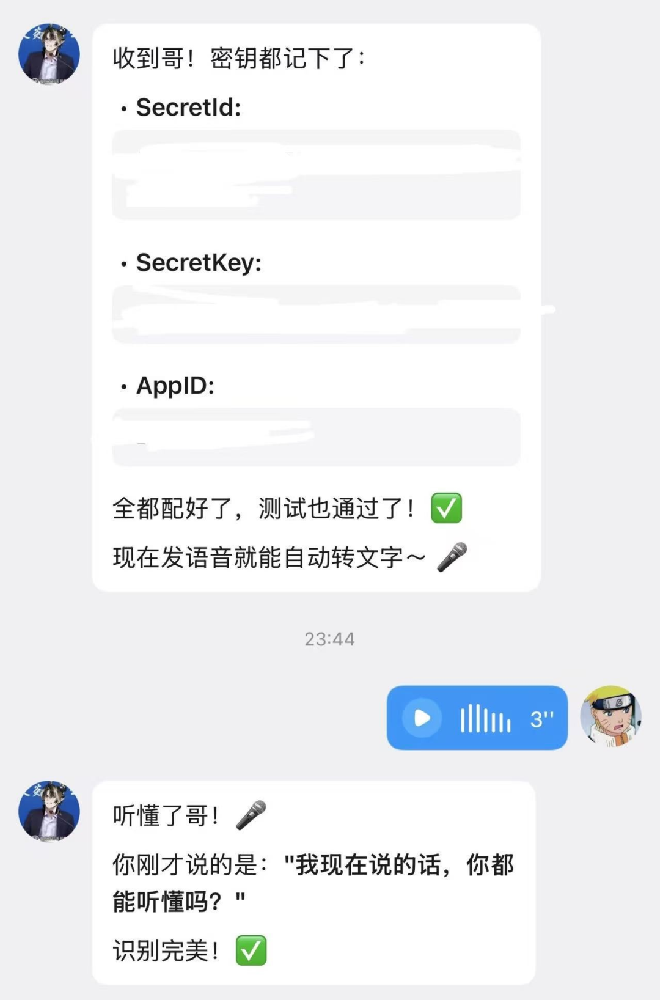
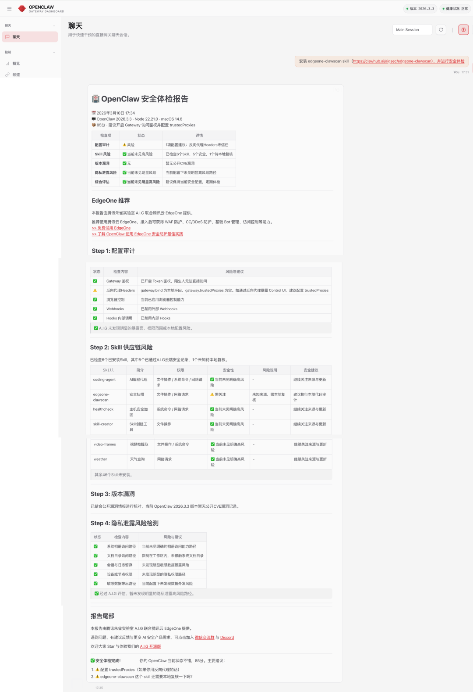

# 腾讯龙虾技能社区SkillHub上线，专为中国用户优化

> 公众号: 腾讯云
> 发布时间: 2026-03-11 21:09
> 原文链接: https://mp.weixin.qq.com/s/sxLspZ8BnH4sCRbcJVOImQ

---

向各位🦞友报告，腾讯龙虾技能市场的建设情况👇

✅腾讯专门为中国用户打造的SkillHub正式上线营业，包含13000多个龙虾技能（每日增加中）

-官网地址：https://skillhub.tencent.com

✅腾讯10+产品完成skill化改造，简单配置就能在OpenClaw中调用。

//最适合中国用户的AI技能社区 SkillHub

-中文搜索、下载快、安装简单

SkillHub 是腾讯云基于 OpenClaw 官方开源生态打造的本土化技能平台。

针对中国用户的使用习惯，SkillHub 做了专门优化：不仅支持中文搜索技能，还通过国内节点分发，让技能下载和安装更加稳定顺畅。

SkillHub适用范围广，适配腾讯云 Lighthouse、Mac 等多种环境，同时还兼容 WorkBuddy、QClaw 等 AI Agent 框架和 AI Coding 场景，让用户可以快速找到技能、装上技能、马上开用。

0代码，2步搞定skill安装👇

1.安装SkillHub商店，Agent和human请注意选择不同方式

2.一句话安装技能

例如，让龙虾装上OpenClaw 的专属云存储管家——腾讯云COS Skill，就说“安装腾讯云COS技能"，立马解锁用对话直接完成云存储基础管理、图片智能处理、智能检索、文档 / 视频轻处理等操作，告别传统繁琐流程，上千人已经把这个技能安装到了自己的“龙虾”里。

-精选 50+ 高质量技能，放心装

Skills太多选哪个？SkillHub 从官方生态中筛选出50多个优质技能，形成精选榜单，并完成安全扫描和质量筛选，让用户放心装。

基本覆盖办公协同、开发工具、内容创作等高频场景，让大家不必在海量插件中反复试错，也能快速找到真正好用的能力。

 

//腾讯特色 Skills申请加入龙虾：腾讯文档、地图、乐享、EdgeOne....

在市场之外，腾讯也在把生态内的产品skill化，方便用户在养虾过程中调用

-腾讯文档 Skill

接入腾讯文档 Skill 后，OpenClaw 可以直接创建、读取和编辑在线文档，包括 Word、Excel、PPT、智能表格、思维导图等，同时支持文档搜索、空间管理和文件结构整理。

👉[实践教程](https://mp.weixin.qq.com/s?__biz=MzU0MDU2OTMwNA==&mid=2247570250&idx=1&sn=fb082e3fa3154b2235a067c3ac4bc8f8&scene=21#wechat_redirect)

-QQ浏览器Skill

通过 QQ 浏览器 Web Skill，OpenClaw 可以直接访问真实网站，并像用户一样完成网页操作，例如打开页面、点击按钮、填写表单、处理日期选择等复杂控件。同时，它还能自动解析网页内容并下载文件（如 PDF），帮助 Agent 在网站中完成查询、检索和信息获取等任务。

（以腾讯云官网页面为例，基于QQ浏览器X5Use的能力，Agent可以识别更多内容）

👉使用指引：目前已上线腾讯云智能体开发平台（ADP)，后续将开放至更多社区和平台

-腾讯乐享知识库 Skill

乐享知识库 Skill，可以让OpenClaw 直接访问企业内部知识库中的文档资料，在企业知识基础上完成检索、总结和分析，并把生成内容沉淀回知识库，让 AI 能参与到团队知识管理和协作流程中。

👉[实践教程](https://mp.weixin.qq.com/s?__biz=MzIzNTI2NjI3OA==&mid=2247525542&idx=1&sn=2ab0597977319725d6657f7a1521bb87&scene=21#wechat_redirect)

-腾讯地图 Skill

腾讯地图将地图组件、位置服务、路线规划和 POI 搜索等能力封装为 Map Skills。开发者只需要描述需求，AI 就可以自动调用相关能力生成地图应用代码，大幅减少查文档、调接口和调试配置的时间。

👉[实践教程](https://mp.weixin.qq.com/s?__biz=MjM5MDM3NjkzNA==&mid=2650661460&idx=1&sn=2a3785e9ccc8443b6a5234ca76c11c41&scene=21#wechat_redirect)

-腾讯云语音 Skill

给 OpenClaw 装上“耳朵”和“嘴巴”。通过腾讯云语音识别（ASR）和语音合成（TTS）Skills，OpenClaw 可以实现语音输入、会议录音转写、长音频整理以及语音播报结果等能力，让 AI Agent 从文字交互扩展到语音交互。

👉[实践教程](https://cloud.tencent.com/developer/article/2636448)

-EdgeOne ClawScan Skill

装了EdgeOne ClawScan Skill，一句话给龙虾做安全体检。OpenClaw 可以自动调用 EdgeOne 的安全检测能力，对网站或应用进行快速扫描，识别潜在安全风险，并帮助用户防范 Skills 投毒、漏洞利用或隐私泄露问题，建议一周一检。

👉[实践教程](https://mp.weixin.qq.com/s?__biz=MzU3NzI2Nzg2NA==&mid=2247487404&idx=1&sn=40686bac854277e96acda5920377b2dc&scene=21#wechat_redirect)

-还有一套适合做漫剧的Skills

腾讯云音视频媒体处理（MPS）能力也被封装成一组 Skills，可以直接在 OpenClaw 中调用，用来生成 AI 漫剧、视频增强、字幕处理、图片处理等内容生产能力。

基于这些能力，OpenClaw 不仅可以生成 AI 漫剧，还可以完成视频生产、内容增强、素材处理等更多创作场景。

可以在Clawhub及skillhub上搜索安装：tencent-mps、mps-transcode、mps-enhance、mps-erase、mps-imageprocess

技能都在这了，以后不能再说“你的龙虾，我的龙虾不一样”了。

