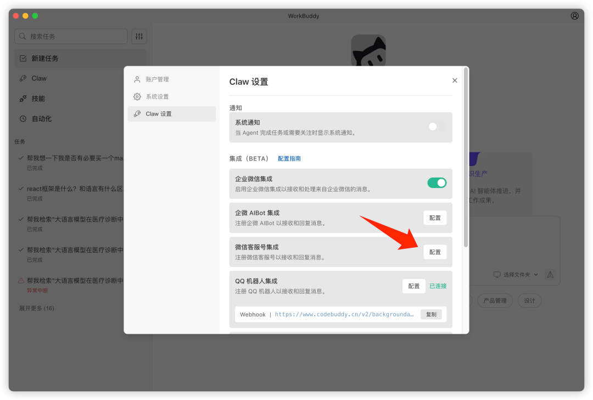
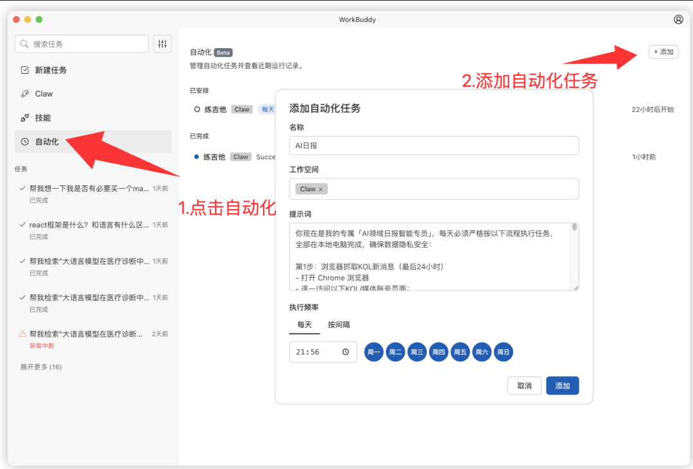
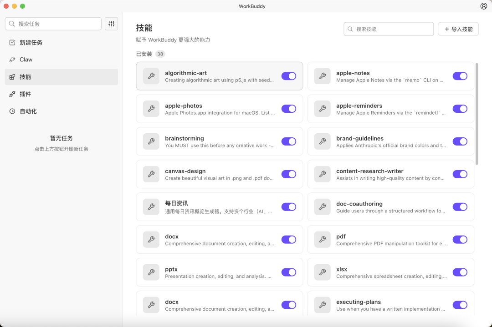
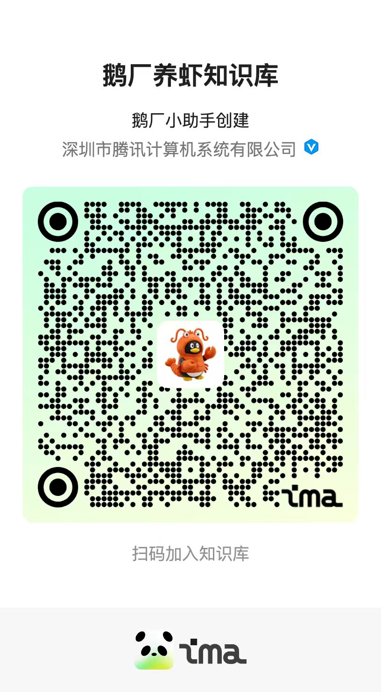

# 腾讯WorkBuddy重大升级：直连微信，全量开放

> 公众号: 腾讯云
> 发布时间: 2026-03-12 15:05
> 原文链接: https://mp.weixin.qq.com/s/vAQQEDVDwwboLHRYlaXILQ

---

今天，腾讯旗下自研AI原生桌面智能体工作台WorkBuddy迎来重要升级——

打通微信直连，只需发条消息，随时随地都能用手机“遥控”电脑帮你干活！即日起全量开放，所有用户下载、更新即可体验。

// 微信一键直连：发个微信，让🦞帮你干活

以前养虾，你得坐在电脑前，看着它长大（dagong）。

新版本中，只需在设置里简单配置微信客服号，就能实现微信一键直连。

不管你是在逛商场还是在外见客户，只要在微信里发一句语音或文字，办公电脑上的WorkBuddy就会立刻开工。

查资料、写文案、处理报表…全程在本地运行，保障隐私安全。

只要电脑不关机，它就是你随叫随到的7×24小时随身助理。真正做到远程遥控，实时交付。

// 企微稳连+定时任务：仅需设置一次，自动打工不操心

对于企业团队用户，这次我们把底层连接做得更稳了，支持企微断网自动重连，告别复杂的IP配置。

需要划重点的是，你的小龙虾终于学会了自动化定时打工。

点几下鼠标，给它定个规矩：比如“每天早上9点自动抓取行业热点”、“每周五下午5点自动整理本周会议纪要”。

干完活，它还会贴心地把Markdown、PDF等格式的成品，直接推送到你的企业微信里，任务进度随时可查。

// 技能无缝迁移，更有腾讯全链路安全保驾护航

不用买服务器，不用搞模型API，下载就能直接用。

WorkBuddy内置了超20种技能包，完全兼容OpenClaw体系，几个🦞还能同时开工，直接效率拉满。

更贴心的是，最新版还上线了专属Skills管理功能。支持技能一键导入、在对话中快速引用、随手启用或禁用。

如果你之前攒了一堆小龙虾的绝活技能，现在全都能无缝迁移过来，管理起来简直不要太省心。

另外，为了让大家更安心养虾，腾讯还正式打出了一套全链路安全防御[“组合拳”](https://mp.weixin.qq.com/s?__biz=MjM5MDgwMzc4MA==&mid=2654906635&idx=1&sn=24ea3f0b01e67cde273c3059781b00b8&scene=21#wechat_redirect)：

向内隔离：通过云端Lighthouse、企业iOA及个人电脑管家沙箱，为小龙虾建立严苛的物理与系统级隔离墙。

向外防御：创新推出安全AI Skills（如漏洞扫描、本地数据脱敏插件），让AI 自己学会抵御黑客与流量攻击。

// 接下来是福利放送时间!

即日起-3月31日：

面向所有国内版用户，注册即无门槛赠送5000Credits体验补贴(类似token的T版计量单位)。领取后，你可以直接用它来吩咐小龙虾为你执行各项复杂任务。

再划一次重点：全量开放，所有用户下载、更新即可体验。

打开官网（[workbuddy.tencent.com](http://workbuddy.tencent.com)），认领一只你的专属小龙虾吧！

最后安利一下：如有任何养虾过程中的疑难杂症，也欢迎来ima找答案呀👉🏻龙虾知识库

