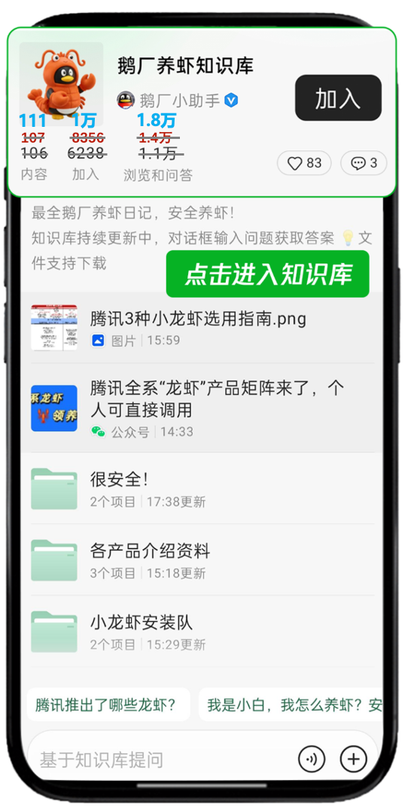
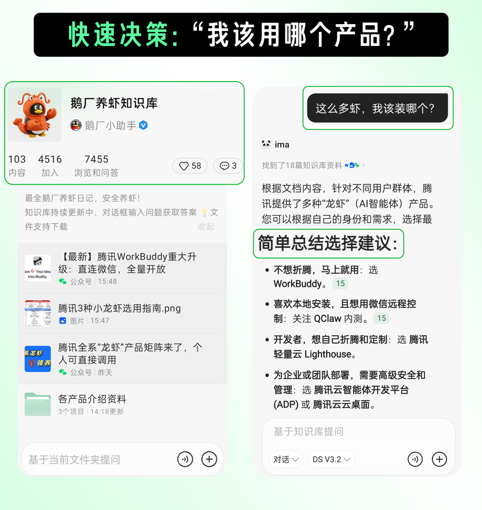
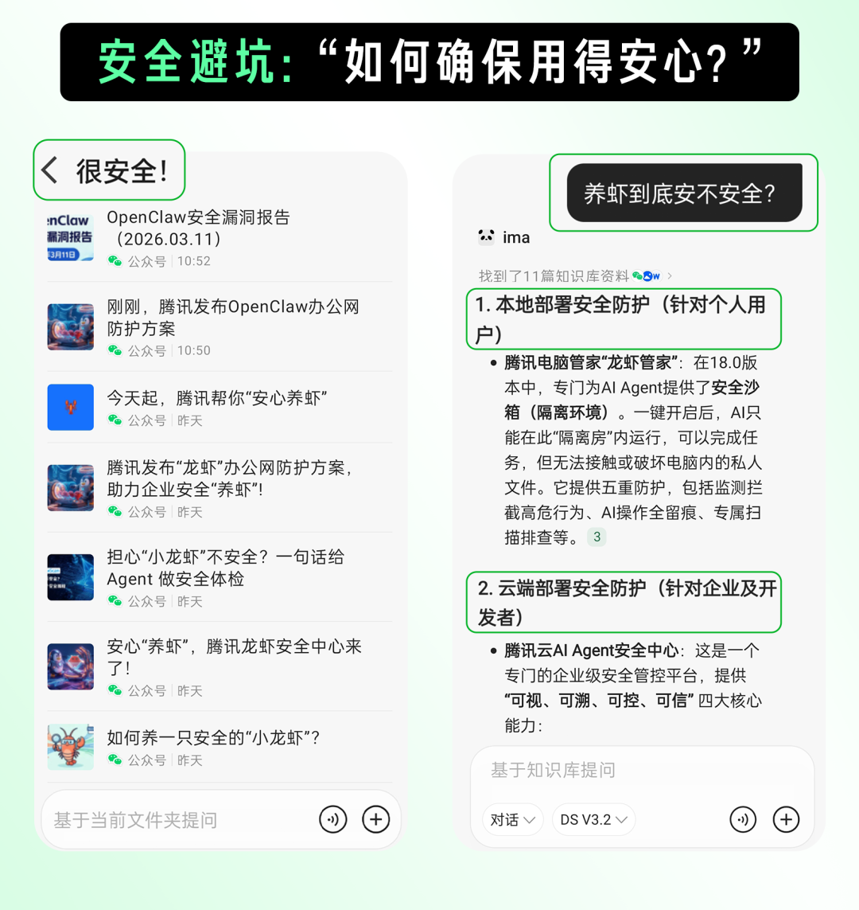
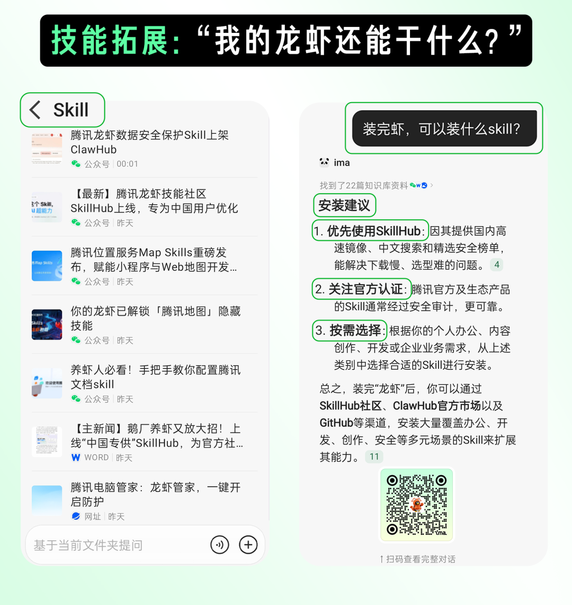
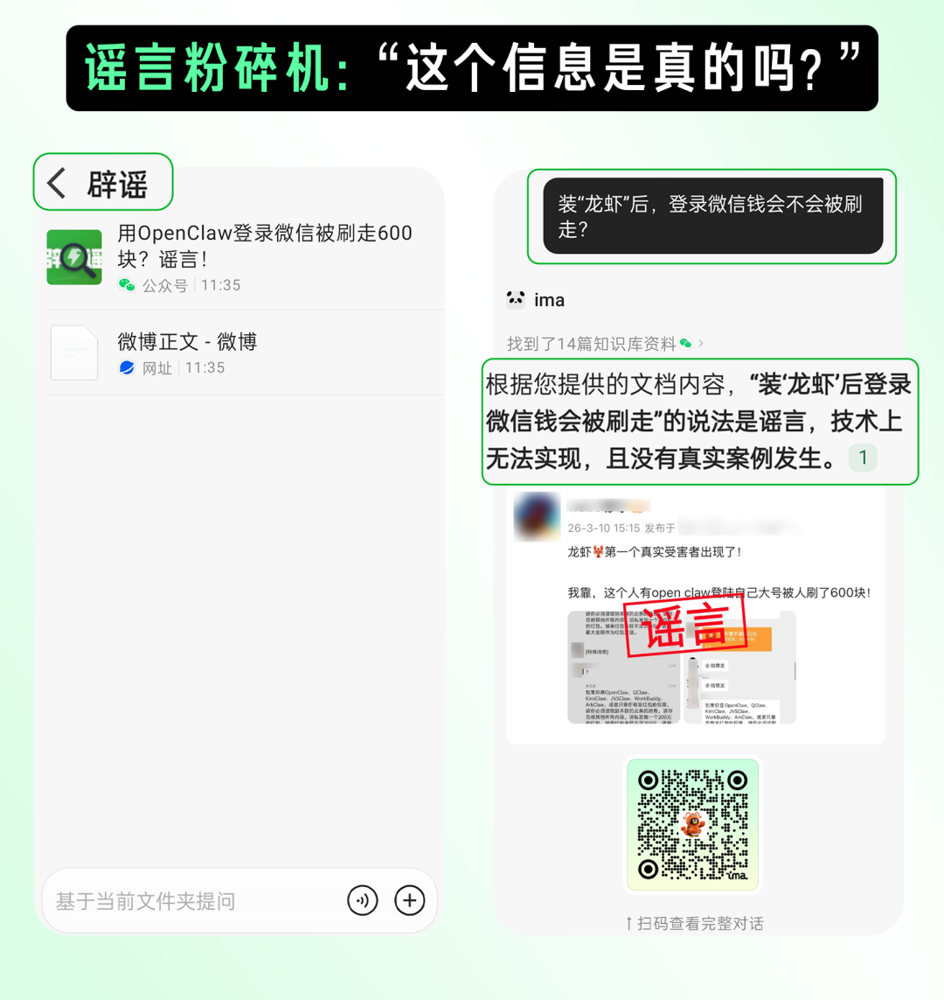

# 腾讯“龙虾”官方知识库上线，10000人在线找攻略

> 公众号: 腾讯云
> 发布时间: 2026-03-13 10:10
> 原文链接: https://mp.weixin.qq.com/s/QHmYXVk5tYLdJGa3sVv4sA

---

刚刚，腾讯龙虾官方知识库「鹅厂养虾」在ima上线。

汇总腾讯官方在龙虾方面的产品动态和实践指南。

目前，已有超1w人加入，问答和浏览超1.8w，成为ima一周内广场知识库加入top1。

在这里，回答腾讯龙虾养殖的一切👇

// 快速决策：“我该用哪个产品？”

-小白用户直接装WorkBuddy、QClaw，

- Workbuddy零配置下载即用，还送5000 Credits体验补贴。
- QClaw（内测中）发个微信家里电脑自动帮你算报表传文件，覆盖1.3万+skills。

-企业用户装智能体开发平台ADP，几分钟部署完成，按部门分权限、敏感数据隔离，现在限时特惠。

多地远程办公装腾讯云桌面，支持Linux、Windows双系统。

-开发者装腾讯云Lighthouse，云端7×24小时在线，一个QQ号能养5只虾。

知识库里每款产品都有完整接入指南，10分钟跑通。

//安全避坑：“如何确保用得安心？”

-本地装有腾讯电脑管家（18.0）龙虾管家功能，AI在隔离房里干活碰不到私人文件。

-云端用有AI Agent安全中心实时监控，高风险指令自动拦截。

-企业用ADP按部门分权限，数据隔离，审计日志完整。

//技能拓展：“我的龙虾还能干什么？”

-做自媒体有QQ浏览器web、内容生成skill，SkillHub社区1.3万个本土化技能国内镜像加速一键调用。

-写PPT有完整Slides创建教程，从大纲到配图配音全覆盖。

-企业协同可以3步接入企业微信，数据直接写入智能表格，AI还能主动推送任务进度。接入公司知识库有腾讯乐享接入指南，把产品手册、报告资料“喂”给AI，支持百余种格式。

//谣言粉碎机：“这个信息是真的吗？”

官方新闻实时更新，帮你鉴别不实传言

各种疑难杂症，欢迎扫码进库，养虾更酷👇

---

