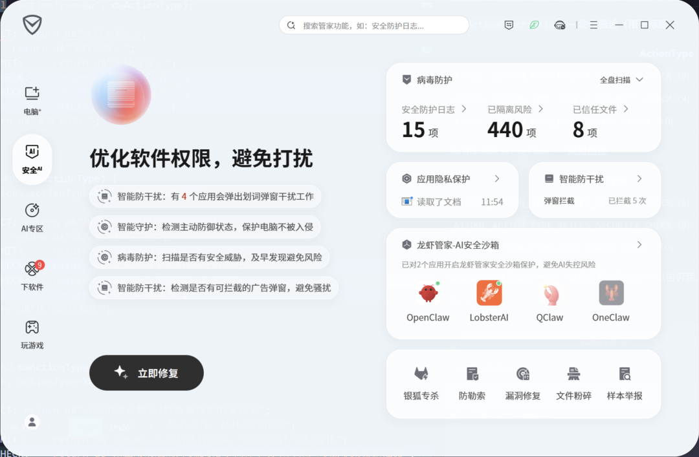
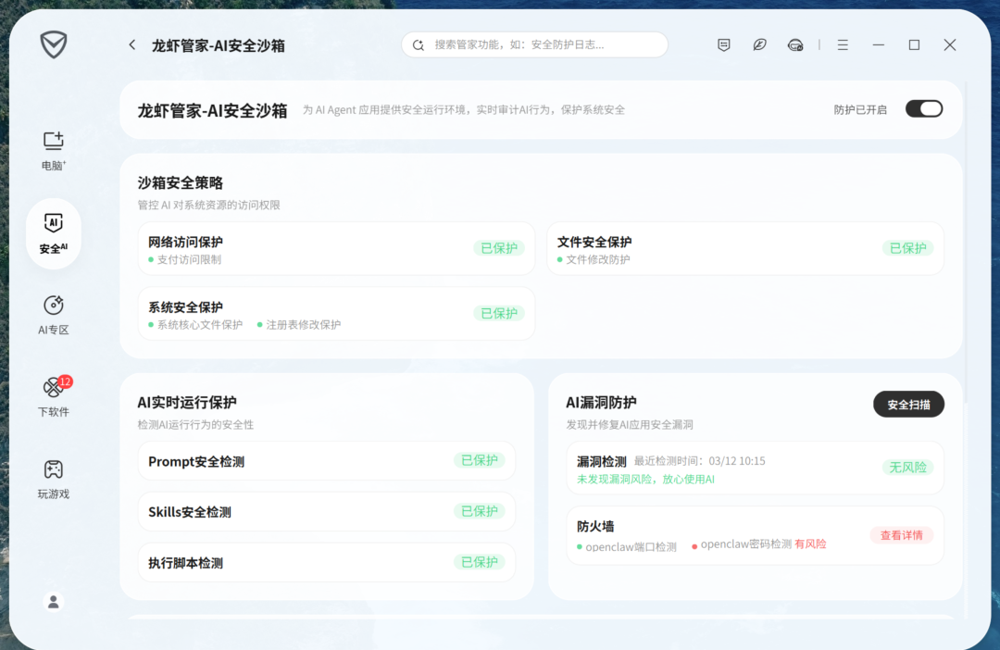
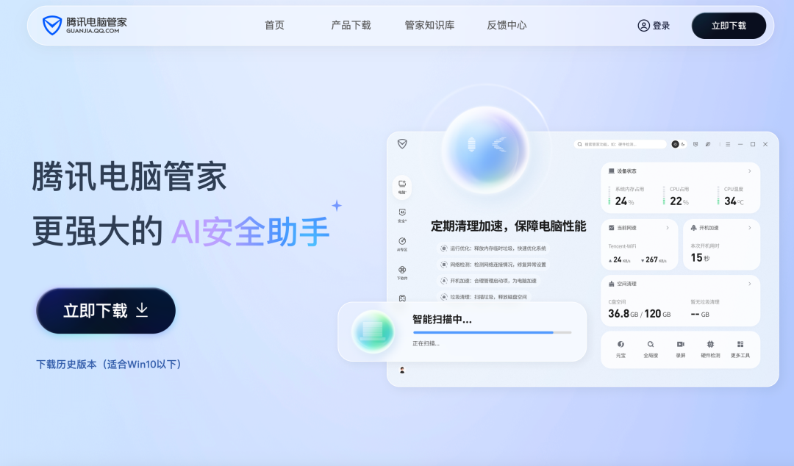
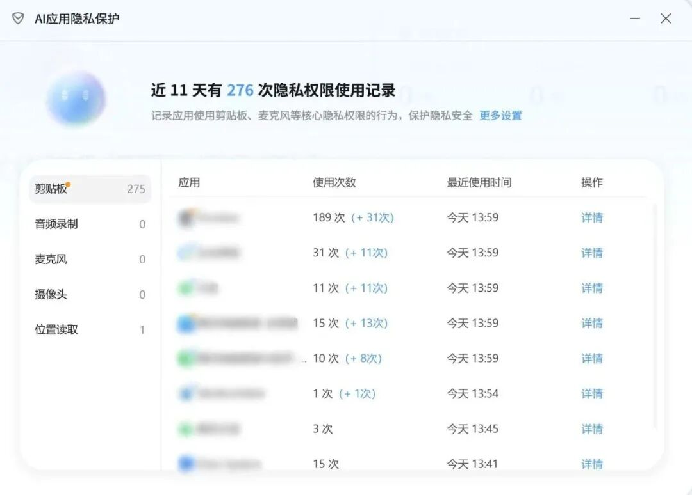
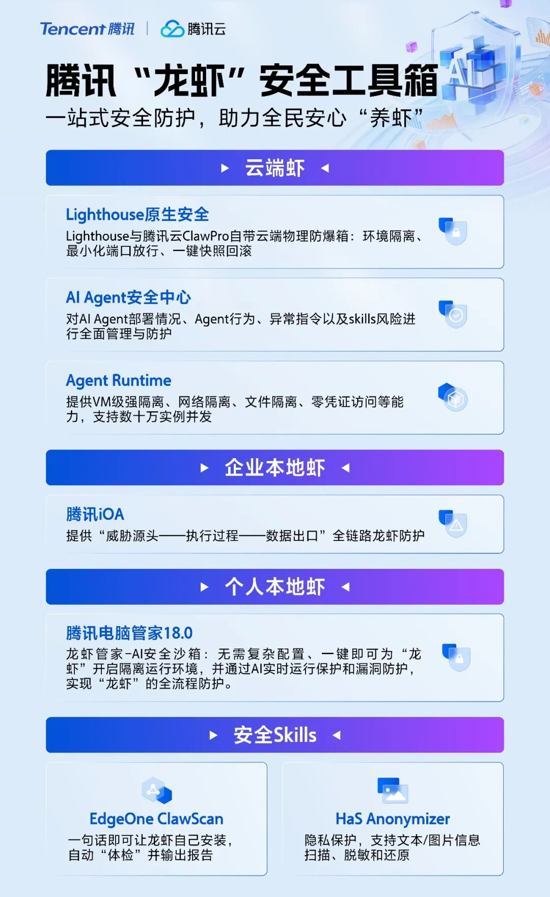

# 腾讯发布首个「龙虾管家」

> 公众号: 腾讯云
> 发布时间: 2026-03-13 22:51
> 原文链接: https://mp.weixin.qq.com/s/d7f2v3Oet1o59zE6ZEXIOg

---

本地部署的“龙虾”安全更有保障了！

刚刚，腾讯电脑管家在18.0新版本推出行业首个

「龙虾管家·AI安全沙箱」

功能，为本地运行的 AI Agent 提供一站式安全防护。

用户无需复杂部署，即可开启多重安全保护，覆盖系统安全、Skills 安全、支付安全、Prompt 安全等多个维度，实现 AI 应用的隔离运行、全程防护、行为溯源。

目前，「龙虾管家」已支持 OpenClaw、QClaw、OneClaw、LobsterAI 等多种“龙虾”。

//五大安全能力，构建「安全隔离虾房」

围绕本地部署潜在的权限滥用、恶意技能注入、系统篡改等问题，「龙虾管家」构建了多层安全能力体系：

-沙箱安全策略

可管控 AI 对系统底层资源的访问权限，对异常支付行为发起拦截，防止 AI 工具修改用户系统级文件。

同时支持自定义全局敏感路径黑名单，禁止 AI 访问隐私或核心文件，从源头限制高风险操作。

-AI实时运行保护

在 AI 运行过程中进行实时安全监测，对 Prompt、Skills、执行脚本 等多个维度进行检测，识别并拦截注入式攻击和高危技能执行，隔离潜在风险操作。

-AI 漏洞防护

支持发现并修复 AI 应用安全漏洞，可开启定时漏洞扫描，并监测 AI 应用端口暴露及网关密码安全，防止未授权访问。

-全流程行为审计

腾讯电脑管家为每个 AI 应用提供独立日志入口，完整记录操作类型、风险等级及处置结果，让 AI 应用全链路操作可追溯。

同时，「龙虾管家」通过实时监测 + 智能拦截的机制，对高风险 Skills 下载、危险指令执行、越权访问等行为进行即时检测。一旦发现异常即可第一时间拦截，从源头阻断潜在攻击路径。

//30+ AI安全能力，为本地 AI 使用提供完整防护

「龙虾管家」搭载的腾讯电脑管家 18.0 版本，是面向 AI 时代的重大更新。

该版本已内测半年，累计升级 30 余项 AI 安全能力，构建起面向个人用户的AI安全防护体系，也是目前首个功能完备的C端 AI 安全产品。

比如，新增的「AI应用隐私保护」功能，能够可视化展示各类应用（包括 AI 应用）的数据权限访问记录。

例如，剪贴板、音频录制、摄像头、麦克风、位置信息等敏感权限。

用户可以直观查看近期敏感权限的调用次数与最近使用时间。

点击“详情”页面，还可进一步查看具体调用记录，并识别该权限调用是否由用户主动触发或软件自动调用，帮助用户更好识别潜在风险，提升 AI 应用使用的透明度与安全性。

养虾体验奇妙，安全更重要。

腾讯“龙虾”安全工具箱已上线，让大家养虾更安心。

---

各种疑难杂症，欢迎扫码进库，养虾更酷👇

---

