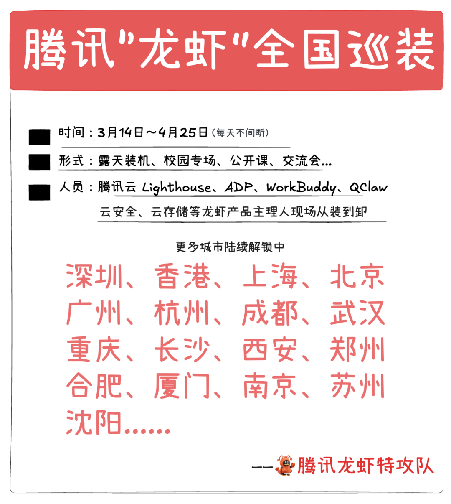
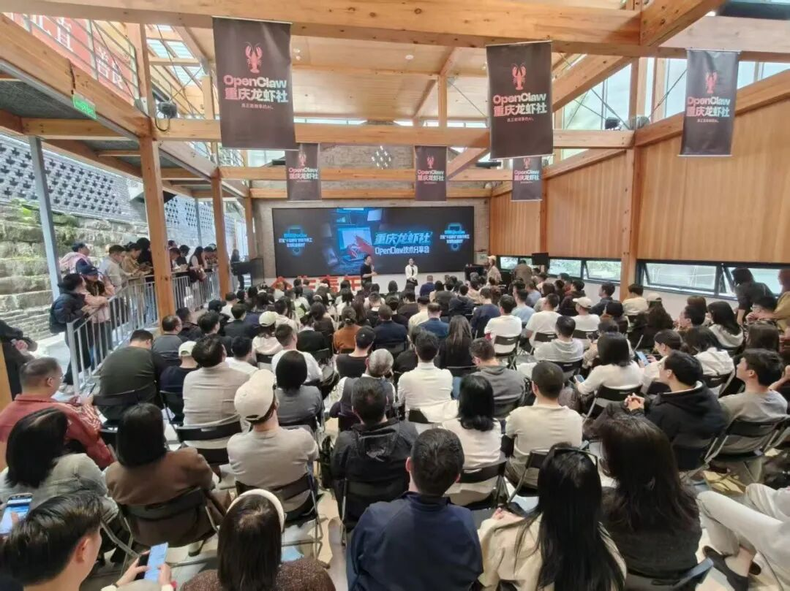
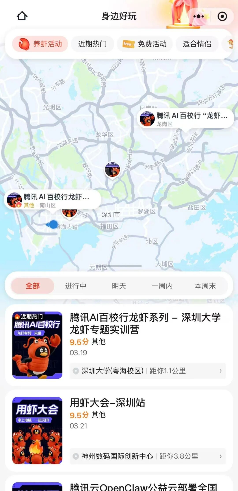

# 久等了！腾讯“龙虾”全国巡装来了

> 公众号: 腾讯云
> 发布时间: 2026-03-14 14:45
> 原文链接: https://mp.weixin.qq.com/s/9goUQebmqabWrOTaQifgtw

---

腾讯 “龙虾” 全国免费安装计划，正式启动！

未来40天，腾讯云Lighthouse、ADP、WorkBuddy、QClaw、云安全、云存储等龙虾产品的主理人和技术专家，将奔赴17个城市，与各位爱 🦞 人士面对面交流。

说是免费安装，但我们提供的是一条龙服务。

安装部署👉模型配置👉技能安装👉正式使用👉卸载清理（如果用户需要的话）。

总之，你的一切养虾问题，都可以现场抓住他们随时提问。

//还是那个味：腾讯公司楼下免费装虾

在本次全国巡装活动中，用户呼声很高的“腾讯公司楼下免费安装活动”会限时返场。

目前这三场活动的档期、场地、人员已经搞定👇

📍3月21日，深圳市龙岗区机器人街区（星光广场）

📍3月27日，上海腾讯滨江大厦

📍4月3日，北京腾讯总部大厦

不用报名、不用预约，带上电脑直接去。

在现场一站式完成 OpenClaw 部署、技能安装和环境配置，体验龙虾的自动化能力。

//进校园：腾讯高校龙虾专列开了！

腾讯龙虾的车这次还会专门开辟校园专列——腾讯AI百校行“高校龙虾专列”正式发车！

包含“龙虾科普公开课”、“玩转龙虾实训营”、“龙虾社群”等活动，与师生分享科学养虾指南、安全防护攻略、个人玩虾技巧等丰富的AI科普和实践技能。

深圳、北京、广州、上海、成都、武汉、西安、香港陆续抵达，我们校园见！

-高校学子请关注「腾讯教育」公众号，即将启动专场报名

//17城接力，等你解锁龙虾的实用价值

未来 40 天，龙虾公开课和装机活动还将陆续走进：深圳、上海、北京、广州、杭州、成都、武汉、重庆、长沙、西安、郑州、沈阳等全国17个城市。

面向企业用户和开发者等不同群体，开展一系列 “装虾、用虾、探虾” 活动。

👉[报名戳这](https://wj.qq.com/s2/25958571/zd2b/)

150多家合作伙伴也将和腾讯云一起奔赴全国，昨天重庆传回的现场

---

收藏这些信息，关注全国巡装最新信息👇

🔍来腾讯地图搜索“养虾地图”一键直达全国龙虾活动：

🐎扫码关注全国活动具体站点👇

🐎扫码进群，交流养虾心得👇

🧀各种疑难杂症，欢迎扫码进库，养虾更酷👇

如果你的城市也想办一场龙虾活动，欢迎在评论区留言。

---

