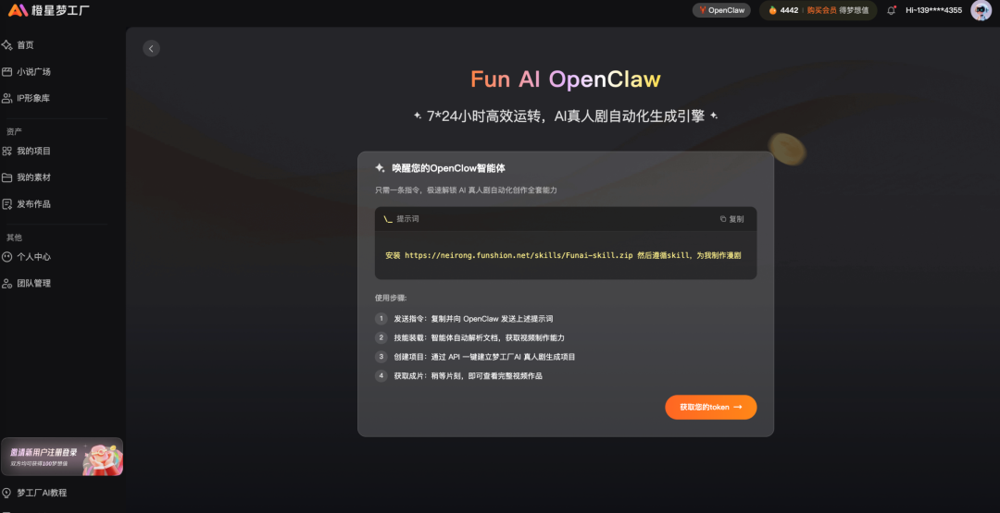
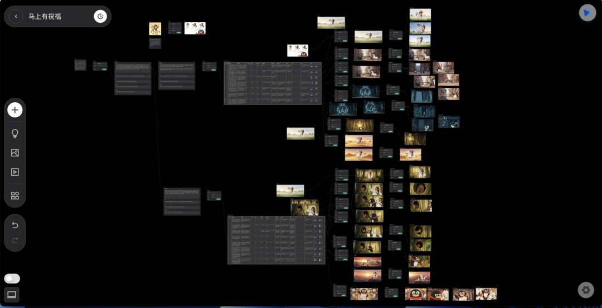
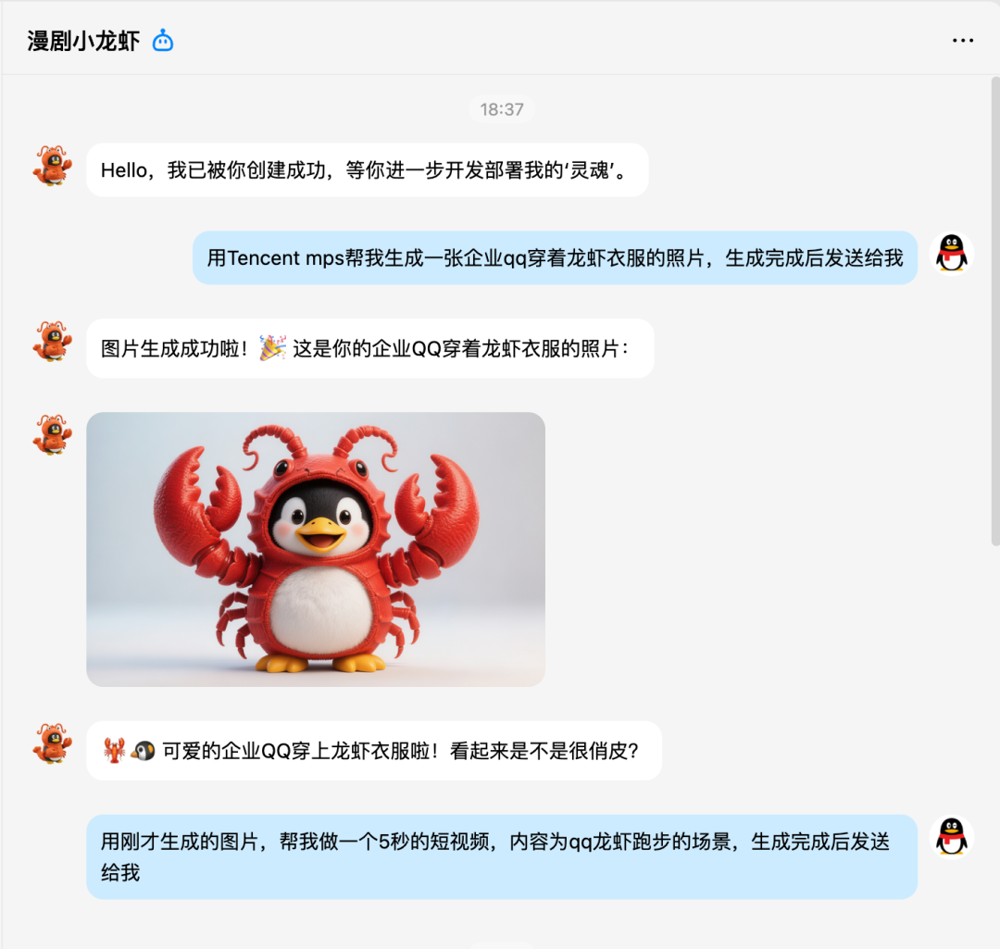

# 中国AI漫剧80%头部团队，都在用腾讯云

> 公众号: 腾讯云
> 发布时间: 2026-03-15 15:05
> 原文链接: https://mp.weixin.qq.com/s/A2ogmq_lNuneSet6aapCGg

---

刚签了一单AI漫剧合同回来，向各位汇报这个火热赛道的最新情况👇

- 腾讯云已服务中国80%漫剧行业头部团队，生产的内容在全球市场都吃香（北美、东南亚、日韩最明显）
- 腾讯云每日助力客户生成4万张AI漫画、近40小时AI视频（约800-1300集漫剧）。
- 腾讯云模型调用、媒体处理（MPS）等整体调用量环比增长近300%。

撑起日更千集的超高产能，背后靠的是一整套云上的AI制作能力👇

# //AI漫剧全链路生产能力

过去，漫剧生产链条（剧本→分镜→角色→漫画→视频→配音→后期）碎片化严重。

现在，越来越多团队选择将整条链路“搬”到腾讯云上：

- 生成阶段： 腾讯混元大模型等提供全栈AIGC能力。其中 HunyuanVideo 支持根据脚本/分镜图直接生成视频，极速缩短素材生产周期。
- 声音阶段：AI语音合成与声音复刻支持多角色、复杂情绪表达及多语言输出。
- 后期阶段：腾讯云AI音视频能力实现画面修复、补帧与超分，确保画质达到商业分发标准。

目前，每天有超过5万分钟漫剧视频在腾讯云上完成增强处理，帮助团队在保持画质统一的同时，综合制作成本降低约20%。

例如风行在线AI漫剧平台，已经将视频合成、视频增强等生产环节迁移到腾讯云，通过混元大模型与MPS能力，实现漫剧内容的自动化生产与规模化处理。

这些能力还将被整合进一个统一工作台。腾讯云正在研发 SuperX Studio，统一AI生成、视频制作与云端算力资源。

# //把 AI 能力做成 Skill，让 Agent 自动成片

#

为了让 AI 能力被更灵活地调用，腾讯云正在把内容生产能力 Skill 化。

腾讯云近期将媒体处理能力封装为Tencent MPS Skill，覆盖视频转码、视频增强、字幕识别与翻译、去字幕处理、图片增强以及AIGC视频与图像生成等能力。

通过Skill，这些原本需要复杂API调用的能力，可以被OpenClaw、WorkBuddy等AI Agent直接调用，漫剧企业甚至在QQ上就能完成整套内容制作。

创作者只需提交原视频，Agent 就会自动触发一整套制作流程：

拆解分镜 → 识别角色 → 生成风格参考图 → 生成分镜视频 → 自动重组内容。

原本需要多款软件协作完成的制作流程，现在可以由 Agent 自动串联完成，大幅降低 AI 漫剧制作门槛。

这些能力以 Skill 插件形式被 Agent 调用，让 AI 漫剧生产真正实现自动化与规模化。

AI 漫剧时代，我们陪大家一起跑。

让每一个内容创作者，都能日更千集，日进斗金。

---

各种龙虾疑难杂症，欢迎扫码进库，养虾更酷👇

---

