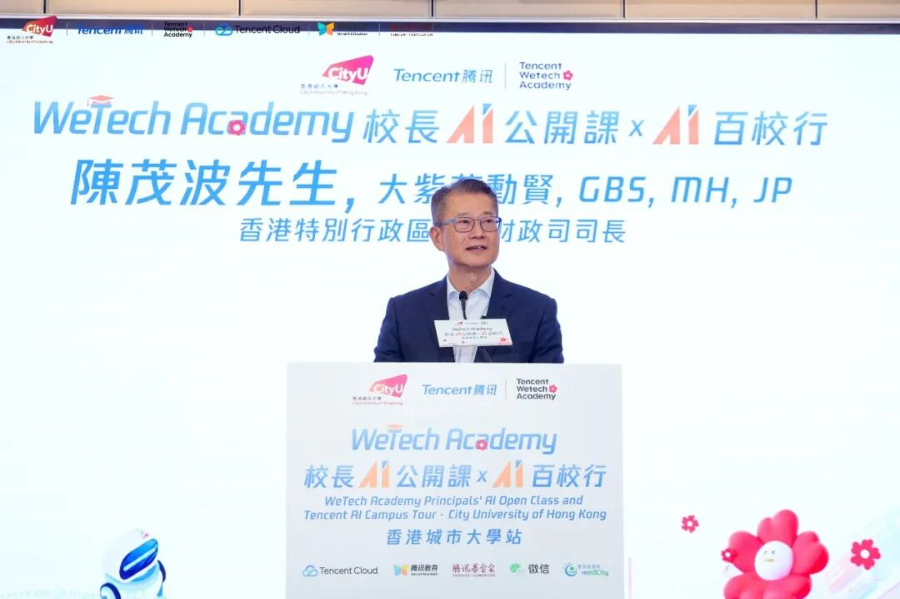
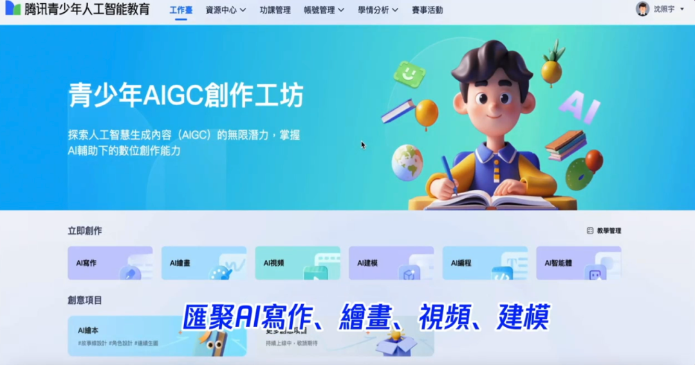

# 腾讯宣布多项香港AI人才培养举措

> 公众号: 腾讯云
> 发布时间: 2026-03-16 19:45
> 原文链接: https://mp.weixin.qq.com/s/UCHb_NkJGBw0zXzsvcGDEw

---

今天在香港，腾讯宣布多项AI人才培养举措。

围绕AI学习工具、AI基础设施与AI赛事体系三大方向，为香港全民构建从学习、实践到科研的完整成长路径。

（图：香港特别行政区政府财政司司长陈茂波在现场致辞）

//腾讯青少年人工智能教育平台港澳 AIGC 版发布

新版本重点强化 AIGC 创作能力。平台通过 AIGC 创作工坊提供写作、绘画、编程等多模态创作工具，支持学生进行 AI 文本、图像、视频、3D 和程序创作，让学生在创作真实作品的过程中理解和使用 AI。该平台在内地已沉淀超过 100 万份AI作品。

同时推出 AI 自主学习工具 “快叮岛”，将 AI 与编程知识拆解为闯关式学习任务，通过游戏化方式帮助青少年逐步掌握 AI 基础能力。

在落地香港之前，腾讯青少年人工智能教育平台已在全国300多个城市、2万多所学校落地应用。

//提供科研算力与AI全栈能力

面向港澳高校，腾讯以全球AI基础设施为支撑，助力高校科研加速、学习提效。在科研方面，腾讯云科学计算平台TEFS，支持高校快速构建科学计算环境，开展 AI for Science 研究与创新应用。

腾讯云分布全球的基础设施助力港澳高校国际化科研合作，其中高性能计算集群 HCC、TurboFS 高性能存储等，为大模型训练和科研数据处理提供稳定的数据底座。

腾讯云Cloud Studio为高校便捷开展AI教学与实训。以CodeBuddy和WorkBuddy为代表的AI工具为高校师生提供智能化、轻量化、一站式学习辅助。

同时，腾讯还将推出系列 AI 课程体系，并结合腾讯云培训认证体系，与香港高校开展课程合作，帮助学生系统掌握 AI 技术能力，并提升产业实践能力。

//WeTech Academy 2026 人才计划升级发布

Tencent WeTech Academy 自 2025 年成立以来，已惠及 近 5 万名港澳青年。升级后的 WeTech Academy 推出“AI for Good”计划，将进一步鼓励学生运用 AI 技术解决真实社会问题，例如：

-面向中小学生

联合香港机电工程署、保良局、香港圣公会福利协会、成长希望基金会等社会福利机构，带领学生深入社区考察，通过 “科技+公益” 模式，用AI解决社会痛点。

-面向大专院校

全国赛事“2026 LIGHT 创造营”首设港澳赛区，并与香港明爱共同设立 “长者慢性病管理” 港澳专属赛题。优秀项目最高可获得 10 万元人民币资助及腾讯云资源，推动项目落地应用。

-连接全球创新赛事

第四届微信小程序全球创新挑战赛今天也正式启动。上一届赛事中，香港中学生开发的 AI 小程序 “声声慢”，通过 AI 技术帮助听障人士进行语言学习，获得全球总决赛一等奖。（同时还获得日内瓦国际发明展 Young Talents 金奖，并计划在特殊学校落地应用）

AI人才，从校园生长。

天马行空的创想，开始发芽。

(3月16日，腾讯AI走进港城大，香港师生在元宝“天马行空”画展区创作AI作品)

这是今年腾讯 AI 进校园的第一站，更多校园正在路上。

---

🧀龙虾各种疑难杂症，欢迎扫码进库，养虾更酷👇

---

