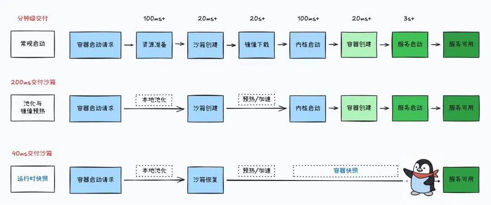

# 腾讯云 x MiniMax：平稳运行百万级Agent RL沙箱

> 公众号: 腾讯云
> 发布时间: 2026-03-17 19:56
> 原文链接: https://mp.weixin.qq.com/s/hLr_iERh2lFhbsm4tPeAZg

---

最近，MiniMax与腾讯云合作，成功完成一次Agent基建的重要实践。

基于腾讯云，MiniMax开始部署百万级吞吐、十万级并发的Agent RL（智能体强化学习）沙箱，并在测试环境中实现全量平稳运行。

这助力MiniMax的强化学习框架(Forge)，能在大规模Agent训练场景下做到 “环境秒开、用完即删”，最终让训练更快、更稳、成本更低。

在Agent RL训练中，模型不再只是生成内容，需要在真实环境中不断尝试：写代码、运行程序、再根据结果持续优化策略。

而这些执行过程的每一步，都依赖一个独立的运行环境——“沙箱”。

腾讯云Agent Runtime沙箱如何实现的？

//多组训练任务，瞬时启动上万个执行环境

在 Agent RL 训练中，执行代码的不再是工程师，而是 Agent。模型会像开发者一样不断尝试解决问题：

读取代码 → 修改 → 运行 → 查看报错 → 再尝试一次。

很多训练任务甚至来自真实开源项目，例如 GitHub 上的 bug 修复任务（如 SWE-bench）。

但和真实开发不同的是，这些操作全部由 Agent 自动完成。每一个任务，都需要启停沙箱。

当训练规模扩大，一轮任务可能需要瞬时启动上万个执行环境，一天的峰值规模可以达到百万级。

更复杂的是，这些环境往往并不相同。不同 GitHub 项目对应不同依赖库和运行环境。在一些训练场景中，系统需要一瞬间拉起十万个环境，这里面甚至有数千到上万个不同的镜像。

在这样的规模下，执行环境不再以“按需创建”为主，而是以资源池形式常驻，由调度系统统一编排。

环境的创建、分配与回收被收敛到同一执行路径中，使大规模并发任务能够持续推进，而不会在环境层面形成阻塞。

//启动慢一秒，GPU 就可能空跑

并发高还不够，得快。当 Agent 生成任务时，系统需要立即唤醒一个新的执行环境。

如果环境准备时间过长，GPU 就会持续等待任务开始。在大规模训练中，这种等待会被迅速放大，转化为算力空耗。

（腾讯云沙箱“运行时快照”能力，得以让启动更快）

因此，执行环境需要具备快速进入可运行态的能力。

在实际运行中，沙箱并非从零初始化，而是基于预初始化状态进行恢复，仅加载必要运行上下文，毫秒级即可进入执行阶段。

//十万环境背后，是海量镜像分发

当训练任务瞬时启动数万环境时，如果每个环境都完整拉取镜像，网络带宽和存储很快就会成为瓶颈。

但在腾讯云Agent Runtime沙箱的工程哲学里，大部分镜像数据并不会被“真正”访问。

因此，镜像不再以“整体分发”为前提，而是通过镜像去重，在运行过程中按需加载，并结合节点侧的数据复用机制减少重复读取。

镜像访问、缓存与调度被统一纳入执行链路中，使系统在高并发环境启动时，依然能够保持稳定吞吐，而不会被带宽限制。

Agent时代，基础设施不再单纯提供资源供给，而是贯穿Agent训练、执行、对外服务整体，是决定Agent能力天花板的核心所在。

腾讯云正在和客户一起加速，让每一个Agent都能放心在云上展开手脚。

---

各种龙虾疑难杂症，欢迎扫码进库，养虾更酷👇

---

