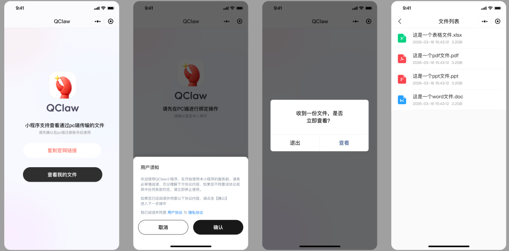
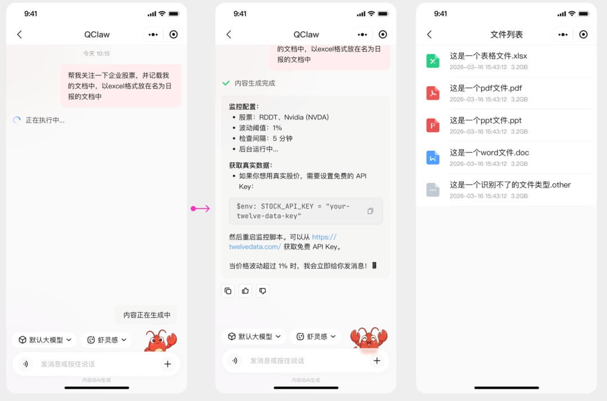
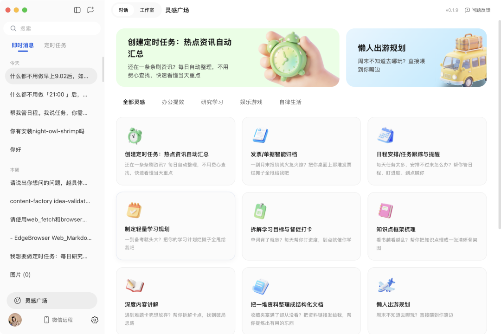
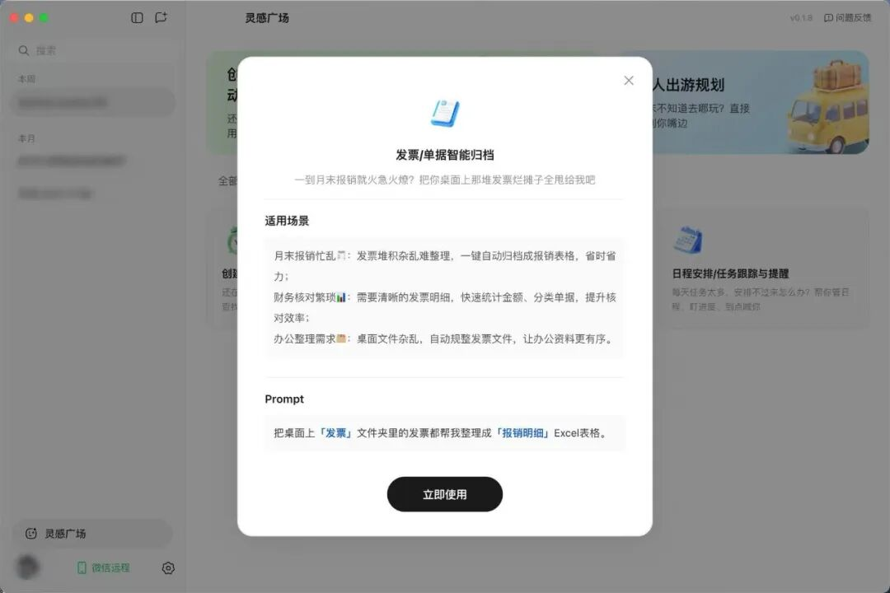

# 腾讯QClaw来了！微信入口全面升级

> 公众号: 腾讯云
> 发布时间: 2026-03-18 09:33
> 原文链接: https://mp.weixin.qq.com/s/AzrWd8Xw1b53cQdVbUGAPw

---
   腾讯QClaw宣布重大版本更新。

微信入口升级为小程序，支持上传或接收电脑端文件；「灵感广场」全新上线，预置常用任务与 skills，用户无需编写指令即可一键使用。

👉[官网下载新版本](https://qclaw.qq.com/)

QClaw 基于 OpenClaw 极简封装， 是一款人人都能轻松使用的 AI Agent。不用配环境、不用写命令、也不用调模型，下载、安装、开工，三步就能在微信里远程操作，让电脑帮你干活。

前期小范围内测，很多同学没能参与体验。抱歉，我们来晚了。

这次的新版本扩大内测范围，码管够，希望你会喜欢这个版本（v0.1.9）。

新版本亮点快速Get👇

//微信入口升级为小程序：给龙虾派活更简单

QClaw 是首个实现微信互联的「龙虾」。

这次版本升级，我们把入口从原来的微信客服号，升级成了微信小程序（微信搜索「QClaw管家」小程序）。

现在，你可以直接在小程序接收 QClaw 发送的电脑文件。很快，小程序将支持语音、图片传输等微信原生的多模态交互能力。你发一句话，就能让电脑帮你执行任务。

更多小程序新功能正在赶来，QClaw将陆续支持在小程序快速创建定时任务、实时接收任务消息、远程切换底层模型等能力，让Agent真正满足用户日常办公、信息处理、任务执行的需求。

//「灵感广场」全新上线：预置常用Skills，点一下就运行

Skills是龙虾的灵魂，很多人第一次用 Agent，卡在不知道该怎么下指令。

本次版本同步上线「灵感广场」围绕办公提效、深度研究、娱乐游戏、自律生活等场景，预置常用任务，并自动加载对应 skills。

用户无需配置或编写指令，点击「立即使用」就能运行skills，让灵感通过Agent执行和完善。

内测这段时间，我们主要在把使用体验一点点打磨得更顺。比如对话更清楚了，记忆更有条理；任务可以搜索、删除和管理，不容易丢；定时任务也做了分区，方便回看之前的想法和待办。

每一个小改动，都希望你用起来，会更顺手一点。当然，QClaw还有不少地方在继续优化。如果有不如意的地方，也欢迎直接告诉我们。

我们希望QClaw是一款足够简单的产品，简单到我们的父母也能用上。

十年前，你第一次帮父母装上微信，体验移动社交。

现在，QClaw的入口就在微信里，可以顺便帮他们装上第一个Agent。

欢迎使用QClaw。

---

龙虾各种疑难杂症，欢迎扫码进库，养虾更酷👇

---

