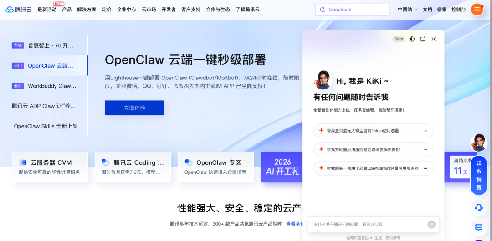
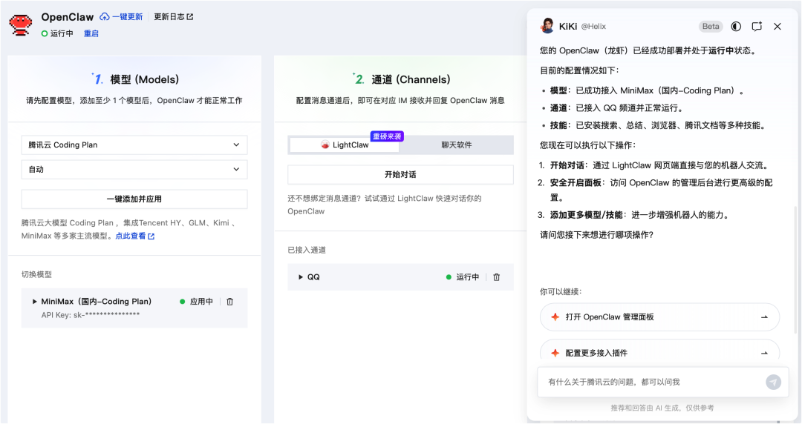
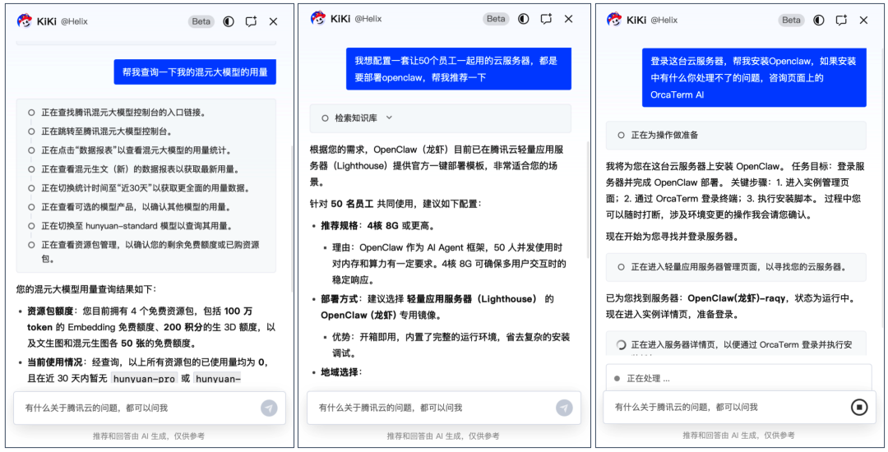
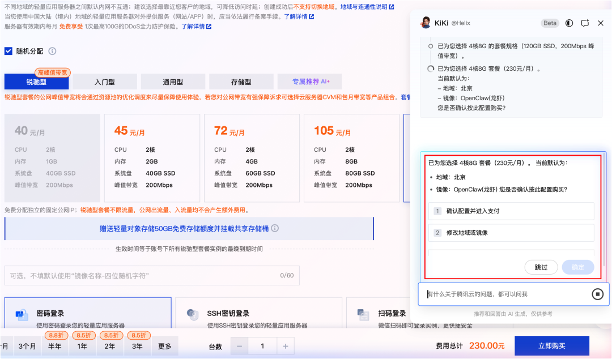
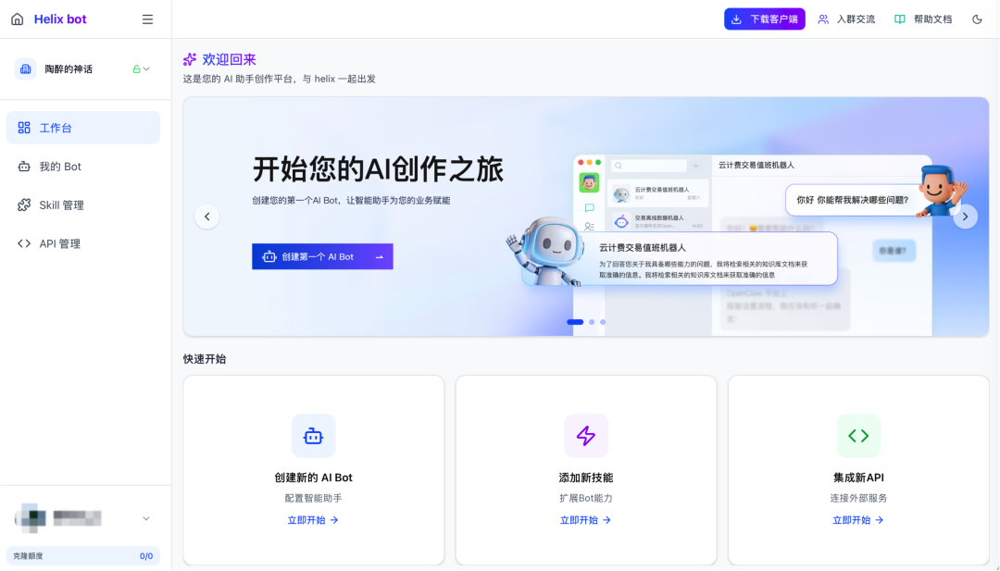
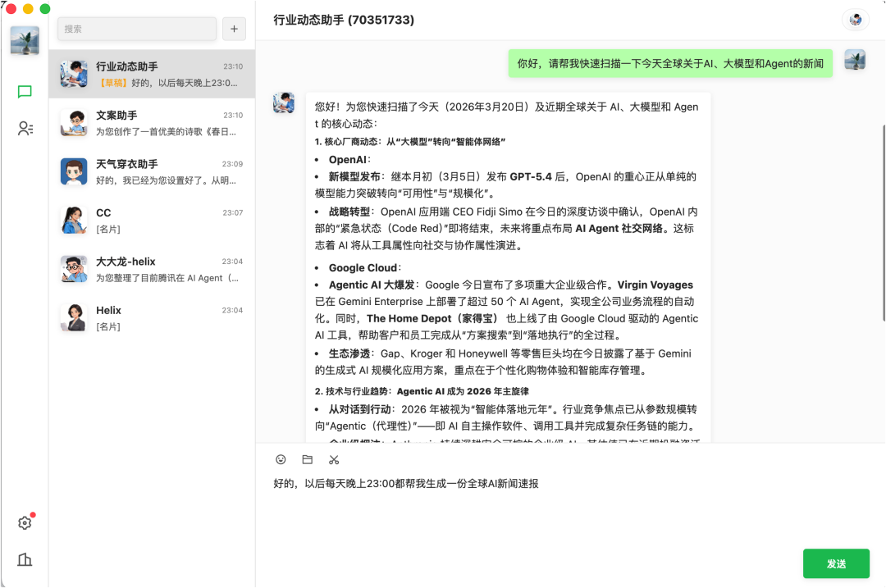

# 今天，超2000人在腾讯云官网“用嘴”部署龙虾

> 公众号: 腾讯云
> 发布时间: 2026-03-20 23:44
> 原文链接: https://mp.weixin.qq.com/s/XfF-ToqK3_18YwSwPIYa_w

---

腾讯云正式发布行业首个官网内置Agent助手—KiKi，用户只需用一句自然语言描述需求，KiKi即可在控制台模拟人完成资源配置、服务购买、应用部署等一系列操作。

零基础的小白用户，也可以安心在腾讯云上低门槛部署全套云服务。

不同于传统AI助手仅能问答，KiKi具备完整任务执行能力，可理解页面上下文、自动拆解步骤并跨页面操作。目前，KiKi已全量登陆腾讯云官网。

KiKi上线第一天，就有超2000名用户通过一句话完成OpenClaw“零操作”部署，DAU较上一代AI助手提升超10倍，用户人均对话达14.6次。在典型部署场景中，KiKi实现整体节省约92%时间。

//说一句就能干活，小白也能玩转云控制台

对于刚进入云官网、希望完成部署或配置的新用户来说，传统路径往往需要在多个页面之间来回切换：选实例、配环境、查文档、做配置，每一步都依赖经验。

现在，这件事被压缩成一句话。用户只需输入“帮我部署 openclaw”，KiKi就会自动完成资源购买、环境初始化到部署配置的全过程，并在关键节点提示确认，其余步骤全部自动执行。

 KiKi还可以实现在官网、控制台、购买页等多个页面之间的自动跳转，理解当前上下文，自主拆解任务并选择最优路径执行，把原本割裂的多页面操作，变成一次连续完成的任务。

//全流程安全可控，关键地方会问你

在执行能力之外，KiKi也保留了对流程的控制权。

所有操作步骤均可视、可追溯，用户可以随时介入或中断；在涉及关键或敏感操作时，系统会主动暂停并请求确认，确保操作边界清晰可控。

当任务执行受阻时，KiKi还能自动调整策略、重新规划路径，像工程师一样解决问题，而不是简单报错终止。

这意味着，云服务的使用体验正在发生变化——从需要反复确认的复杂操作，变成可以放心交给系统执行的任务流程。

//KiKi也可以被“搬”到企业业务里

KiKi并非只能待在腾讯云官网，而是基于腾讯云Agent平台 Helix （内测中）构建的一类通用Agent能力，可快速复用到企业官网、内网系统及各类数字服务场景中。

可以理解为，企业可以从 Helix 把这类Agent“克隆”到不同场景里，让一个数字化助手在各个入口持续提供服务。

在Helix里，可以尽情发挥想象力创建BOT，而那些最具创意、最具生产力的BOT，还有机会通过社交链和交易链被更多人扩散使用。

这意味着，KiKi所代表的不只是一个产品能力，而是一种新的服务形态。

未来，企业的销售、售前甚至架构师，都可以借助Agent，以更低成本提供具备海量知识、秒级响应的服务能力；用户也无需依赖人工沟通，即可完成从咨询、决策到执行的完整流程。

同时，原本分散在搜索、对比、决策、下单、售后等多个环节的用户路径，也有机会被压缩进一个统一的Agent入口中完成。

你好，

AAA云服务KiKi姐已在线，

有任何问题随时告诉我。

---

