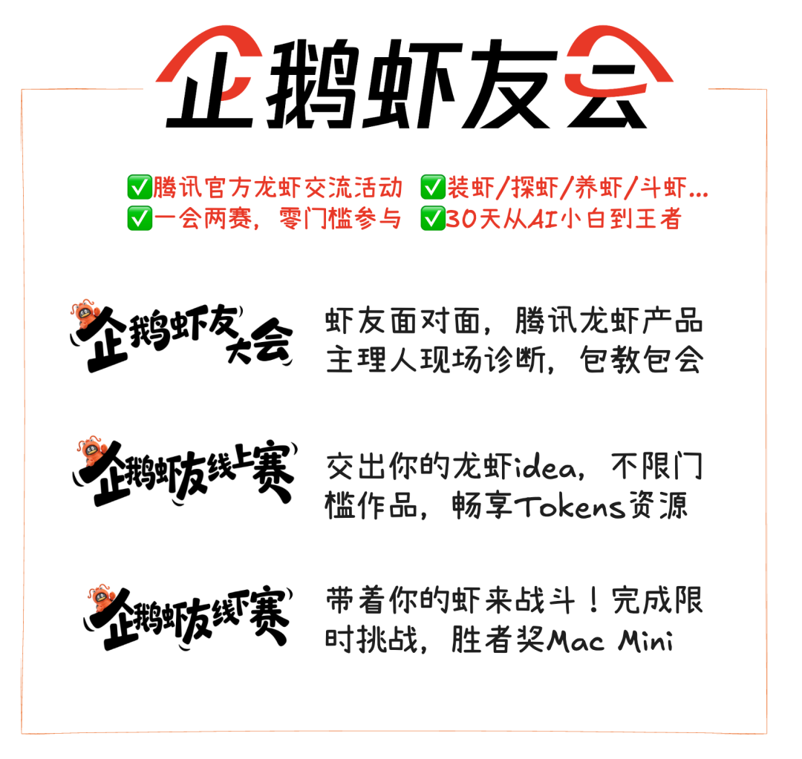
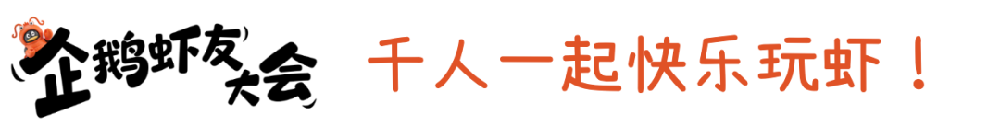

# 企鹅虾友会，等你来玩！

> 公众号: 腾讯云
> 发布时间: 2026-03-20 20:41
> 原文链接: https://mp.weixin.qq.com/s/xlug8_cbEQmfbeoYtw4gig

---

今天，腾讯正式启动全国养虾互助和赛事活动「企鹅虾友会」，通过“一会两赛”（企鹅虾友大会、企鹅虾友线上赛、企鹅虾友线下赛），在全国范围内打造覆盖入门科普、创意实践到硬核对抗的龙虾生态社区 ，加速 Agent 全民普惠。

企鹅虾友会欢迎全国、全年龄段、全 AI 经验梯度人群参与，无论是刚接触龙虾的新手，还是已经在实际使用的进阶用户，都可以找到对应的参与方式和成长路径，快速进入“能用、好用、用于生产”的状态。

目前，所有活动已同步开放参与。参与活动，不仅可以获得云资源奖励，还有机会获得官方认证、进入产品共创与内测体系，并受邀成为腾讯官方 AI 产品体验官。

活动速览👇

- 面向普通用户与养虾爱好者的“玩虾”交流大会，也是万千虾友的线下社交平台。

- 腾讯QClaw、WorkBuddy、Lighthouse、企业微信、QQ等龙虾产品主理人和玩虾高手现身教学，提供龙虾通用知识分享、热门产品体验及养虾进阶指导。
- 现场有最热的虾系产品玩法，也有适配不同养虾阶段的技能互动，帮助小白快速从0到1养出能干活的龙虾。

报名开启👇

- 首场启动：3月29日（周日）13:30–16:30 ，深圳滨海大厦39楼多功能厅 。
- 报名方式：[戳这](https://wj.qq.com/s2/26050212/7q1y/)

参与可得👇

- 证书认证：参与全程可获得“企鹅虾友会虾友”认证 。
- 限定周边：参与互动，多款龙虾鹅限量周边等你兑换 。

活动速览👇

- 不设门槛的创意大赛，面向全国征集最会玩的“养虾达人” 。
- 无论你是用龙虾来职场续命、日常整活还是开发脑洞应用，只要够创意通通欢迎 。
- 活动模式：线上征集、专业评审、线下颁奖及路演分享 。

参与方式👇

- 作品提交期：2026年3月20日— 4月30日 。

- 工具要求：需使用腾讯养虾工具（如WorkBuddy、QClaw、Lighthouse等）实现创意想法 。
- 提交方式：[戳这](https://doc.weixin.qq.com/forms/AJEAIQdfAAoAJEA_wYsACkCNUj9IqnZDf)

奖励认证👇

- 硬核奖励：最高可获“至尊虾王奖”，奖励50000 WorkBuddy Credit，共计100名 。
- 荣誉权益：颁发官方认证“养虾达人”电子证书，并授权成为“企鹅虾友会公益大使” 。
- 专属福利：获奖者进入达人库享有产品内测资格，并赠送专属纪念公仔 。

活动速览👇

- 集“线下赛虾+全程直播”于一体的实战对抗赛
- 选手需使用腾讯系龙虾产品，在规定时间内完成多轮高强度技术任务 。
- 比赛采用投票计分制，评委根据任务完成情况现场投票累计积分 。

参与方式👇

- 比赛时间和地点

 📍深圳场：3月22日 14:00-16:30 深圳腾讯滨海大厦

 📍上海场：3月26日（具体时间地点待通知）

 📍成都场：3月31日（具体时间地点待通知）

- 报名方式：[戳这](https://docs.qq.com/form/page/DWndzTWhEdVhtWEFI#/fill)

胜者奖励👇

- 实物大奖：第1名奖励Mac mini，2、3等奖包含机械键盘、Lighthouse代金券等 。
- 段位证书：根据排名颁发“经典老钳”、“高级钳工”、“中级钳工”等官方证书 。
- 普惠奖：所有参赛选手均可获得企鹅公仔。

更多赛会信息，更新中。

Pony在财报中说：“人们既享受消费与娱乐，也从创作与高效工作中获得满足感，腾讯深感荣幸，能够提供AI服务全方位赋能用户，助其在这些领域更上一层楼。”

希望腾讯能和各位虾友在活动中一起成长。

快，带上你的虾，来全国大赛。

---

