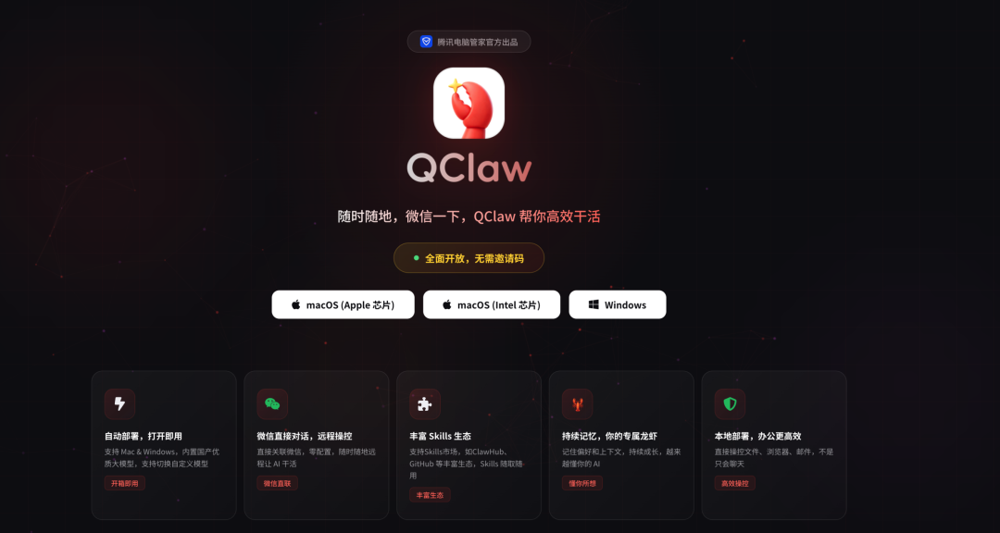
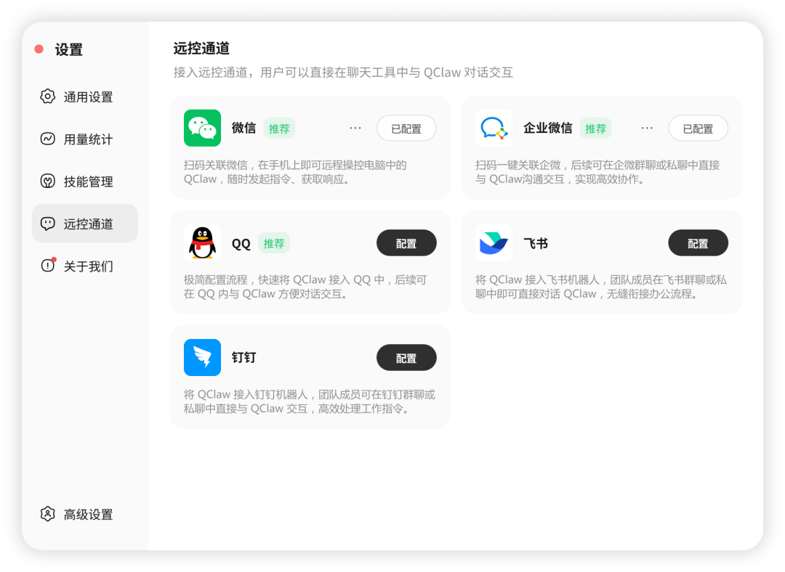
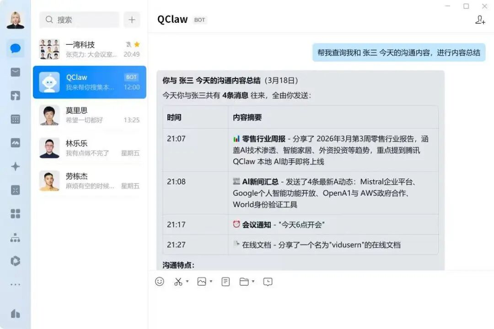
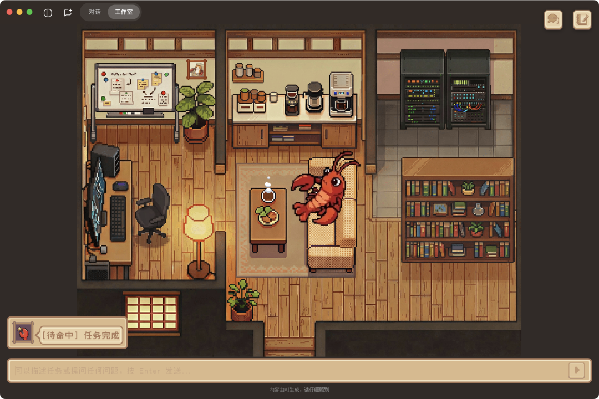
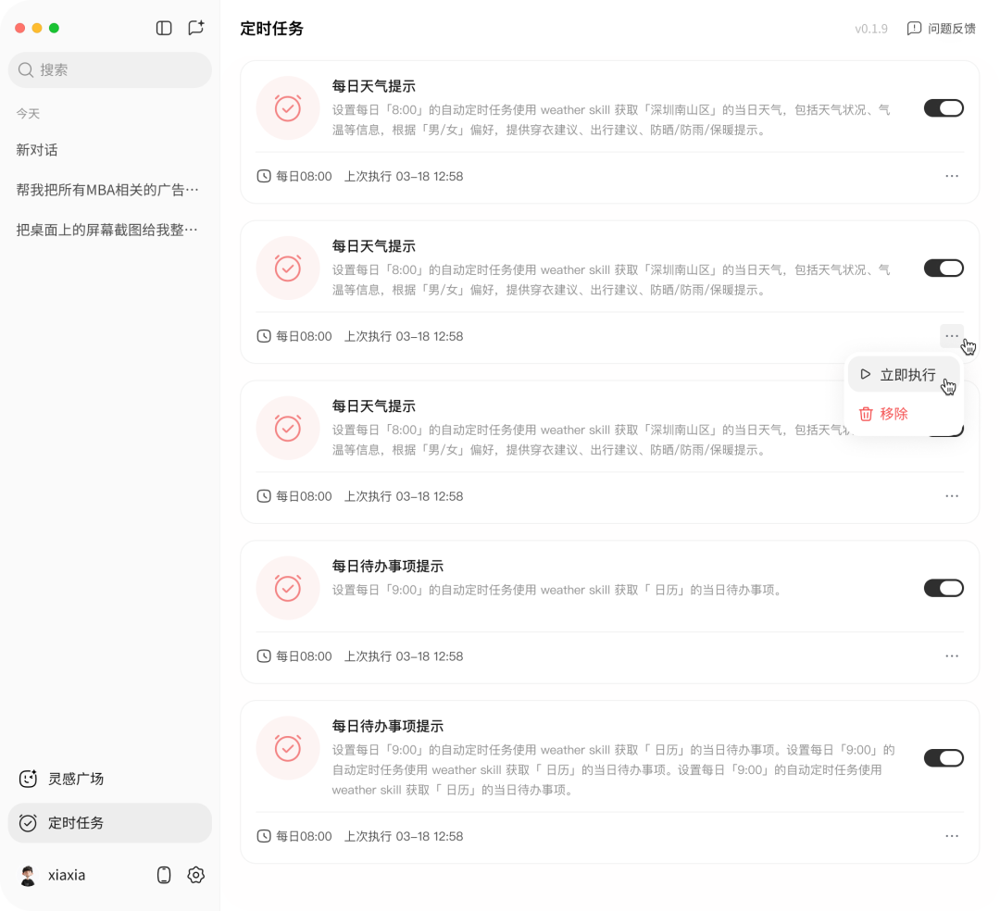

# 腾讯QClaw全面开放，无需邀请码下载就能用

> 公众号: 腾讯云
> 发布时间: 2026-03-20 12:43
> 原文链接: https://mp.weixin.qq.com/s/Tu8Eskf6Pmb5Kp9GIJp-Zw

---

今天，腾讯 QClaw 正式开启全量公测，无需邀请码，用户通过官网下载最新版本，20秒即可完成安装，并向“龙虾”下达指令。

新版本持续优化微信生态体验，同时打通企业微信、QQ、飞书、钉钉等多平台远控通道，进一步拓展 AI 协作入口。「龙虾像素工作室」、定时任务等特色功能也在本次公测中正式和大家见面。

立刻下载：https://qclaw.qq.com

//五大IM工具全覆盖，率先实现企微帮你回消息

现在，QClaw不仅支持一键扫码接入微信和企业微信，还同步打通了 QQ、飞书、钉钉等主流即时通信工具 。

在企业微信，QClaw率先实现帮你回消息（面向个人及10人以下团队）。一键扫码创建企微机器人，QClaw就能帮你总结单聊、群聊消息，还能写文档、订日程、订会议、写待办等等，就像你的一个“数字分身”。

无论你身处哪个办公软件，QClaw 都随时待命 。你只需在手机端发起指令，就能跨平台操控电脑执行任务，零配置即可实现互联效率的提升。

// 像素工作室亮相：给你的龙虾一个温暖的家

正式和大家介绍「像素工作室」。这个设计灵感来自开源项目 Star-Office-UI，QClaw 在与项目主创（海辛 @ring\_hyacinth 和阿文 @simonxxoo）沟通后进行了相关探索与实现，将其落地为龙虾的专属空间。

在这里，Agent不再只是后台一个隐形的进程，而是一个会根据工作状态忙前忙后的“像素打工人” 。用户可以直观看到其在整理资料、执行任务或待机等过程。

希望这个像素小屋能让你感受到龙虾的温暖。

// 可视化定时任务：把复杂的生活管理变简单

“每天查星座运势、看科技新闻，或者提醒自己按时喝水”，这些周期性需求现在都有了更科学的管理方式 。

全新升级的定时任务功能实现了全可视化的操作界面，所有历史任务都会被集中收纳 ，可以根据需要，对多个任务进行独立的开关、修改或删除 。

你好，我是 QClaw。

很高兴，正式为你服务。

感谢内测期间陪我们一点点打磨产品的朋友，大家的反馈我们都记下了。

今天，邀请码正式退场，QClaw 全面待命。

评论区互动抽5位幸运观众，

赠送“龙虾鹅”贴纸套装。

---

