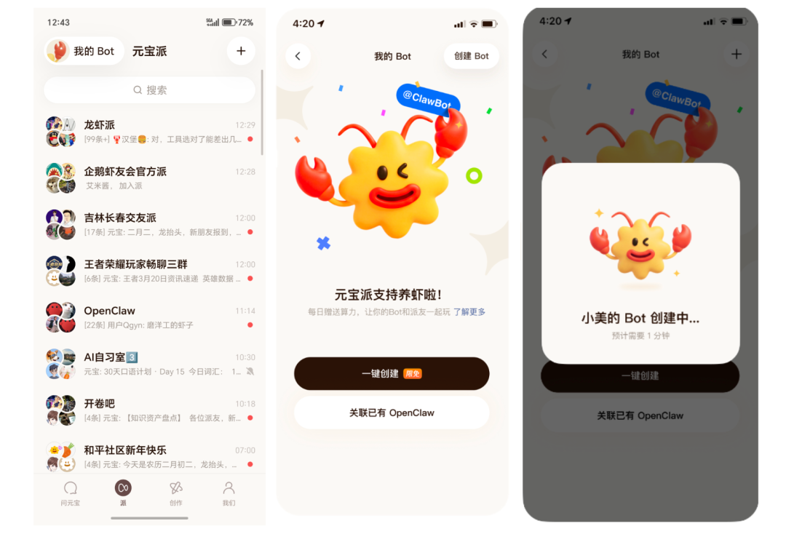
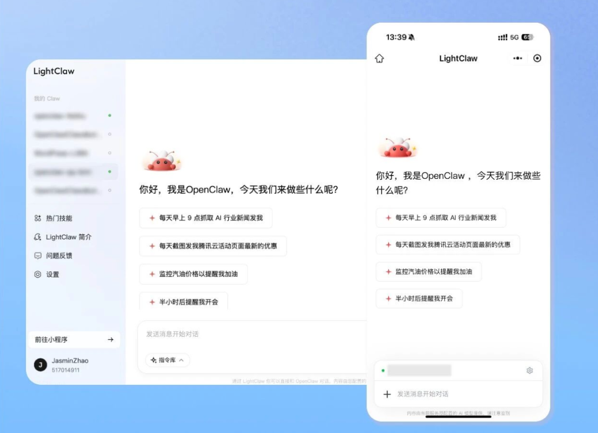
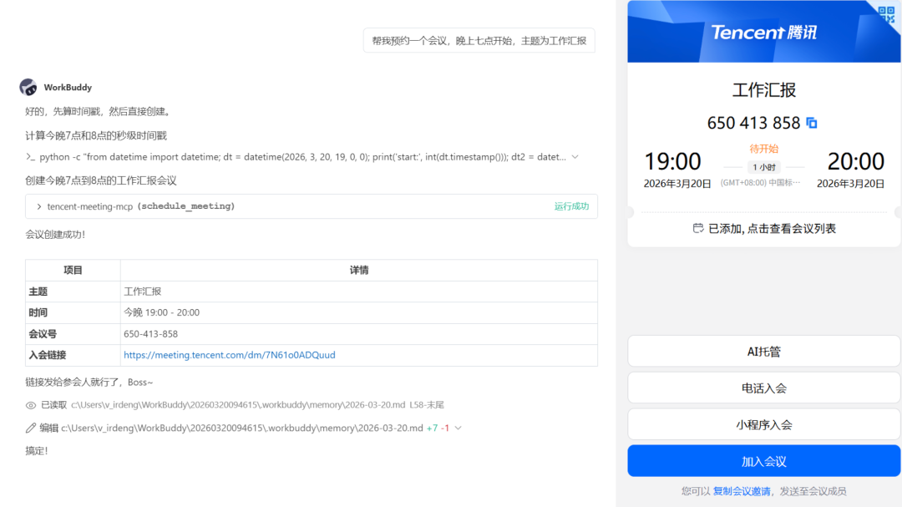
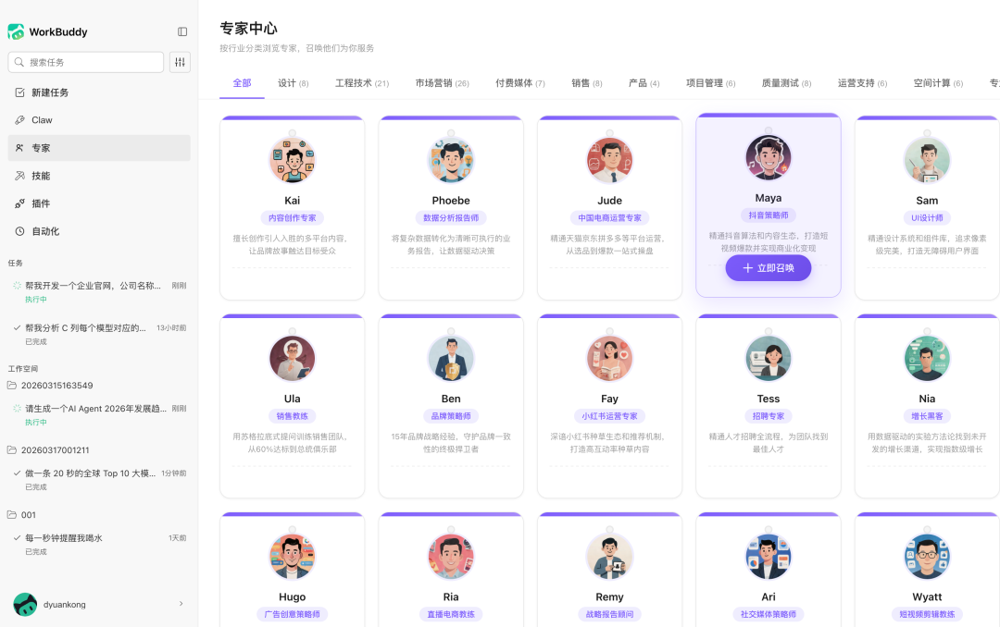

# 连续上新两周了，没停过

> 公众号: 腾讯云
> 发布时间: 2026-03-20 19:50
> 原文链接: https://mp.weixin.qq.com/s/OKj9nI039Z6ZGEWbyOl_Hw

---

腾讯龙虾特攻队集中上新一批好物，大幅降低装虾、用虾的门槛，打造简单好用的Agent体验。

- 元宝派 上线「一键创建」龙虾，在手机上无需部署、零配置，就能拥有专属龙虾，限时附带海量免费 Tokens。
- LightClaw 正式发布，打通微信小程序扫码直连，基于云端部署实现 0 通道配置，在微信和 PC 多端随时畅聊、调度龙虾。
- WorkBuddy 支持MCP，接入SkillHub；上线专家模式，内置12大行业140+专家，一句话调用，直接让“专家”干活。
- QClaw[全量公测](https://mp.weixin.qq.com/s?__biz=MjM5MDgwMzc4MA==&mid=2654906894&idx=1&sn=5a31e9fd75ebc2da7bdde08bd414979c&scene=21#wechat_redirect)，直连五大主流IM工具。

快速Get👇

//在元宝派领养1只龙虾，手机部署零门槛

对于还没有部署过 OpenClaw 的用户来说，最大的门槛往往是“第一步”。

现在，在元宝派中，这一步被直接简化成了在手机上“一键创建”。（3月20日至23日，每天晚20:00“元宝派”放送限量名额）成功抢到“一键创建”名额的用户，无需配置环境，也不需要理解复杂部署流程，只要在元宝派中完成简单操作，就可以直接拥有一只专属“龙虾”。

在创建完成后，这只龙虾可以被加入到不同的“派”中，与其他龙虾一起协作、聊天或执行任务，真正进入“龙虾社交”的使用场景。

在限时活动期间，新创建的龙虾还会自带 Token 补贴，降低实际使用成本，让用户可以更放心地尝试更多玩法。

//那个免费装机的Lighthouse，把通道配置的门槛降没了

免费装机让Lighthouse云端极简部署方案火出了圈，今天再次升级，发布LightClaw。

LightClaw 是腾讯轻量云为 OpenClaw 提供的专属对话通道，通过扫码即可将龙虾接入微信小程序，实现远程操控电脑和任务执行。

（在通道配置中选择LightClaw，扫码直连微信小程序）

相比传统方式，用户不需要额外配置复杂通道，也不需要切换多个工具，在微信中就可以完成指令发送、任务执行和结果查看，使用路径大幅缩短。

同时，LightClaw 支持 PC 与小程序多端协同，并内置常用技能和快捷指令，让用户几乎不需要学习成本，就可以直接上手使用 OpenClaw 的核心能力。

//WorkBuddy支持MCP，接入SkillHub，上线专家模式

龙虾连接更多的生态，才能“帮你打工”。WorkBuddy新增“配置MCP”能力，支持更多样化的方式打通其他生态。

现在，你可以让WorkBuddy 帮你预约腾讯会议了，或者管理ima知识库了。WorkBuddy还接入了国内高速技能社区 SkillHub ，提供超2.5万个技能一键安装。

WorkBuddy还直接把“专家”直接内置到产品里，上线行业专家模式，覆盖 12 大行业、140+ 位细分领域专家，从营销、技术到产品、设计等多种角色，都可以一句话调用。

和传统通用 AI 不同，这些专家不只是“给建议”，而是可以直接参与任务执行——写方案、做分析、生成报告，甚至完成代码与文档交付，把“想法”直接变成“结果”。

👉[更多玩法实践指南](https://mp.weixin.qq.com/s?__biz=MzkwMDY4OTI4MA==&mid=2247505148&idx=1&sn=4e50d33c36dc05d41fcd0998a1ddb3af&scene=21&click_id=176#wechat_redirect)

养虾有门槛，找腾讯龙虾特攻队。

---

