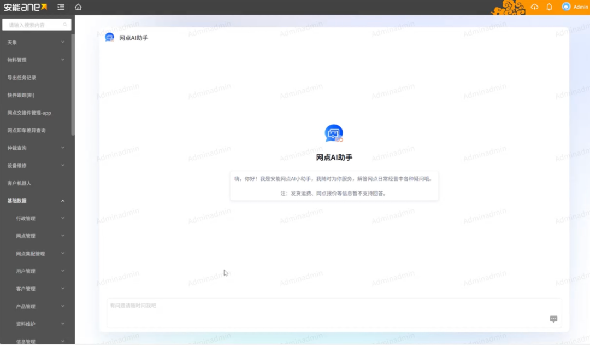

# 系统提速超30%！安能物流全量“搬家”腾讯云

> 公众号: 腾讯云
> 发布时间: 2026-03-21 13:59
> 原文链接: https://mp.weixin.qq.com/s/N6Jwl-dfFCYl8S2POHzlwA

---

好消息！腾讯云交到一位新朋友——国内零担快运的头部玩家安能物流。

最近，安能物流把全线核心业务都搬到了腾讯云上，打造了快运行业首个“会思考、能应变”的智慧物流中枢。

上云后，IT运维成本大幅降低，系统响应速度提升30%以上。

先感受下这次“搬家”的难度——

规模大：老机房里装着近百个机柜、近千台物理服务器及存储设备、数千台虚拟机，养着数十套核心系统；

架构杂：系统大多是“单体架构”，彼此牵连很深，稍有不慎，就可能出现系统脱节、数据不一致等问题；

时间短：业内同等规模的项目，通常半年起步，安能只给了4个月。更极限的是，为了避开业务高峰，真正的窗口，只有春节前后一周。

这样一个debuff叠满的任务，腾讯云不仅按时完成，还交出“业务零中断、数据零丢失、体验零降级”的答卷。

腾讯云派出专项团队驻扎现场，制定了“分层迁移、分批上线”的整体策略，基于腾讯云自研迁移工具，像搬运精密仪器一样，搬完一台测一台，测完一台切一台。同时派驻专家全程带教，帮助安能团队完成从传统运维到云端运维的丝滑转换。

上云之后，安能物流基于腾讯云“云+地图+AI”能力，跑出了一套“感知—决策—交互”的智慧物流闭环：

感知更敏锐（云端OCR）：票货一进场，秒级识别录入。以前靠人工录单，现在靠AI“刷单”，效率更高还不费人；

路线更精准：货怎么走？车怎么跑？不再凭老司机的第六感，而是靠腾讯地图的实时规划和路由监控。每一公里的成本和时效，系统都能帮你找到最优解；

交互更智能：查件、催单、咨询，这些琐碎事儿都能交给7×24小时在线的智能客服。不仅秒回，还更懂客户，满意度自然就上去了。

简单总结下——

搞定安能这次“搬家”，腾讯云不仅收获了一个新朋友，更验证了“云+AI+地图”组合拳，能让物流生意变得轻盈、聪明。

接下来，腾讯云将持续以全栈技术能力，帮助更多企业朋友构建智慧物流新生态。

欢迎来撩。

---

