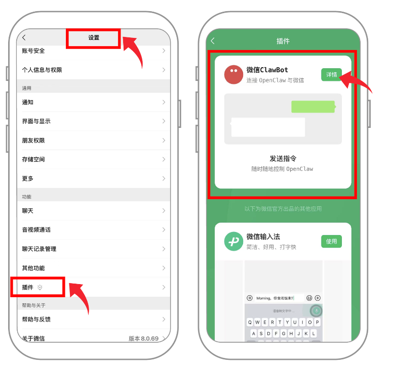
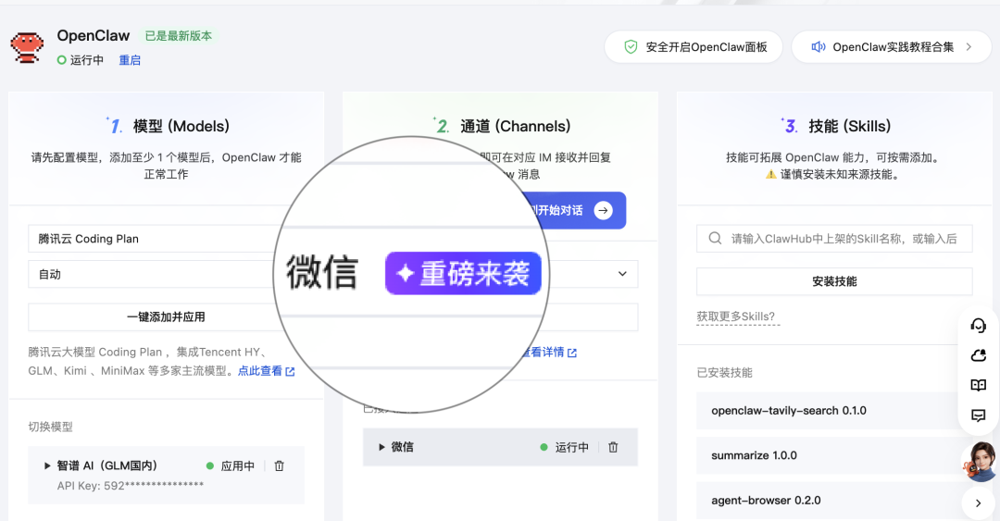
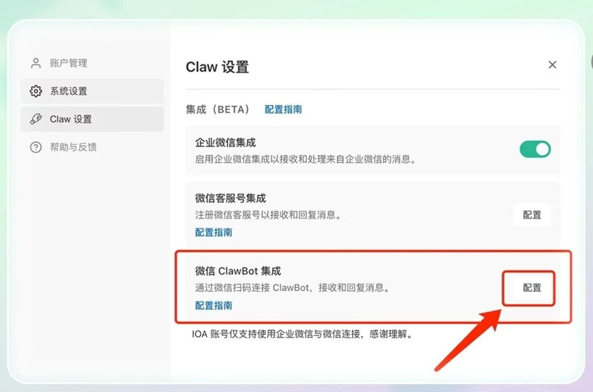
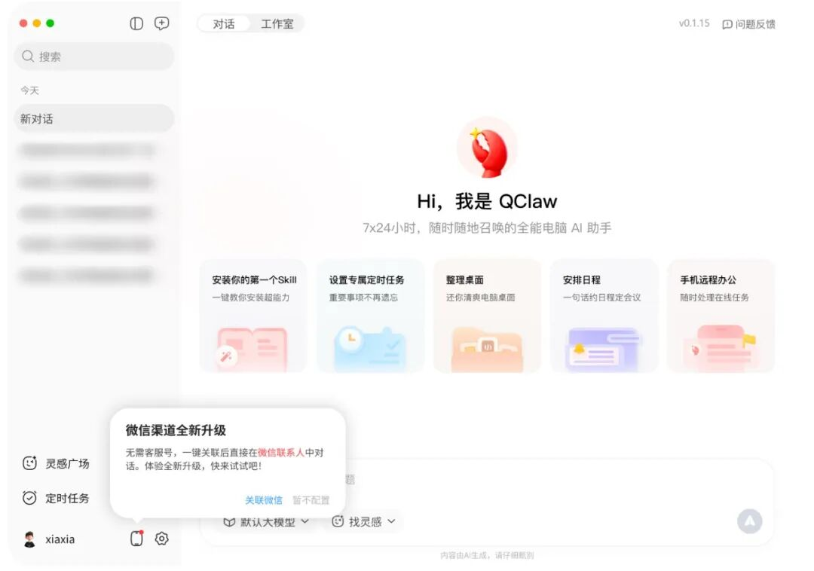
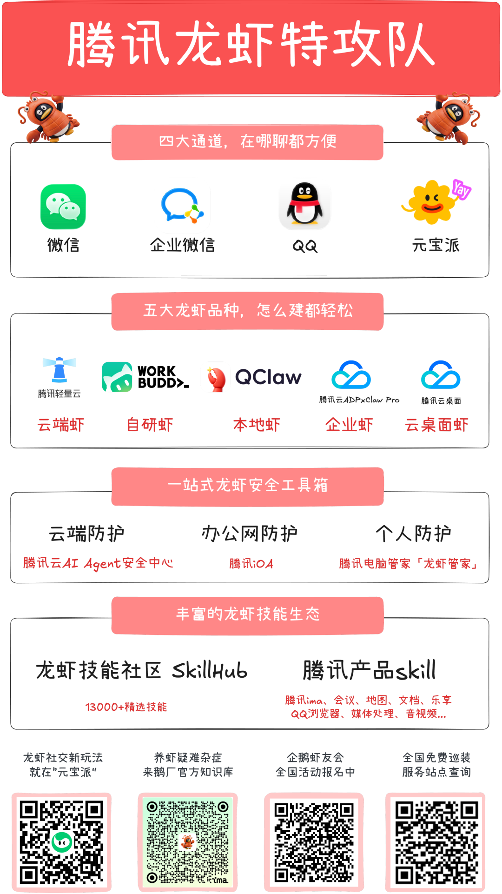

# 微信发布官方龙虾插件，腾讯云率先适配

> 公众号: 腾讯云
> 发布时间: 2026-03-22 10:07
> 原文链接: https://mp.weixin.qq.com/s/iVK3Ua0Ude6-d_lgD2jy8A

---

龙虾申请加入你的微信联系人。

刚刚，微信上线「ClawBot」插件，支持接入 OpenClaw。用户扫码或复制命令，即可将 OpenClaw 接入微信，作为联系人直接对话并执行任务。

腾讯云已第一时间适配，云端虾Lighthouse（包含企业版Claw Pro）、自研虾workbuddy、本地虾 QClaw等均已就位，更多产品接入中，欢迎大家到微信玩龙虾。

//腾讯云Lighthouse接入路径👇

腾讯云控制台→Lighthouse实例→应用管理→一键更新到最新版→微信通道→扫码直连

//WorkBuddy接入路径👇

WorkBuddy桌面端→左下角个人头像→Claw设置→微信通道→扫码直连

//QClaw接入路径👇

QClaw桌面端（v0.1.15版本)→左下角弹窗→扫码直连

腾讯龙虾特攻队集结，24小时待命。

