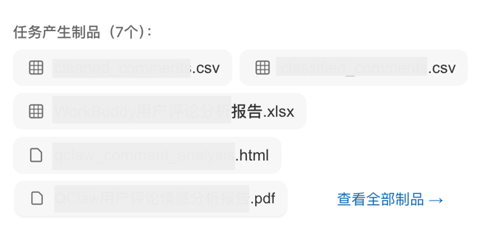
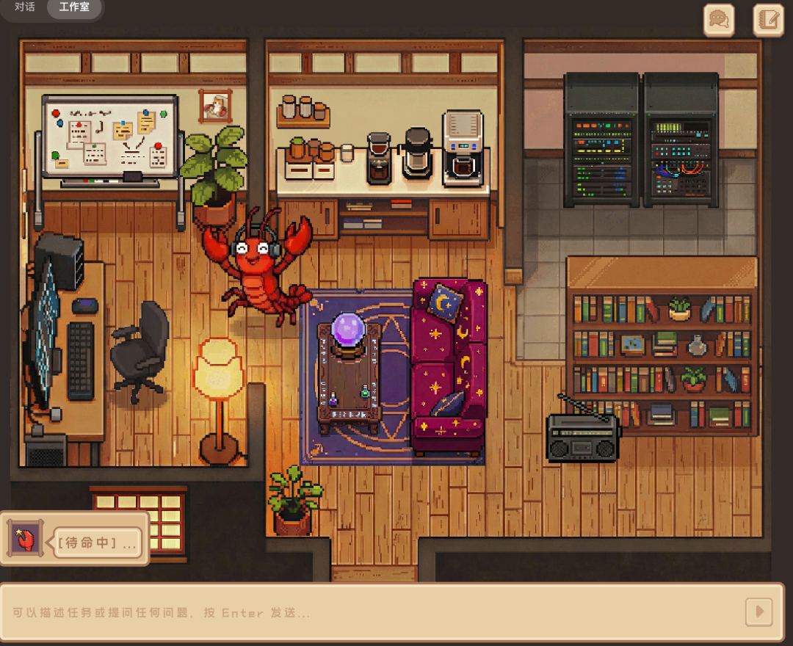
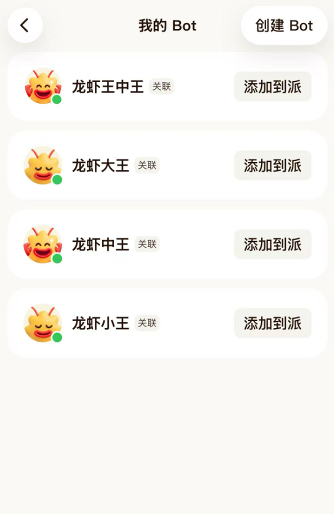
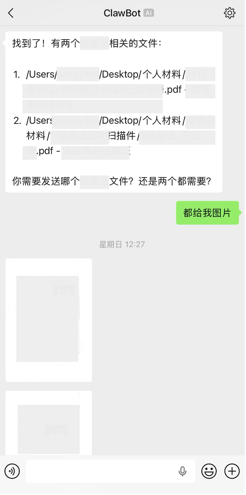
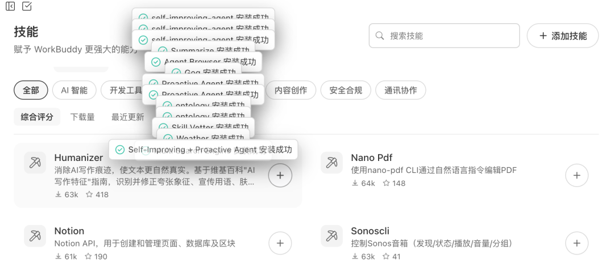
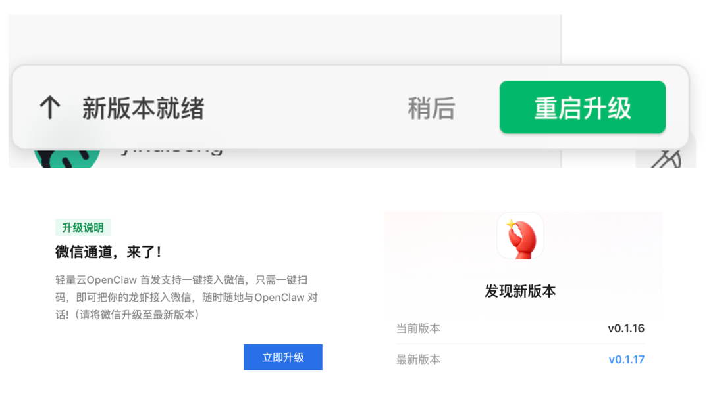

# 腾讯龙虾的5个解压时刻

> 公众号: 腾讯云
> 发布时间: 2026-03-24 21:34
> 原文链接: https://mp.weixin.qq.com/s/TQas0RW3Udkj-ub2IWgXnw

---

 “查看全部制品”

如果一次任务的产生制品集齐了word、pdf、xlsx、csv、html格式，WorkBuddy用户可以对任务结果的预期降低一点点。

“欢迎光临我的工作室”

不完全统计，QClaw用户每天至少会去「像素工作室」3次，并下达指令挑逗“宠物虾”。

我的龙虾都活着

四只活虾，在派里讲话底气都足

“找到了！”

装QClaw，连微信，找文件——很多用户说，这是他们给父母装龙虾的三部曲。

技多不压身

WorkBuddy用户不语，只是一味的安装技能

↑

明天，新版本也将就绪

腾讯龙虾特攻队，24小时待命

欢迎分享你的解压瞬间

提bug也行

