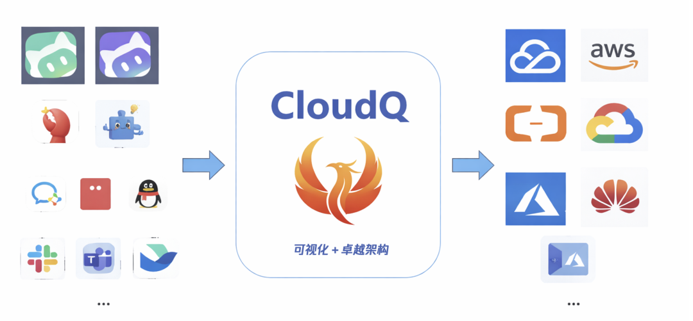
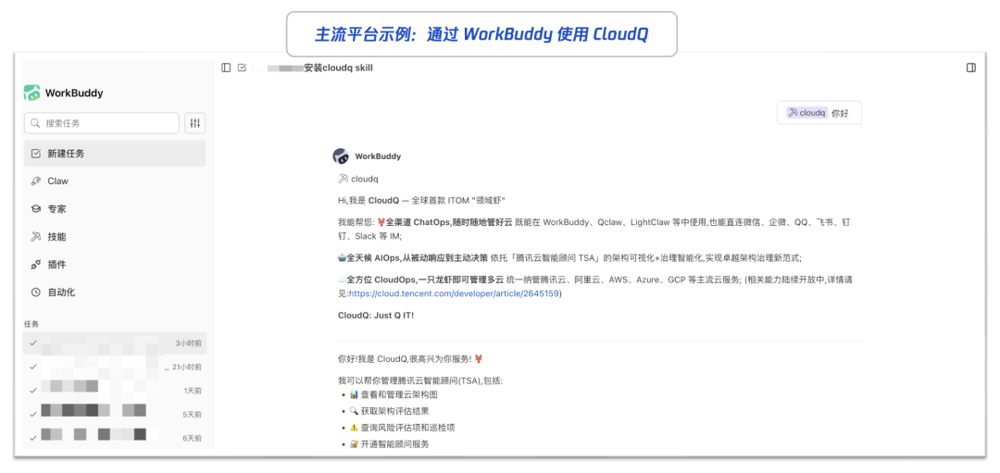
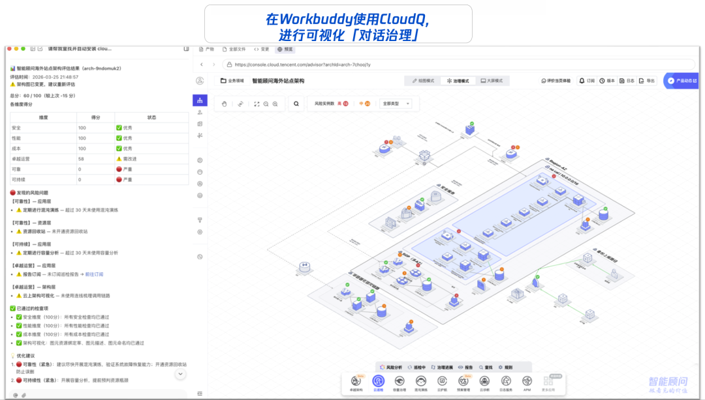
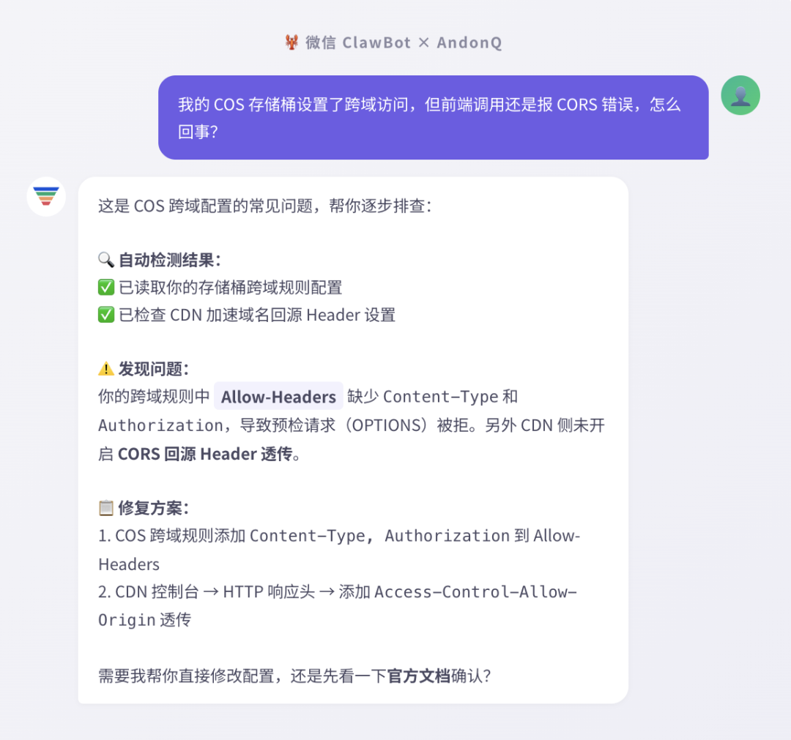
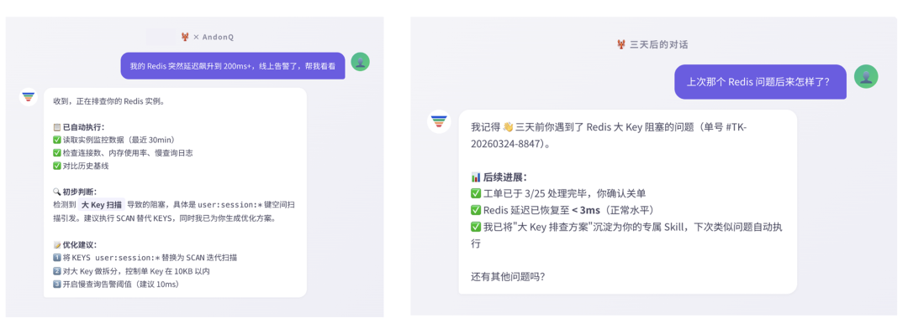
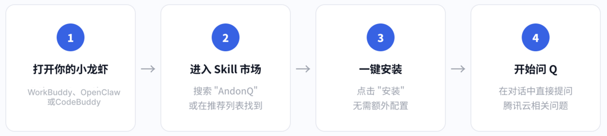
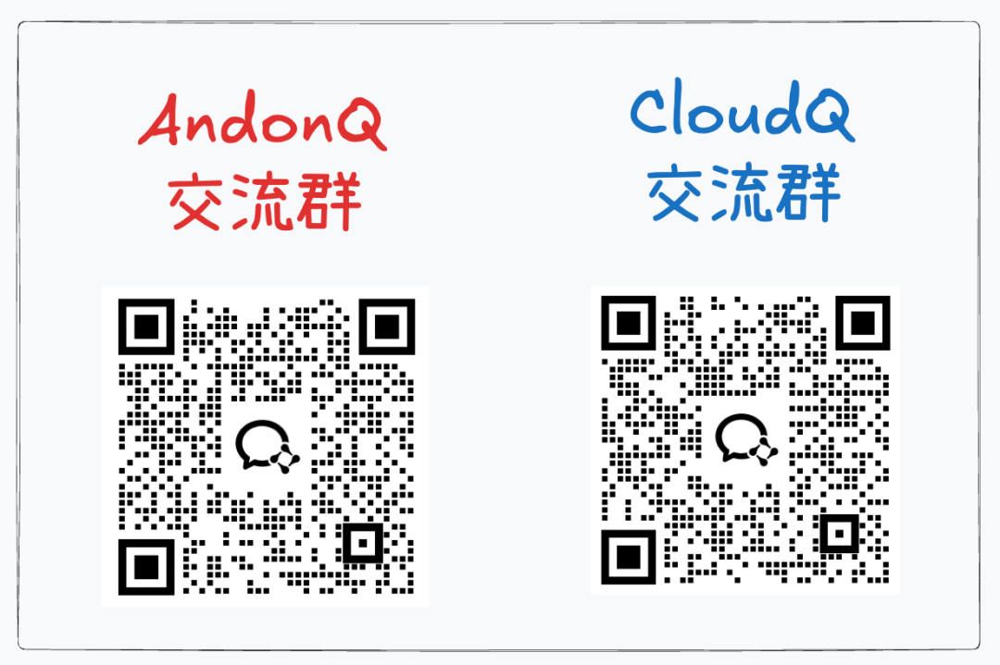

# 腾讯龙虾特攻队，来了2个IT老师傅

> 公众号: 腾讯云
> 发布时间: 2026-03-26 19:07
> 原文链接: https://mp.weixin.qq.com/s/hrBp5dgCkI_MGCMkjrkyyQ

---

云上的技术难题，以后在“龙虾”里就给办了。

正式介绍刚刚加入腾讯龙虾特攻队的两位新成员：

CloudQ，在微信、企微、飞书等聊天工具里发一句指令，就能搞定多云架构的巡检、风险分析和优化治理；

AndonQ，把腾讯云技术支持能力装进你的AI应用；在对话框里直接提问产品配置、故障排查或选型问题，就能获得官方级的解答，不用查文档、不用提工单。

它们拥有非常灵活的载体形态——既能作为独立智能体（Agent）直连微信等前端 IM，也能作为能力插件（Skill）无缝嵌入你的 AI 应用 。

这也代表了腾讯龙虾特攻队的一个探索趋势：领域龙虾。“龙虾”，是轻量、可插拔，不需要下载新 App的智能； “领域”，是在垂直场景里解决具体问题，而不是泛泛问答。

看看老师傅的手艺👇

//CloudQ：多云架构的全局智能管家

CloudQ是业内首款基于 OpenClaw 与腾讯云智能顾问（TSA）打造的 ITOM（IT运维管理）“领域虾” 。过去管理多云环境，往往面临控制台反复切换、架构标准不一的痛点 。CloudQ 就是为解决这类全局治理难题而生的 。

它的核心绝活是跨云统一纳管与对话式运维（ChatOps） 。无需登录繁杂的控制台，它能协同治理腾讯云、AWS、阿里云、Azure、GCP 等主流云厂商的资源。

它依托全天候的 AIOps 能力，将底层的架构状况转化为可视化的拓扑图与健康评分，实现从被动响应到主动决策的跨越 。

用起来极其轻量。你只需将 CloudQ 机器人接入企业微信、飞书、钉钉、Slack 等办公群，或安装在 WorkBuddy 等平台 。

遇到需要巡检的时刻，直接在聊天框敲一句：“帮我做一次架构健康检查” 。它会立刻输出涵盖安全、成本、性能等维度的体检报告，并直接给出高风险项的排查方案 。

//AndonQ：装进 AI 助手的贴身原厂客服

AndonQ 专治云上疑难杂症，也是业内首款基于 ITSM 的技术咨询“领域虾” ，它的定位非常直接：装在你 AI 助手里的腾讯云贴身客服 ，帮助云上用户技术答疑与故障排查，开发和运维同学重点推荐。

这位师傅的底气，来源于背后腾讯云原厂的技术专家团队与工单系统 。它的最大特点是“上下文感知”与“跨会话记忆” ，能记住用户的历史聊天背景，并且在你授权的前提下，直接调取实例监控数据帮你“把脉”，给出最贴合真实业务环境的修复建议 。

AndonQ“入职”手续最快只需 30 秒 ，全流程零代码。

绑定腾讯云账号完成身份验证后，下次写代码卡壳，直接在对话框问：“COS跨域配置怎么设？”或者“CLB健康检查失败原因有哪些？” 。

不用切出工作页面查文档，直接拿到专业的解答和代码示例。

欢迎到技能市场雇佣两位IT老师傅上岗。

统管多云、架构巡检、成本优化，找CloudQ 。

解决单点配置、紧急排障、查工单做选型，找AndonQ 。

---

---

