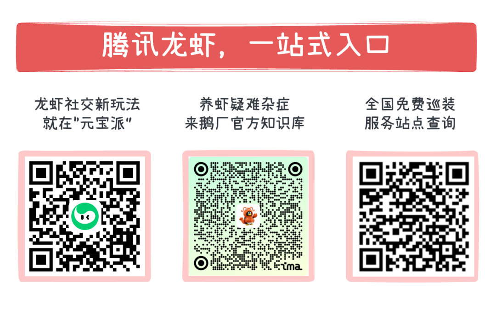

# 腾讯AI作战地图，全面更新

> 公众号: 腾讯云
> 发布时间: 2026-03-27 12:14
> 原文链接: https://mp.weixin.qq.com/s/1hgRsbgj8_Zp8mwH20Rl0A

---

今天在上海，腾讯公布最新AI演进计划。

重点围绕 Agent、大模型脚手架、模型、安全 四大方向，加速构建“好用的AI”。

# //Agent产品全面铺开

#

“全民养虾”背后，是对 Agent 的真实需求。腾讯云打磨了一整套Agent产品，覆盖个人与企业、开发者等各类用户群体。

个人提效，直接上手——

- QClaw：基于OpenClaw打造的本地AI助手，零门槛、小白三步上手，自带安全防护。首创微信直连，支持智能匹配模型及自定义模型，场景化skills进一步降低“养虾”门槛。
- 腾讯办公应用全面Skill化：会议、文档、ima 等工具已化身Skill，无缝接入IM与AI应用，实现办公场景全覆盖。
- WorkBuddy：全场景职场AI工作台，兼容OpenClaw技能体系，支持微信远程操控电脑，处理文书、数据、日常事务。过去几小时的活，20分钟搞定。

企业提效，解决真问题——

- 乐享 2.0：从“问答机器人”进化为“能干活的知识中枢”，自动做质检、输出分析报告 PPT。
- 企点营销云MAGIC Agent 2.0：主动洞察市场机会，自主推进“创意生成-渠道分发-效果追踪”的全链路营销 。海外版同步发布，深度适配WhatsApp、LINE等本地社交生态。
- TC Data Agent：业务人员用对话取代SQL，数据查询不再需要等排期。

研发提效，效率拉满——

- CodeBuddy：已覆盖腾讯超90%工程师，从需求分析、项目开发、代码审计到测试部署全流程 AI 协同。实测数据：仅优化工程框架，复杂编程任务端到端成功率从42%拉到78%。
- ADP（智能体开发平台）：帮助企业快速搭建行业专属智能体，在传媒、金融等行业已广泛应用，[华住集团](https://mp.weixin.qq.com/s?__biz=MjM5MDgwMzc4MA==&mid=2654906496&idx=1&sn=6aada7b6bdbfb8da92baf9d02cdb48f5&scene=21#wechat_redirect)基于 ADP 打造的酒店 Agent 已跑在超 5000 家门店。

Agent 规模化路径也更加高效——

- 基于ClawPro与ADP的协同，打通企业级 Agent “构建-分发-反馈”的完整闭环。

- 作为“智能体工厂”，ADP 负责集中构建与技能管理；“企业版小龙虾” ClawPro 则作为分发商店，提供了一键分钟级部署、成本透明、全套安全管控及无缝融入企微等办公生态的统一入口。
- 员工开箱即用的同时，使用反馈会持续回流至 ADP 形成飞轮效应，驱动企业专属 AI 能力不断迭代，让智能体真正成为伴随企业进化的生产力伙伴。

# //做好Harness，释放模型能力上限

#

AI 落地不只是算法题，更是工程题。在大模型能力趋同的当下，决定胜负的关键在于Harness。通过工具调用、长记忆管理、工作流设计等“脚手架”手段，Harness决定了模型能力的释放上限，腾讯云已构建起了完备的Harness体系👇

- ADP：作为知识增强底座，通过RAG、知识库的能力，给智能体连接上专业的“图书馆”，让行业专家永远在线，并持续积累企业的经营Know-How。
- Claw：作为这套智能系统的神经中枢，跑在Agent Runtime的安全沙箱，从技能库发现与下载Skills，不断学习与积累连接外部系统的能力，借助大模型来对外收发指令，触发行动。

- Agent Runtime：安全沙箱用于[大模型强化学习](https://mp.weixin.qq.com/s?__biz=MjM5MDgwMzc4MA==&mid=2654906813&idx=1&sn=a695013e260994bfbc6468f0588015e3&scene=21#wechat_redirect)的程序结果验证，可在1分钟内拉起超过十万个容器沙箱，百毫秒级的启动速度，用完就销毁，大幅提升强化学习的训练效率。底层平台Cube全面开源，企业可直接用于智能体训练和部署。

- 全链路安全：云端AI Agent安全中心+安全网关，终端iOA+电脑管家「龙虾管家」，为Agent构建「资产管理→权限管控→行为溯源」的立体安全体系。
- 持续打磨底层组件性能：COS向量桶存储成本较传统方案降低超90%、MetaInsight为Agent提供多模态记忆能力；自研推理加速框架TACO在多场景性能提升30%–50%。

# //混元模型加速迭代，TokenHub供给多元算力

模型是智能服务的底座。聚焦数据质量提升与基础设施重构，腾讯混元大模型正在加速迭代。

- 混元3.0即将发布，激活参数大幅降低，复杂推理、长记忆、Agent能力全面提升，元宝实测正向收益显著。
- 多模态持续拉开身位：混元图像3.0春节期间带动元宝AI生图日均调用量增长30倍；混元3D开源下载量破300万，全球超150家企业接入，拓竹科技、创想三维、德国 Maxon 都在用。
- 端侧小模型：混元 7B 翻译模型在国际机器翻译大赛31个单项中拿下30个第一；1.8B 版本仅需 1GB 内存端侧运行，效果超过大部分商用翻译 API。

MaaS 平台全新升级为TokenHub——

- 统一接入混元、DeepSeek、MiniMax、Kimi、GLM等多家模型，配合Token Plan统一计费，企业按需调度、灵活切换
- “模型任选”理念已经渗透整个产品线：WorkBuddy、CodeBuddy支持多模型无缝切换；QClaw按任务复杂度智能调度；ADP支持为Agent不同步骤分配不同模型。

加速拥抱AI的同时，腾讯也在和全球伙伴一起共建共享智能生态。

今天，腾讯云已服务长三角超11万家客户；2025年，腾讯云实现自身规模化盈利。海外业务也在加速，客户规模同比翻番，并将 CodeBuddy、智能体开发平台等AI产品推向全球。从泰国正大集团的电商直播，到保柏香港的“刷掌就医”，再到土耳其的合规金融云。

从能用到好用，从单点突破到全栈打通，AI正在各地真实落地、生长。

2026，一起加速！

---

---

