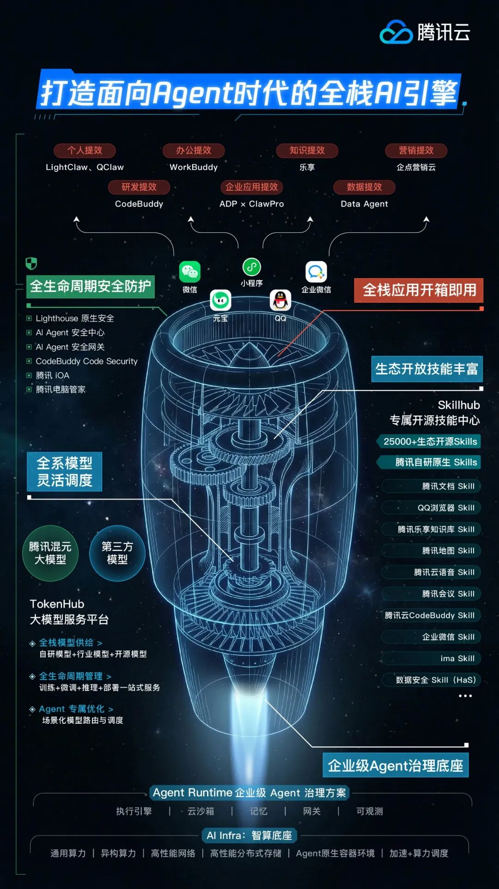

# 腾讯云Agent产品全景图，正式发布

> 公众号: 腾讯云
> 发布时间: 2026-03-27 14:48
> 原文链接: https://mp.weixin.qq.com/s/qYUxMkFIDK9Gxxrm9In9qg

---

今天，腾讯云Agent产品全景图正式发布，打造面向Agent时代的全栈AI引擎。

依托腾讯云的全栈AI能力，我们已经构建了从个人到企业、从最底层基础设施到上层场景应用的完整产品体系。

Agent基础设施层，相当于企业应用Agent 的“操作系统”，我们积累了一套安全、稳定、高效的技术底座与治理平台。

模型服务层，是Agent高效运行的“大脑”。我们将MaaS平台升级为TokenHub 大模型服务平台，基于自研的混元大模型及先进的第三方模型，为企业提供全栈模型供给和全生命周期的智能管理与优化服务。

技能生态层，是Agent施展能力的“武林秘籍”。为适配企业需求，我们开放了涵盖自研技能、开源SkillsHub，以及微信、小程序、企业微信、元宝、QQ等在内的丰富生态，能够展现在AI应用场景中的独特优势。

AI应用层，是Agent落地用户/客户场景的“具身形态”。我们围绕个人提效、企业营销、知识管理、研发提效、办公协同等多个场景，打造了专属的产品应用矩阵。

安全层，是用户/客户部署Agent的重要前提。正是因为Agent具备自主执行能力，如果没有可靠的保障机制，其效率越高，带来的潜在风险就越大。在这方面，腾讯云提供了系统性的安全解决方案。

腾讯集团高级执行副总裁、云与智慧产业事业群CEO汤道生表示：

「当前，人工智能的应用范式正从"Chatbot"向"AI Agent"跃迁。AI落地不只是一道算法题，更是一道工程题——随着主流大模型能力差距逐步缩小，企业比拼的不再是"谁的模型更强"，而是谁能通过工程化手段把模型用好。

未来，每一个个体、每一家企业都能借助标准化工具，快速搭建专属智能体应用，共同构筑一个去中心化、高度繁荣的Agent生态。」

---

---

