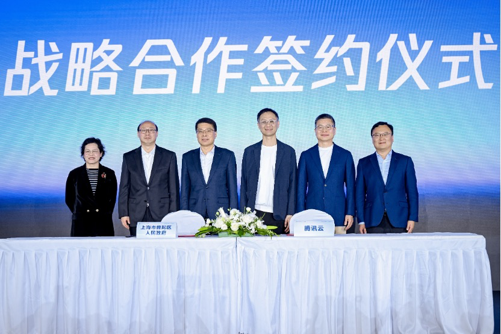

# 腾讯云与上海市普陀区签署战略合作协议

> 公众号: 腾讯云
> 发布时间: 2026-03-27 14:48
> 原文链接: https://mp.weixin.qq.com/s/GkjWF7dgMPGb2nQDAEX6YQ

---

3月27日，在腾讯云上海城市峰会现场，腾讯云与上海市普陀区人民政府正式签署战略合作框架协议。双方将围绕普陀区“1+2+3”为主体的现代化产业体系与数字化转型目标，深化在云计算、人工智能、大数据等领域的合作，共同推动区域产业集群建设及数字经济高质量发展。

腾讯云将发挥云计算及全栈AI服务能力等技术优势，助力普陀区打造以上海国际数字广告园为核心的区域数字化转型平台，加速企业上云与产业聚集。同时，双方将在政务、文旅、医疗、教育、金融及数字广告等多个行业场景中开展深入合作，探索人工智能创新应用场景，共同打造数字经济发展新高地。未来双方还将联手构建政企及产业生态协同平台，促进产业上下游的数字化链接，助力“数智普陀”建设。

在2026腾讯云上海城市峰会上，腾讯发布了Agent产品全景图，升级全栈AI能力。腾讯集团副总裁、政企业务总裁李强表示，AI好用才有生产力，腾讯将借助能源、算力、模型、智能体和应用等全栈智能化产品体系，助力企业增长提效。

目前，腾讯云已经在长三角服务了超过11万家客户，未来也将与普陀区深度联手，为区域数字化产业升级及经济提效贡献科技力量。

