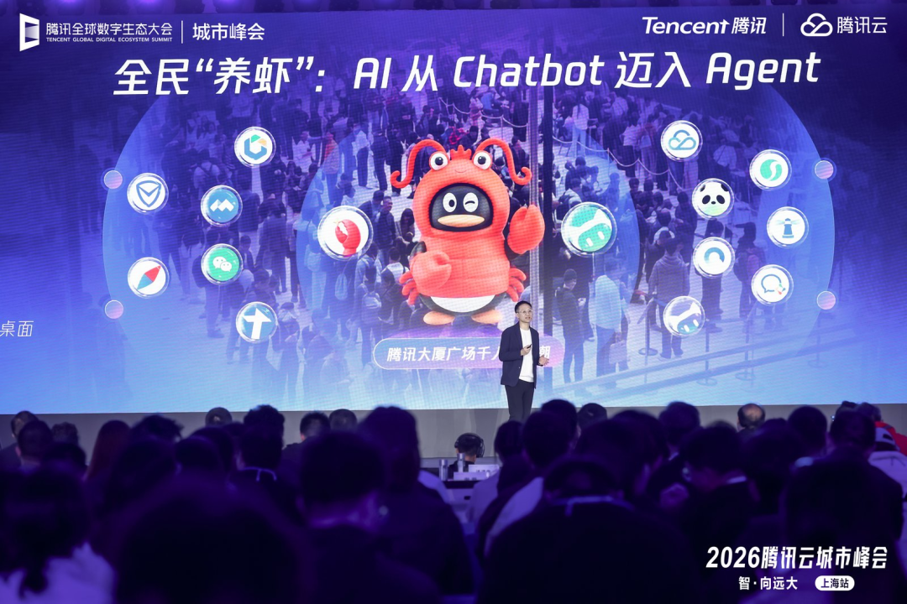

# 腾讯汤道生：AI落地不只是算法题，Harness工程能力是关键变量

> 公众号: 腾讯云
> 发布时间: 2026-03-27 12:14
> 原文链接: https://mp.weixin.qq.com/s/72q-EQEbHsZIdeAgXvh72A

---

“AI落地不只是一道算法题，更是一道工程题。”在同样的模型能力下，不同的“脚手架”（Harness）设计，对实际使用效果与tokens成本有很大的影响。为此，腾讯要全面“强化模型的Harness与工具，用精心的工程实现，最大化发挥大模型的能力，让应用更高效落地”。

继腾讯龙虾特攻队火爆出圈，腾讯云实现全年规模化盈利，腾讯集团高级执行副总裁、云与智慧产业事业群CEO汤道生3月27日在腾讯云城市峰会上海站，提出了腾讯AI在Agent时代的新思考。

汤道生复盘了腾讯集结龙虾特攻队：早在春节前，产品团队已经嗅到机会，推出面向各类人群、强安全的LightHouse云端部署方案，在假期间产品团队保持快速迭代，上线了WorkBuddy、QClaw等面向C端用户的本地化产品，以及企业版龙虾ClawPro。

“我们之所以能够快速响应需求，靠的是多年的技术积累和敏捷的迭代能力。”他强调：“龙虾服务的背后，其实是一整套工具链”，涵盖了面向用户的各类龙虾产品，打通微信、QQ、企业微信等IM渠道实现便捷互联，还有腾讯文档、地图、会议、ima等产品能力封装而成的Skills，专为中国用户优化的AI Skills社区——SkillHub，以及为智能体提供全链路防护的安全能力。

“AI大模型的发展日新月异。人工智能的应用范式，正在从Chatbot向AI Agent跃迁。”汤道生进一步披露了Agent时代腾讯AI的新进展：即将发布的混元3.0，一方面激活参数大幅降低，体验更优，另一方面在复杂推理、长记忆、长文、多轮追问与Agent能力等多个维度，有明显的提升，在元宝中做实验测试，正向收益非常明显。

在不断夯实模型根基的同时，腾讯云也积极用精心工程打破模型的天花板。汤道生分析，随着行业发展，主流大模型的能力差距正在逐步缩小，企业的核心需求已不再是拥有最好的模型，而是如何通过模型的Harness，也即“大模型的脚手架”——包括工具调用、分层上下文工程、长记忆管理、工作流设计等系统工程手段——在不改变模型架构和参数的基础上，把模型能力最大程度发挥出来。

在这方面，腾讯云早有布局。首先是腾讯云智能体开发平台ADP，通过RAG、知识库等能力给智能体连接上“图书馆”，让行业专家永远在线。然后是Claw跑在Agent Runtime的安全沙箱：Claw作为智能系统的神经中枢，通过从技能库发现与下载Skills，不断学习与积累连接外部系统的能力，借助大模型来对外收发指令，触发行动；Agent Runtime的沙箱方案还能用于大模型强化学习的程序结果验证，提升强化学习的训练效率。

汤道生介绍，腾讯云正把研发领域验证过的Agent能力，推广到每一个职场人的日常，上下文工程、多智能体协同、记忆系统、生态连接，从研发场景延伸到通用办公场景，实现知识的即时获取、内容的自动生产、事务的自主流转。

从代码编程，到职场办公，再到每个企业的丰富业务场景，智能体将带来全面的优化和重构。汤道生强调：“未来，随着龙虾这类开发框架越来越成熟，每一家企业都能够借助标准化工具，快速搭建属于自己的专属智能体应用，共同构筑一个去中心化、高度繁荣的 Agent 生态。”

以下是演讲全文：

《扎根场景创新 让好用的AI触手可及》

欢迎来到腾讯云城市峰会，很高兴与大家相聚在上海，共同探讨AI产业发展的新机遇。

上海是中国AI发展的前沿阵地，这里创新氛围浓厚，聚集了MiniMax、智元机器人等上万家AI创新企业。这些年来，我们和上海以及长三角的伙伴一起，持续探索AI的落地应用，取得了扎实的成果。

例如，我们和华住集团合作，从0到1打造了酒店智能体——AI住中服务，可以自主调度机器人完成配送任务。我们还与复旦大学附属眼耳鼻喉科医院合作，打造专科大模型，用AI辅助病例分析和诊疗；同时面向更广大的医疗机构，升级“腾讯健康开放平台”，服务医患两端，覆盖了1000多家医疗机构。

当前，AI大模型的发展日新月异。最近爆火的OpenClaw，更是标志着人工智能的应用范式，正在从“Chatbot”向“AI Agent”跃迁，让越来越多的企业客户认知到，AI Agent深入业务场景、解决实际问题的价值和能力。

在这场全民“养虾”热潮中，腾讯公司也置身其中。就在3月初，我们的Lighthouse团队组织的一场Open Claw的线下装机活动，吸引了近千名的用户参与，一度登上了各大媒体头条。

其实早在春节前，我们的一些产品团队已经嗅到机会，推出面向各类人群、强安全的云端部署方案，在假期间产品团队保持快速迭代，优化体验，接着WorkBuddy、QClaw等面向C端用户的本地化Agent产品也陆续上线。同时，在追求创新与勇于探索企业的强烈需求下，我们也推出了以安全为核心的“企业版龙虾”ClawPro。

我们之所以能够快速响应需求，靠的是多年的技术积累和敏捷的迭代能力。“龙虾”服务的背后，其实是一整套工具链。我们利用Agent Infra及产品矩阵，快速推出面向各类用户的产品。再通过庞大的生态入口，打通微信、QQ、企业微信等IM渠道，实现便捷互联。在使用环节，我们又将腾讯文档、地图、会议、ima，乃至一些企业级的产品能力，封装成Skills供智能体调用，同时还上线专为中国用户优化的AI Skills社区——SkillHub。

最新发布的全方位智能办公助手WorkBuddy，也穿上了龙虾壳，让用户能轻松在微信上远程操控与管理桌面上的任务。

早在今年1月，腾讯就启动了WorkBuddy的内测。超过2000名来自不同岗位的同事参与体验。他们用WorkBuddy做文书编辑、数据清洗、经营分析，过去需要好几个小时的工作，现在20分钟内搞定，大家越用越多，越用越深，tokens消耗持续增长。我猜在不久的将来，大家跟老板要的，不仅仅是涨工资，还有每月tokens数量的提升。

接下来，我们希望把过去几年，打造大模型应用产品的进展与一些思考，分享给大家，总结下来有以下四点：

//首先是夯实模型根基，聚焦性能与效率的“双突破”

模型是应用的根基。过去一年，腾讯自研的混元大模型，密集发布了30多个版本，混元2.0的推理能力与效率都得到了大幅提升。

去年下半年，腾讯对混元团队与研发流程进行了重构，聚焦提升数据质量，重建预训练与强化学习基础设施。即将发布的混元3.0，一方面激活参数大幅降低，体验更优，另一方面在复杂推理、长记忆、长文、多轮追问与Agent能力等多个维度，有明显的提升，在元宝中做实验测试，正向收益非常明显。

多模态也是混元与元宝的重点。今年春节活动期间，混元图像3.0图生图模型，带动元宝AI生图日均调用量，增长了30倍；混元3D模型则继续保持行业领先，服务了拓竹科技、创想三维等3D打印企业，并开始向海外市场覆盖。

同时，我们也非常关注适配端侧部署的小模型机会。比如混元的7B翻译模型，在2025国际机器翻译大赛31个单项中，斩获了30个第一名。混元的1.8B翻译模型，主要面向手机等消费级设备场景，只需1GB内存即可流畅部署运行，效果超过大部分商用翻译API，目前已经在腾讯会议、企业微信、QQ浏览器等内部多个业务场景应用。

除了强大的模型，我们的TACO推理加速框架，在OpenClaw、客服助手、文档审核、自动驾驶等业务场景下，推理性能相较于社区可以提升30%-50%。

其次是强化模型的Harness与工具，或者俗称大模型的脚手架，用精心的工程设计与实现，最大化发挥大模型的能力，让应用更高效落地。

//AI落地不只是一道算法题，更是一道工程题

随着行业的发展，主流大模型的复杂推理能力都挺强了，尤其国内开源模型与海外闭源能力的差距，也在逐步缩小，为市场提供了更具性价比的大模型推理服务。客户按照自己的业务场景，与对性能和成本的偏好，其实有蛮多的选择。国外的研究报告也指出，在同样的模型能力下，不同的脚手架或harness的设计，比如给模型调用什么工具、有层次的上下文工程、长记忆的管理、工作流的实现等，都对实际使用效果与tokens成本有很大的影响。

我们也从三个维度对模型能力进行增强。首先是腾讯云智能体开发平台ADP，通过RAG、知识库的能力，给智能体连接上专业的"图书馆"，让行业专家永远在线，并持续积累企业的经营KnowHow。然后是Claw跑在Agent Runtime的安全沙箱，Claw作为这套智能系统的神经中枢，通过从技能库发现与下载Skills，不断学习与积累连接外部系统的能力，借助大模型来对外收发指令，触发行动。

这套Agent Runtime的沙箱方案，还能用于大模型强化学习的程序结果验证，可在 1 分钟内拉起超过十万个容器沙箱，百毫秒级的启动速度，用完就销毁，大幅提升强化学习的训练效率。

//第三点是安全，这是大家非常关心的话题

企业部署Agent 后，需要了解有多少资产、装了多少个龙虾、哪些发行版，把企业的资产识别出来，龙虾的管控就容易结合策略来做。在云端，我们的AI Agent安全中心和AI Agent安全网关，可以帮助企业梳理资产、提供安全管控能力。在办公终端，我们也提供IOA和龙虾管家，来帮助管理龙虾的访问权限。

同时，提供详细的运行日志方便合规审计，给企业提供安全保障。  Skills的安全，大家也都非常关心，我们可以屏蔽企业龙虾从外部下载Skills，只允许在企业内部的Skills市场下载内部审核通过的Skills，我们也同时提供安全检测能力，让企业龙虾连接内部系统也更方便、更可控。通过这些安全产品和能力，我们希望护航客户用好Agent。

//最后是重构生产力

过去两年，AI 编码助手已经深刻改变了软件开发的方式。CodeBuddy 在研发场景中实现了生产力重构。

但我们很快意识到一个问题：生产力的瓶颈从来不只在代码里。 一个产品经理花三天写方案，一个运营同学用半天做数据报告，一个管理者每天淹没在邮件和会议中。这些场景里没有一行代码，但它们消耗着企业中绝大多数人的绝大多数时间。

于是我们打造了WorkBuddy产品。把 Agent Core 中沉淀的核心能力，从研发场景延伸到通用办公场景，实现知识的即时获取、内容的自动生产、事务的自主流转，让一个人就能扮演多个角色，一个人就能把事情办完，大大减少沟通成本，更进一步实现One Person Company的愿景。

企业侧也是如此，过去很多企业的经营都强依赖各员工的知识与经验，通过各种流程贯穿起来，打造最终的产品与服务。在智能体时代，这些知识与经验必须沉淀成企业知识库，并成为AI可以依赖的、可以支持长期经营的企业资产，更是智能体时代的企业新中台。

只要企业知识库变得实时与准确，就能支持更多数字员工并行协作，比如成为提高员工工作效率的问答助手，成为提供售后服务的智能客服，成为精通产品的营销助手与在线销售；结合CDP的用户画像与经营大数据，Agent还能提供经营决策的分析，以及通过AI实现营销内容生成、业务流程自动化，以及数据处理工作。

腾讯云ADP给客户提供了智能体构建与治理的一体化能力，包括多种开发框架，还集成了丰富的开发资源库，同时也提供全生命周期的管理能力，持续对智能体进行运营和调优。

我们还把ADP沉淀的知识库、模型、插件等企业级能力，封装成Skills，供智能体广泛调用。比如知识库问答Skill，企业基于ADP搭建的知识库，可以被ClawPro或者WorkBuddy等调用，实现B端、C端产品和能力的打通。

未来，随着Agent 技术体持续发展，普及应用到更多场景，打造更繁荣的 Agent 生态。不同模型厂商也针对不同市场需求，为企业与个人提供了更多大模型的选择，提供不同性价比的tokens服务。

面对这一趋势，我们将腾讯云MaaS大模型服务平台全新升级为TokenHub，支持混元大模型和多种优质开源模型，以更加开放的姿态，为客户提供多元化、高性价比的 MaaS 服务。

在腾讯云上，用户可以通过API服务，调用腾讯混元、DeepSeek、MiniMax、Kimi以及GLM等国内主流的大模型能力。我们推出的Token Plan服务，可以实现统一的计费管理，和极低的模型切换成本，让企业在多模型之间灵活调度、按需选用。同时，腾讯云CodeBuddy、 ADP等产品，均已支持多个模型接入，方便用户选择。腾讯云TI平台的“大模型广场”，也内置了多种预训练和指令微调大模型，支持模型一键部署和精调训练。今天，Tokens已经成为智能经济中的新货币，在快速迭代的大模型与智能体科技变革中，我们不仅仅要加油，更要加tokens！

智能化的浪潮不仅改变传统产业，也在加速企业的全球化发展与布局。最近一年，腾讯云全球化布局加快，国际业务持续双位数高速增长，海外客户规模同比翻番。

一方面，我们构筑全球化基础设施，为企业提供合规、稳定的硬支撑。过去三年，腾讯云海外可用区的开设速度，在中国云厂商中名列前茅。这个月我们又刚刚宣布，将在德国法兰克福新增第三个云可用区，可以更加方便服务欧洲客户。

另一方面，我们持续输出有独特优势和竞争力的产品与解决方案，为企业全球布局注入创新动能。目前，腾讯云音视频、腾讯云CodeBuddy、智能体开发平台等核心产品，都推出了海外版本；云Mall、Superapp as a Service等具有腾讯场景特色的方案，也在越来越多的海外客户中落地。

去年“黑五”期间，泰国正大旗下的超级应用Amaze，就依托腾讯云音视频的高并发、低延迟能力，打造了流畅的直播体验，成功完成了电商直播首秀。土耳其金融科技公司iyzico，也基于腾讯云构建了欧洲首个高可用、合规的云业务平台，支撑起“虚拟支付解决方案”，稳定承载了18万商户的交易处理。保柏香港也与我们合作推出香港首个“刷掌登记就医”服务，为市民提供安全、智能的非接触式就诊体验。

当前，AI智能体正以前所未有的速度，深刻改变我们的生活。而腾讯，也正以空前的投入力度，积极地去拥抱这一历史性浪潮。我们持续投入模型研究、升级研发架构、强化模型与产品协同，已经初见成效——为腾讯多条业务线，如微信、游戏、广告与企业服务，提供加速发展的新动能。

未来，腾讯将继续携手各位伙伴和客户，深耕产业场景、打造好用的产品，让AI真正成为企业“用得上、用得起、用得放心”的普惠生产力工具！

-End-

---

