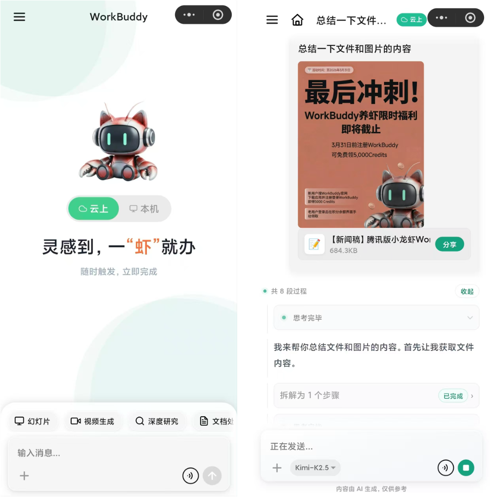
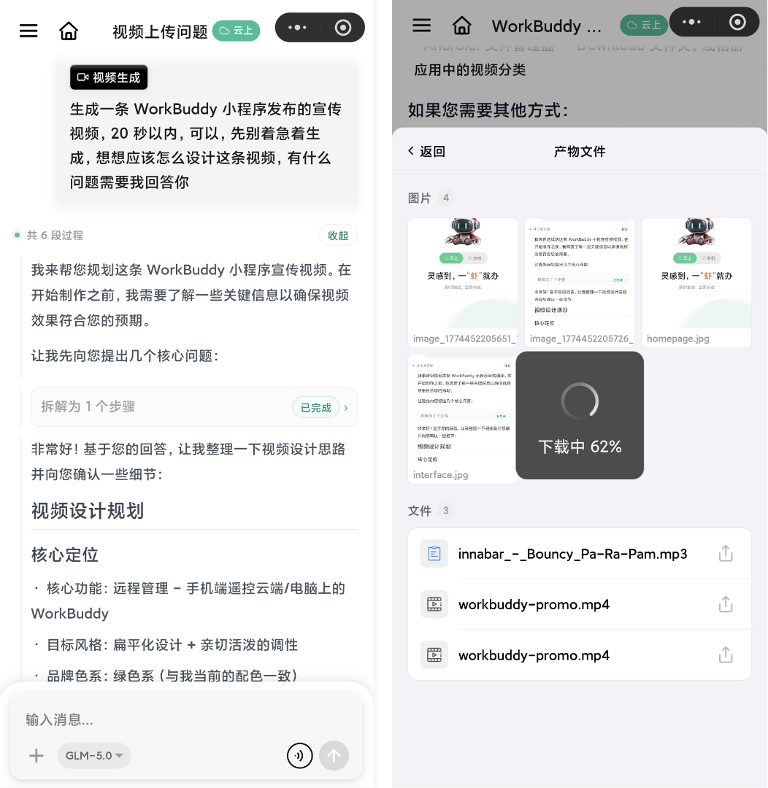
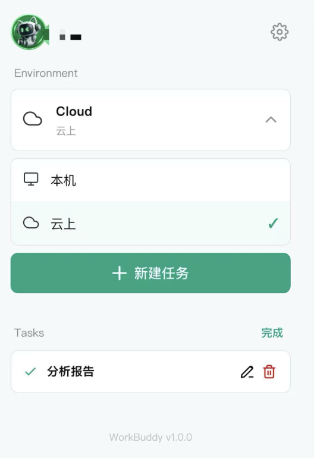
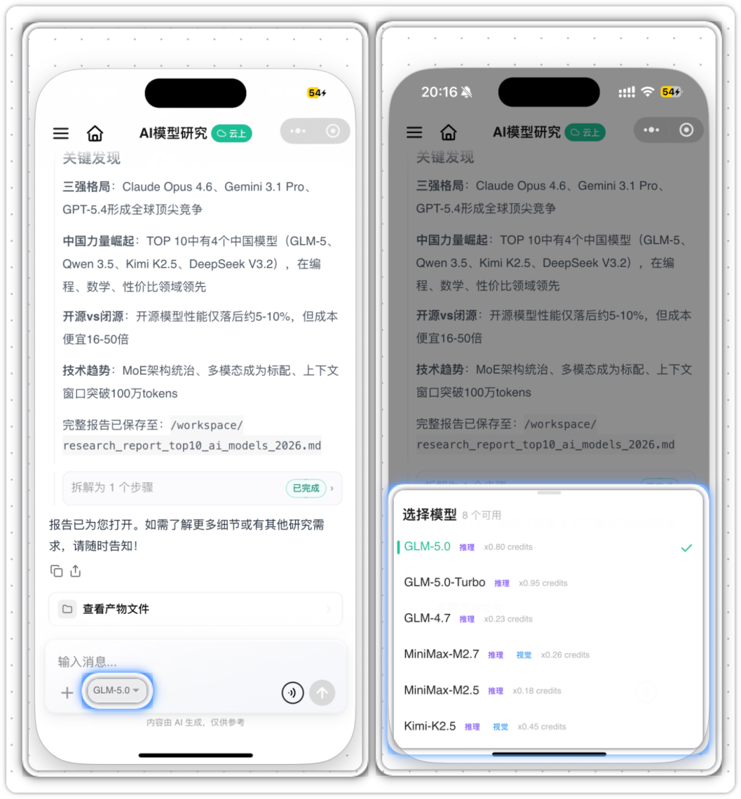

# 腾讯WorkBuddy小程序上线，支持"云端+本机"双模式运行

> 公众号: 腾讯云
> 发布时间: 2026-03-31 11:55
> 原文链接: https://mp.weixin.qq.com/s/FQPdUQjbxdEMZjgWk7Zukg

---

刚刚，腾讯 WorkBuddy 微信小程序正式上线。

这次更新，WorkBuddy把一整套能干活的AI，完整搬进微信：支持云端沙箱与本地电脑远程执行双模式，手机上用语音、拍照、传文件就能直接派活，生成的文档、PPT、视频可以一键下载、随手转发。

一句话说——手机是遥控器，电脑或云端在替你干活。

微信搜索“腾讯WorkBuddy”小程序，试试用手机撸虾。也可以直接扫码体验：

 WorkBuddy 小程序亮点快速Get👇

//桌面级 AI 生产力，搬进微信

小程序也是继客服消息和 ClawBot 之后，WorkBuddy 在微信里的第三个入口。不用下载新 App，不用注册新账号，微信里搜一下就能用。

交互围绕手机场景来做：打字、语音、拍照、从微信聊天里直接选文件，怎么顺手怎么来。

拍照可以直接调摄像头实时拍，也可以从相册多选——课堂板书、会议白板、纸质发票，拍完丢给 AI 就行。

做出来的东西不只是一段文字回复。文档、表格、图片、视频，都可以在小程序里直接下载，或者转发到微信群里。

举个场景：你在外面见客户，微信群里发来一份合同 PDF，需要结合公司电脑上的报价单做比对。

以前只能说“等我回去看看”。

现在把合同从微信转到 WorkBuddy 小程序，语音说一句“和电脑上项目文件夹里的报价单一起看，整理一份对比意见”。

几分钟后分析报告回传到手机，直接转发到工作群，当场搞定。全程没离开微信。

（甚至你可以像我的同事一样，在小程序里做一个宣传视频）

//云端+本地双模式，不开电脑也能办公

这次更新最硬的一个点，是同时小程序支持云端和本地电脑两种执行模式。

本地模式，电脑开着但人不在旁边的时候用。手机下指令，电脑端的 WorkBuddy 远程执行，能读本地文件、操作本地软件。人走了，电脑替你接着干。

（\*小程序与电脑端WorkBuddy需要同一微信登录方可实现连接）

云端模式，彻底不依赖电脑。WorkBuddy 在云端沙箱里独立跑，出差、通勤、周末，只要有手机有微信就行。不用惦记电脑开没开机。

两种模式组合起来，可以进一步解锁办公AI的生产力，按需选择，一键切换。

云端模式还带一个能力：定时任务。让 WorkBuddy 每天在云端定时跑活，结果直接推送到小程序。早上打开微信，行业早报、待办汇总已经整理好了，像收到一个靠谱同事发来的工作简报。电脑关机、断网都不耽误。

//多模型灵活切换+技能生态，打造最懂你的 AI 助手

WorkBuddy 小程序里内置了多个主流大模型——GLM-5.0、Kimi-K2.5、MiniMax-M2.7 等，可以根据任务随时切。

复杂推理选强模型，日常问题切轻量的省 Credits，拍照识图的活儿选带视觉能力的。不是只绑一个模型，而是让你每次都用最合适的那个。

模型之外，WorkBuddy 还有一套技能（Skill）体系。技能是可插拔的能力包：做 PPT、生成海报、处理 Excel、深度搜索——需要什么就挂什么，用完可以换。

想要更多的话，SkillHub 技能市场里有大量社区贡献的技能。复制安装指令，粘贴到对话框发送，30 秒上岗。

挑战一下，明天上班不带电脑试试

挑五位勇敢观众，送龙虾鹅贴纸套装

---

