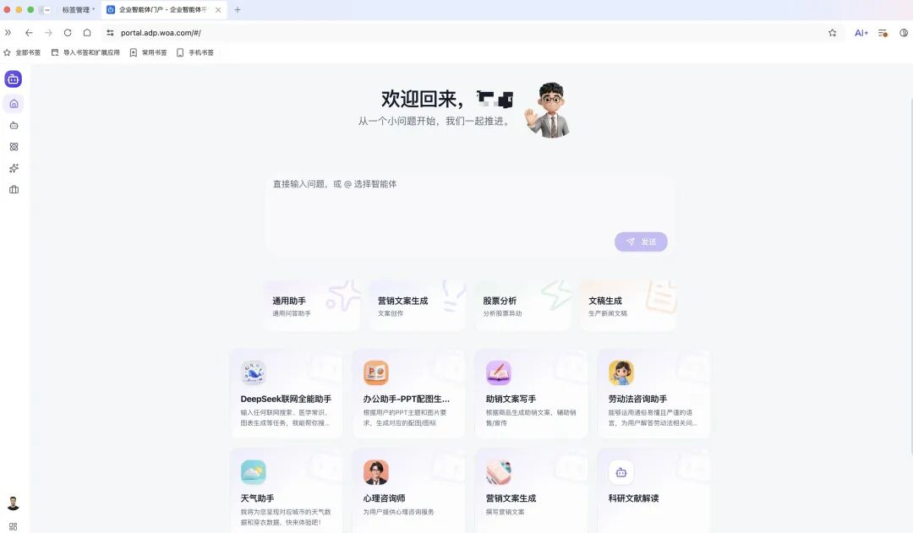
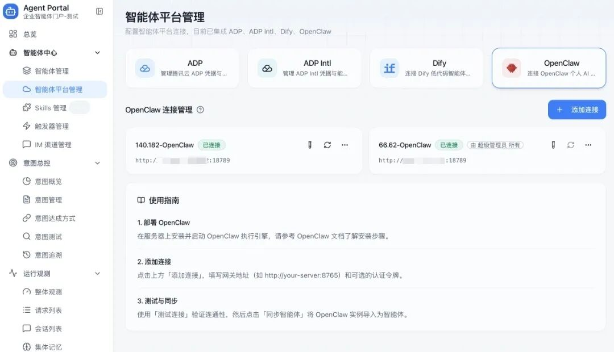
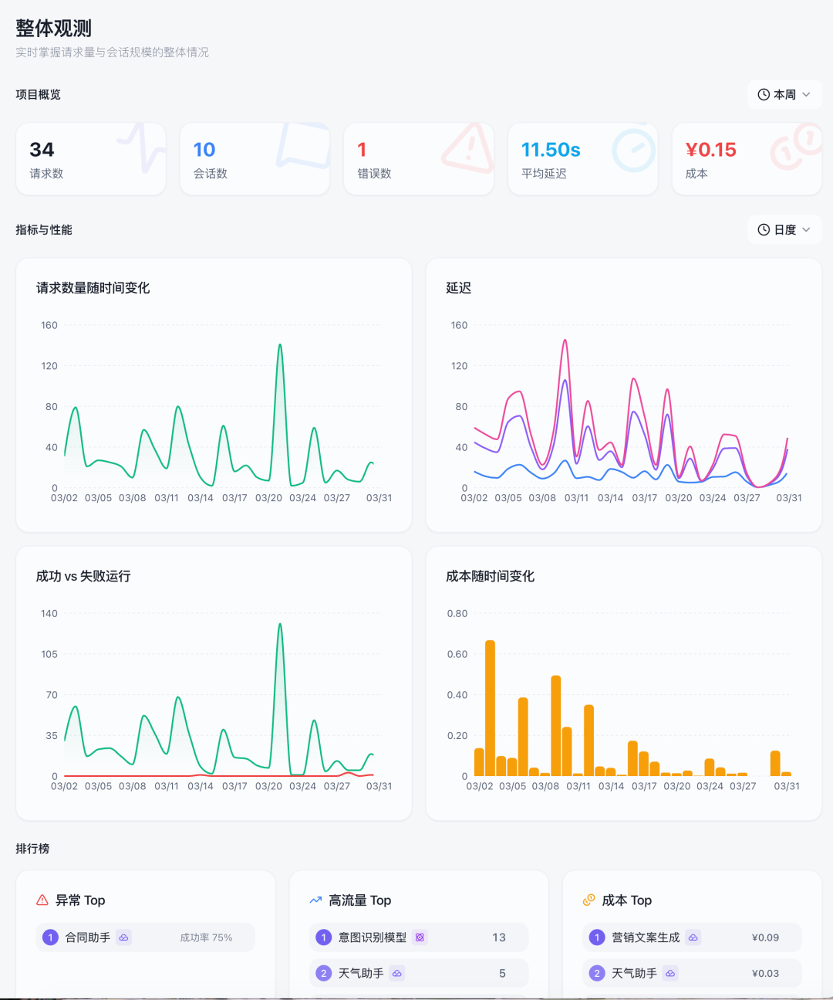
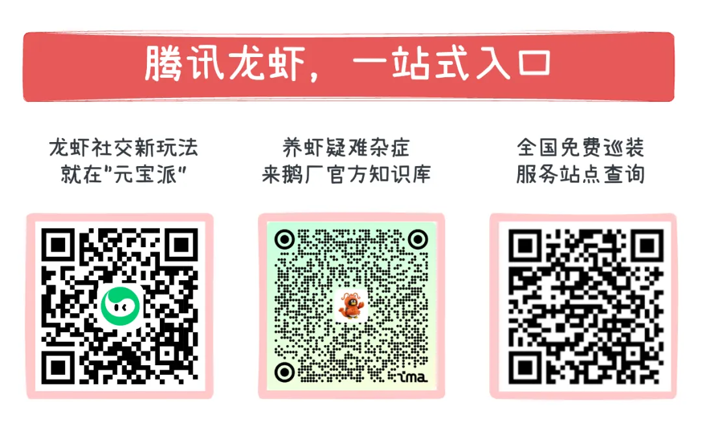

# 腾讯企业级「虾管家」：ADP Agent Portal 正式上线！

> 公众号: 腾讯云
> 发布时间: 2026-04-01 17:55
> 原文链接: https://mp.weixin.qq.com/s/eimXV13s1D7DcQ2xchd7Yw

---

今天，国内首个跨平台、企业智能体门户与协同治理平台：ADP Agent Portal，正式发布。

一句话解释下：

它就像一个龙虾管家，能帮你把公司里散落各处的🦞（数字员工），全部统一收编，排班、管理，然后监督出活儿。

// 对企业来说：养虾容易，管好它们可太难了

持续爆火的🦞，让大家看到，AI不仅仅是陪聊工具，还是真能上手干活儿的办公搭子。

相比个人养虾，企业要养这些数字员工，账本就复杂多了：跟老业务怎么集成、投产比（ROI）高不高、合规安全问题等等，全是硬指标。

与此同时，随着Agent的搭建门槛越来越低，不少公司一下子冒出几百上千只🦞，问题也紧跟着来了：

- 找不到：它们散落在各个平台、群聊和网页里，员工想用的时候找不到入口。
- 难协同：跨平台之间各干各的，很难配合和协同。
- 难管理：用了多少Token、花了多少钱、哪里卡顿出错，一算很多都是糊涂账。

为了帮企业更好养虾、管虾，今天腾讯云正式发布ADP Agent Portal，希望能够助力解决这些问题。

// 一个统一入口，管好所有Agent

以前员工要办个事，得先在收藏夹里找半天合适的Agent。现在有了ADP Agent Portal，我们做了一个统一的管理视图和搜索框。

员工只用提需求，系统自动找到“对的智能体”

它包容性强，不仅能管ADP平台自己开发的🦞，还能无缝接入Dify等开源平台，或者直连基于腾讯混元、DeepSeek、Kimi、GLM等大模型搭建的Agent，支持各路个人和企业龙虾接入。

遇到问题，员工直接在输入框用大白话提需求。系统会像自动派单一样，精准把需求匹配给最对口的Agent去处理，保障任务高效、精准执行。

一只“企业虾”就能服务全公司，帮你告别碎片化。

Portal为不同平台开发的智能体，提供统一的管理视图

// 看得清状态，算得清成本

对企业CXO来说，还有一个问题很重要：Agent跑得顺不顺？到底花了多少钱？

ADP Agent Portal直接上了全套监控体系：调用量、成功率、响应时长、Token消耗，看板清清楚楚，还能下钻到具体会话去排查卡顿。

实时监测请求耗时、资源消耗，持续调优与排障

在实际使用中，团队曾通过ADP Agent Portal的追踪能力发现，某客服场景的响应延迟主要集中在知识库查询环节。

通过针对性优化查询路径与调用方式，整体响应时长显著下降，系统性能得到明显改善。

当然，企业客户最关心的安全合规问题我们也考虑到了：它兼容企业现有权限模型，并且支持私有化部署，核心数据绝不出门。

// 光管好还不够，还得配齐装备库

把智能体管好了，还得让它们干好活。而决定Agent战斗力的，往往是它能调用什么 Skill。这次，腾讯云ADP推出 Agent Portal的同时，还打造了“精选企业级Skill广场”。

这个“广场”只上企业办公提效真正需要的硬核技能：

- 比如文档重排序（Rerank）、Embedding、知识库等，一键即用，无需额外开发；
- 比如腾讯文档、QQ浏览器等官方插件，以及医疗、开发等垂直行业专属 Skill；
- 你还可以直接打包ZIP传上来，在企业内部共享。所有技能都过了内部的安全隔离和防越权检测。

最重要的是，广场还上线了一键全享（One Key All Skills）的Skill Plan服务。企业只要购买了ADP的“龙虾”套餐，就能一键调用广场上所有的精选Skill，不用再单独购买Key，不用重复部署。

企业AI的未来不在于拥有多少个智能体，而在于能否让它们高效协同、价值落地。

目前，ADP Agent Portal及Skill广场已全面上线，欢迎体验。

👇🏻👇🏻👇🏻扫码报名体验ADP Agent Portal：

👇🏻👇🏻👇🏻[点击了解腾讯云](https://cloud.tencent.com/document/product/1759/129561)[ADP](https://cloud.tencent.com/document/product/1759/129561)[Skill](https://cloud.tencent.com/document/product/1759/129561)[广场](https://cloud.tencent.com/document/product/1759/129561)：

<https://cloud.tencent.com/document/product/1759/129561>

---

