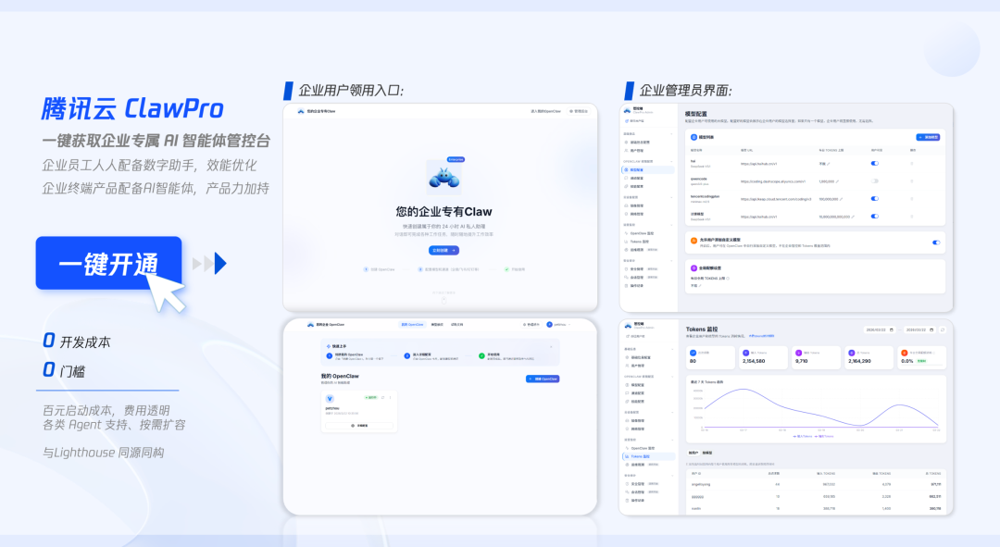
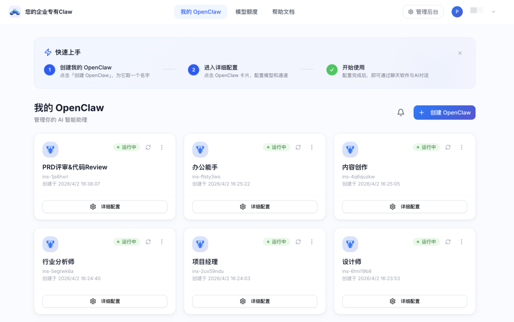
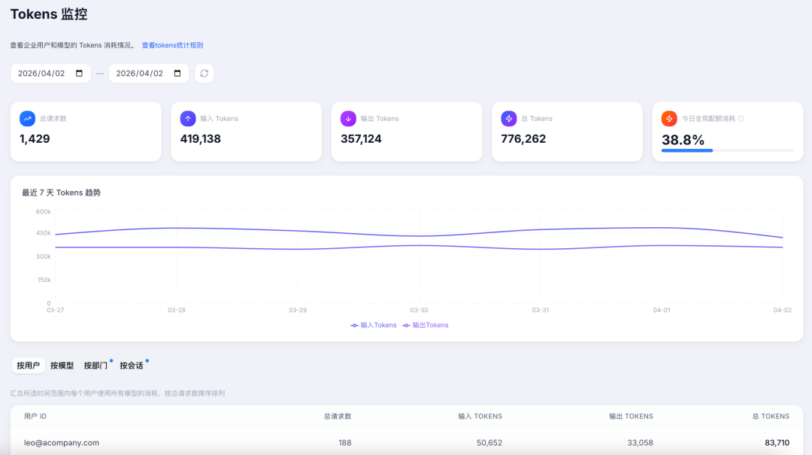
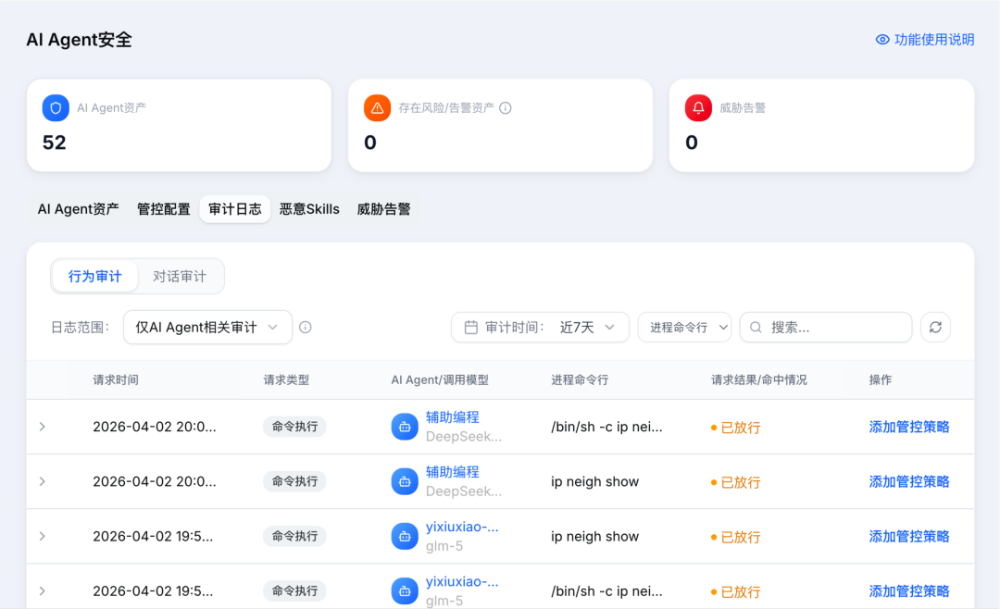

# 腾讯云ClawPro正式发布，企业版龙虾10分钟上线

> 公众号: 腾讯云
> 发布时间: 2026-04-02 21:22
> 原文链接: https://mp.weixin.qq.com/s/Tnqp7bGPlbimg_AvdOmXqA

---

腾讯云推出的企业版OpenClaw——ClawPro，今天正式发布并开启公测。

ClawPro是国内首个基于百万级用户验证的一站式企业AI智能体管控平台。它为企业提供专属的AI Agent平台，让企业管理员可以统一部署 OpenClaw模板、下发模型资源配额并进行监测。

企业无需组建复杂的技术团队，最快只需10分钟，就能完成全员专属 AI 助手的上线落地。

在前期内测阶段，有200多家企业客户率先接入，并在真实的业务场景中投入使用 。

企业养虾能这么快跑起来，靠的就是这三点👇

//10 分钟上线：底层全托管，企业只管用

不夸张，10 分钟。

选套餐 → 配模型 → 发给员工，3步完成全企业部署。

员工端更快——扫码申领，1 分钟内就能开始与自己的AI助手对话。五大办公平台一键接入，在员工熟悉的聊天窗口中直接用起来。

能做到这么快，是因为ClawPro提供了底层云服务的全自动化托管。企业管理员只需要在后台点击开通，系统就会一键智能拉起所有关联的基础云资源。（例如云服务算力、存储、网络等）

企业不需要懂云原生，不需要配安全组，不需要研究 API 参数。每位员工的OpenClaw都运行在专属云服务器上，互不干扰。

更关键的是，这套架构并非从零搭建——它和腾讯云轻量应用服务器Lighthouse上百万级OpenClaw用户环境同源同构。经过大规模生产验证的成熟架构，企业无需再踩一遍坑。

而且，腾讯云多年沉淀的云服务器、网络、日志服务、存储产品、云开发等全栈产品能力都能和OpenClaw有机结合，也支持通过分布式方案支持企业本地部署。

OpenClaw也非常开放。不限定模型，不限定 Agent。默认提供OpenClaw，也支持自定义镜像，多版本并存，一键切换。企业的虾，企业做主。

//百元起步：Token 花了多少，看得清清楚楚

针对企业在AI规模化落地中普遍面临的成本不可控难题，腾讯云ClawPro推出了一套精细化、透明化的成本管控方案。

首创「企业-部门-个人」三级Token配额体系。通过多层级的可视化管理大盘，企业可实时掌握全局及各分支架构的资源消耗情况，实现配额的精准下发与用量阻断机制，从根源上杜绝预算超支风险。

在底层算力层面，ClawPro搭载专为AI智能体优化的Ai2云服务器实例，其算力成本较传统标准机型大幅降低40%，有效优化了企业的整体TCO。

ClawPro把企业落地的门槛打到行业最低，采用“百元起步、按需扩容”的灵活计费机制。平台支持最低1个席位即可开通，且所有的企业级管控能力均作为全版本标配提供。

企业可灵活适配自身团队规模，无需为非必要的高阶版本支付溢价，真正实现每一笔费用都清晰透明、按需使用。

//四层纵深防护：企业用虾，安全先行

OpenClaw 能力很强，但默认配置下权限也大。

能读文件、能跑代码、能装 Skill、能联网——个人使用没问题，放到企业环境里就是安全隐患。

ClawPro为此构建了“看得见、审得了、管得住、扫得全”的四层纵深安全体系：

- 看得见——AI Agent 资产全盘点，谁在用、用了什么、跑了哪些任务，一览无余。
- 审得了——全链路行为审计，每一次对话、每一个操作都有迹可循，满足合规审计要求。
- 管得住——租户级物理隔离，随机端口替代默认端口，安全组精细管控。网络层面，收放自如。
- 扫得全——Skill 供应链安全扫描，从源头拦截恶意技能。不是出了事再查，而是上架前就拦住。

内测的200多家企业里，有不少是来自金融、政务、制造等对安全要求严苛的行业，都在放心使用中。

企业养虾最复杂部分，ClawPro都提前解决了

“定向邀约申请”通道已全面开启。首批客户将会由腾讯云的专家团队提供专属配置引导、使用培训和护航，确保企业龙虾平稳上线、合规干活。

👉 点击[开启公测](https://cloud.tencent.com/act/pro/cvmopenclaw2026)，10分钟开启你的龙虾办公。

---

---

