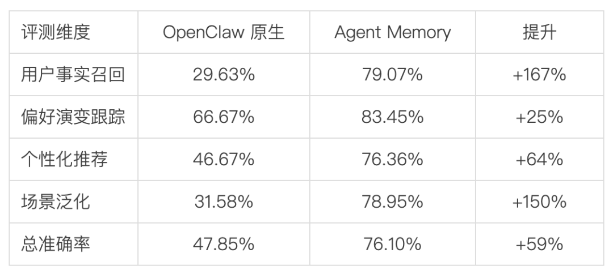
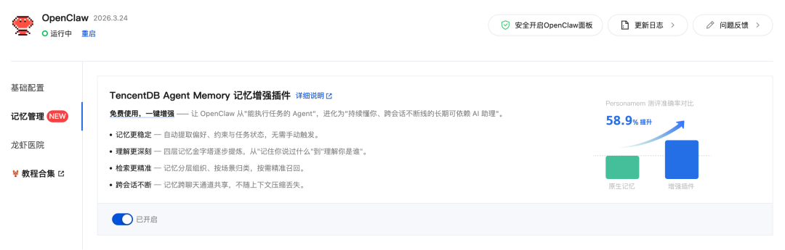
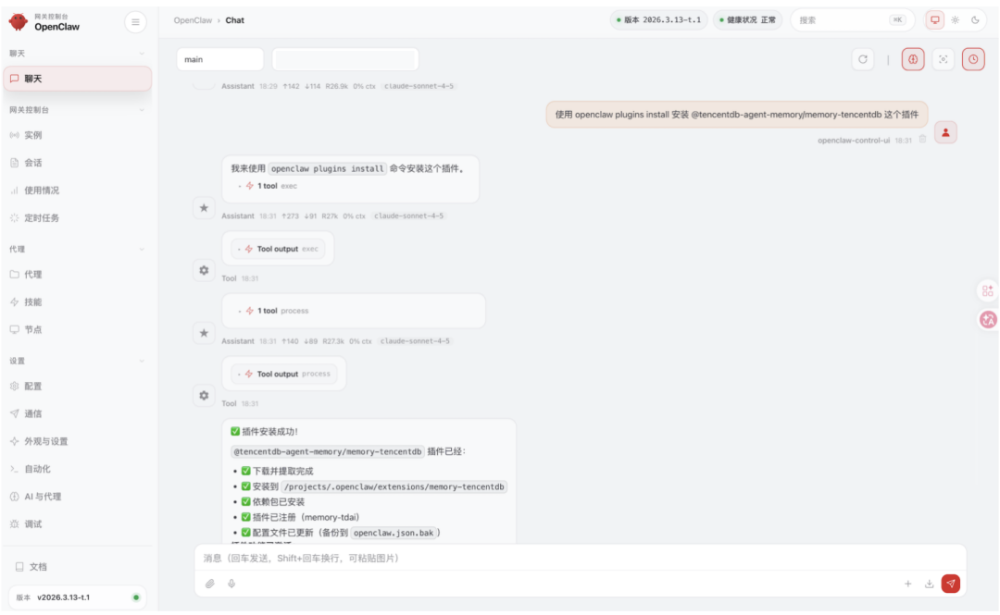

# 腾讯云发布龙虾记忆服务Agent Memory，免费一键开启

> 公众号: 腾讯云
> 发布时间: 2026-04-03 10:57
> 原文链接: https://mp.weixin.qq.com/s/y90_u2KciFAIDeXZ6aIcZQ

---

好消息，龙虾能记住更多事儿了！

今天，腾讯云正式发布“龙虾”记忆服务——TencentDB Agent Memory ，为 OpenClaw补上一层长期记忆能力。

这个由腾讯云数据库团队研发的记忆引擎，从原始对话到用户画像，构建了四层渐进式记忆系统——让你的龙虾从“能干活”，进化为“持续懂你、跨会话不断线”的长期 AI 助理。

评测数据显示，接入该服务后，OpenClaw的总回答准确率高达76.10%，较原生记忆提升近59%。

目前，Agent Memory以插件的形态无缝集成至腾讯云Lighthouse、[ClawPro](https://mp.weixin.qq.com/s?__biz=MjM5MDgwMzc4MA==&mid=2654907130&idx=1&sn=1045ee99e41d3223918c7603e906cedf&scene=21#wechat_redirect)等产品中，支持免费一键开启 。

//四层记忆系统，较原生OpenClaw准确率提升近6成

用过 OpenClaw 的都知道，简单的日常对话上下文跟随毫无压力 。但一旦面对长周期、跨会话的复杂项目，由于缺乏稳定的长期记忆系统，AI极易出现早期设定被“冲淡”、新开窗口就“失忆”的情况，导致用户常常需要反复重“喂”背景信息 。

为解决这一难题，腾讯云数据库团队自研了 Agent Memory，引入独创的四层渐进式记忆架构 ：

- L0 原始对话：全量保存，确保原始对话信息不丢失 。
- L1 原子记忆：自动提取事实、偏好与关键约束 。
- L2 场景分块：按项目聚类，记忆带着上下文精准召回，不串场 。
- L3 用户画像：形成稳定的用户画像，让 AI 适应你的习惯 。

信息沿着这条链路逐步进化：碎片化对话 → 结构化事实 → 场景化认知 → 个性化画像 。

最终，Openclaw不仅记得“你说过什么”，还包括你的真实目标、任务进度、历史决策依据以及最适合你的服务节奏 。

数据说话，基于 PersonaMem 评测集结果👇

（20个模拟用户画像、6000+条消息、589道测评题）：

原本 100 个关于“你的问题”，以前只能答对不到 48个，现在能答对 76个。

//插件免费开放， 多种方式按需部署

Agent Memory 提供多样化的接入方式，方便用户便捷接入龙虾启用。

-云上龙虾无缝集成，一键开启

Agent Memory 已作为内置插件集成到腾讯云多产品中，以 Lighthouse为例简单配置就能快速启用。

👉进入控制台 → 打开 OpenClaw 实例 → 在「应用管理 - 记忆管理」中找到 Agent Memory → 拨动开关启用 → 确认重启 Gateway，即刻生效。

启用后，Agent Memory 与 OpenClaw 原生 Memory Core 共存互补，数据存在本机，安全可控。

-本地龙虾，复制粘贴一行命令

在龙虾聊天窗口敲入以下魔法：

【使用 openclaw plugins install安装@tencentdb-agent-memory/memory-tencentdb 这个插件】

-还有性能更强劲的企业级记忆服务

面向多用户和企业级场景，腾讯云即将推出 Agent Memory Pro版服务。

Pro版基于腾讯云向量数据库构建，在记忆规模持续增长后依然保持稳定的检索性能，同时支持备份、回档、权限控制等数据治理能力，用于支撑企业级长期记忆资产的沉淀与管理。

Agent Memory 是腾讯云围绕 OpenClaw 构建的Agent Runtime能力体系的重要一环。

在记忆之外，执行引擎、云沙箱、可观测等能力正共同构成智能体基础设施，支撑 Agent 在多场景下安全高效运行。

---

---

