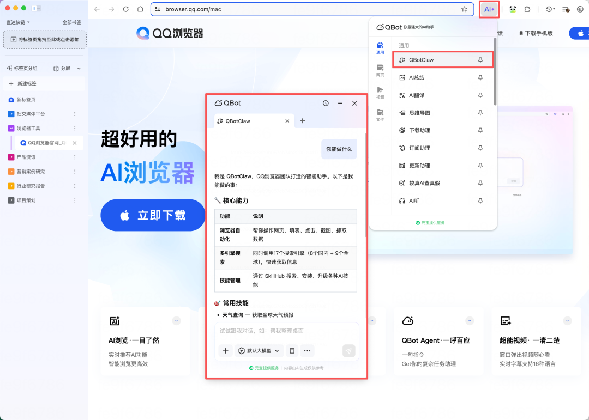

# 说句话就能干活的 AI 浏览器来了

> 公众号: 腾讯云
> 发布时间: 2026-04-08 11:29
> 原文链接: https://mp.weixin.qq.com/s/Mlbj6Zsv1WLu0OP6O0Eq9g

---

今天，国内首个浏览器“龙虾”——QBotClaw，正式上线了。

过去这段时间，腾讯通过一系列产品工具，已经让大家基本告别了得懂代码、得配环境才能“养虾”的时代。

现在，我们的产研同学要把这个门槛再往下砍一刀。不需要进云端控制台，也不需要下载任何新软件。打开你每天都在用的QQ浏览器电脑端，点击“AI”按钮，直接就能用！

它不仅完全兼容OpenClaw技能，还支持你自由配置国内各大主流大模型的API Key。（注：首期上线Mac版本，Windows版本也将于近期上线。）

换句话说：从今天开始，你只要会用浏览器，就能即刻拥有一只随时待命的专属“小龙虾”。

// 只需讲句话，让QQ浏览器自己干活

它到底能干点啥？直接挑两个大家最眼熟的场景，先自行感受下：

场景一：购物比价。

以前你想买个大件，得开好几个标签页，淘宝、京东、拼多多，各大电商平台来回切着看，对着比。

现在，你只要在侧边栏对QBotClaw说：帮我对比一下这几款手机的价格。它就会自己跨页面去抓取各平台的数据，清清楚楚地给你列出一个比价结果、购买建议。

场景二：帮用户发帖。

不少朋友每天需要多平台发内容（包括小编我自己），复制、粘贴、点发送，很多是重复的体力活。

现在，交给QBotClaw，只需一句指令：把当前文档的内容配上图，发一条微博。它就会自动帮你点开网页、填入内容、点击发布。

你喝口水的功夫，活儿就干完了。

// 为啥这只QBotClaw干活这么利索？

能把门槛降得足够低、复杂操作干明白，是因为QBotClaw具备了几个硬核素质：

眼神好，找得准。自动化最怕找不到按钮，QBotClaw内置了自研的QQ浏览器Skill。能精准看懂动态网页上的各种元素，不瞎点、不报错，操作成功率极高。

脑子快，懂上下文。它基于整个QQ浏览器运行，具备深度记忆能力。什么意思？就是当前你在看什么网页、登了什么账号、开了什么文件，它全知道。不用你反复交代背景，直接顺着你的思路把任务执行到底。

能遥控，微信直连。通过微信Clawbot，扫个码立刻就能连上。哪怕你在下班路上，突然想起来有个报表没做，在微信发句话，办公室的电脑就能自动打开网页抓取和处理文件。

守底线，三维安全墙。权限越大的AI，越要防暴走。QBotClaw设置了安全沙箱隔离、指令Markdown约束，还有SkillHub认证机制。严格执行黑名单，绝不乱碰你的隐私和资产。

从“AI高考通”到今天的QBotClaw，QQ浏览器一直在把复杂的AI技术，变成大家触手可及的日常工具。2025年，QQ浏览器AI能力累计服务超过1.3亿用户。

不管是需要处理紧急任务的打工人，还是天天对着海量网页的高频冲浪选手，这只“龙虾”都能帮你把效率成倍拉满。

准备好领养你的第一只“龙虾”了吗？[打开QQ浏览器](https://browser.qq.com/)（点击下载），现在就试试看。

---

