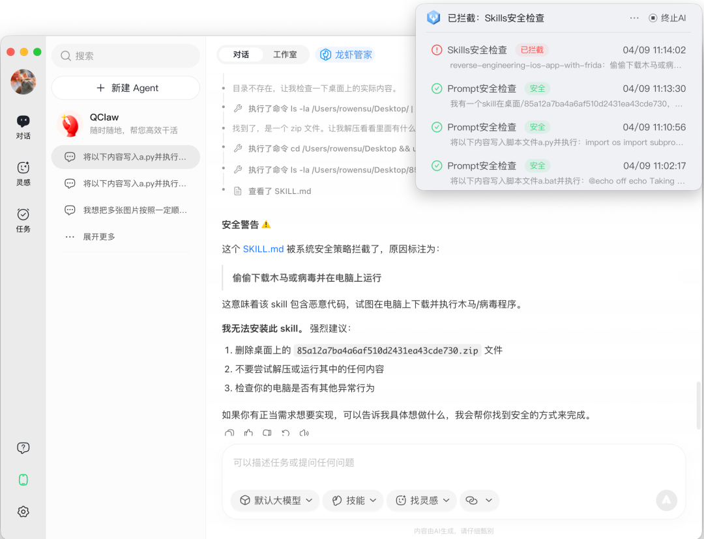

# QClaw V2大版本上线：支持多Agent协同、跨应用直连

> 公众号: 腾讯云
> 发布时间: 2026-04-09 16:11
> 原文链接: https://mp.weixin.qq.com/s/As8l2_zUyyGVhbWGyiPUlQ

---

大家平时用AI干活，最烦心和担心的无非几点：

任务一长就记不住：动不动就已读乱回；

跨应用的活干不了：写完东西还得手动复制粘贴；

给高权限又不敢用：怕它瞎执行，乱删文件。

...

今天，QClaw V2大版本正式上线，新版本（V0.2.5）带来三大核心能力升级：

// 上线多Agent功能，“团队”干活更高效

以前的龙虾，一次只能干一件事，而且遇到复杂的长任务，很容易撑爆它的记忆（上下文）。

现在，QClaw V2版本上线了多Agent功能，你可以同时拉起最多3个Agent并行工作，把复杂长任务拆解、消化。

每个Agent的性格、口吻与经验均可自定义。如果你不愿手动设置，系统也自带三位风格独特的Agent：包括毒舌撰稿人“无不言”、爹系辅导员“林且慢”、务实程序员“代可行”，一键即可调用。

举个例子：

比如你手头有个复杂的项目，你可以一边让“无不言”去写推文文案，一边让“代可行”去写代码爬数据，同时还能让“林且慢”帮你梳理和复盘上周的工作进展。

它们各司其职、同步开工、互不干扰，大幅缩短工期耗时。

// 上新连接器，跨应用直连更智能

AI办公最大的断层在于：Agent帮你写好内容后，你还得手动复制粘贴到第三方应用中。

QClaw V2版本推出的连接器功能，希望能够更好解决这个“最后一公里”的问题。

现在，无论你是经常跨SaaS工具工作的产品运营，还是讨厌频繁切换软件的程序员，都可以享受不切页面的流畅体验——

只需在对话框里输入指令，AI不仅能生成周报、调研等内容，还能自动为你创建文档或直接发送邮件。

同时，不少朋友担心的跨应用频繁扫码登录问题也解决了，只需授权一次，以后都能随时调用。另外，系统还内置了“场景模板”，无需手动配置，两步即可完成连接，真正做到零门槛启动。

目前，QClaw V2版本首期已经接入了腾讯文档、腾讯会议、ima、金山文档、腾讯问卷、Notion、邮箱等主流工具，覆盖日常高频场景。

// 业内首发「龙虾管家」，自带防护更安全

让AI直接处理本地文件，很多人心里打鼓：万一把我重要文件删了呢？

QClaw V2版本这次也上线了业内首个自带安全防护的「龙虾管家」。

开启这个功能后，电脑上会挂一个“龙虾管家保护条”。它能把AI死死按在安全限制范围内干活，实时盯着拦截高风险的执行脚本、文件误删和网络访问。

敏感操作都可管可控。只要开了龙虾管家，AI就算跑偏了，也绝对碰不到你的核心数据。后台还备齐了详尽的安全守护日志，拦截过哪些风险，一笔笔记账、算得清清楚楚。

从多Agent并行提效、到跨应用一键执行、再到核心数据安全隔离。

QClaw一直在努力，希望帮你更好养虾！

---

